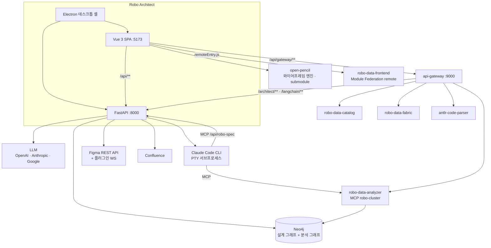
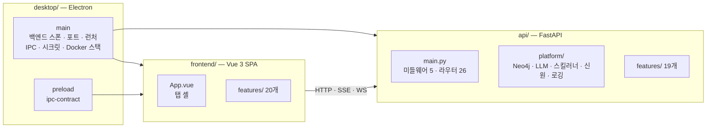
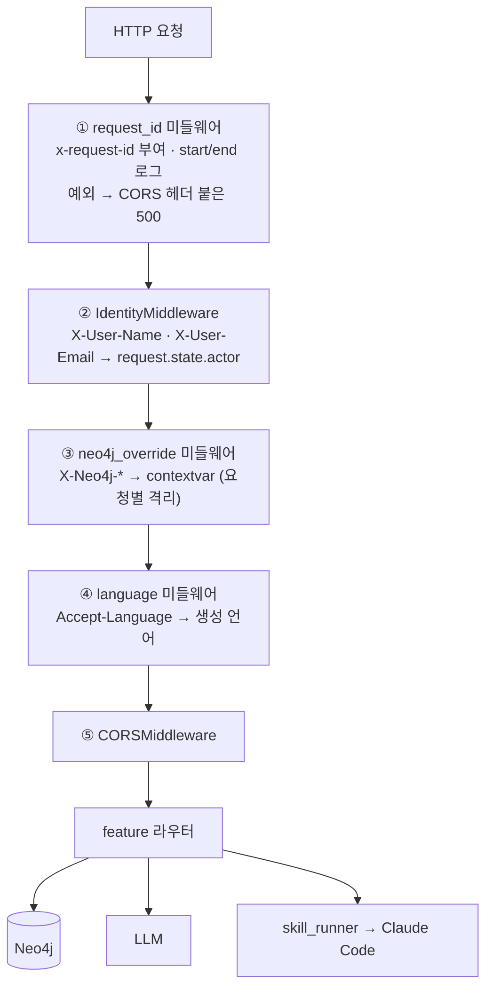
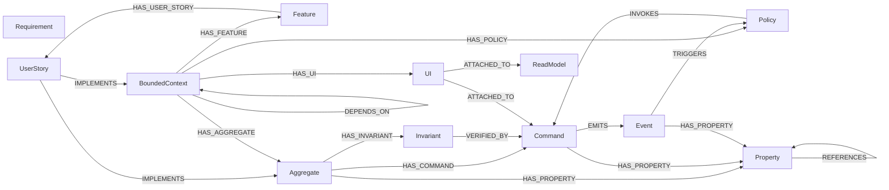
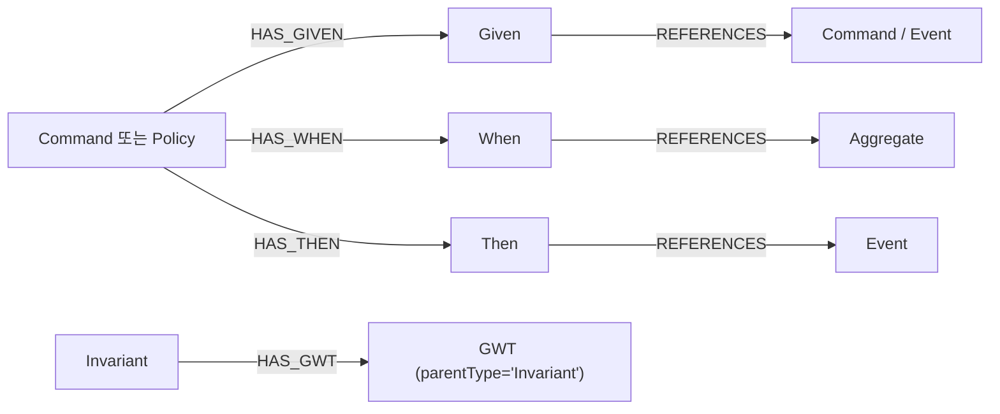
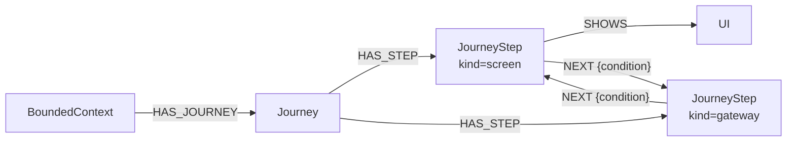
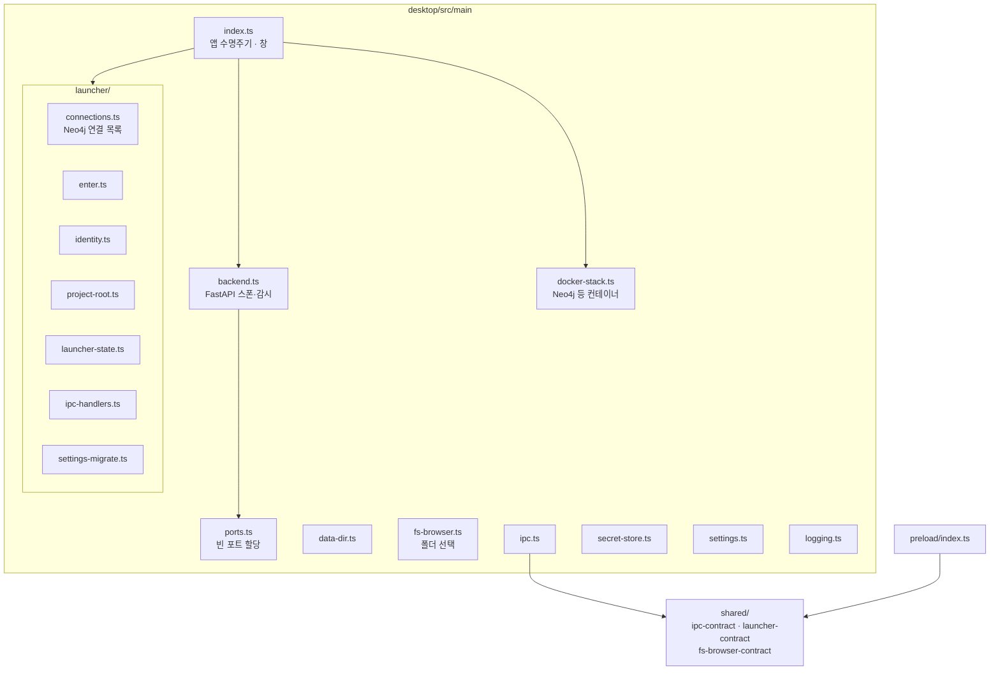
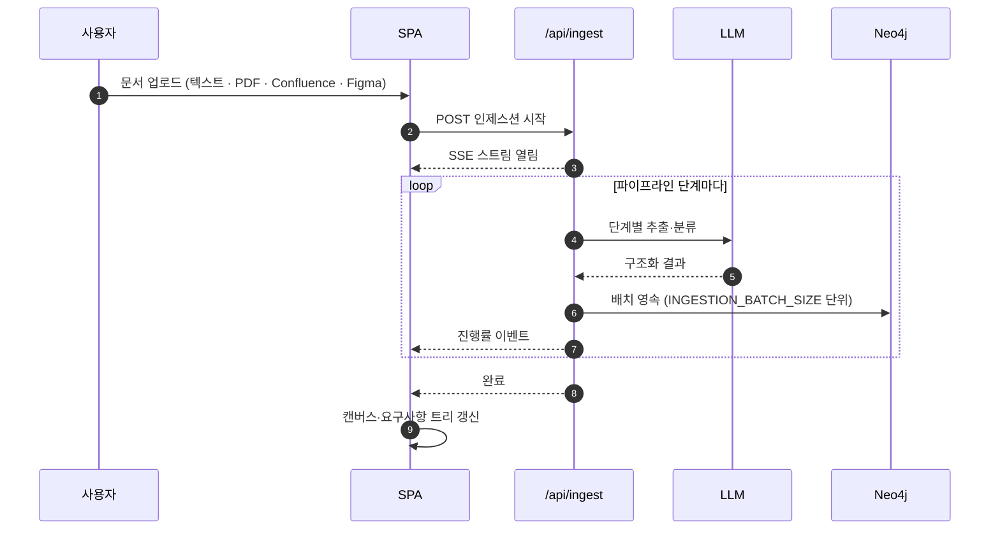
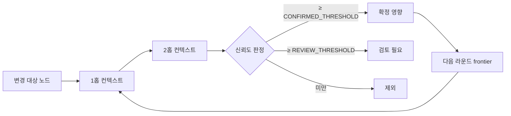
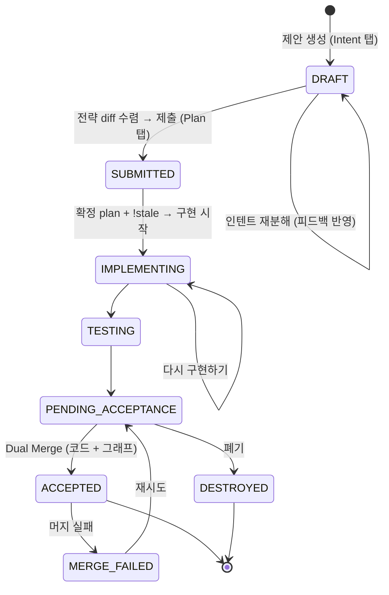

# Robo Architect (MSAez)

요구사항의 변화가 시스템 설계 전체(Bounded Context · Aggregate · Command · Event · Policy ·
ReadModel · UI)에 어떻게 전파되는지를 **Neo4j 온톨로지 그래프 위에서 탐색·분석·계획**하고,
Claude Code를 통해 **실제 구현까지 이어주는** 도구입니다.

요구사항 인제스션 → 그래프 모델링 → 영향도 분석 → 변경 계획 → PRD/에이전트 컨텍스트 생성 →
샌드박스 구현 → 수용(머지)까지를 하나의 그래프 위에서 다룹니다.

**Demo Video**
🎥 [Code Generation from Legacy Analysis](https://youtu.be/NtIHSZHugpU?si=xQTYBPEHXdTDrO6B)
🎥 [Legacy Analysis](https://youtu.be/9s54dhhERM0?si=GUj-b7NZ2TLLuF6y)
🎥 [Figma & JIRA Integration](https://youtu.be/CHw9U1aQZFg?si=PmLI1R8o4zaDxfze)

---

## 목차

1. [무엇을 하는 제품인가](#1-무엇을-하는-제품인가)
2. [시스템 안에서의 위치](#2-시스템-안에서의-위치)
3. [3단 구성](#3-3단-구성)
4. [백엔드 아키텍처](#4-백엔드-아키텍처)
5. [설계 그래프 스키마](#5-설계-그래프-스키마)
6. [프런트엔드 아키텍처](#6-프런트엔드-아키텍처)
7. [Electron 데스크톱](#7-electron-데스크톱)
8. [핵심 흐름](#8-핵심-흐름)
9. [Proposal 생명주기](#9-proposal-생명주기)
10. [스킬 체계](#10-스킬-체계)
11. [API](#11-api)
12. [서브모듈과 외부 연동](#12-서브모듈과-외부-연동)
13. [프로젝트 구조](#13-프로젝트-구조)
14. [설정](#14-설정)
15. [실행](#15-실행)
16. [빌드와 패키징](#16-빌드와-패키징)
17. [테스트](#17-테스트)
18. [문제 해결](#18-문제-해결)

---

## 1. 무엇을 하는 제품인가

| 기능 | 내용 |
|---|---|
| **요구사항 인제스션** | 텍스트 · PDF · Confluence · Figma 입력을 LLM 파이프라인으로 해석해 Neo4j 설계 모델로 적재. 진행률은 SSE 실시간 스트림 |
| **하이브리드 인제스션** | 문서 + 레거시 코드를 함께 넣어 BPM(업무 프로세스) 척추를 먼저 세우고 그 위에 Event Storming 산출물을 승격 |
| **캔버스 그래프 탐색** | BC · Aggregate · Command · Event 서브그래프 조회·확장. Event Storming 스티커 캔버스 |
| **요구사항 탭** | Epic(BC) → Feature → UserStory → Acceptance Criteria 드릴다운, 요구사항 명확화 질문-응답 세션 |
| **Process 탭** | BPM 뷰와 Event Modeling 뷰를 하나의 그래프의 두 투영으로 전환 |
| **어그리거트 인베리언트** | 불변식을 1급 객체로 선언하고 GWT 검증 조건을 편집·공유 참조 |
| **ReadModel / CQRS** | ReadModel의 소스 이벤트·프로퍼티 매핑·조회 조건 구성 |
| **변경 관리** | 유저스토리 변경의 영향도 분석 → LLM 기반 변경 계획 → 승인 후 그래프 반영 · 되돌리기 |
| **Proposal 생명주기** | 제안 생성 → 인텐트 분해 → 계획 → Git worktree 샌드박스 구현 → 테스트 → 수용/폐기 |
| **프로젝트 헌장(Constitution)** | 설계 원칙 · 기술 스택 · 아키텍처 스타일 · 레포 전략을 그래프 노드로 관리(프로젝트 루트 + BC별 오버라이드) |
| **모델 수정 채팅** | ReAct 기반 대화형 그래프 수정 |
| **PRD · 에이전트 컨텍스트 생성** | 그래프 → PRD 문서, DDD-for-SDD 아티팩트, 에이전트 컨텍스트 ZIP |
| **AI Design / 와이어프레임** | open-pencil 엔진으로 UI 스티커의 화면을 생성·편집 |
| **Figma 양방향 연동** | 문서 바인딩, 스토리보드↔페이지 매핑, 프레임 푸시, 동기화 복구, 플러그인 WebSocket |
| **Analysis 탭** | `robo-data-frontend`를 Module Federation 리모트로 끼워 레거시 코드 분석 화면을 통합 |
| **Code 탭** | Claude Code를 PTY 터미널로 띄워 실제 구현을 진행. 세션 레지스트리로 새로고침에도 재어태치 |

---

## 2. 시스템 안에서의 위치



| 상대 | 연결 방식 | 내용 |
|---|---|---|
| `robo-data-frontend` | **Module Federation** | 리모트 `robo-analyzer-frontend`를 "Analysis" 탭에 끼워 넣습니다 |
| `robo-data-analyzer` | **MCP**(`robo-cluster`) | Code 탭의 Claude Code 서브프로세스가 레거시 코드를 의미 검색합니다. REST를 쓰지 않습니다 |
| `robo-data-catalog` · `robo-data-fabric` · `antlr-code-parser` | 없음(직접) | 이 저장소가 직접 HTTP로 호출하는 코드가 없습니다. Analysis 탭의 리모트가 게이트웨이를 통해 호출합니다 |
| `api-gateway` | **양방향** | 프런트가 게이트웨이를 거쳐 형제 서비스를 호출하고, 게이트웨이도 이 저장소의 API를 `/architect/**`·`/langchain/**`로 라우팅합니다 |
| `open-pencil` | git submodule | 와이어프레임·AI Design 엔진. Vite가 소스 레벨로 별칭 해석 |
| `Neo4j` | Bolt | 설계 그래프. Analyzer의 분석 그래프와 **같은 DB를 공유하되 `graph_owner`로 분리** |
| Claude Code | PTY 서브프로세스 | Code 탭. 이 저장소의 `/api/robo-spec` MCP와 Analyzer의 MCP를 동시에 사용 |

---

## 3. 3단 구성



| 계층 | 스택 | 진입점 | 기본 포트 |
|---|---|---|---|
| **Backend** | FastAPI · LangChain · LangGraph · Neo4j 드라이버 · MCP SDK | `api/main.py` | `8000` (`API_PORT`) |
| **Frontend** | Vue 3.5 · Vite 5 · Pinia · Tailwind 4 · Vue Flow · xterm.js · open-pencil | `frontend/src/main.js` | `5173` |
| **Desktop** | Electron 31 · electron-builder · TypeScript | `desktop/src/main/index.ts` | — |

---

## 4. 백엔드 아키텍처

### 4.1 요청 파이프라인



> 미들웨어는 등록 순서와 실행 순서가 반대입니다. 위 그림은 **실행 순서**입니다.

| 미들웨어 | 역할 |
|---|---|
| `_request_id_middleware` | 모든 요청에 correlation id 부여, 시작·종료·실패 로그, **처리되지 않은 예외를 CORS 헤더가 붙은 JSON 500으로 변환**(그냥 re-raise하면 CORS 헤더가 없는 500이 되어 브라우저가 응답을 막고 프런트는 `Failed to fetch`만 봅니다) |
| `IdentityMiddleware` | Electron 런처가 넘긴 신원 헤더를 `Actor`로 붙임. 신뢰 모델은 **로컬 루프백 전용** |
| `neo4j_override_middleware` | `X-Neo4j-*` 헤더가 있으면 그 요청만 그 DB를 사용. 없으면 `.env` 폴백 — Analyzer·Catalog·Fabric과 동일 계약 |
| `language_middleware` | `Accept-Language`로 생성 결과 언어 결정. 헤더가 없으면 `GENERATION_LANGUAGE_DEFAULT` |
| `CORSMiddleware` | `allow_origins=["*"]`, **`allow_credentials=False`**. 두 값을 같이 켜면 브라우저가 실제 응답을 거부하므로(Figma 플러그인에서 `Failed to fetch`로 표면화) 이 조합이 강제됩니다 |

### 4.2 lifespan

앱 시작 시 순서대로 수행합니다.

1. Neo4j 드라이버 초기화
2. 인제스션 LLM 캐시 기본값 적용 (`INGESTION_CACHE_DEFAULT`)
3. 이전 크래시로 남은 Figma 풀싱크 락 해제
4. `RESET_CHANGE_DATA` 지정 시 `RequirementChange` 노드 초기화
5. 저장된 모든 `Proposal.projectRoot`마다 **고아 git worktree prune**
6. robo-spec MCP 세션 매니저 컨텍스트 진입 (없으면 첫 요청이 `Task group is not initialized`로 실패)

종료 시 Neo4j 드라이버를 닫습니다. 3~5번은 best-effort로, 실패해도 경고만 남기고 기동합니다.

### 4.3 `api/platform/` — 횡단 인프라

| 모듈 | 역할 |
|---|---|
| `neo4j.py` · `neo4j_helpers.py` | 드라이버 수명주기, 세션, 헬퍼 |
| `neo4j_context.py` | `Neo4jOverride` + 요청별 contextvar |
| `llm.py` · `llm_messages.py` | LangChain 모델 생성, 메시지 조립 |
| `skill_runner.py` | Claude Code 스킬 실행(stdin 전달 포함) |
| `global_skills.py` | 전역 스킬 등록·해석 |
| `keys.py` | 자연키·UUID 생성 |
| `language.py` · `middleware/language_middleware.py` | 생성 언어 결정 |
| `identity/` | `Actor` 모델과 헤더 미들웨어 |
| `observability/request_logging.py` · `smart_logger.py` | 요청 상관관계 로깅(LDVC) |
| `open_pencil_client.py` | open-pencil 연동 |
| `ui_wireframe_template.py` | UI 스티커 템플릿 |
| `legacy_tool_events.py` | 레거시 도구 이벤트 |
| `env.py` | 환경 접근 |

### 4.4 `api/features/` — 기능 모듈

| 모듈 | 라우터 접두 | 책임 |
|---|---|---|
| `health` | `/api/health` | 헬스체크 |
| `contexts` | `/api/contexts` | BC 목록·트리·`classification` 관리 |
| `canvas_graph` | `/api/graph` | 캔버스 서브그래프 조회·확장, BPM task design-trace |
| `ingestion` | `/api/ingest` | 문서 인제스션 파이프라인 (+SSE 진행) |
| `ingestion.hybrid` | `/api/ingest/hybrid` | 문서+코드 → BPM → Event Storming 승격 |
| `ingestion.confluence` | `/api/ingest/confluence` | Confluence 페이지 수집 |
| `ingestion.figma_api` | `/api/ingest/figma-api` | Figma REST 조회 |
| `ingestion.figma_sync` | `/api/ingest/figma-sync` | Figma 동기화 |
| `ingestion.figma_plugin_ws` | (WS) | Figma 플러그인 WebSocket |
| `requirements` | `/api/requirements` | 요구사항 탭 — Epic/Feature/US 트리, 명확화, design-trace |
| `user_stories` | `/api/user-stories`, `/api/user-story` | US 카탈로그 조회 / 추가·반영 |
| `invariants` | `/api/aggregates/{id}/invariants`, `/api/invariants/{id}` | 어그리거트 불변식과 GWT |
| `readmodel_cqrs` | `/api/readmodel/{id}/cqrs`, `/api/cqrs/**` | ReadModel CQRS 구성·매핑·조회조건 |
| `change_management` | `/api/change` | 구 변경 관리 (LangChain 기반, 유지) |
| `requirement_changes` | `/api/requirement-changes` | `CHG-NNN` 요구사항 변경 (스킬 우선) |
| `proposal_lifecycle` | `/api/proposals` | `PRO-NNN` 제안 생명주기 · 샌드박스 · 프리뷰 |
| `constitution` | `/api/constitution`, `/api/bounded-contexts/{id}/constitution` | 프로젝트 루트 + BC 오버라이드 헌장, 인터뷰 |
| `model_modifier` | `/api/chat` | ReAct 대화형 그래프 수정 |
| `prd_generation` | `/api/prd` | PRD 생성 |
| `ddd_spec` | `/api/ddd-spec` | DDD-for-SDD 아티팩트 생성 |
| `robo_spec` | `/api/robo-spec` + `/mcp` 마운트 | Claude Code 스킬용 MCP 브리지, 구현 파일 매핑, tasks.md 워처 |
| `claude_code` | `/api/claude-code` | PTY 터미널 WebSocket, 세션 레지스트리 |
| `figma_binding` | `/api/figma-binding` | 문서 바인딩·스토리보드 매핑·동기화 이력 |
| `ai_design` | `/api/ai-design` | open-pencil AI → 백엔드 LLM 런타임 프록시 |

---

## 5. 설계 그래프 스키마

Neo4j 스키마 정의는 `docs/cypher/schema/`에 있습니다
(`01_constraints` · `02_indexes` · `03_node_types` · `04_relationships`).

### 5.1 Event Storming 핵심



**핵심 크로스-BC 패턴** — `BC-A의 Event` → `TRIGGERS` → `BC-B의 Policy` → `INVOKES` →
`BC-B의 Command`. 이것이 영향도 전파의 기본 축입니다.

### 5.2 GWT (Given/When/Then)



인베리언트 전용 GWT는 Given·Then만 사용합니다(When은 규칙에 해당되지 않아 편집기에서 숨김).
Then은 어그리거트의 `exceptions` 카탈로그를 `thenRef.exceptionName`으로 참조해 예외 결과를
선언할 수 있습니다.

### 5.3 사용자 여정 레이어



재사용 화면은 여정마다 별도 `JourneyStep`이 되며 모두 같은 `UI`를 가리킵니다.

### 5.4 노드 라벨 목록

| 라벨 | 설명 | 식별 |
|---|---|---|
| `Requirement` | 원본 요구사항 | `id` |
| `UserStory` | "As a … I want … so that …" | `id` (`US-NNN`) |
| `Feature` | BC와 UserStory 사이의 그룹 | `key` = `<bc.key>.feature.<slug>` |
| `BoundedContext` | 전략적 설계 단위 | `key` (자연키) + `id`(UUID) |
| `Aggregate` | 트랜잭션 일관성 경계 | `key` = `<bc>.<agg>` |
| `Command` | 사용자 의도(동사형) | `key` |
| `Event` | 발생한 사실(과거형, 버전 포함) | `key` = `…@1.0.0` |
| `Policy` | "When [Event] then [Command]" | `key` |
| `ReadModel` | 조회 모델 | — |
| `Property` | 필드 정의 | `parentType` + `parentId` + `name` |
| `UI` | 와이어프레임 스티커 | `key` |
| `Given` · `When` · `Then` · `GWT` | BDD 인수조건 | `key` |
| `Invariant` | 어그리거트 불변식 | `key` = `<agg.key>.invariant.<slug>-<hash>` |
| `Journey` · `JourneyStep` | 사용자 여정 | UUID v5 (`key` 기반) |
| `Constitution` | 프로젝트 헌장 (`scope`: `PROJECT`/`BOUNDED_CONTEXT`) | `id` (루트는 `CON-ROOT`) |
| `RequirementChange` | 요구사항 변경 | `id` (`CHG-NNN`) |
| `ChangeSet` | 변경 묶음 | `id` (`CS-NNN`) |
| `Proposal` | 제안 | `id` (`PRO-NNN`) |
| `ImplementationFile` | 설계 요소 ↔ 소스 파일 매핑 | `(projectId, path)` |
| `FigmaBinding` | Figma 문서 바인딩 (싱글톤) | `id="singleton"` |
| `StoryboardPageMapping` | 스토리보드 ↔ Figma 페이지 | `id`, `commandId` |
| `BindingHistoryEvent` | 바인딩 감사 로그 (append-only) | `id` |
| `SyncRun` | Figma 동기화 실행 요약 | `id` |

### 5.5 주요 관계

| 관계 | 방향 | 속성 |
|---|---|---|
| `IMPLEMENTS` | UserStory → BC/Aggregate | `createdAt`, `confidence` |
| `HAS_FEATURE` | BC → Feature | `createdAt` |
| `HAS_USER_STORY` | Feature → UserStory | `source`(`llm`/`manual`), `confidence`, `createdAt` |
| `HAS_AGGREGATE` | BC → Aggregate | `isPrimary` |
| `HAS_COMMAND` | Aggregate → Command | `isIdempotent` |
| `EMITS` | Command → Event | `isGuaranteed` |
| `TRIGGERS` | Event → Policy | `priority`, `isEnabled` |
| `INVOKES` | Policy → Command | `isAsync` |
| `HAS_POLICY` | BC → Policy | |
| `DEPENDS_ON` | BC → BC | `integrationPattern`(`event`/`sync`) |
| `HAS_UI` · `ATTACHED_TO` | BC → UI, UI → Command/ReadModel | `ATTACHED_TO.role`(`display` 등) |
| `HAS_PROPERTY` · `REFERENCES` | 객체 → Property, FK → PK | |
| `HAS_GIVEN` · `HAS_WHEN` · `HAS_THEN` · `HAS_GWT` | Command/Policy/Invariant → GWT 노드 | |
| `HAS_INVARIANT` · `VERIFIED_BY` | Aggregate → Invariant, Invariant → Command | `VERIFIED_BY.createdAt` |
| `HAS_JOURNEY` · `HAS_STEP` · `SHOWS` · `NEXT` | 여정 그래프 | `NEXT`: `id`, `condition`, `documentExcerpt`, `source` |
| `HAS_CONSTITUTION` | BC → Constitution | |
| `IMPLEMENTED_IN` | Aggregate/Command/Event/ReadModel → ImplementationFile | (속성 없음 — 판별자는 노드 쪽) |
| `EFFECT` | RequirementChange/Proposal → UserStory·Feature·BC·Aggregate·Command·Event | `reason`, `impactLevel`, `changeType`, `diff`(SemanticDiff JSON), `appliedAt` |
| `CONTAINS` | ChangeSet → RequirementChange | |
| `MAPS_STORYBOARD` · `MAPS` · `LOGGED` · `RUN_OF` | Figma 연동 | |

### 5.6 SemanticDiff

`EFFECT.diff`는 설계 반영 시 저장되는 JSON입니다. **되돌리기(undo)는 `ops`를 역순으로 반전
적용**합니다.

| `op` | 의미 |
|---|---|
| `replace` | 텍스트 필드 전체 교체 |
| `list_append` · `list_remove` | 리스트 항목 추가·제거 |
| `obj_append` · `obj_remove` | JSON 배열에 객체 추가·제거 (`obj_remove`는 `obj_data`에 원본 보존 → 복원 가능) |
| `enum_add_items` · `enum_remove_items` | 열거형 값 추가·제거 |

---

## 6. 프런트엔드 아키텍처

### 6.1 탭 셸

`frontend/src/App.vue`가 모든 패널을 소유하고 탭으로 전환합니다.

| 탭 | 패널 컴포넌트 | 내용 |
|---|---|---|
| Design | `CanvasWorkspace` · `AggregatePanel` | Event Storming 캔버스, 어그리거트 상세 |
| Process | `BpmnPanel` ⇄ `EventModelingPanel` | 상단 토글로 BPM/Event Modeling 전환 |
| Requirements | `RequirementsPanel` · `ChangesRootPanel` | 요구사항 트리와 변경 목록 |
| Proposals | `ProposalsPanel` | 제안 생명주기 |
| Code | `ClaudeCodeWorkspace` | Claude Code PTY 터미널(멀티 세션) |
| Analysis | `AnalysisPanel` | `robo-analyzer-frontend` 리모트 래퍼 |

좌측은 `NavigatorPanel`, 상단은 `TopBar`, 그 밖에 `PreviewBanner` ·
`DesignReflectPrompt` · `RequirementsIngestionModal` · `LauncherView`가 얹힙니다.

### 6.2 features

| 폴더 | 내용 |
|---|---|
| `canvas` | Event Storming 캔버스, BPMN 패널, 어그리거트 패널, 프리뷰 요청 스토어 |
| `eventModeling` | Event Modeling 레인 뷰 |
| `navigator` | 좌측 설계 트리 |
| `requirements` | 요구사항 트리·명확화·설계 반영 프롬프트 |
| `requirementsIngestion` | 인제스션 모달 |
| `changeManagement` | 변경 관리 UI |
| `proposals` | 제안 생명주기 UI |
| `constitution` | 헌장 편집 모달 |
| `invariants` | 불변식 편집 |
| `userStories` | US 편집 |
| `claudeCode` | xterm 기반 PTY 워크스페이스 |
| `roboSpec` | robo-spec 진행 반영 |
| `analysis` | Module Federation 리모트 래퍼 |
| `aiDesign` | open-pencil AI 부트스트랩, 한글 폰트 프리로드 |
| `figmaBinding` | Figma 바인딩 UI |
| `prdGeneration` · `exportDocument` | PRD·문서 내보내기 |
| `modelModifier` | 채팅 기반 모델 수정 |
| `terminology` | 유비쿼터스 언어 |
| `desktop-launcher` | Electron 런처 뷰와 세션 스토어 |

### 6.3 app 셸 인프라

| 파일 | 역할 |
|---|---|
| `app/http.js` | **백엔드 요청 헤더 인터셉터** — 신원(`X-User-*`)과 Electron이 고른 Neo4j 연결(`X-Neo4j-*`)을 모든 백엔드 요청에 부착. 웹 모드에서는 no-op |
| `app/httpInterceptor.js` · `language.store.js` | 전역 `window.fetch` 패치로 `Accept-Language` 부착 |
| `app/theme.store.js` · `i18n.js` · `messages.js` | 테마·다국어 |
| `app/previewSession.js` · `ui/PreviewBanner.vue` | Proposal 임팩트 미리보기 세션 |
| `app/lifecycle/dataLifecycle.js` | 데이터 수명주기 |
| `app/logging/logger.js` | 프런트 로깅 |
| `app/layout/TopBar.vue` · `SettingsPanel.vue` | 상단바·설정 |

`main.js`의 부팅 순서는 **Pinia 등록 → 백엔드 헤더 인터셉터 설치 → 언어 스토어 터치 → 언어
fetch 인터셉터 설치 → AI Design 배선 → 한글 폰트 프리로드 → mount**입니다. 인터셉터는 어떤
기능 코드보다 먼저 설치되어야 첫 요청부터 헤더가 붙습니다.

### 6.4 Vite 구성

| 항목 | 내용 |
|---|---|
| Module Federation | **host** `roboArchitectHost`, 리모트 `robo-analyzer-frontend`. `vue`·`pinia` 싱글톤 공유 |
| 리모트 URL | `ANALYZER_REMOTE_URL` 환경변수. 코드 기본값 `http://localhost:5001/assets/remoteEntry.js`, **워크스페이스 `architect-web` 프로필은 `http://127.0.0.1:15001/...`를 주입**(리모트를 `--port 15001 --strictPort`로 띄움), 배포는 빌드 스크립트가 `analyzer/assets/remoteEntry.js`를 주입해 Electron이 `app://app/analyzer/`로 co-locate 서빙 |
| open-pencil 해석 | 형제 저장소 `../../../open-pencil`이 있으면 그것을, 없으면 `../open-pencil` 스텁을 사용. `@/` 별칭을 **임포터 위치에 따라** 다르게 해석하는 전용 플러그인 |
| 자산 복사 | `canvaskit.wasm`, open-pencil의 `Inter-Regular.ttf`·`NotoNaskhArabic-Regular.ttf`·`favicon-32.png`를 빌드 시작 시 `public/`으로 복사 |
| 프록시 | `/api/gateway` → `ROBO_GATEWAY_URL`(기본 `http://127.0.0.1:9000`), `/api` → `ARCHITECT_API_URL`(기본 `http://127.0.0.1:8000`, **WebSocket 업그레이드 전달**). 더 구체적인 `/api/gateway`가 먼저 매칭되도록 위에 둡니다 |
| `manualChunks` | `vue-stream-markdown`을 별도 청크로 분리 — 공통 청크에 섞이면 순환 참조로 `j is not a function`이 나며 화면 전체가 검게 됩니다 |
| `preview` | `5173`. 터널(HTTP/3) 환경에서는 dev의 수백 개 비번들 요청이 깨지므로 빌드본을 서빙합니다 |

---

## 7. Electron 데스크톱



런처는 **Neo4j 연결과 프로젝트 루트를 고르고 세션 신원을 확정할 때까지** SPA를 가립니다.
선택된 값은 이후 모든 백엔드 요청에 `X-Neo4j-*` / `X-User-*` 헤더로 실립니다. 웹 모드에서는
`session.entered`가 처음부터 true여서 이 게이트가 투명하게 지나갑니다.

| 스크립트 | 내용 |
|---|---|
| `npm run build` | `tsc -b` |
| `npm run dev` | 빌드 후 `electron .` |
| `npm run pack` | `electron-builder --dir` (unpacked) |
| `npm run dist` | `electron-builder` (설치본) |
| `npm test` | Playwright |

의존성은 `electron-updater` · `get-port` · `neo4j-driver`입니다.

---

## 8. 핵심 흐름

### 8.1 요구사항 인제스션



LLM 호출은 SQLite 캐시를 통과하며(`INGESTION_CACHE_DEFAULT`, 런타임 토글 가능), 토큰 사용량은
provider가 `usage_metadata`를 주지 않을 때 `LLM_TOKENIZER_FALLBACK`으로 근사합니다.
`INGESTION_SNAPSHOT_DEBUG=1`이면 각 배치 입력이
`logs/ingestion-snapshots/<session_id>/<phase>.<entity>.json`으로 남습니다.

### 8.2 하이브리드 인제스션 (문서 + 레거시 코드)

문서와 코드를 함께 넣으면 `BpmTask`를 척추로 세운 뒤 Event Storming 산출물을
`PROMOTED_FROM`으로 승격합니다. UI는
`(:UI)-[:ATTACHED_TO]->(:Command)-[:PROMOTED_FROM]->(:BpmTask)` 체인으로 연결되며,
Process 탭의 task 인스펙터에서 "포함 요소"로 그 체인을 Event Modeling 가로 레인
(`UI액션 → Command → Event → ReadModel → UI결과`)으로 볼 수 있습니다.

ReadModel은 `screen` · `inline` · `system` 세 가지로 분류되어, `screen`은 자체 결과 UI를,
`inline`은 `ATTACHED_TO {role:'display'}`를, `system`은 UI를 갖지 않습니다.

### 8.3 변경 영향도 전파



`/api/change/plan`이 2홉 컨텍스트를 반복 확장해 2차~N차 수정 후보를 찾습니다. 탐색은
`CHANGE_PROPAGATION_REL_WHITELIST`(기본
`IMPLEMENTS,HAS_AGGREGATE,HAS_COMMAND,EMITS,HAS_POLICY,TRIGGERS,INVOKES`)에 든 관계만
따라가며, 라운드 수·확정 상한·라운드당 신규/frontier 상한으로 폭주를 막습니다.

---

## 9. Proposal 생명주기



| 요소 | 내용 |
|---|---|
| **인텐트 분해** | 제안을 Strategic Diff(Epic/Feature/UserStory)와 Tactical Diff(Aggregate/Command/Event/VO)로 분해. 명확화 Q&A와 자연어 피드백 로그가 `Proposal`에 누적되어 재분해에 반영됩니다 |
| **샌드박스** | Git worktree. **원천은 이 저장소가 아니라 Code 탭이 가리키는 대상 프로젝트(`projectRoot`)**이며 경로는 `<projectRoot>/.sandbox/proposal/<PRO-NNN>`입니다 |
| **구현** | 헤드리스가 아니라 **Code 탭의 살아 있는 Claude Code PTY 셀**을 재사용합니다. 중지·피드백이 가능하고, worktree별 독립 세션을 상단 탭으로 전환하며, 백엔드 세션 레지스트리 덕분에 새로고침에도 스크롤백을 replay하며 재어태치됩니다 |
| **임팩트 미리보기** | 라이브 그래프 슬라이스(read) + `strategicDiff`/`tacticalDiff` 오버레이를 메모리에서 합성해 **라이브 read 엔드포인트와 같은 형태**로 반환합니다. 복제 DB도, 라이브 임시 쓰기도 없습니다. 신규 노드에는 `PREVIEW:<pid>:<idx>` 임시 id가 붙습니다 |
| **수용** | Dual Merge — 코드 머지와 Neo4j 그래프 업데이트를 보상 트랜잭션으로 함께 처리 |
| **분해 모드** | `SIMPLIFIED`(기본, Intent→Plan)와 `DETAILED_DDD`(ddd-starter 6단계) |

### 상세 DDD 모드

`DETAILED_DDD`를 고르면 먼저 스코프 분류가 스테이지 플랜을 제안하고(단일 BC면 cross-context
생략, 전략만이면 Tactical 생략 등), 아키텍트가 확정한 뒤 6단계가 진행됩니다.

| 스테이지 | 탭 | 산출 |
|---|---|---|
| Discover | Intent | 도메인 이벤트 시간 순 전개, Pivotal Event·Hotspot·외부시스템 |
| Decompose | Intent | 서브도메인 묶음, 책임·인접관계 점검 |
| Strategize | Intent | Core/Supporting/Generic 분류, 차별성·build-vs-buy (4분면 Core Domain Chart) |
| Connect | Plan | Event/Command/Query 분류, pub/sub vs 동기 결합 (BC 컨텍스트맵) |
| Define | Plan | Bounded Context Canvas — 책임·입출력·유비쿼터스 언어·비즈니스 결정 |
| Tactical | Plan | Aggregate 경계·불변식·상태전이·명령/이벤트·처리량 (Aggregate Design Canvas) |

지속되는 전략 결정(차별성·가치제안, BC별 분류, 기본 결합 posture, BC별 유비쿼터스 언어)은
`Constitution.strategicMemory`에 **한 번** 저장되어 이후 제안에서 재질문 없이 재사용됩니다.
메모리와 로컬 결정이 충돌하면 amend-or-justify 게이트가 열리고, 메모리를 수정하면 의존하는
plan이 stale로 표시됩니다.

---

## 10. 스킬 체계

`skills/`의 Claude Code 스킬이 백엔드 `skill_runner`를 통해 실행됩니다.

| 그룹 | 스킬 |
|---|---|
| `skills/robo-spec/` | `robo-plan` · `robo-tasks` · `robo-implement` · `robo-sync`(+`extractors/`) |
| `skills/robo-changes/` | `robo-change-specify` · `robo-change-tasks` |
| `skills/robo-proposals/` | `robo-proposal-scope` · `-intent` · `-plan` · `-tasks` · `-implement` · `-test` · `-context` · `-oda`, ddd-starter 6단계(`-discover` · `-decompose` · `-strategize` · `-connect` · `-define` · `-tactical`), `robo-project-constitution` |

### robo-spec MCP 브리지

`/api/robo-spec` 라우터가 MCP 서버를 **인프로세스로 `/mcp`에 마운트**합니다. Claude Code가
이 MCP를 통해 설계 그래프를 읽고, 구현 파일 매핑을 등록합니다.

| 개념 | 내용 |
|---|---|
| 소스 매핑 단일 원칙 | 워크스페이스 로컬 매니페스트(`.robo-link.json` 등)를 쓰지 않고, 모든 매핑을 `ImplementationFile` 노드와 `IMPLEMENTED_IN` 관계에만 저장 |
| 생성 | `/robo-implement`가 파일을 스캐폴딩한 직후 `register_implementation_files(mode=merge\|replace)` 호출 |
| 갱신 | `/robo-sync`가 이동·리네임을 감지하면 `mode=replace`로 재호출 |
| 정리 | 파일이 사라지면 다음 `/robo-sync`에서 제안되고 개발자 확인 후 관계 삭제 |
| 진행 반영 | `watchfiles`가 `<workspace>/specs/**/tasks.md`를 감시해 Design 탭에 체크박스 진행을 반영 |
| BC 분류 | `set_bc_classification`으로 `BoundedContext.classification`(`core`/`supporting`/`generic`)을 기록. `/robo-plan`이 core는 clean architecture, supporting은 default speckit 구조로 plan.md를 만듭니다 |

---

## 11. API

전체 요청·응답 스펙은 백엔드 실행 후 `http://localhost:8000/docs`(Swagger)에서 확인합니다.
아래는 접두 단위 요약입니다.

| 접두 | 대표 엔드포인트 |
|---|---|
| `/api/health` | 헬스체크 |
| `/api/contexts` | BC 목록·트리, `PATCH /{id}/classification` |
| `/api/graph` | 캔버스 서브그래프, `GET /bpm-task/{id}/design-trace` |
| `/api/ingest` | 인제스션 시작·진행(SSE), 캐시 `enable`/`disable` |
| `/api/ingest/hybrid` · `/confluence` · `/figma-api` · `/figma-sync` | 입력원별 인제스션 |
| `/api/requirements` | 요구사항 트리, 명확화 세션, design-trace |
| `/api/user-stories` · `/api/user-story` | US 조회 / 추가·반영 |
| `/api/aggregates/{id}/invariants`, `/api/invariants/{id}` | 불변식 CRUD와 GWT |
| `/api/readmodel/{id}/cqrs`, `/api/cqrs/**` | CQRS 구성·이벤트·프로퍼티·오퍼레이션·매핑·where |
| `/api/change` | 구 변경 관리 (`/plan` 포함) |
| `/api/requirement-changes` | `CHG` 생성·상태전이·`apply-design`·`undo-design` |
| `/api/proposals` | `PRO` 생명주기, 샌드박스, `preview/**` |
| `/api/constitution`, `/api/bounded-contexts/{id}/constitution` | 헌장 조회·수정·전략메모리·인터뷰(start/analyze/answer/state)·스트림 |
| `/api/chat` | ReAct 모델 수정 |
| `/api/prd` | PRD 생성 |
| `/api/ddd-spec` | DDD-for-SDD 아티팩트 |
| `/api/robo-spec` + `/mcp` | 스킬 브리지 · MCP |
| `/api/claude-code` | PTY 터미널 WebSocket(`/terminal`) |
| `/api/figma-binding` | 바인딩·매핑·이력·`sync-runs` |
| `/api/ai-design` | open-pencil AI 프록시 (`/health` 포함) |

공통 요청 헤더

| 헤더 | 효과 |
|---|---|
| `X-Request-Id` | 없으면 서버가 생성. 응답에도 반환 |
| `X-User-Name` · `X-User-Email` | Electron 런처 신원 → `Actor` |
| `X-Neo4j-Uri` · `-User` · `-Password` · `-Database` | 요청별 Neo4j 연결 |
| `Accept-Language` | 생성 결과 언어 |

---

## 12. 서브모듈과 외부 연동

`.gitmodules`에 5개가 선언되어 있습니다.

| 경로 | 저장소 | 용도 |
|---|---|---|
| `open-pencil` | `uengine-oss/open-pencil` | 와이어프레임 / AI Design 엔진 |
| `robo-analyzer/robo-data-analyzer` | `uengine-oss/robo-data-analyzer` (branch `main`) | Analyzer 계열 pinned 사본 |
| `robo-analyzer/robo-data-frontend` | `uengine-oss/robo-data-frontend` (branch `main`) | 〃 |
| `robo-analyzer/robo-data-catalog` | `uengine-oss/robo-data-catalog` | 〃 |
| `robo-analyzer/robo-data-fabric` | `uengine-oss/robo-data-fabric` | 〃 |

**Architect 프로필로 실행하면 항상 이 pinned 서브모듈을 사용합니다.** Analyzer 본진 개발은
`robo-workspace`의 별도 프로필에서 형제 독립 저장소를 씁니다 — 두 사본을 섞어 실행하지
않습니다.

`open-pencil`은 Vite가 형제 저장소(`../../../open-pencil`)를 우선 찾고, 없으면 저장소 안의
스텁(`../open-pencil`)으로 폴백합니다(CI·Playwright 실행용).

**외부 서비스**

| 대상 | 용도 |
|---|---|
| Figma REST API (`https://api.figma.com/v1`) | 파일·페이지·프레임 조회와 생성. 120 calls/min 레이트리밋에 맞춘 동시성 제한 |
| Figma 플러그인 | WebSocket으로 연결 (`file_key` → 소켓 레지스트리) |
| Confluence | 페이지 수집 |
| LLM | OpenAI · Anthropic · Google (LangChain) |

---

## 13. 프로젝트 구조

```
robo-architect/
├── api/                              FastAPI 백엔드
│   ├── main.py                       앱 조립 — 미들웨어 5 · 라우터 26 · lifespan
│   ├── platform/                     횡단 인프라
│   │   ├── neo4j.py · neo4j_context.py · neo4j_helpers.py
│   │   ├── llm.py · llm_messages.py
│   │   ├── skill_runner.py · global_skills.py · keys.py
│   │   ├── language.py · middleware/language_middleware.py
│   │   ├── identity/                 Actor 모델 + 헤더 미들웨어
│   │   ├── observability/            request_logging · smart_logger
│   │   ├── open_pencil_client.py · ui_wireframe_template.py
│   │   └── env.py · legacy_tool_events.py
│   ├── features/                     기능 모듈 19개 (§4.4)
│   └── tests/regression/
├── frontend/                         Vue 3 SPA
│   ├── src/
│   │   ├── main.js                   부팅 순서 (인터셉터 → AI Design → mount)
│   │   ├── App.vue                   탭 셸 (Design·Process·Requirements·Proposals·Code·Analysis)
│   │   ├── app/                      http · httpInterceptor · language · theme
│   │   │                             previewSession · logging · layout · ui · lifecycle
│   │   ├── features/                 기능 UI 20개 (§6.2)
│   │   ├── api/shopApi.js            샘플 쇼핑몰 REST 클라이언트
│   │   ├── views/                    CartView · OrderStatusView (샘플 화면 —
│   │   │                             App.vue가 import하지 않아 Architect UI 흐름 밖)
│   │   └── open-pencil-theme.css
│   ├── vite.config.js                Federation host · open-pencil 별칭 · 프록시
│   ├── playwright.config.ts · playwright.analyzer.config.ts
│   │                                 playwright.oda.config.ts · playwright.unit.config.ts
│   └── tests/ · tests-analyzer/
├── desktop/                          Electron 셸
│   ├── src/main/                     backend · ports · docker-stack · fs-browser
│   │   │                             ipc · secret-store · settings · logging
│   │   └── launcher/                 connections · enter · identity · project-root
│   │                                 launcher-state · ipc-handlers · settings-migrate
│   ├── src/preload/ · src/shared/    IPC 계약 3종
│   ├── electron-builder.yml · tsconfig.*.json
│   └── tests/
├── skills/                           Claude Code 스킬 (§10)
│   ├── robo-spec/                    robo-plan · robo-tasks · robo-implement · robo-sync
│   ├── robo-changes/                 robo-change-specify · robo-change-tasks
│   └── robo-proposals/               15개 (scope · intent · plan · tasks · implement · test
│                                     context · oda · ddd 6단계 · constitution)
├── open-pencil/                      git submodule — 와이어프레임 엔진
├── robo-analyzer/                    git submodule 4개 — Analyzer 계열 pinned 사본
├── scripts/                          dev-desktop · build-desktop-app · build-packaged-runtime
│                                     build-desktop-frontend · seed_oda_demo · generate_oda_manual
├── docs/
│   ├── cypher/                       schema(01~04) · sample_data · impact_analysis
│   ├── clarification-manual/ · requirements-tab-manual/
│   ├── event-modeling/ · event-storming/ · legacy-ingestion/
│   ├── prd-generation/ · figma-plugin/ · integration-test/
├── figma-plugin/                     Figma 플러그인 소스
├── deploy/                           pdf2bpmn-api · pdf2bpmn-facade · secrets.example
├── examples/ · tests/platform/
├── pyproject.toml · uv.lock · docker-compose.yml · dev.sh · .env.example
```

---

## 14. 설정

`.env`가 자동 로드됩니다. 기준은 `.env.example`입니다.
**이 저장소에는 `requirements.txt`가 없습니다 — `pyproject.toml`이 유일한 의존성 소스입니다.**

### Neo4j

| 변수 | 기본 |
|---|---|
| `NEO4J_URI` | `bolt://localhost:7687` |
| `NEO4J_USER` | `neo4j` |
| `NEO4J_PASSWORD` | — |
| `NEO4J_DATABASE` | `neo4j` |

요청별 `X-Neo4j-*` 헤더가 있으면 그 요청에서 이 값들보다 우선합니다.

### LLM

| 변수 | 기본 | 설명 |
|---|---|---|
| `LLM_PROVIDER` | `openai` | `openai` · `anthropic` · `google` |
| `LLM_MODEL` | `gpt-4.1-2025-04-14` | provider에 맞는 모델명 |
| `OPENAI_API_KEY` · `ANTHROPIC_API_KEY` · `GOOGLE_API_KEY` | — | 선택한 provider의 키 |
| `LLM_TOKENIZER_FALLBACK` | `tiktoken` | `tiktoken` · `heuristic`(len/4) · `none`. 응답에 `usage_metadata`가 없을 때만 사용 |

### 인제스션

| 변수 | 기본 | 설명 |
|---|---|---|
| `INGESTION_BATCH_SIZE` | `500` | Neo4j 트랜잭션당 최대 행. 매우 큰 엔티티(100KB+ sceneGraph 등)에서 트랜잭션 크기 한계에 걸리면 낮춥니다 |
| `INGESTION_CACHE_DEFAULT` | `1` | LangChain SQLite 캐시 기본 상태. 런타임 토글 가능 |
| `INGESTION_SNAPSHOT_DEBUG` | `0` | `1`이면 모든 벌크 flush 입력을 스냅샷 파일로 기록 |

### 변경 전파

| 변수 | 기본 |
|---|---|
| `CHANGE_PROPAGATION_ENABLED` | `true` |
| `CHANGE_PROPAGATION_MAX_ROUNDS` | `4` |
| `CHANGE_PROPAGATION_MAX_CONFIRMED` | `60` |
| `CHANGE_PROPAGATION_MAX_NEW_PER_ROUND` | `20` |
| `CHANGE_PROPAGATION_MAX_FRONTIER_PER_ROUND` | `8` |
| `CHANGE_PROPAGATION_CONFIRMED_THRESHOLD` | `0.70` |
| `CHANGE_PROPAGATION_REVIEW_THRESHOLD` | `0.40` |
| `CHANGE_PROPAGATION_REL_WHITELIST` | `IMPLEMENTS,HAS_AGGREGATE,HAS_COMMAND,EMITS,HAS_POLICY,TRIGGERS,INVOKES` |

### 언어·서버

| 변수 | 기본 | 설명 |
|---|---|---|
| `GENERATION_LANGUAGE_DEFAULT` | `en-US` | `Accept-Language`가 없는 호출자(curl · MCP · 스크립트)의 폴백. SPA는 항상 헤더를 보냅니다 |
| `API_HOST` | `0.0.0.0` | `python -m api.main` 실행 시 |
| `API_PORT` | `8000` | 〃 |
| `RESET_CHANGE_DATA` | (없음) | `true`면 기동 시 `RequirementChange` 초기화 |

### 프런트엔드 빌드·실행

| 변수 | 기본 | 설명 |
|---|---|---|
| `ARCHITECT_API_URL` | `http://127.0.0.1:8000` | Vite `/api` 프록시 대상 |
| `ROBO_GATEWAY_URL` | `http://127.0.0.1:9000` | Vite `/api/gateway` 프록시 대상 |
| `ANALYZER_REMOTE_URL` | `http://localhost:5001/assets/remoteEntry.js` | Analysis 탭 리모트 |

---

## 15. 실행

### 15.1 데스크톱 앱으로 한 번에 (권장)

```cmd
scripts\dev-desktop.cmd               :: 빌드 후 풀스택 + 데스크톱
scripts\dev-desktop.cmd -SkipBuild    :: 기존 frontend/dist 재사용
scripts\dev-desktop.cmd -NoElectron   :: 공통 백엔드만
scripts\dev-desktop.cmd -Stop         :: 이 스크립트가 기록한 프로세스 트리 종료
```

이 스크립트는 중복 서비스 로직을 갖지 않고 형제 저장소 `robo-workspace`의 공통 실행기에
위임합니다. host와 Analyzer 리모트를 co-locate한 unpacked 앱을 빌드한 뒤 백엔드와 함께
실행합니다. 전제는 Neo4j(7687)가 떠 있는 것입니다.

**최초 준비**

```cmd
robo.cmd setup architect-electron
robo.cmd doctor architect-electron
```

기본 배치는 `robo-workspace`와 `project/robo-architect`가 같은 상위 디렉터리 아래에 있는
구조입니다. 다르면 `ROBO_WORKSPACE_DIR`을 지정합니다.

### 15.2 수동 실행

요구사항: Python 3.11+, Node.js 20+, Neo4j 4.4+(권장 5.x)

```bash
cp .env.example .env     # NEO4J_*, LLM_PROVIDER/MODEL + API 키

cypher-shell -f docs/cypher/schema/01_constraints.cypher
cypher-shell -f docs/cypher/schema/02_indexes.cypher

uv sync
uv run uvicorn api.main:app --host 0.0.0.0 --port 8000 --reload   # 백엔드

cd frontend && npm install && npm run dev                          # 프런트엔드(별도 터미널)
```

- Frontend `http://localhost:5173` · Backend `http://localhost:8000` · Swagger `/docs` ·
  Health `GET /api/health`
- Neo4j만 컨테이너로 띄우려면 `docker compose up -d` (이미지 `neo4j:5.15.0`, APOC 포함,
  `7474`/`7687` 노출)
- `robo-workspace` 없이 백엔드+와이어프레임+프런트를 한 번에 띄우려면 `./dev.sh`
  (POSIX. Windows는 WSL/Git Bash. `open-pencil/` 서브모듈 체크아웃 필요)

### 15.3 Analysis 탭을 켜려면

Module Federation 리모트는 **빌드본을 서빙**해야 동작합니다.

```bash
cd ../robo-data-frontend      # 또는 robo-analyzer/robo-data-frontend
npm run build && npm run preview   # :5001
```

---

## 16. 빌드와 패키징

```cmd
scripts\build-desktop-app.cmd              :: unpacked
scripts\build-desktop-app.cmd -Installer   :: NSIS 설치본
scripts\build-desktop-app.cmd -SkipFrontend
```

| 결과물 | 경로 |
|---|---|
| unpacked | `desktop\out\dist\win-unpacked\Robo-Architect.exe` |
| 설치본 | `desktop\out\dist\Robo-Architect-Setup-<version>.exe` |

배포용 설치본은 `robo-workspace`에서 `robo.cmd release architect-electron` 한 명령으로도
만들 수 있습니다(Windows NSIS, 대상 PC에는 Docker Desktop 필요).

**현재 산출물은 Python 백엔드 런타임을 포함하지 않는 개발 패키지입니다.** 독립 설치본으로
배포하려면 런타임 번들 작업이 별도로 필요합니다(`scripts/build-packaged-runtime.ps1` 참고).

---

## 17. 테스트

```bash
uv run python -m pytest api/                          # 백엔드 (반드시 api/로 범위를 좁혀 실행)
npx playwright test --config=playwright.config.ts     # frontend
npm run test                                           # desktop (Playwright)
```

frontend에는 목적별 Playwright 설정이 네 개 있습니다.

| 설정 | 대상 |
|---|---|
| `playwright.config.ts` | 기본 E2E |
| `playwright.analyzer.config.ts` | Analysis 탭(Analyzer 리모트) 통합 |
| `playwright.oda.config.ts` | ODA 시나리오 |
| `playwright.unit.config.ts` | 단위 성격 테스트 |

pytest는 `pyproject.toml`에서 `test_*.py` · `*_test.py` · `NNN_*.py`를 테스트 파일로
인식합니다. 백엔드 테스트는 `api/tests/`(회귀)와 `tests/platform/`(신원 미들웨어),
그리고 각 feature·platform 폴더 안에 위치합니다.

린트는 ruff(`line-length=100`, `py311`, `E/F/I/N/W`, `E501` 무시)입니다.

---

## 18. 문제 해결

| 증상 | 원인 | 조치 |
|---|---|---|
| 첫 MCP 요청이 `Task group is not initialized` | lifespan의 MCP 세션 매니저 컨텍스트 미진입 | 앱을 정상 lifespan으로 기동(리로더 없이 임의 import 금지) |
| 프런트에서 `TypeError: Failed to fetch`만 보임 | 백엔드 500이 CORS 헤더 없이 나감 | `_request_id_middleware`가 500을 JSONResponse로 변환합니다. 미들웨어 순서 변경 여부 확인 |
| Figma 플러그인에서 `Failed to fetch` | `allow_origins="*"` + `allow_credentials=True` 조합 | `allow_credentials=False` 유지 |
| Analysis 탭이 비어 있음 | 리모트가 dev 서버이거나 미기동 | `robo-data-frontend`를 `build` 후 `preview`(:5001). `ANALYZER_REMOTE_URL` 확인 |
| 임베드에서 반응성·inject가 깨짐 | Vue/Pinia 인스턴스 이중화 | 양쪽 federation `shared` 싱글톤 설정 확인 |
| 화면 전체가 검게 되고 `j is not a function` | `vue-stream-markdown`이 공통 청크에 섞여 순환 참조 | `manualChunks`로 별도 청크 분리 유지 |
| 한글이 두부(tofu)로 렌더 | CanvasKit CJK 폴백이 Google Fonts 레이트리밋에 걸림 | `preloadKoreanFont()` 동작 확인, `public/Pretendard-Regular.otf` 존재 확인 |
| 프로덕션 빌드가 favicon/폰트에서 실패 | open-pencil `public/` 자산 미복사 | `open-pencil` 서브모듈 체크아웃 확인 |
| 터널(HTTP/3)에서 스타일이 깨짐 | dev의 비번들 ESM 요청 다수 | `npm run preview`로 빌드본 서빙 |
| Electron에서 다른 Neo4j를 봄 | 런처가 고른 연결이 `X-Neo4j-*`로 우선 | 런처 선택값과 `.env` 대조 |
| Proposal 샌드박스가 안 만들어짐 | worktree 원천이 대상 프로젝트(`projectRoot`) | Code 탭의 프로젝트 루트가 git 저장소인지 확인 |
| 고아 worktree가 쌓임 | 비정상 종료 | 재기동 시 `projectRoot`별 prune이 자동 수행됩니다 |
| Plan 게이트에서 진행 불가 | `planStale=true` 또는 plan 미확정 | 헌장 변경 후 plan 재생성 |
| 인제스션이 트랜잭션 크기로 실패 | 매우 큰 엔티티 | `INGESTION_BATCH_SIZE` 하향 |
| 같은 문서를 재인제스션해도 결과가 같음 | LLM SQLite 캐시 | `POST /api/ingest/cache/disable` 또는 `INGESTION_CACHE_DEFAULT=0` |
| 생성 결과 언어가 의도와 다름 | `Accept-Language` 부재 → 서버 폴백 | SPA는 설정에서 언어 변경, 비-SPA는 `GENERATION_LANGUAGE_DEFAULT` |
| 서브모듈 Analyzer와 형제 Analyzer가 섞임 | 두 실행 프로필 혼용 | Architect 실행은 pinned 서브모듈, Analyzer 개발은 workspace `analyzer` 프로필 |
| `pip install -r requirements.txt` 실패 | 그 파일이 없음 | `uv sync` 사용 |

---

## 라이선스

MIT License
