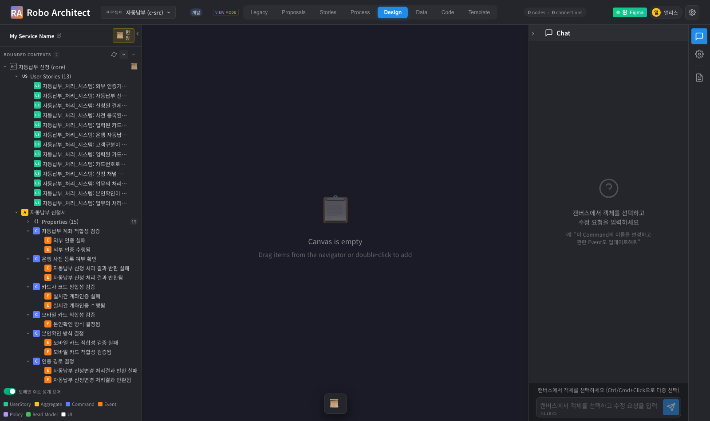
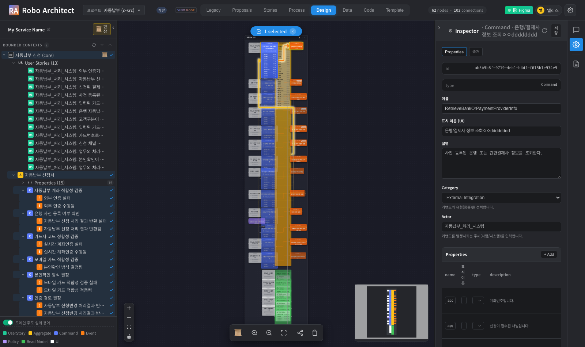
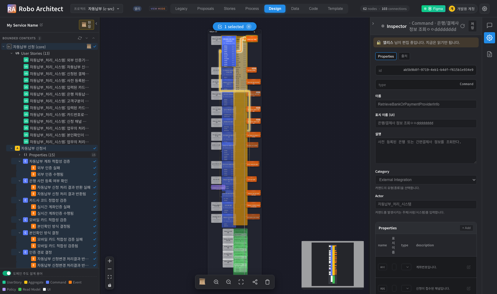
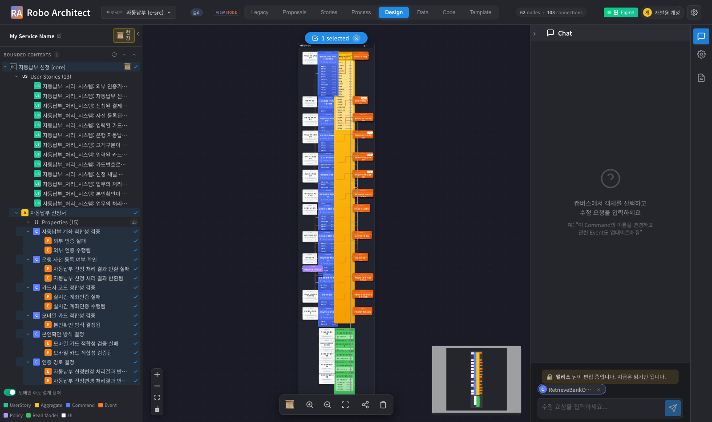

# 동시편집 사용 매뉴얼

> 기능 명세: [specs/057-presence-bound-element-lock](../../specs/057-presence-bound-element-lock/spec.md)
> 대상 사용자: 같은 프로젝트를 **여럿이 함께 고치는 사람**(기획자·아키텍트)
> 최종 업데이트: 2026-09-17

여러 사람이 같은 설계를 동시에 열어도 **서로의 수정이 덮어써지지 않게** 하는 장치입니다.
누가 무엇을 고치고 있는지 화면에 보이고, 남이 고치는 중인 요소는 읽기로 열리며,
상대의 저장은 새로고침 없이 내 화면에 들어옵니다.

이 매뉴얼의 화면 캡처는 Playwright 자동 시나리오
(`frontend/tests/collab-manual-capture.spec.ts`)로 **실제 화면에서** 생성되었습니다.
두 사람(앨리스·개발용 계정)이 같은 프로젝트를 연 상태입니다.

---

## 목차

1. [누가 보고 있는지 확인하기](#1-누가-보고-있는지-확인하기)
2. [요소를 열면 자동으로 선점됩니다](#2-요소를-열면-자동으로-선점됩니다)
3. [남이 편집 중인 요소 — 읽기로 열립니다](#3-남이-편집-중인-요소--읽기로-열립니다)
4. [AI 챗도 같은 선점을 따릅니다](#4-ai-챗도-같은-선점을-따릅니다)
5. [선점은 언제 풀리나요](#5-선점은-언제-풀리나요)
6. [연결이 끊겼을 때](#6-연결이-끊겼을-때)
7. [상대의 수정이 내 화면에 들어옵니다](#7-상대의-수정이-내-화면에-들어옵니다)
8. [자주 묻는 것 · 문제 해결](#8-자주-묻는-것--문제-해결)

---

## 1. 누가 보고 있는지 확인하기

상단 바에 **지금 이 프로젝트를 보고 있는 사람**이 표시됩니다.



| 위치 | 의미 |
|------|------|
| 상단 바 좌측 이름 칩 | 지금 이 프로젝트에 접속해 있는 사람 |
| `VIEW MODE` 배지 | 지금 화면이 보기 상태임을 알리는 표시 |

접속자는 창을 닫으면 사라집니다. 브라우저를 강제로 종료한 경우에도 잠시 뒤 자동으로 빠집니다.

---

## 2. 요소를 열면 자동으로 선점됩니다

캔버스에서 요소를 **더블클릭**하면 오른쪽에 Inspector 가 열리고, **그 순간 선점이 걸립니다.**



> **왜 "저장할 때"가 아니라 "여는 순간"인가요?**
> 저장할 때 잠그면 이미 두 사람이 각자 다 고친 뒤입니다. 그때는 막을 것이 없고
> 한쪽의 작업이 사라집니다. 그래서 **여는 순간** 잡습니다.

선점한 사람에게는 아무 배너도 뜨지 않고, 모든 입력칸이 평소대로 열려 있습니다.
따로 눌러야 하는 버튼은 없습니다.

---

## 3. 남이 편집 중인 요소 — 읽기로 열립니다

다른 사람이 먼저 잡고 있는 요소를 열면, **열리긴 하지만 읽기 전용**이 됩니다.



Inspector 위쪽에 누가 고치고 있는지 배너가 뜹니다.


```
🔒  앨리스 님이 편집 중입니다. 지금은 읽기만 됩니다.
```

| 할 수 있는 것 | 할 수 없는 것 |
|---|---|
| 내용을 **보는 것** | 입력칸 수정 |
| 다른 탭(출처 등) 전환 | 저장 |
| 캔버스에서 다른 요소로 이동 | AI 챗으로 이 요소 수정 요청 |

> **아예 못 열게 하지 않는 이유.** 옆 사람이 무엇을 하는지도 못 보게 되고, 그 사람이
> 창을 켜 둔 채 자리를 비우면 아무도 아무것도 못 하게 됩니다. 선점은 **실수로 겹쳐
> 쓰는 것**을 막는 장치이지 사람을 막는 장치가 아닙니다.

**선점을 강제로 빼앗는 기능은 없습니다.** 급하면 그 사람에게 말해서 창을 닫게 하세요.
닫는 즉시 풀립니다.

---

## 4. AI 챗도 같은 선점을 따릅니다

남이 잡고 있는 요소를 AI 챗에 올리면, **프롬프트를 치기 전에** 막힙니다.



```
🔒  앨리스 님이 편집 중입니다. 지금은 읽기만 됩니다.
    → 선택 칩은 남아 있지만 입력칸과 보내기 버튼이 잠깁니다
```

> **왜 미리 막나요?** 보내고 나서 막으면 AI 가 초안을 다 만든 뒤에 실패합니다.
> 그동안 기다린 시간도, **남이 지금 고치고 있는 내용 위에 쓸 초안**도 쓸모가 없습니다.

**챗은 선점을 잡지 않습니다.** 요소를 고르기만 해도 잡아 버리면, Inspector 로 고치려던
사람이 막히기 때문입니다. 챗은 "남이 잡았는지"만 읽습니다.

**Inspector 와 챗을 오가도 선점은 유지됩니다.** 오른쪽 패널을 전환하는 것은
"손을 떼는 것"이 아닙니다.

---

## 5. 선점은 언제 풀리나요

| 상황 | 언제 풀리나 |
|---|---|
| 다른 요소를 엽니다 | 즉시 |
| 오른쪽 패널을 접습니다 | 잠시 뒤(몇 초) |
| **창(탭)을 닫습니다** | **즉시** |
| 브라우저가 강제 종료됐습니다 | 약 25초 안에 자동 |
| 컴퓨터가 절전에 들어갔습니다 | 깨어나지 못하면 약 25초 안에 자동 |
| 서버가 재시작됐습니다 | 재시작 시 자동 정리 |

**시간 제한은 없습니다.** 오래 열어 두었다고 선점이 풀리지 않습니다. 화면을 열어 두고
회의를 다녀와도 그대로입니다. 판단 기준은 시간이 아니라 **접속이 살아 있는지**입니다.

> **선점은 창(탭) 단위입니다.** 같은 사람이 탭을 둘 열면 각각 따로 잡습니다.
> 한쪽 탭을 닫아도 다른 탭에서 고치던 것은 그대로 유지됩니다.

---

## 6. 연결이 끊겼을 때

네트워크가 잠깐 끊기거나 절전에서 깨어난 직후에는 **경고 배너**가 뜹니다.


```
⚠️  서버와 연결이 끊겼습니다. 연결이 돌아오지 않으면 편집권을 잃고
    지금 고친 내용이 저장되지 않을 수 있습니다.
```

이 배너는 **남이 편집 중이라는 배너와 다른 것**입니다. 원인이 다르고, 해야 할 일도 다릅니다.

| 배너 | 뜻 | 할 일 |
|---|---|---|
| 🔒 회색 | 남이 그 요소를 고치고 있다 | 기다리거나 그 사람에게 말한다 |
| ⚠️ 빨강 | 내 연결이 끊겼다 | **큰 수정을 잠시 멈추고** 연결이 돌아오길 기다린다 |

**입력칸은 잠기지 않습니다.** 끊긴 것은 아직 빼앗긴 것이 아니고, 잠깐 끊겼다 붙는 경우가
흔하기 때문입니다. 다만 그 사이에 친 글자는 연결이 돌아오지 않으면 저장되지 않을 수 있습니다.

연결이 돌아오면:

- 아무도 그 요소를 가져가지 않았으면 → **자동으로 다시 선점**하고 경고가 사라집니다
- 그 사이 누군가 가져갔으면 → 🔒 배너로 **누가 가져갔는지** 보이고 읽기로 바뀝니다

---

## 7. 상대의 수정이 내 화면에 들어옵니다

상대가 Inspector 에서 저장했거나 AI 챗으로 수정을 적용하면, **새로고침 없이** 내 화면에
반영됩니다. 트리·캔버스·목록이 함께 갱신됩니다.

내가 어떤 요소를 열어 놓고 편집 중일 때는, 그 요소만은 화면이 흔들리지 않도록
갱신을 잠시 미룹니다 — 치고 있던 글자가 지워지지 않게 하기 위해서입니다.
손을 떼면 밀린 갱신이 들어옵니다.

연결이 끊긴 동안 상대가 고친 내용도, 연결이 돌아오면 **따라잡아 반영**됩니다.

---

## 8. 자주 묻는 것 · 문제 해결

**Q. 저장 버튼이 눌리지 않습니다.**
Inspector 위쪽에 🔒 배너가 있는지 보세요. 남이 그 요소를 고치는 중입니다.
배너가 없는데도 눌리지 않으면 아무 칸도 수정하지 않은 상태입니다.

**Q. 저장했더니 "○○ 님이 편집 중입니다. 저장하지 않았습니다" 가 떴습니다.**
저장 직전에 다른 사람이 그 요소를 가져갔습니다. **내용은 그대로 남아 있으니**
잠시 뒤 다시 시도하거나, 그 사람과 순서를 정하세요.

**Q. 분명히 내가 열어 뒀는데 남이 편집 중이라고 나옵니다.**
연결이 오래 끊겨 선점이 자동으로 풀린 사이에 상대가 가져간 경우입니다.
⚠️ 경고 배너가 먼저 떴을 것입니다. 상대가 놓으면 다시 잡을 수 있습니다.

**Q. 자리를 비운 사람이 요소를 잡고 있어 아무도 못 고칩니다.**
그 사람이 **창을 닫으면 즉시** 풀립니다. 강제로 빼앗는 기능은 일부러 만들지
않았습니다 — 빼앗을 수 있으면 선점이 선점이 아니게 되기 때문입니다.

**Q. 상대 화면에 내 수정이 안 보인다고 합니다.**
상대가 그 요소를 **열어 놓고 편집 중**이면 그 요소만 갱신이 미뤄집니다.
상대가 손을 떼면 들어옵니다. 그래도 안 보이면 상대 화면 상단의 연결 상태를 확인하세요.

**Q. 접속자 목록에 이미 나간 사람이 남아 있습니다.**
브라우저를 강제 종료한 경우 몇십 초 정도 남을 수 있습니다. 곧 자동으로 빠집니다.

---

## 관련 문서

- 기능 명세: [specs/057-presence-bound-element-lock](../../specs/057-presence-bound-element-lock/spec.md)
- 화면 캡처 시나리오: `frontend/tests/collab-manual-capture.spec.ts`
- 동작 검증: `frontend/tests/collab-lock-lifetime.spec.ts` · `collab-two-paths.spec.ts` ·
  `collab-catchup.spec.ts` · `collab-two-users.spec.ts`
