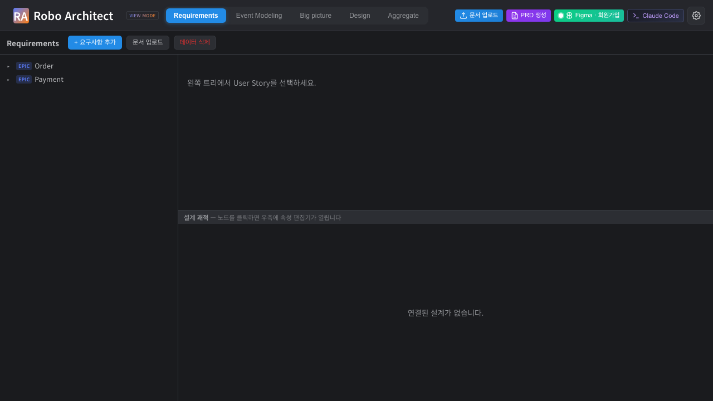
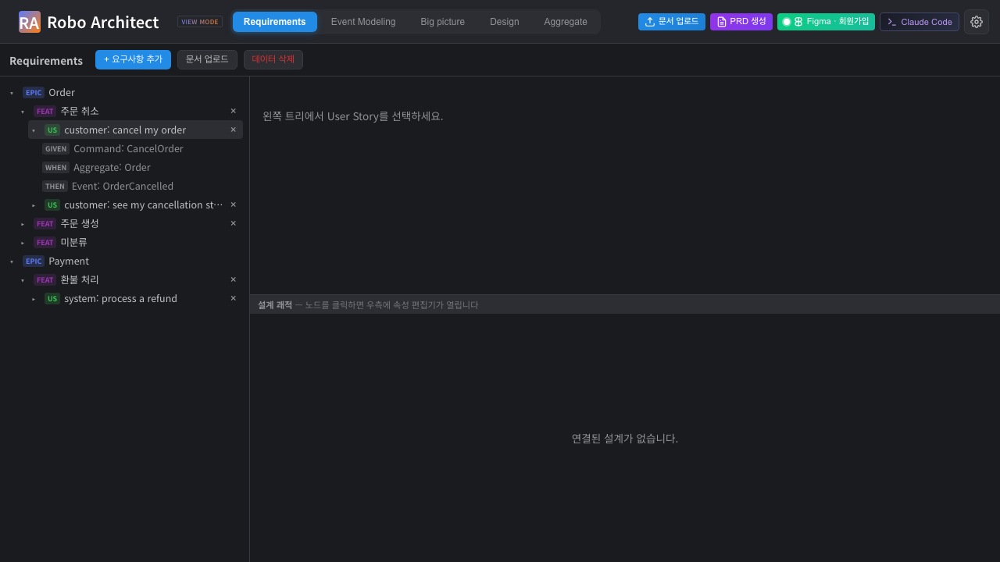
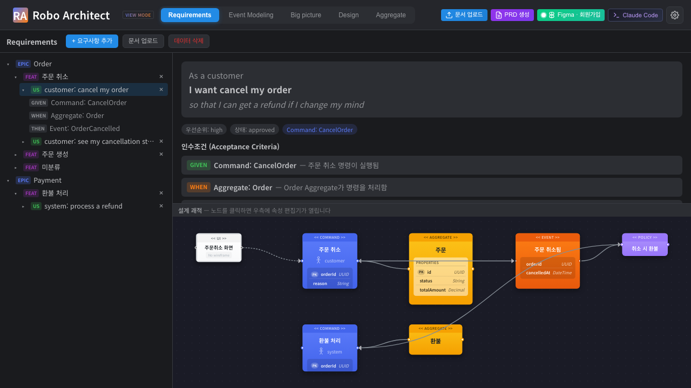
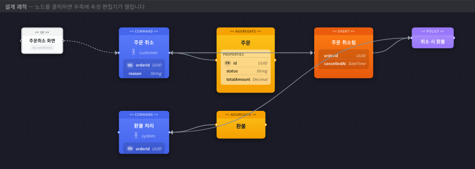
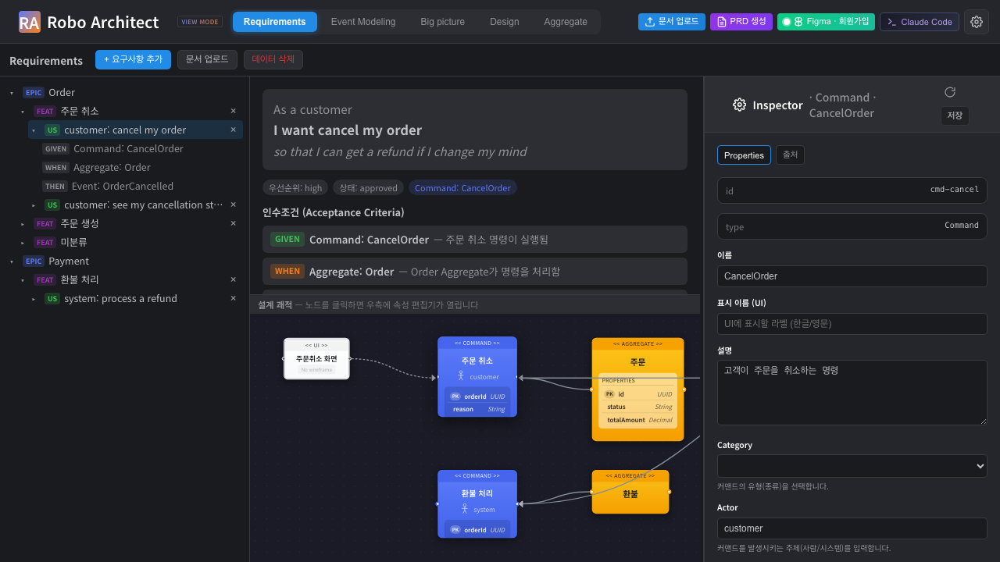
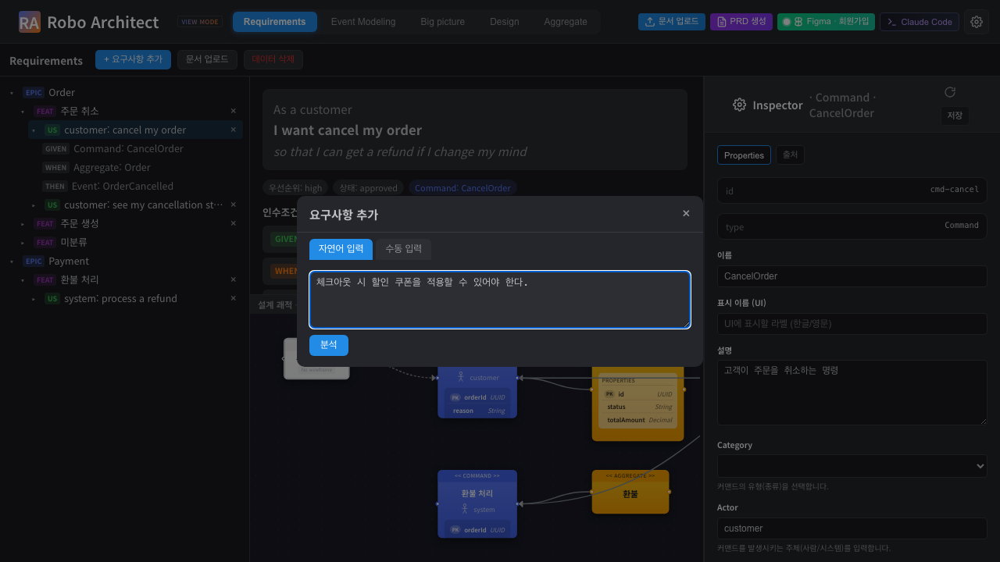
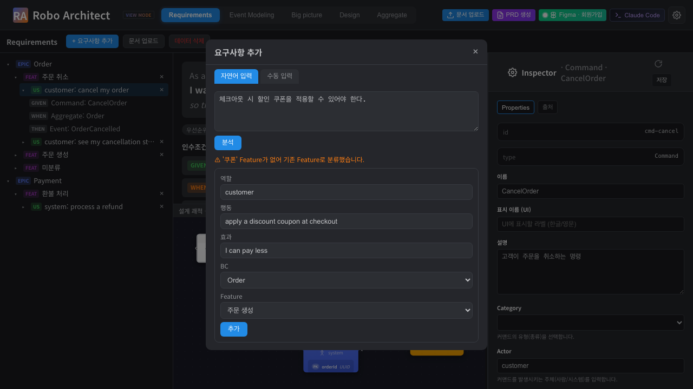
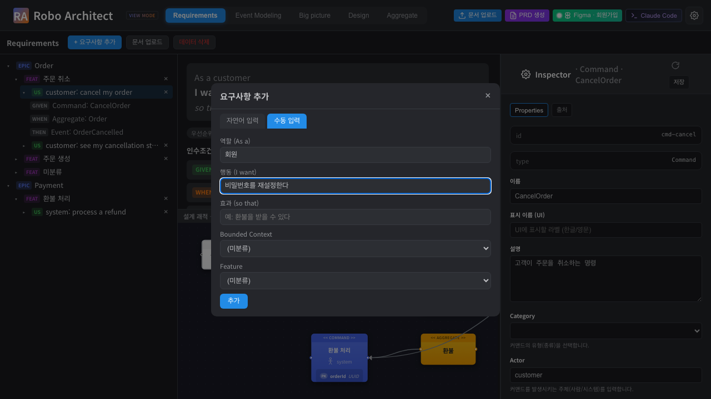
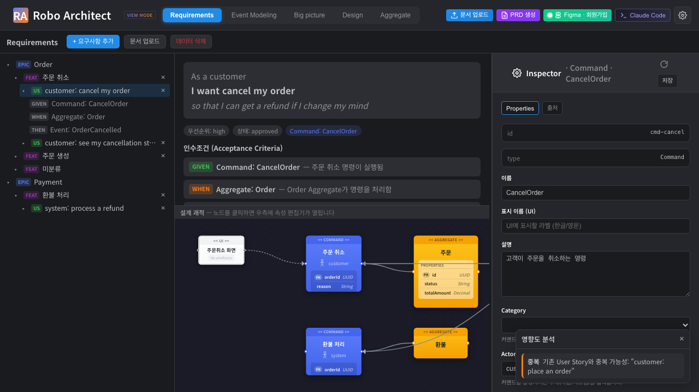
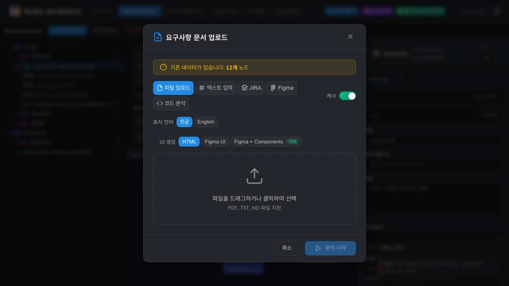

# Requirements 탭 사용 매뉴얼

> 기능 명세: [specs/026-requirements-tab](../../specs/026-requirements-tab/spec.md)
> 대상 사용자: 기획자(Product Planner)
> 최종 업데이트: 2026-05-18

Requirements 탭은 기획자가 요구사항을 **Epic → Feature → User Story → Acceptance Criteria** 4단계로 탐색하고, 신규 요구사항을 추가하며, 각 요구사항이 어떻게 설계와 UI로 구현되는지를 한 화면에서 확인하는 작업 공간입니다.

이 매뉴얼의 화면 캡처는 Playwright 자동 시나리오 테스트(`frontend/tests/requirements-tab-manual.spec.ts`)로 생성되었습니다.

---

## 목차

1. [Requirements 탭 열기 — 전체 화면 구성](#1-requirements-탭-열기--전체-화면-구성)
2. [요구사항 트리 탐색 (Epic→Feature→User Story→인수조건)](#2-요구사항-트리-탐색)
3. [User Story 상세 보기](#3-user-story-상세-보기)
4. [설계 괘적 확인 (탭 내부 캔버스 + UI 연결)](#4-설계-괘적-확인)
5. [캔버스 노드 클릭 → 속성 편집기](#5-캔버스-노드-클릭--속성-편집기)
6. [신규 요구사항 추가 — 자연어 입력](#6-신규-요구사항-추가--자연어-입력)
7. [신규 요구사항 추가 — 수동 입력](#7-신규-요구사항-추가--수동-입력)
8. [영향도 분석 리포트](#8-영향도-분석-리포트)
9. [문서 업로드 (증분 upsert)](#9-문서-업로드-증분-upsert)
10. [User Story 재배치·삭제](#10-user-story-재배치삭제)
11. [요구사항 데이터 전체 삭제](#11-요구사항-데이터-전체-삭제)

---

## 1. Requirements 탭 열기 — 전체 화면 구성

상단 탭 메뉴 맨 앞의 **Requirements** 탭을 클릭합니다.



화면 구성:

| 영역 | 설명 |
|------|------|
| 상단 툴바 | `+ 요구사항 추가`, `문서 업로드`, `데이터 삭제` 버튼 |
| 좌측 트리 | Epic(BC) → Feature → User Story → Acceptance Criteria 4단계 드릴다운 |
| 우측 상단 | 선택한 User Story의 본문·인수조건 상세 |
| 우측 하단 | 선택한 User Story의 **설계 괘적** 캔버스 |

---

## 2. 요구사항 트리 탐색

좌측 트리는 4단계로 펼쳐집니다.

- **EPIC** — Bounded Context (도메인 경계)
- **FEAT** — Feature (관련 User Story 묶음)
- **US** — User Story
- **GIVEN / WHEN / THEN** — Acceptance Criteria (연결된 Command의 GWT)

각 노드의 `▸` 캐럿을 클릭해 하위 단계를 펼치거나 접습니다. Feature/User Story 행 우측의 `×` 버튼으로 삭제할 수 있습니다.



> **미분류 처리** — Feature에 속하지 않은 User Story는 해당 Epic 아래 **"미분류"** 그룹에, Bounded Context도 없는 User Story는 트리 최상위 **"미분류"** 그룹에 표시됩니다.

---

## 3. User Story 상세 보기

트리에서 User Story를 클릭하면 우측 상단에 상세가 표시됩니다.



- **As a … / I want … / so that …** — 역할·행동·기대효과 문장
- **우선순위 / 상태 / Command** 배지
- **인수조건 (Acceptance Criteria)** — 연결된 Command의 Given/When/Then. Command가 연결되지 않은 User Story는 "연결된 Command가 없어 인수조건을 표시할 수 없습니다"가 표시됩니다.

---

## 4. 설계 괘적 확인

User Story를 선택하면 우측 하단 **설계 괘적** 캔버스에 그 User Story가 구현하는 Command를 기점으로 한 설계 흐름이 렌더링됩니다.



괘적은 `UI → command → aggregate → event → policy` 범위를 간략히 표시합니다. **Command에 연결된 UI 와이어프레임이 있으면 캔버스에 함께 표시**되어, 요구사항이 화면 디자인까지 어떻게 이어지는지 한눈에 볼 수 있습니다.

- **스티커** — Design 탭의 노드 컴포넌트를 그대로 재사용합니다. `<< COMMAND >>` 등 헤더, 색상, **속성(필드) 목록**, Actor까지 Design 탭과 완전히 동일하게 표시됩니다.
- **배치 순서** — Design 탭과 동일하게 `UI → Command → Aggregate → Event` 순서로 좌→우 배치됩니다.
- **노드 라벨** — 기본적으로 **논리명**(displayName)으로 표시되며, 논리명이 없으면 기술명으로 대체됩니다.

| 스티커 색 | 종류 |
|-----------|------|
| 흰색 | UI (와이어프레임 화면) |
| 노랑 | Aggregate |
| 파랑 | Command |
| 주황 | Event |
| 연보라 | Policy |

노드 사이의 화살표는 설계 흐름을 나타냅니다. UI→Command 연결만 **점선**으로 표시되어 어떤 화면이 어떤 Command에 붙는지 구분됩니다. 연결된 Command가 없는 User Story를 선택하면 "연결된 설계가 없습니다"가 표시됩니다.

---

## 5. 캔버스 노드 클릭 → 속성 편집기

설계 괘적 캔버스에서 **노드를 클릭하면**, Design 탭에서 쓰던 것과 동일한 **속성 편집기(Inspector)** 가 우측에 열립니다. 기획 내용이 어떤 설계 객체·UI로 구현되었는지 곧바로 확인하고 편집할 수 있습니다.



- Command·Aggregate·Event·Policy 노드를 클릭하면 해당 객체의 속성(이름·설명·Actor·필드 등)이 표시됩니다.
- **UI 노드**를 클릭하면 같은 Inspector가 열리며, `Preview` 탭에서 와이어프레임 화면을 직접 확인할 수 있습니다.
- Inspector 우상단의 닫기 버튼으로 패널을 닫습니다. 다른 User Story를 선택하면 Inspector는 자동으로 닫힙니다.
- **패널 너비 조절** — Inspector 패널 왼쪽 경계를 드래그하면 너비를 조절할 수 있습니다(Design 탭의 패널과 동일). 조절한 너비는 저장되어 다음에도 유지됩니다.

이로써 **요구사항(User Story) → 인수조건 → 설계 괘적 → UI 화면 → 속성**까지 탭 이동 없이 한 화면에서 추적할 수 있습니다.

---

## 6. 신규 요구사항 추가 — 자연어 입력

툴바의 `+ 요구사항 추가` 버튼을 누르면 추가 다이얼로그가 열립니다. **자연어 입력** 탭에서 요구사항을 자연어 문장으로 작성한 뒤 `분석` 버튼을 누릅니다.



LLM이 입력을 User Story로 분해하고, Bounded Context·Feature를 제안한 **초안**을 보여줍니다. 이 단계에서는 그래프가 아직 변경되지 않습니다.



제안된 역할·행동·효과·BC·Feature를 검토·수정한 뒤 `추가` 버튼을 눌러야 비로소 그래프에 반영됩니다(propose → confirm). 분류가 불확실하면 `⚠` 경고가 함께 표시됩니다.

> 자연어 입력이 **propose(검토) → confirm(확정)** 2단계인 것은, LLM이 생성한 변경을 사람이 검토 후 적용한다는 원칙(human-in-the-loop)을 따르기 때문입니다.

---

## 7. 신규 요구사항 추가 — 수동 입력

다이얼로그의 **수동 입력** 탭에서는 역할·행동·효과를 직접 작성하고 Bounded Context·Feature를 선택해 즉시 추가합니다(LLM 분해 없이 confirm 직접 호출).



BC·Feature를 선택하지 않으면 미분류 상태로 생성됩니다.

---

## 8. 영향도 분석 리포트

User Story를 추가·삭제하거나 다른 Bounded Context로 이동하면, 시스템이 **백그라운드에서** 영향도 분석을 수행합니다. 작업 흐름은 분석을 기다리지 않고 계속 진행됩니다.



분석이 끝나면 우측 하단에 **영향도 분석** 리포트 패널이 비차단(non-blocking)으로 나타납니다.

- **중복** — 기존 User Story와 의미가 겹칠 가능성
- **충돌** — 요구사항 간 충돌
- **설계 영향** — 영향받는 Command/Event/Policy 등 설계 요소

문제가 발견되지 않으면 리포트는 표시되지 않습니다. `×` 버튼으로 패널을 닫습니다.

---

## 9. 문서 업로드 (증분 upsert)

툴바의 `문서 업로드` 버튼으로 요구사항 문서를 추가합니다.



업로드는 **증분 upsert** 방식입니다 — 기존 데이터를 자동으로 삭제하지 않고 신규 요구사항만 병합합니다. 따라서 업로드 시 "기존 데이터 삭제" 확인창이 나타나지 않습니다. 인제스트 과정에서 User Story가 Bounded Context와 Feature로 자동 분류됩니다.

---

## 10. User Story 재배치·삭제

- **재배치** — 트리에서 User Story를 다른 Feature 노드 위로 **드래그 앤 드롭**하면 소속 Feature가 변경됩니다. 다른 Bounded Context의 Feature로 옮기면 Epic 소속도 함께 변경되고 영향도 분석이 실행됩니다.
- **삭제** — Feature/User Story 행 우측의 `×` 버튼을 누릅니다. Feature 삭제 시 하위 User Story를 **미분류로 이동**할지 **함께 삭제**할지 선택하는 확인창이 표시됩니다.

삭제 후에도 영향도 분석이 백그라운드로 실행됩니다.

---

## 11. 요구사항 데이터 전체 삭제

툴바의 `데이터 삭제` 버튼은 문서 업로드와 **무관한 별도 액션**입니다. 클릭하면 확인창이 표시되고, 확인 시 요구사항 데이터가 전체 삭제됩니다. 전체 초기화는 이 버튼으로만 가능합니다.

---

## 부록 — API 요약

| 기능 | 엔드포인트 |
|------|-----------|
| 트리 조회 | `GET /api/requirements/tree` |
| Feature 생성/삭제 | `POST` / `DELETE /api/requirements/feature` |
| User Story 제안 | `POST /api/requirements/user-story/propose` |
| User Story 확정 | `POST /api/requirements/user-story/confirm` |
| User Story 이동 | `PATCH /api/requirements/user-story/move` |
| User Story 삭제 | `DELETE /api/requirements/user-story` |
| 설계 괘적 (UI 포함) | `GET /api/requirements/user-story/{id}/design-trace` |
| 영향도 리포트 | `GET /api/requirements/impact-report/{report_id}` |

전체 명세는 [contracts/rest-api.md](../../specs/026-requirements-tab/contracts/rest-api.md)를 참고하세요.

## 재현 방법

화면 캡처를 다시 생성하려면:

```bash
cd frontend
npx playwright test requirements-tab-manual
```

스크린샷은 `docs/requirements-tab-manual/images/`에 저장됩니다.
