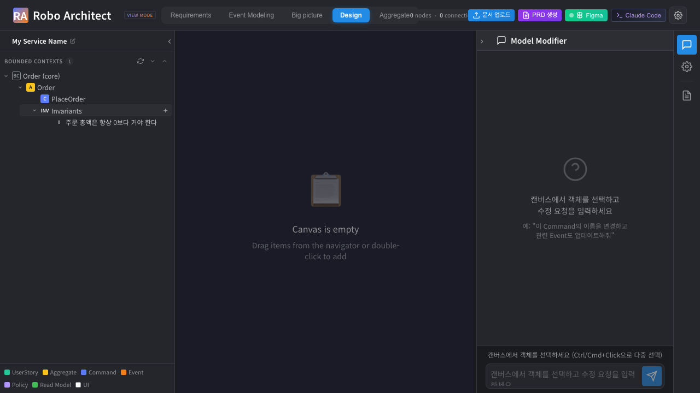
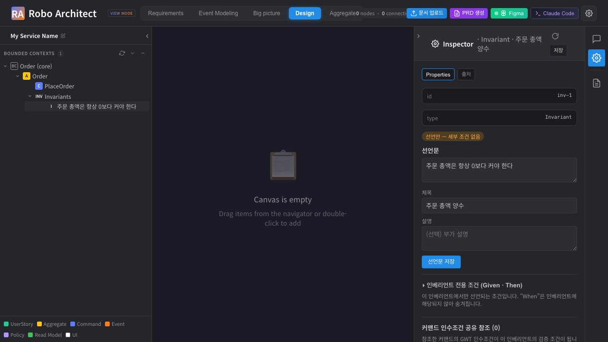
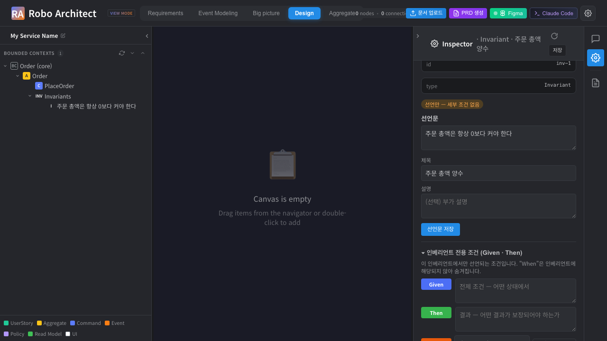

% 어그리거트 인베리언트(Aggregate Invariants) 사용 매뉴얼
% Robo Architect — 기능 027
% 2026-05-18

# 1. 개요

**인베리언트(Invariant)** 는 하나의 어그리거트가 *항상* 준수해야 하는 비즈니스 규칙을
나타내는 1급(first-class) 모델링 객체입니다. 기존에는 어그리거트의 불변식이 단순한
텍스트 문자열 목록으로만 존재해 구조도, 추적성도, 검증 조건과의 연결도 없었습니다.

이 기능은 인베리언트를 어그리거트 하위의 독립 객체로 만들어 다음을 제공합니다.

- 어그리거트마다 0개 이상의 인베리언트를 부착하고 디자인 트리에서 드릴다운
- 각 인베리언트의 **선언문**(규칙 문장) 편집
- 인베리언트의 **세부 검증 조건**(Given · Then)을 편집 — 커맨드의 GWT 인수조건을
  **공유 참조**하거나, 인베리언트 전용 조건으로 직접 선언
- 조건의 **Then** 에 사용자에게 제시할 **Exception**(예외) 객체를 선언
- 문서 인제스트 시 인베리언트 후보 자동 추출

> 인베리언트는 캔버스에 스티커로 나타나지 않습니다. 좌측 **디자인 트리**와 우측
> **속성 패널**에서만 다룹니다.

# 2. 핵심 개념

| 개념 | 설명 |
|------|------|
| **Invariant** | 어그리거트가 항상 지켜야 하는 규칙. 선언문 + 세부 조건으로 구성. |
| **선언문(declaration)** | 규칙을 서술한 한 문장. 예: "주문 총액은 항상 0보다 커야 한다". |
| **세부 검증 조건** | 규칙을 *어떻게* 검증하는지 나타내는 Given · Then. |
| **공유 참조** | 같은 어그리거트의 커맨드 인수조건(GWT)을 그대로 검증 조건으로 참조. 한쪽에서 편집하면 양쪽에 반영. |
| **인베리언트 전용 조건** | 어떤 커맨드와도 공유하지 않는, 이 인베리언트만의 GWT 조건. |
| **Exception** | Then 결과로 사용자에게 제시될 예외 객체. 어그리거트의 도메인 객체(enum·value object와 동급)로 관리. |

> **인베리언트 GWT에는 "When"이 없습니다.** 인베리언트는 항상 참이어야 하는 규칙이므로
> "언제(When)"라는 개념이 성립하지 않습니다. 따라서 편집기는 **Given · Then** 만
> 표시합니다. (커맨드의 GWT는 Given·When·Then 모두 사용)

# 3. 인베리언트 보기 및 추가

1. **Design 탭**을 열고 좌측 트리에서 바운디드 컨텍스트 → 어그리거트를 펼칩니다.
2. 어그리거트 하위에 커맨드·이벤트와 함께 **Invariants** 그룹이 보입니다.
3. **Invariants** 그룹을 클릭해 펼치면 해당 어그리거트의 인베리언트 목록이 나옵니다.

**새 인베리언트 추가** — **Invariants** 그룹 행 위에 마우스를 올리면 나타나는 **＋**
버튼을 누르고 선언문을 입력합니다. 추가 즉시 트리에 반영됩니다.

# 4. 인베리언트 편집 (우측 속성 패널)

트리에서 인베리언트를 더블클릭하면 우측 **속성 패널(Inspector)** 에 인베리언트
편집기가 열립니다.

상단의 상태 배지가 인베리언트의 완성도를 나타냅니다.

- **선언만 — 세부 조건 없음** : 선언문만 있고 검증 조건이 아직 없음
- **구체화됨** : 공유 참조 또는 전용 조건이 하나 이상 있음

**선언문 영역**에서 선언문·제목·설명을 수정하고 **선언문 저장**을 누릅니다.

# 5. 세부 검증 조건 — 인베리언트 전용 조건 (Given · Then)

**인베리언트 전용 조건 (Given · Then)** 섹션을 펼치면 이 인베리언트만의 GWT 편집기가
나타납니다. **Given**(전제)과 **Then**(보장되어야 할 결과)만 있으며 **When은
표시되지 않습니다**.

- **Given** : 어떤 상태에서
- **Then** : 어떤 결과가 보장되어야 하는가
- **시나리오** : 구체적인 검증 시나리오를 여러 개 추가 가능
- 편집 후 **GWT 저장**을 누릅니다.

# 6. Then 의 Exception 선언

**Then** 아래의 **Exception** 행에서 규칙 위반 시 사용자에게 제시될 예외를 선언할 수
있습니다. (이 기능은 커맨드의 GWT 편집기에서도 동일하게 동작합니다.)

- 드롭다운에서 어그리거트에 이미 정의된 Exception을 선택하거나,
- **＋ 새 Exception** 을 눌러 새 예외를 선언합니다.
  - **이름**(식별자), **메시지**(사용자 제시 문구), **구조화 필드**(이름·타입)를 입력
  - **Exception 저장**을 누르면 해당 어그리거트의 Exception 카탈로그에 등록됩니다.

> Exception은 enumeration·value object와 마찬가지로 **어그리거트의 도메인 객체**로
> 관리됩니다. 한 번 만든 Exception은 같은 어그리거트의 다른 GWT(커맨드·인베리언트)
> Then에서 이름으로 재사용할 수 있습니다.

# 7. 커맨드 인수조건 공유 참조

**커맨드 인수조건 공유 참조** 섹션에서 같은 어그리거트에 속한 커맨드의 GWT
인수조건을 이 인베리언트의 검증 조건으로 끌어올 수 있습니다.

1. **＋ 커맨드 참조 추가** 를 누르면 같은 어그리거트의 커맨드 목록이 나옵니다.
2. 커맨드를 선택하면 해당 커맨드의 GWT가 이 인베리언트의 검증 조건으로 연결됩니다.
3. 참조된 커맨드 행을 펼치면 그 커맨드의 GWT를 바로 편집할 수 있습니다.

> **공유 편집** — 참조된 조건은 물리적으로 커맨드의 GWT 노드 그 자체입니다. 인베리언트
> 쪽에서 편집하든 커맨드 쪽에서 편집하든 **같은 조건이 모든 곳에 자동 반영**됩니다.
> 별도의 확인 창은 뜨지 않습니다.

**참조 해제** 는 연결만 끊으며, 커맨드의 GWT 자체는 그대로 보존됩니다.

# 8. 인베리언트 삭제

편집기 하단의 **인베리언트 삭제** 버튼으로 삭제합니다. 삭제 시:

- 인베리언트 전용 GWT 조건은 함께 삭제됩니다.
- **공유 참조된 커맨드 GWT는 보존**됩니다(연결만 끊김).

# 9. 자동 추출 및 레거시 이관

- **레거시 이관** — 어그리거트가 예전 방식의 텍스트 불변식 목록을 가지고 있던 경우,
  해당 어그리거트의 인베리언트를 처음 조회하는 순간 각 텍스트가 1급 Invariant
  객체로 자동 이관됩니다(원문 보존, 1회성·멱등).
- **인제스트 자동 추출** — 요구사항 문서를 인제스트하면 `EXTRACTING_INVARIANTS`
  단계에서 어그리거트별 인베리언트 후보가 자동 생성됩니다. 자동 생성된 인베리언트도
  수동 인베리언트와 똑같이 편집·삭제할 수 있으며, 같은 문서를 다시 인제스트해도
  중복 생성되지 않습니다.

# 10. 참고 — REST API

| 동작 | 엔드포인트 |
|------|-----------|
| 어그리거트의 인베리언트 목록(최초 조회 시 레거시 이관) | `GET /api/aggregates/{id}/invariants` |
| 인베리언트 생성 | `POST /api/aggregates/{id}/invariants` |
| 인베리언트 조회·수정·삭제 | `GET·PATCH·DELETE /api/invariants/{id}` |
| 공유 참조 후보·추가·해제 | `GET /api/invariants/{id}/reference-candidates`, `POST·DELETE /api/invariants/{id}/references/...` |
| GWT 편집(커맨드·인베리언트 공통) | `POST /api/graph/gwt/upsert`, `GET /api/graph/gwt/{parentType}/{parentId}` |
| 어그리거트 Exception 카탈로그 | `GET·PUT /api/aggregates/{id}/exceptions` |

자세한 계약은 [`../contracts/rest-api.md`](../contracts/rest-api.md) 를 참고하세요.
