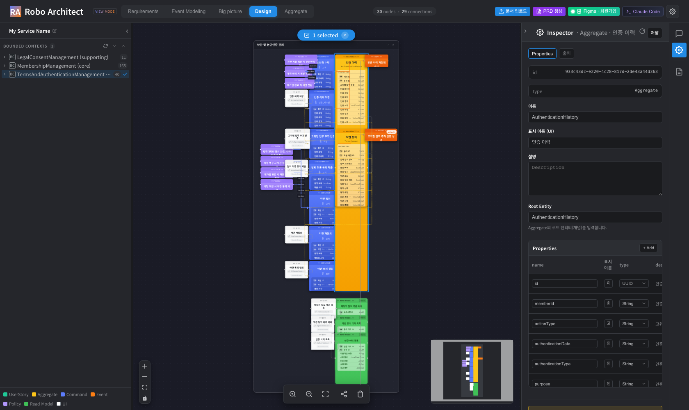
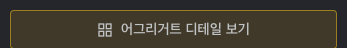
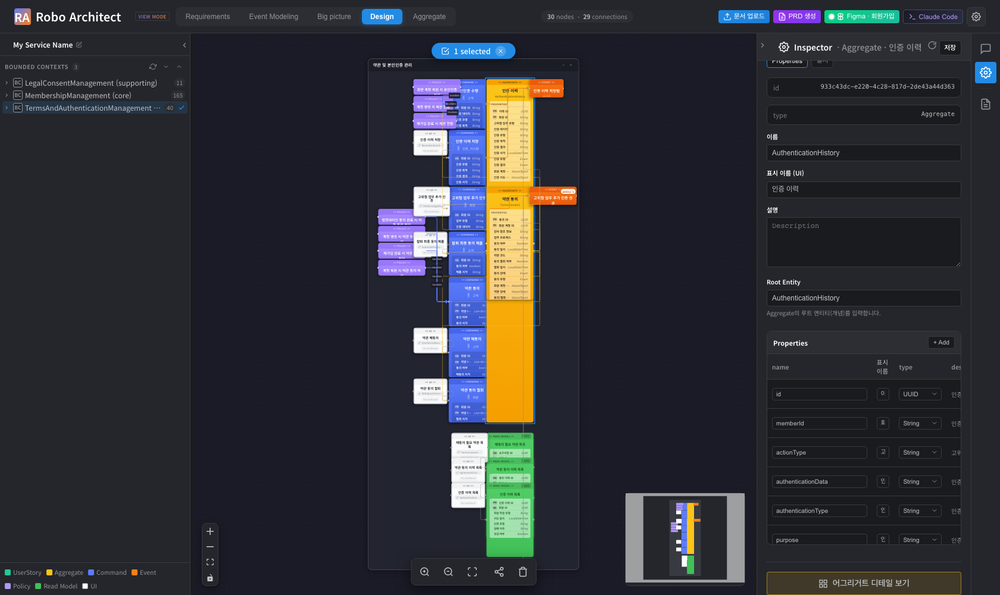
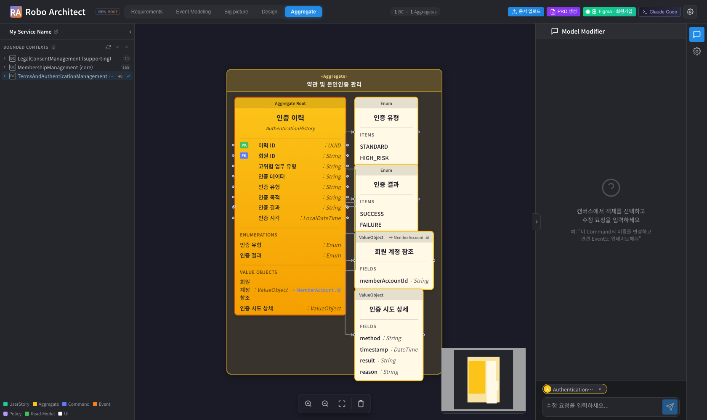
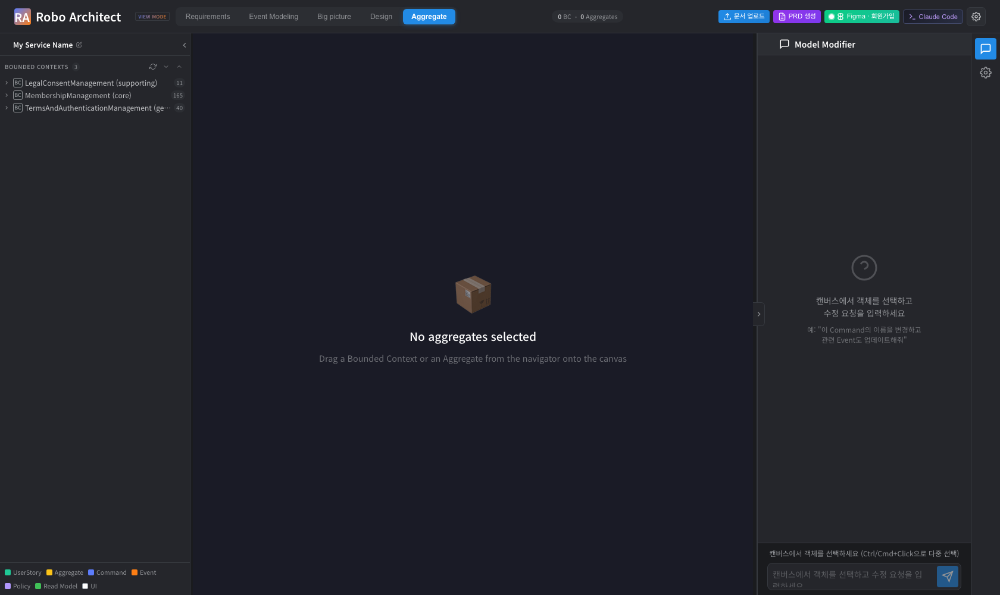
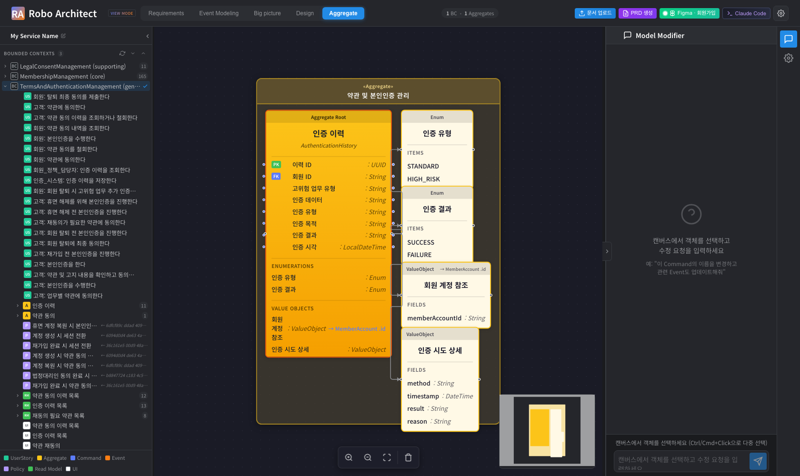
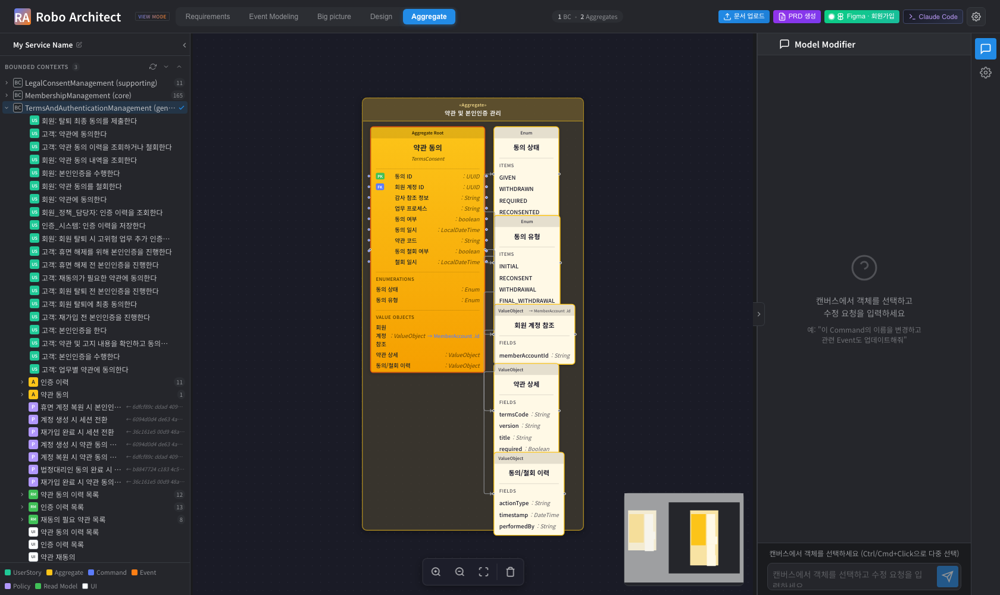
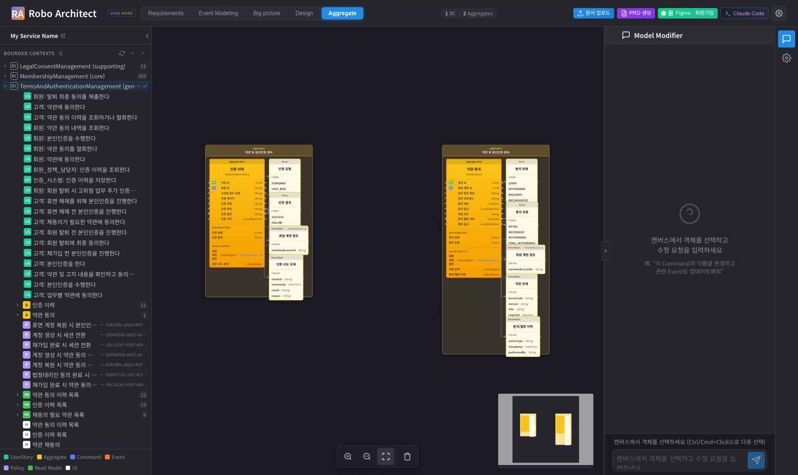
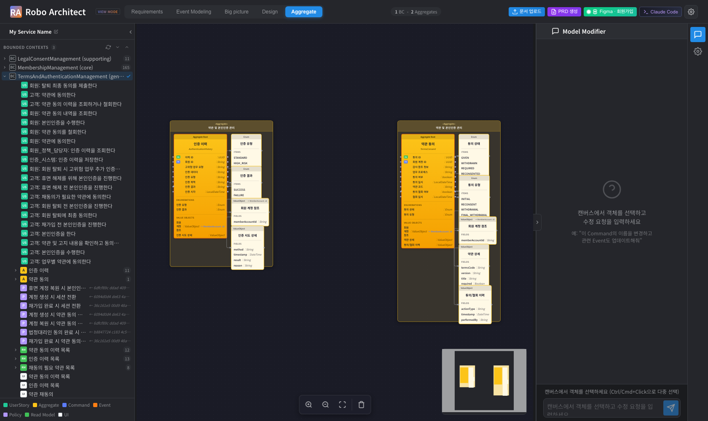
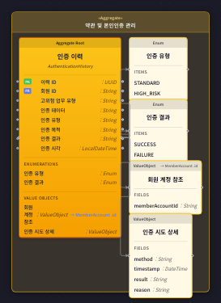

% 어그리거트 탭 드릴다운 & 캔버스 UX 사용 매뉴얼
% Robo Architect — Feature 028 (aggregate-tab-drilldown)
% 2026-05-18

---

## 개요

이 기능은 **디자인(Design) 탭**과 **어그리거트(Aggregate) 탭**을 서로 연결하여,
어그리거트의 내부 상세를 더 빠르고 자연스럽게 확인할 수 있도록 합니다.

이 매뉴얼은 다음 네 가지 기능의 사용법을 화면 캡처와 함께 설명합니다.

| # | 기능 | 한 줄 요약 |
|---|------|-----------|
| 1 | 디자인 탭에서 어그리거트 디테일 열기 | 속성창의 버튼 한 번으로 어그리거트 탭으로 이동 |
| 2 | 탭 전환 시 선택 어그리거트 자동 표시 | 어그리거트를 선택한 채 탭만 바꿔도 자동 로드 |
| 3 | 어그리거트를 캔버스에 직접 드롭 | Bounded Context뿐 아니라 어그리거트 하나만 올리기 |
| 4 | 어그리거트 경계 시각 강조 | 그루핑 박스의 노란색 배경 + `«Aggregate»` 스테레오타입 |

> 이 기능은 화면 동작과 표시에만 관여하며, 모델 데이터(그래프)를 변경하지 않습니다.

---

## 기능 1 — 디자인 탭에서 어그리거트 디테일 열기

디자인 탭에서 모델링을 하다가 특정 어그리거트의 내부(루트 엔티티, 속성, 값 객체,
열거형 등)를 자세히 보고 싶을 때 사용합니다. 더 이상 어그리거트 이름을 기억해
어그리거트 탭에서 다시 찾을 필요가 없습니다.

### 사용 방법

**1단계.** 디자인 탭에서 어그리거트 노드를 더블클릭하면 오른쪽에 속성창(Inspector)이
열립니다.

**2단계.** 속성창의 속성 목록 아래에 **「어그리거트 디테일 보기」** 버튼이 표시됩니다.
이 버튼은 선택한 노드가 어그리거트일 때만 나타납니다.

**3단계.** 버튼을 클릭하면 화면이 **어그리거트 탭으로 전환**되고, 방금 선택했던
어그리거트의 상세 뷰가 자동으로 화면 중앙에 표시됩니다.

### 참고

- 이미 어그리거트 탭 캔버스에 해당 어그리거트가 있는 경우, 새로 추가하지 않고
  기존 항목으로 포커스만 이동합니다(중복 생성 없음).
- 어그리거트가 아닌 노드(커맨드, 이벤트 등)를 선택하면 이 버튼은 나타나지 않습니다.

---

## 기능 2 — 탭 전환 시 선택 어그리거트 자동 표시

「어그리거트 디테일 보기」 버튼을 누르지 않더라도, 어그리거트를 선택한 상태에서
상단 탭 메뉴로 직접 어그리거트 탭으로 이동하면 동일하게 자동 로드됩니다.

### 사용 방법

**1단계.** 디자인 탭에서 어그리거트 노드를 하나 선택합니다.

**2단계.** 상단 탭 메뉴에서 **Aggregate** 탭을 클릭합니다.
선택했던 어그리거트가 어그리거트 탭에 자동으로 로드되고 포커스됩니다.

### 참고

- **어그리거트 1개만** 선택되어 있을 때 동작합니다.
- 아무것도 선택하지 않았거나, 여러 개를 선택했거나, 어그리거트가 아닌 노드를
  선택한 경우에는 어그리거트 탭이 강제로 바뀌지 않고 기존 상태를 유지합니다.

---

## 기능 3 — 어그리거트를 캔버스에 직접 드롭

기존에는 어그리거트 탭 캔버스에 내용을 표시하려면 내비게이터에서
**Bounded Context**를 끌어다 놓아야 했습니다. 이제 **어그리거트 항목 하나**를
끌어다 놓는 것도 가능합니다.

### 사용 방법 — 어그리거트 하나 올리기

**1단계.** 어그리거트 탭으로 이동합니다. (캔버스가 비어 있으면 안내 문구가 표시됩니다.)

**2단계.** 내비게이터 트리에서 Bounded Context를 펼친 뒤, 어그리거트 항목을
캔버스로 드래그하여 드롭합니다. 해당 어그리거트 하나의 상세 뷰가 표시됩니다.

**3단계.** 다른 어그리거트를 추가로 드롭하면, 기존 어그리거트는 그대로 둔 채
새 어그리거트가 **나란히 추가**됩니다.

**4단계.** 이미 캔버스에 있는 어그리거트를 다시 드롭해도 **중복 생성되지 않습니다.**
아래 화면은 첫 번째 어그리거트를 다시 드롭한 뒤에도 캔버스에 어그리거트가
정확히 2개만 있는 모습입니다.

### 참고 — Bounded Context 드롭은 그대로 동작

기존 방식대로 Bounded Context를 드롭하면 해당 컨텍스트의 **모든 어그리거트**가
표시됩니다. 이 동작은 변경되지 않았습니다.

---

## 기능 4 — 어그리거트 경계 시각 강조

어그리거트 탭 캔버스에서, 어그리거트의 구성 요소를 감싸는 **그루핑 박스**가
어그리거트 경계임을 한눈에 알 수 있도록 시각적으로 강조됩니다.

### 변경 내용

- 그루핑 박스 배경/테두리에 어그리거트 색상(노란색) 계열의 **옅은 틴트**가
  적용되어, 일반 컨테이너와 구분됩니다.
- 박스 상단 레이블 영역에 **`«Aggregate»` 스테레오타입** 표시가 추가되어,
  "이 영역의 내부는 어그리거트다"라는 점이 명확해집니다.
- 라이트/다크 테마 모두에서 색상과 레이블이 일관되게 보입니다.

위 화면에서 박스 상단의 `«Aggregate»` 표기와, 박스 전체에 입혀진 옅은 노란색
배경을 확인할 수 있습니다. 내부의 루트 엔티티/값 객체/열거형 카드는 그대로
선명하게 읽힙니다.

---

## 검증 요약

이 매뉴얼의 화면들은 Playwright 기반 엔드 투 엔드 테스트로 실제 앱을 구동하며
캡처했습니다. 주요 시나리오 검증 결과는 다음과 같습니다.

| 시나리오 | 결과 |
|----------|------|
| 디자인 탭 → 디테일 버튼 → 어그리거트 탭 포커스 (기능 1) | 정상 |
| 어그리거트 선택 후 탭 전환 자동 로드 (기능 2) | 정상 |
| 어그리거트 단건 드롭 · 추가 드롭 (기능 3) | 정상 |
| 동일 어그리거트 재드롭 시 중복 없음 (캔버스 컨테이너 2개 유지) | 정상 |
| Bounded Context 드롭 시 전체 어그리거트 표시 (회귀 없음) | 정상 |
| 노란색 틴트 + `«Aggregate»` 스테레오타입 표시 (기능 4) | 정상 |

---

*문서 생성: Robo Architect Spec 028 — aggregate-tab-drilldown*
