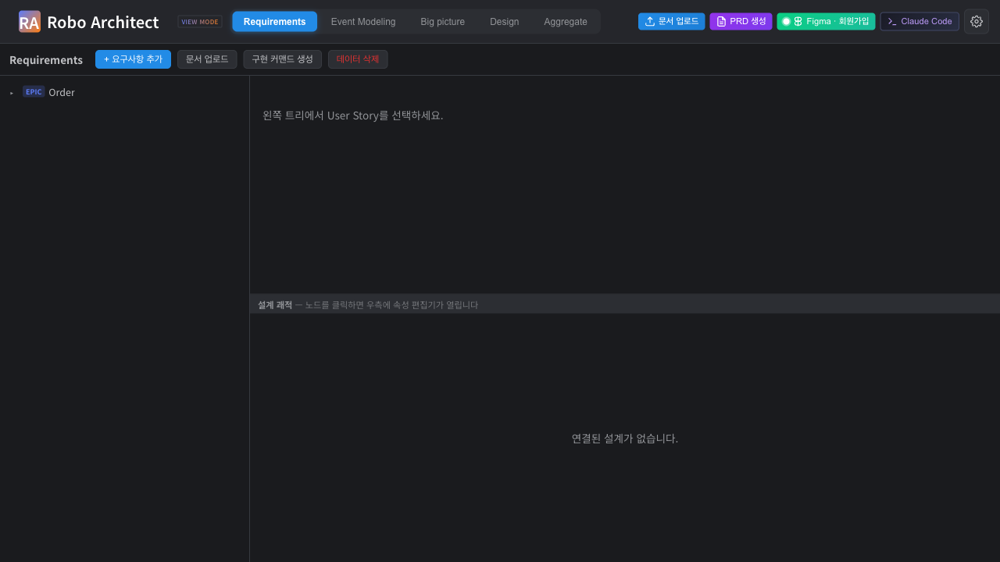
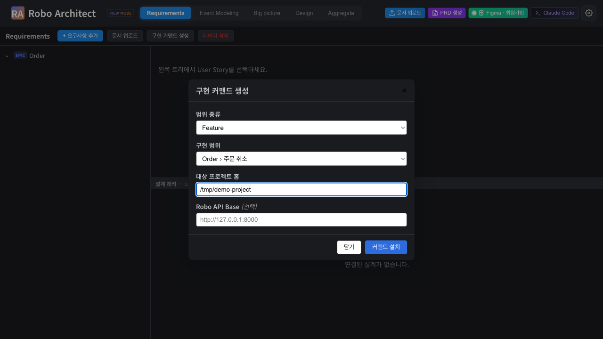
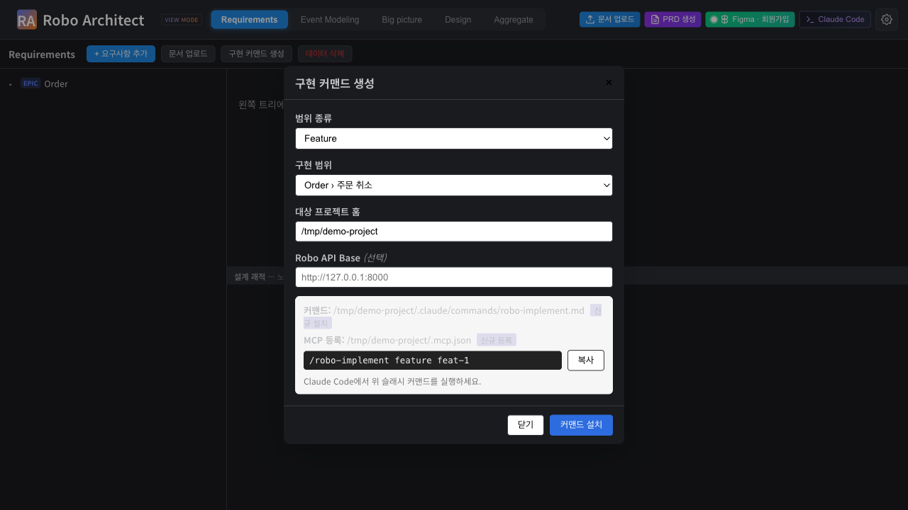
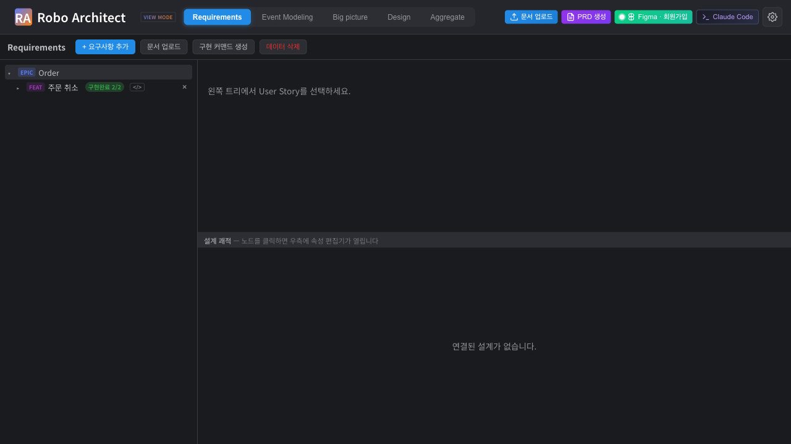
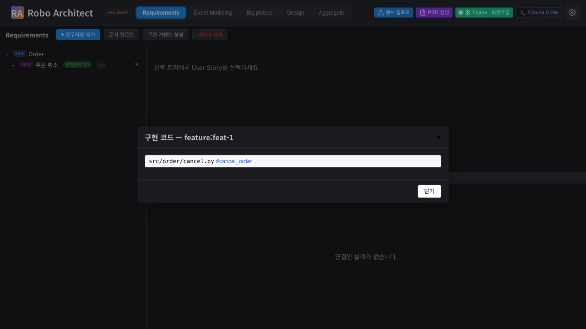
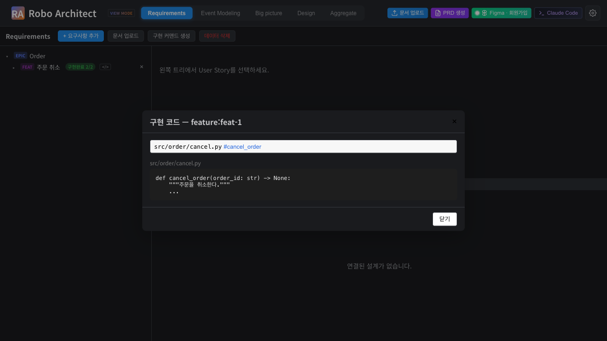

# MCP Spec Bridge 사용 매뉴얼

**기능**: spec 029 — 동적 스펙 전달과 구현 진척 동기화
**대상**: Robo Architect로 설계한 요구사항을 Claude Code로 구현하는 아키텍트
**작성**: 2026-05-19 · 스크린샷은 `manual-assets/`의 자동화 테스트 캡처

---

## 무엇을 하는 기능인가

기존에는 PRD 생성이 Bounded Context별 마크다운 스펙 파일을 디스크에 만들었습니다 — 파일이
쌓이고 모델이 바뀌어도 갱신되지 않았습니다. **MCP Spec Bridge**는 이 정적 파일을
**MCP 서버를 통한 동적 스펙 전달**로 대체합니다.

1. Requirements 탭에서 구현 범위(Feature·Bounded Context·Aggregate)를 골라 **구현 커맨드를
   생성**하면, 대상 프로젝트에 범용 슬래시 커맨드 `/robo-implement`가 설치되고 MCP 서버가
   등록됩니다.
2. Claude Code에서 그 커맨드를 실행하면 MCP가 **호출 시점의 최신 스펙**을 동적으로 전달합니다
   — 정적 스펙 파일은 만들지 않습니다.
3. Claude Code는 `.robo/tasks/`에 태스크 파일을 만들어 구현하며, Robo Architect는 그 파일을
   폴링해 **구현 진척**을 트리에 표시합니다.
4. 구현이 끝난 범위는 클릭 한 번으로 **실제 소스코드로 점프**할 수 있습니다.

---

## 사전 준비

- Robo Architect 백엔드 실행: `uvicorn api.main:app --reload --host 127.0.0.1 --port 8000`
- Neo4j에 인제스트된 모델(Bounded Context·Feature·User Story·Aggregate)이 존재
- 대상 프로젝트가 있는 로컬 디렉터리 경로
- Claude Code CLI 설치

---

## 1. 구현 커맨드 생성

Requirements 탭 상단 툴바의 **"구현 커맨드 생성"** 버튼을 누릅니다.



다이얼로그에서 구현할 범위와 대상 프로젝트 홈을 지정합니다.

- **범위 종류** — Feature 또는 Bounded Context 선택
- **구현 범위** — 그 종류에 해당하는 항목 선택(예: `Order › 주문 취소`)
- **대상 프로젝트 홈** — 슬래시 커맨드를 설치할 프로젝트의 절대 경로
- **Robo API Base** — (선택) 백엔드 포트가 8000이 아닐 때만 입력



**"커맨드 설치"**를 누르면 대상 프로젝트에 다음이 설치됩니다.

- `.claude/commands/robo-implement.md` — 범용 슬래시 커맨드
- `.mcp.json` — MCP 서버 `robo-architect` 등록 항목

설치 후 다이얼로그에 **호출 문자열**(예: `/robo-implement feature feat-1`)이 표시됩니다.
**"복사"** 버튼으로 복사하세요. 같은 동작을 다시 실행해도 커맨드 파일·`.mcp.json` 항목은
중복 없이 멱등하게 갱신됩니다.



---

## 2. Claude Code에서 동적 스펙으로 구현

대상 프로젝트에서 Claude Code를 열면 슬래시 커맨드 목록에 `/robo-implement`가 나타납니다.
복사한 호출 문자열을 실행하세요.

```
/robo-implement feature feat-1
```

그러면 다음이 일어납니다.

1. MCP 서버가 범위 ID로 Robo Architect API를 호출해 **호출 시점의 최신** PRD·DDD 구현 스펙을
   받아옵니다. 범위가 없거나 백엔드에 연결할 수 없으면 그 사실을 명확히 알리고 멈춥니다
   — 추측으로 구현하지 않습니다.
2. Claude Code가 `.robo/tasks/<범위종류>-<범위ID>.md` 태스크 파일을 SpecKit 체크박스
   형식으로 펼칩니다.
3. 태스크를 순차 구현하며 완료 항목의 체크박스를 `- [x]`로 바꾸고, 줄 끝에
   `<!-- impl: <경로>#<심볼> -->` 주석으로 구현 위치를 기록합니다.

> 정적 PRD/스펙 마크다운 파일은 생성되지 않습니다 — 스펙은 항상 MCP가 동적으로 제공합니다.

---

## 3. 구현 진척 확인

Requirements 탭이 열려 있는 동안 Robo Architect는 대상 프로젝트의 `.robo/tasks/`를 5초마다
폴링합니다. 트리의 Feature·Bounded Context 노드에 진척 배지가 표시됩니다.

- **미착수** — 체크된 태스크 0개
- **진행중** — 일부 태스크 체크
- **구현완료** — 모든 태스크 체크



배지 옆 숫자는 `완료/전체` 태스크 수입니다(예: `구현완료 2/2`). 태스크 파일이 없거나 손상돼도
탭은 깨지지 않습니다 — 해당 범위만 미착수로 표시됩니다.

---

## 4. 구현 코드로 점프

태스크가 하나라도 완료된 범위에는 `</>` 버튼이 나타납니다. 누르면 그 범위가 어떤 소스 파일에
구현되었는지 목록이 표시됩니다.



파일을 클릭하면 내용이 뷰어에 열립니다. 태스크 파일이 가리키던 파일이 이동·삭제되어
더 이상 존재하지 않으면 "대상 코드를 찾을 수 없음"으로 안내하고 탭을 깨뜨리지 않습니다.



---

## 문제 해결

| 증상 | 원인 / 조치 |
|------|-------------|
| 슬래시 커맨드가 Claude Code에 안 보임 | MCP 서버 변경 후에는 Claude Code 세션 재시작 필요. `.mcp.json` 등록 여부 확인 |
| "Robo Architect API에 연결할 수 없음" | 백엔드(`uvicorn`)가 실행 중인지, `ROBO_API_BASE`가 맞는지 확인 |
| "범위를 찾을 수 없음" | Robo Architect에서 해당 범위가 삭제되었거나 ID가 잘못됨 — 커맨드를 다시 생성 |
| 진척 배지가 안 보임 | 대상 프로젝트 홈이 지정되어 있어야 폴링 시작 — 구현 커맨드를 먼저 생성 |
| 백엔드 포트가 8000이 아님 | 다이얼로그의 Robo API Base를 맞추고 커맨드를 재설치(`.mcp.json` env 갱신) |

---

## 참고

- 동작 검증: `frontend/tests/mcp-spec-bridge.spec.ts` (이 매뉴얼의 스크린샷을 캡처하는
  자동화 테스트). 실행: `cd frontend && npx playwright test mcp-spec-bridge`
- 기존 PRD 파일 생성 방식(spec 007·022)은 그대로 동작하며 동적 방식과 공존합니다.
- 설계 문서: [spec.md](spec.md) · [plan.md](plan.md) · [contracts/mcp-and-rest.md](contracts/mcp-and-rest.md)
