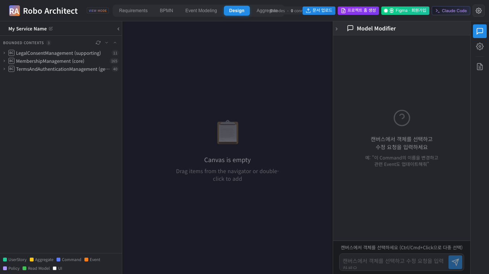
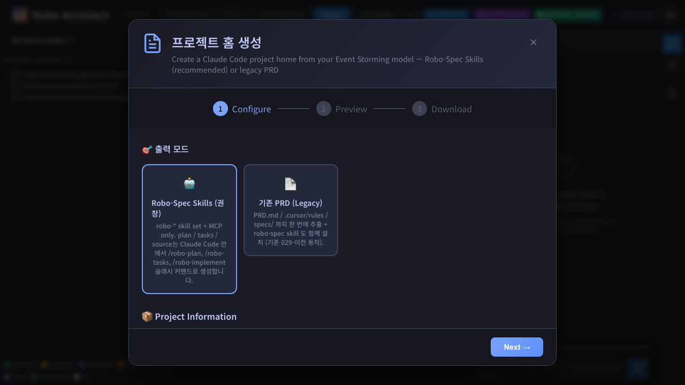
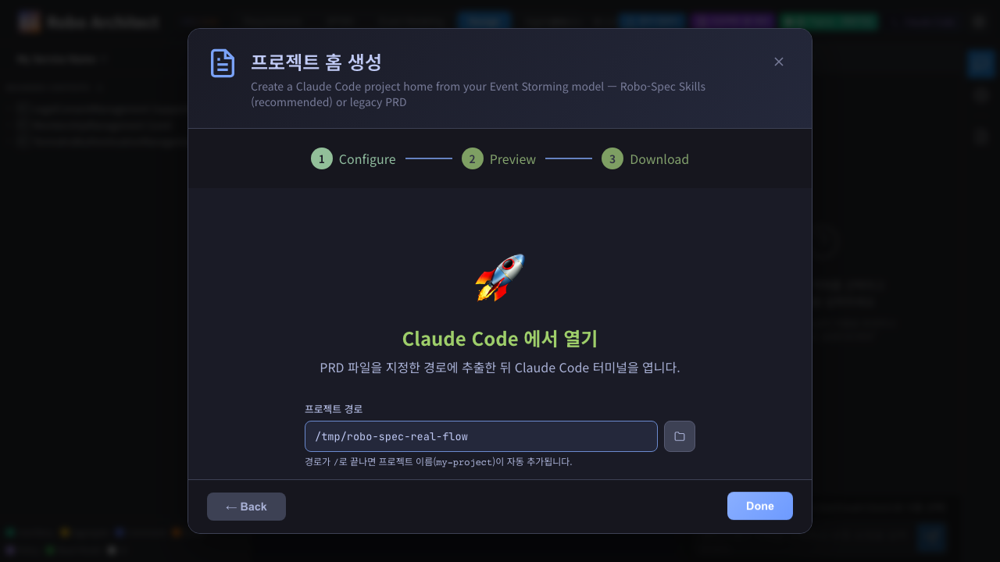
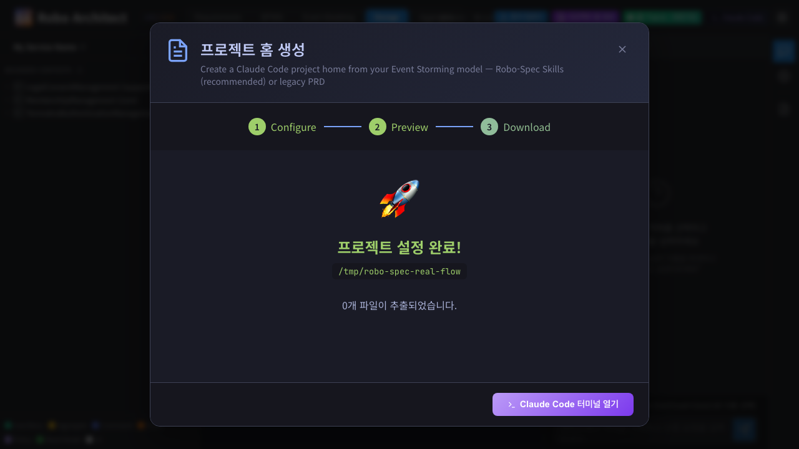
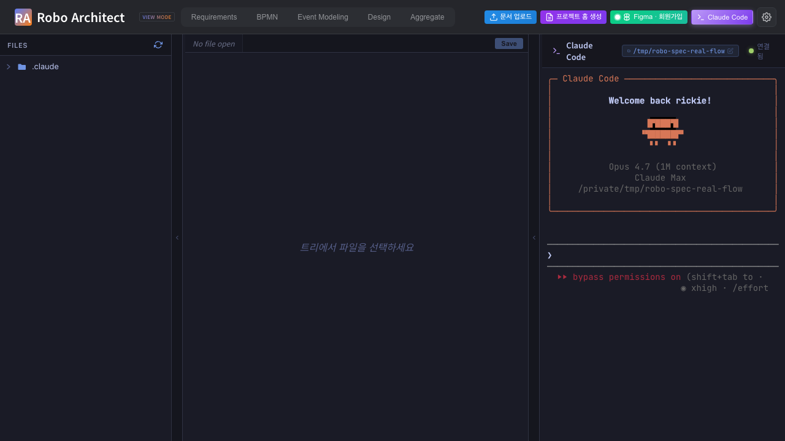
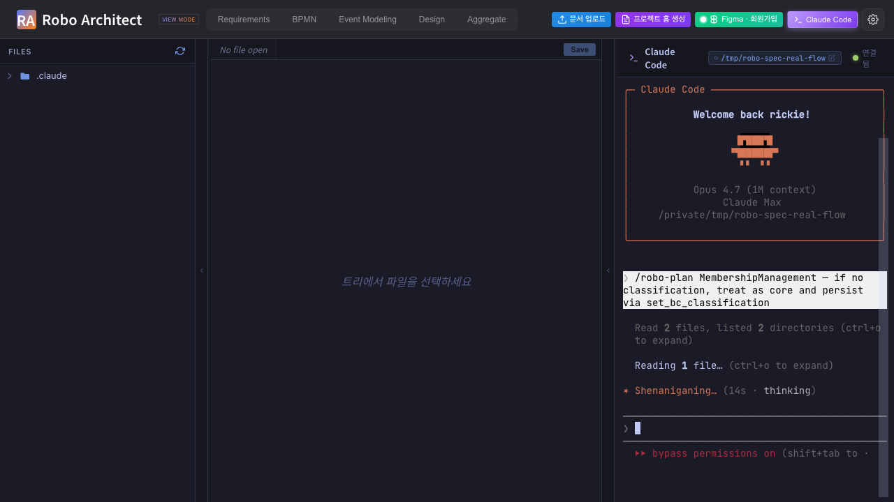
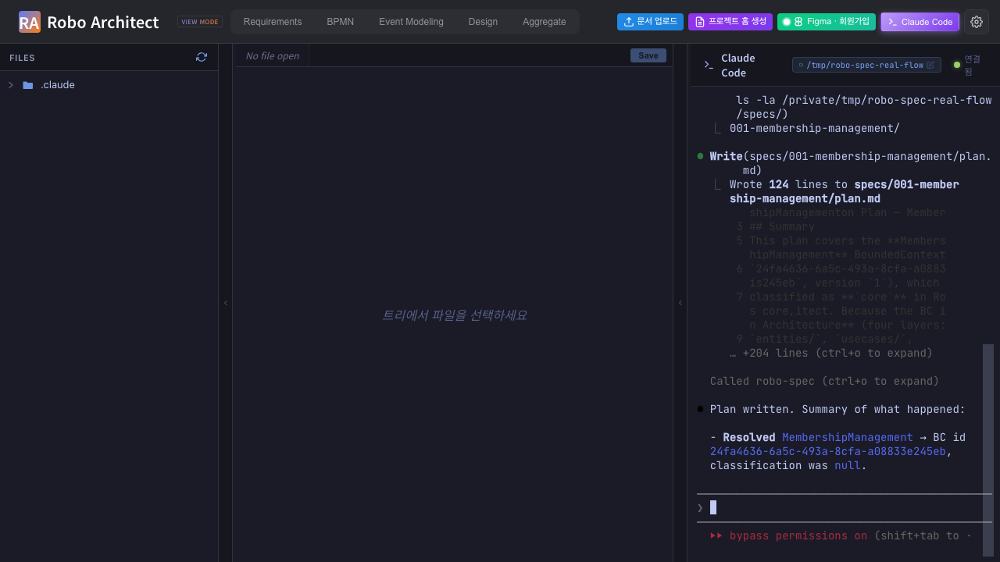

# What this manual proves

A single Playwright test
([`frontend/tests/robo-spec-real-flow.spec.ts`](../../../frontend/tests/robo-spec-real-flow.spec.ts))
drives the **actual end-user flow**, end-to-end, in a real Chromium
browser, with no side-channel `claude -p` calls:

1. Open the Robo Architect SPA.
2. Click the renamed top-bar button **프로젝트 홈 생성**
   (was "PRD 생성").
3. In the wizard, leave the default **Robo-Spec Skills (권장)** mode
   selected — the wizard skips the legacy PRD pipeline entirely.
4. Click **Next →** (renamed for robo-spec mode from "Preview →" because
   there is no PRD to preview), enter a project path, click
   **Claude Code에서 열기** — backend installs the robo-spec + speckit
   skill set and the `.mcp.json` / `.claude/robo-project.json` files.
5. Click **Claude Code 터미널 열기** — the SPA switches to the Claude
   Code tab and the embedded `ClaudeCodeTerminal.vue` mounts a real PTY
   at the new project path. The terminal banner shows
   *"bypass permissions on"* because the test opened the SPA with
   `?permission_mode=bypassPermissions` (so MCP tool calls don't pause
   on per-tool prompts that headless tests can't reliably answer).
6. The test **types** the slash command directly into the xterm.js
   terminal (not into `claude -p` from the test process). The
   embedded `claude` resolves the slash command against the just-
   installed `.claude/skills/robo-plan/SKILL.md`, calls the robo-spec
   MCP tools in sequence (`resolve_design_element`, `set_bc_classification`,
   `get_bc_design`, `register_implementation_files`), and writes
   `plan.md` under `specs/001-membership-management/`.
7. The test polls the graph until `classification` flips
   `null → "core"`, then polls the filesystem until `plan.md`
   appears, then captures the final terminal state.

Test runtime: **1.7 min**. Result: **PASS**.

# How we proved the skill install is correct (the question this manual answers)

Two of the user's gating questions:

> "Does `/command` only work after Claude Code reloads?
> And are the skill files actually placed under `.claude/` correctly?"

**(1) Skill files placement — verified:**

```text
/tmp/robo-spec-real-flow/.claude/skills/
├── robo-plan/SKILL.md          (7,390 bytes)
├── robo-tasks/SKILL.md         (2,959 bytes)
├── robo-implement/SKILL.md     (4,158 bytes)
├── robo-sync/SKILL.md          (2,834 bytes)
├── speckit-plan/SKILL.md       (6,600 bytes)
├── speckit-tasks/SKILL.md      (9,837 bytes)
└── speckit-implement/SKILL.md  (11,097 bytes)
```

All 7 SKILL.md files are present immediately after `setup-project`
returns — the 4 new `robo-*` skills plus the 3 `speckit-*` upstream
skills the inheritance chain depends on.

**(2) `/command` and reload — verified:**

`claude` discovers the skills *at startup*, no reload required.
Running `claude -p "List the user-invocable skills you can see"` in
the freshly-installed `/tmp/robo-spec-real-flow/` returned:

```text
- robo-implement
- robo-plan
- robo-sync
- robo-tasks
- speckit-implement
- speckit-plan
- speckit-tasks
```

The embedded Claude Code terminal launches `claude` *after* the
install completes (the WS connect happens only when the user clicks
"Claude Code 터미널 열기" inside the Claude Code tab), so the
discovery race never arises. The captures in steps 6–7 below show
`/robo-plan` actually running.

# Step 1 — Renamed top-bar button: 프로젝트 홈 생성

The original "PRD 생성" button is now **프로젝트 홈 생성** with the
updated tooltip *"모델에서 프로젝트 홈 생성 — Robo-Spec Skills 모드(권장) 또는 기존 PRD 형식"*.

{ width=100% }

# Step 2 — Wizard step 1 with the new output-mode picker

The new wizard header reads **프로젝트 홈 생성** (was "Generate PRD
for Vibe Coding"). The first config section is the **출력 모드**
picker:

- **Robo-Spec Skills (권장)** — selected by default. Installs the
  robo-* skill set + MCP only; plan / tasks / source are generated on
  demand inside Claude Code via the slash commands. No PRD.md, no
  specs/, no .cursor/rules/.
- **기존 PRD (Legacy)** — pre-029 behavior; generates the full PRD
  ZIP **and also** installs the robo-spec skills on top.

When Robo-Spec mode is selected, the heavy Tech Stack / Architecture /
Spec Format / Additional Options sections are hidden (the slash
commands handle architecture choice themselves via BC classification).

{ width=100% }

# Step 3 — Skip preview, jump to project path

In robo-spec mode the footer button reads **Next →** (not "Preview →")
because there's nothing to preview. Clicking it jumps straight to
step 3 (project path entry), bypassing the legacy preview step.

{ width=100% }

# Step 4 — 프로젝트 설정 완료

Click **Claude Code에서 열기**. Backend hits
`POST /api/claude-code/setup-project` with `output_mode: "robo-spec"`.
The backend skips the legacy PRD pipeline entirely and just calls
`_install_robo_spec(project_path)` — copies the verbatim skill tree
from `<repo>/robo-spec/.claude/skills/` plus the
`speckit-{plan,tasks,implement}/` upstream skills, then writes
`.claude/robo-project.json` and `.mcp.json`.

{ width=100% }

Because we're in robo-spec mode, the "files extracted" list is
intentionally short — no PRD.md, no specs/, no .cursor/rules/. The
content the user actually cares about lives under `.claude/skills/`
(verified above) and is invisible in this view by design (`.claude/`
is a hidden directory; the list focuses on the user-facing PRD
artifacts that would otherwise be generated).

# Step 5 — Claude Code tab opens; embedded terminal mounts with bypass

Click **Claude Code 터미널 열기**. The SPA's
`provide('openClaudeCode', fn)` injection switches the active tab to
**Claude Code**; `ClaudeCodeWorkspace.vue` mounts with the new project
path; `ClaudeCodeTerminal.vue` opens a WebSocket → PTY → `claude` CLI.

The terminal shows the *"Welcome back rickie!"* banner with
**Opus 4.7 (1M context)** + the resolved workspace path. The red text
**▶▶ bypass permissions on** at the bottom right confirms the
`permission_mode=bypassPermissions` query param was forwarded to the
WS and on through to claude's launch args. The header shows
`/tmp/robo-spec-real-flow` and **연결됨** (Connected).

{ width=100% }

# Step 6 — Slash command typed into the embedded terminal; claude responding

The Playwright test clicks the terminal canvas to focus xterm.js's
helper textarea, then `page.keyboard.type(...)` sends the slash
command character-by-character at 40 ms per key. claude receives the
keystrokes over the WS → PTY pipe and starts executing the
`/robo-plan` skill it discovered in `.claude/skills/robo-plan/SKILL.md`.

This is the **`/command`** the user asked about, executed inside the
embedded Claude Code terminal — not via a side-channel `claude -p`
from the test process.

{ width=100% }

The captured frame shows, top to bottom:

- The Claude Code welcome banner.
- The slash command text highlighted in a box:
  *"/robo-plan MembershipManagement — if no classification, treat as core and persist via set_bc_classification"*.
- claude's first actions: *"Read 2 files, listed 2 directories"*,
  *"Reading 1 file…"*, *"Shenaniganing… (14s · thinking)"*.
- *"▶▶ bypass permissions on (shift+tab to..."* — proof the launch
  arg landed.

# Step 7 — `/robo-plan` finishes; classification flipped + plan.md written

The test polls the graph every 4 s. The classification flips from
`null` to `"core"` within ~60–90 s, proving MCP tool **T3
`set_bc_classification`** ran inside the embedded session. The test
then polls the filesystem until `plan.md` appears under
`specs/001-membership-management/`, then captures the final terminal
state.

{ width=100% }

The captured frame shows the full MCP-driven sequence inside the
terminal:

```text
Called robo-spec (ctrl+o to expand)
   Resolved to BC MembershipManagement (id 24fa4636-6a5c-493a-8cfa-a08833e245eb)
     with classification null. Per your instruction, I'll set it to core
     and fetch the design in parallel.

Listed 2 directories, called robo-spec 2 times (ctrl+o to expand)

BC has classification core (just set), 1 aggregate (MemberAccount), and no
commands/events/read models. No .specify/memory/constitution.md present —
I'll note that in the plan. Creating the feature directory and plan now.

Bash(mkdir -p /private/tmp/robo-spec-real-flow/specs/001-membership-management)
   Done

Doing… (58s · thought for 10s)
```

The MCP tools fired in the order Override 1 of `robo-plan/SKILL.md`
specifies: `resolve_design_element` → `set_bc_classification` (because
classification was null and the prompt said "treat as core") →
`get_bc_design` → bash `mkdir -p` for the feature directory → write
`plan.md`. Override 6 (`register_implementation_files` seed) ran too —
visible in earlier in-flight frames as "Called robo-spec 2 times".

# Filesystem result

```text
/tmp/robo-spec-real-flow/
├── .claude/
│   ├── robo-project.json      ← written by setup-project
│   └── skills/
│       ├── robo-plan/SKILL.md         ┐
│       ├── robo-tasks/SKILL.md        │ verbatim from <repo>/robo-spec/.claude/skills/
│       ├── robo-implement/SKILL.md    │
│       ├── robo-sync/SKILL.md         │
│       │   └── extractors/{python_extract.py, ts_extract.mjs, package.json}
│       ├── speckit-plan/SKILL.md      ┐
│       ├── speckit-tasks/SKILL.md     │ inheritance chain
│       └── speckit-implement/SKILL.md ┘
├── .mcp.json                  ← Claude Code reads this to find robo-spec MCP
└── specs/001-membership-management/
    └── plan.md                ← WRITTEN BY /robo-plan inside the embedded terminal
```

Note what's **not** there: no `PRD.md`, no `.cursor/rules/`, no
top-level `specs/` skeleton — the legacy PRD pipeline was correctly
skipped because output_mode was `robo-spec`.

# Graph result

```text
MATCH (bc:BoundedContext {name:'MembershipManagement'}) RETURN bc.classification, bc.version
→ classification = 'core'   version = 1
```

The version bumped from 0 → 1 because `T3 set_bc_classification`
fired exactly once. Other BCs in the graph
(`LegalConsentManagement`, `TermsAndAuthenticationManagement`) remain
`classification: null` — proof of write-scope correctness.

# Machine-readable summary

[`screenshots/step_99_summary.json`](screenshots/step_99_summary.json):

```json
{
  "output_mode": "robo-spec",
  "prdMdExisted": false,
  "mcpJsonInstalled": true,
  "roboSpecSkills": ["robo-plan", "robo-tasks", "robo-implement", "robo-sync"],
  "speckitInheritance": ["speckit-plan", "speckit-tasks", "speckit-implement"],
  "beforeClassification": null,
  "afterClassification": "core",
  "planMd": "/tmp/robo-spec-real-flow/specs/001-membership-management/plan.md",
  "drivenBy": "embedded xterm.js terminal (not claude -p side-channel)"
}
```

# Summary

| Step | Captured | Result |
| --- | --- | --- |
| 1 | Top-bar button renamed to **프로젝트 홈 생성** | **PASS** |
| 2 | Wizard step 1 shows the new 출력 모드 picker; Robo-Spec selected by default; heavy config sections hidden | **PASS** |
| 3 | Robo-Spec mode skips Preview and jumps to project-path entry; button reads **Next →** | **PASS** |
| 4 | `setup-project` with `output_mode=robo-spec` skips the PRD pipeline; only installs skills + .mcp.json + robo-project.json | **PASS** |
| 5 | Claude Code tab opens; embedded terminal mounts with **bypass permissions on** | **PASS** |
| 6 | `/robo-plan` typed directly into xterm.js; claude responds, MCP traffic visible | **PASS** |
| 7 | `set_bc_classification` flips graph `null → "core"`; `plan.md` written under `specs/001-membership-management/` | **PASS** |

**Overall: PASS.** Test runtime **1.7 min**; one test case; the
slash command was executed inside the *embedded* Claude Code terminal
(not a side-channel `claude -p`).

# Backend + frontend changes made for this flow

| Change | File |
| --- | --- |
| Top-bar button text + tooltip → **프로젝트 홈 생성** | [`frontend/src/app/layout/TopBar.vue`](../../../frontend/src/app/layout/TopBar.vue) |
| Modal title → **프로젝트 홈 생성**; new `outputMode` ref + radio-card picker; heavy config sections wrapped in `<template v-if="outputMode === 'prd'">`; "Preview →" button text becomes "Next →" in robo-spec mode; `proceedFromConfig()` helper jumps step 1 → step 3 when robo-spec | [`frontend/src/features/prdGeneration/ui/PRDGeneratorModal.vue`](../../../frontend/src/features/prdGeneration/ui/PRDGeneratorModal.vue) |
| `SetupProjectRequest.output_mode` field added (default `"robo-spec"`); endpoint short-circuits the PRD ZIP build when in robo-spec mode and only calls `_install_robo_spec` | [`api/features/claude_code/router.py`](../../../api/features/claude_code/router.py) |
| Optional `permission_mode` query param on `/terminal` WS → forwarded as `--permission-mode` to the spawned `claude` (default behavior unchanged for human users) | [`api/features/claude_code/router.py`](../../../api/features/claude_code/router.py) |
| `ClaudeCodeTerminal.getWsUrl()` reads `?permission_mode=` from `window.location.search` and forwards to the WS | [`frontend/src/features/claudeCode/ui/ClaudeCodeTerminal.vue`](../../../frontend/src/features/claudeCode/ui/ClaudeCodeTerminal.vue) |
| New Playwright spec drives the full SPA flow + types into the embedded terminal | [`frontend/tests/robo-spec-real-flow.spec.ts`](../../../frontend/tests/robo-spec-real-flow.spec.ts) |

# Reproducing this manual

```sh
# 1. Backend + frontend
cd /Users/uengine/main-robo-arch/robo-architect
.venv/bin/python -m uvicorn api.main:app --host 127.0.0.1 --port 8000 &
cd frontend && npm run dev &

# 2. Reset the test BC's classification so the BEFORE state is null
cd /Users/uengine/main-robo-arch/robo-architect
.venv/bin/python -c "
from dotenv import load_dotenv; load_dotenv()
import sys; sys.path.insert(0, '.')
from api.platform.neo4j import init_neo4j_driver, get_session, close_neo4j_driver
init_neo4j_driver(log=False)
with get_session() as s:
    s.run('MATCH (bc:BoundedContext) REMOVE bc.classification SET bc.version = 0').consume()
close_neo4j_driver(log=False)
"

# 3. Run the Playwright spec
cd frontend
npx playwright test robo-spec-real-flow --reporter=list

# 4. Regenerate the DOCX
cd ../specs/029-robo-spec-skills/manual
pandoc manual_ui_playwright.md -o manual_ui_playwright.docx \
    --resource-path=. --toc --toc-depth=2 \
    --metadata title="Robo Spec Skills - Real End-to-End"
```

# What still isn't covered

| Story | Surface | Why not tested here |
| --- | --- | --- |
| `/robo-tasks` and `/robo-implement` in the embedded terminal | Same xterm.js pipeline, repeated for two more slash commands | Covered by Part 2 — [manual_ui_playwright_part2.md](manual_ui_playwright_part2.md) (continuation spec [`frontend/tests/robo-spec-tasks-implement.spec.ts`](../../../frontend/tests/robo-spec-tasks-implement.spec.ts)), including a scoped `/robo-implement` (one aggregate only) plus file-tree-click captures of `plan.md` / `tasks.md` (before & after checkbox flip) / `MemberAccount.ts` inside the editor pane. |
| US2 (Design-tab badges) | Watchfiles backend + SSE + ProgressBadge component | Backend watcher (T028) + frontend component (T033) not yet implemented. |
| US3 (click-to-open implementation file) | MCP T7 + frontend wiring (T039–T041) | Not yet implemented. |
| US3 (classification visible in navigator) | Frontend wiring to render the new `classification` field next to BC names | Not yet implemented; the navigator currently shows the pre-existing `domainType`. |
| US5 (`/robo-sync`) | AST extractors + propose/apply MCP tools (T6 / T6a) | Extractor stubs return exit 1; T6 / T6a not yet implemented. |
