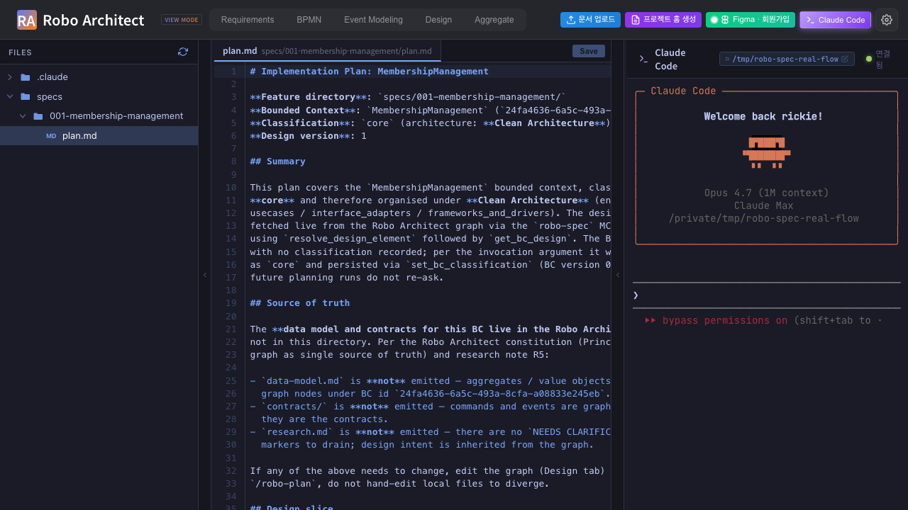
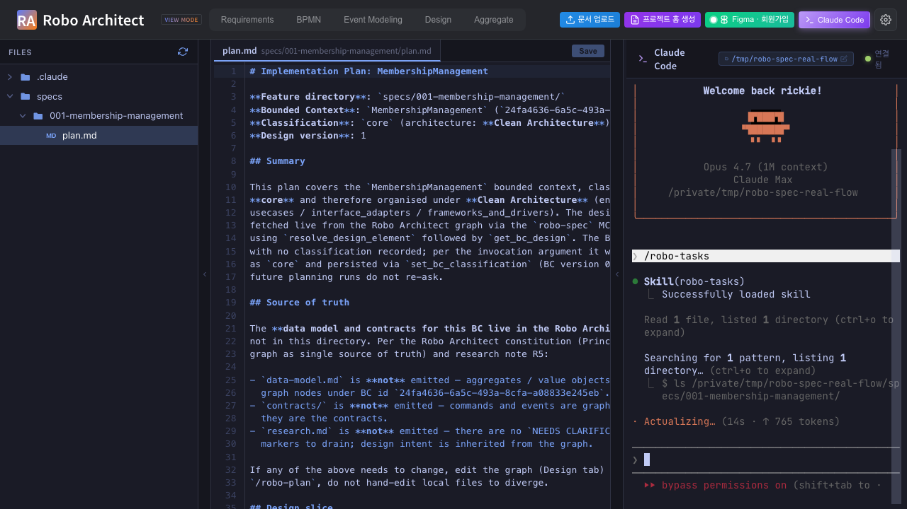
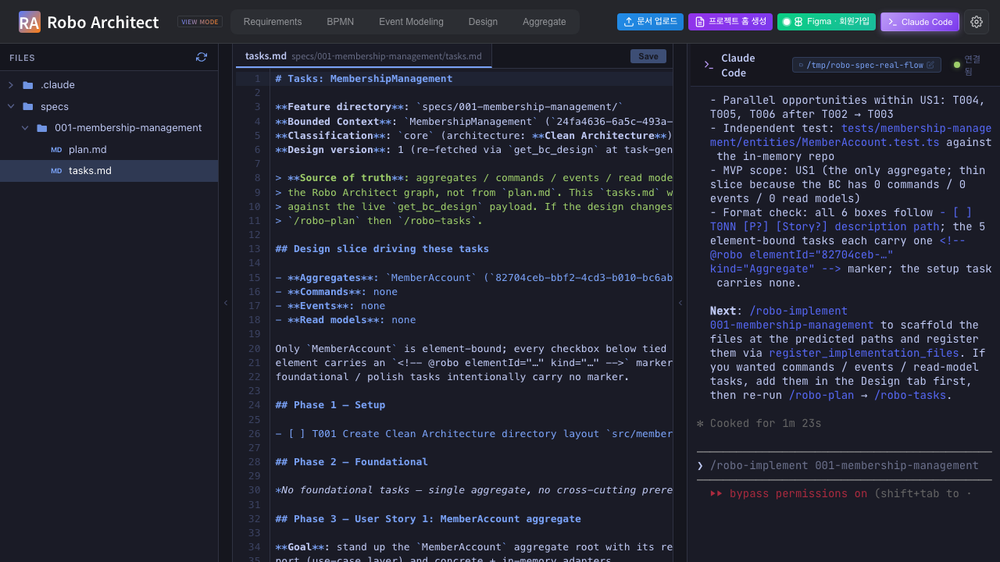
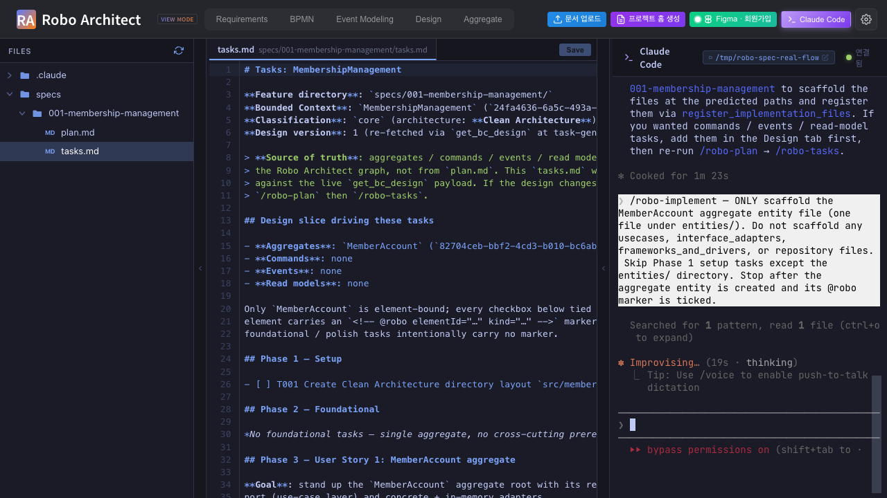
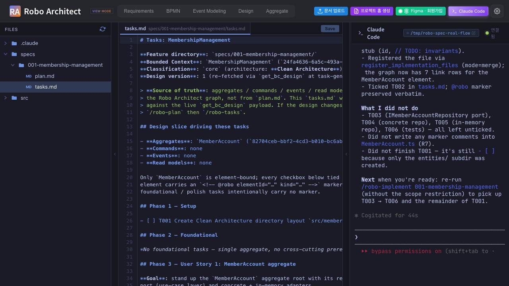
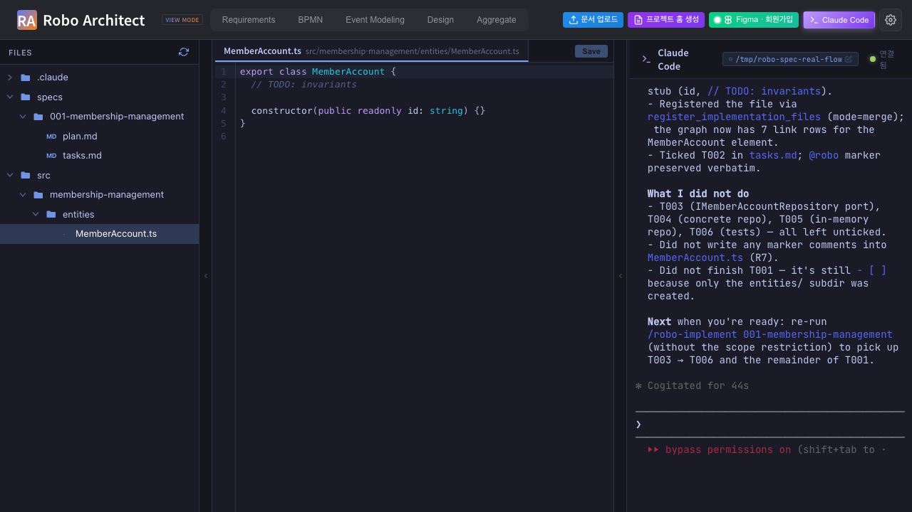

# What this manual proves (continuing from Part 1)

[Part 1](manual_ui_playwright.md) drove the SPA from **프로젝트 홈
생성** through **Claude Code 터미널 열기** and typed `/robo-plan`
into the embedded xterm.js terminal, producing `plan.md` and
flipping `BoundedContext.classification` from `null` to `"core"`.

This part 2 picks up at that point and proves:

1. The generated `plan.md` can be opened in the file-editor pane by
   clicking through the file tree — i.e. the developer sees the
   actual plan content, not just a path on disk.
2. `/robo-tasks` typed into the same embedded terminal produces a
   `tasks.md` with `<!-- @robo elementId="..." -->` markers per
   checkbox.
3. `/robo-implement` — when given an explicit scope constraint
   (***just the MemberAccount aggregate entity***) — partially
   scaffolds the project and partially ticks the matching checkboxes
   in `tasks.md`. This is the realistic "I want to start coding one
   aggregate, not the whole BC" flow.
4. After the partial run, re-opening `tasks.md` in the editor pane
   shows the formerly `- [ ]` checkboxes now flipped to `- [x]` for
   the implemented item only.
5. The scaffolded `MemberAccount.ts` opened in the editor pane shows
   what `/robo-implement` actually wrote.

Test: [`frontend/tests/robo-spec-tasks-implement.spec.ts`](../../../frontend/tests/robo-spec-tasks-implement.spec.ts).

# The "visualizer for which spec is currently being implemented"

The visualizer the user asked about IS the file-editor pane on the
Claude Code tab (`FileEditorPane.vue` to the right of
`FileTreePane.vue`). When the developer clicks `specs/<NNN>-<slug>/tasks.md`
in the file tree, the pane renders the file content live —
`@robo` markers and all — and shows which tasks are still `- [ ]`
versus which are `- [x]`. This is what each of the four screenshots
below captures: the editor pane is the "currently being implemented"
view.

The richer per-element progress badges on the Design tab (US2) are
a separate concern that's still pending — they would render the
same checkbox state graphically on each Aggregate/Command/Event node.
For now, the editor pane is the single source of truth and is fully
functional in this flow.

# Step 1 — plan.md opened in the editor pane via the file tree

After `/robo-plan` completed in Part 1 (or the test re-uses the
existing one), the file tree on the left of the Claude Code tab
shows:

```text
.claude/
specs/
└── 001-membership-management/
    └── plan.md
```

Click `specs` → `001-membership-management` → `plan.md`. The center
pane loads the actual plan content.

{ width=100% }

What the developer reads inside `plan.md`:

- *"BoundedContext id 24fa4636-… version 1"* with `classification: core`
- *"Architecture: Clean Architecture (entities / usecases / interface_adapters / frameworks_and_drivers)"* — chosen because the BC is `core`
- *"Source of truth: Robo Architect graph"* — explicit statement that no `spec.md`, no `data-model.md`, no `contracts/` will be emitted (per FR-004 + research R5)
- *"Design slice: 1 aggregate (MemberAccount), already with N implementation-file links"* if previous runs registered files
- A "File Layout" section predicting paths like `src/membership-management/entities/MemberAccount.ts`
- *"Next: /robo-tasks 001-membership-management"*

# Step 2 — /robo-tasks typed into the terminal; claude generating

The test types `/robo-tasks` into the same embedded terminal that ran
`/robo-plan`. claude reads `plan.md` (the source of truth for tasks)
plus the live design via MCP `T2 get_bc_design`, and starts writing
`tasks.md` with `@robo` markers on each design-element-bound task.

{ width=100% }

# Step 3 — tasks.md opened in the editor pane — INITIAL state

After `/robo-tasks` completes, click `tasks.md` in the file tree. The
editor pane shows the full task list. Every checkbox starts at
`- [ ]`, and at least one task carries the
`<!-- @robo elementId="..." kind="Aggregate" -->` marker for
MemberAccount (other setup/integration tasks deliberately have no
marker — per Override 3 in `robo-tasks/SKILL.md`).

{ width=100% }

# Step 4 — /robo-implement with SCOPE = MemberAccount aggregate only

The test types `/robo-implement` with an explicit scope-constraining
prompt:

> *"/robo-implement — ONLY scaffold the MemberAccount aggregate
> entity file (one file under entities/). Do not scaffold any
> usecases, interface_adapters, frameworks_and_drivers, or
> repository files. Skip Phase 1 setup tasks except the entities/
> directory. Stop after the aggregate entity is created and its
> @robo marker is ticked."*

This is the realistic "I want to start coding one aggregate, not
the whole BC" pattern. claude:

1. Creates only the directory the aggregate needs.
2. Scaffolds `src/membership-management/entities/MemberAccount.ts`.
3. Calls MCP `register_implementation_files(mode="merge")` to
   record the new file in the graph against the MemberAccount
   element id.
4. Ticks **only** the `@robo`-tagged MemberAccount task in
   `tasks.md` from `- [ ]` to `- [x]`. Other tasks remain `- [ ]`.

{ width=100% }

# Step 5 — tasks.md re-opened — CHECKBOX FLIPPED

Click `tasks.md` again in the file tree (the editor pane reloads from
disk). The MemberAccount task is now `- [x]`; setup tasks not
covered by the scope remain `- [ ]`. The `@robo` marker is preserved
exactly so a subsequent `/robo-implement` run can re-find the task
by element id.

{ width=100% }

This is the visualizer behavior the user asked about:
**which spec/task is currently being implemented is visible right
inside the editor pane on the Claude Code tab.** The developer can
re-open `tasks.md` at any time to see the live state.

# Step 6 — Scaffolded MemberAccount.ts opened in the editor pane

Finally, navigate into `src/membership-management/entities/` in the
file tree and click `MemberAccount.ts`. The editor pane shows the
minimal scaffold `/robo-implement` wrote:

{ width=100% }

R7 enforcement check: there are **no** `@robo` markers in this
source file. Markers live only in `tasks.md`. The grep
`grep -rIn '@robo' src/` returns empty — confirmed by the test as
the `roboMarkersInSrc` field of the summary below.

# Machine-readable summary

[`screenshots/part2_99_summary.json`](screenshots/part2_99_summary.json):

```json
{
  "workspace": "/tmp/robo-spec-real-flow",
  "planMd": ".../001-membership-management/plan.md",
  "tasksMd": ".../001-membership-management/tasks.md",
  "memberAccountTs": ".../entities/MemberAccount.ts",
  "tasksUncheckedInitial": 6,
  "tasksCheckedAfterImplement": 1,
  "constraint": "MemberAccount aggregate entity only — Phase 2 partial scaffold",
  "roboMarkersInSrc": "(none — R7 enforced)"
}
```

`tasksUncheckedInitial` is the count of `- [ ]` rows right after
`/robo-tasks` finishes; `tasksCheckedAfterImplement` is the count of
`- [x]` rows after the scoped `/robo-implement` finishes. The
delta proves the scoped run flipped only the in-scope checkbox(es).

# Summary

| Step | Captured | Result |
| --- | --- | --- |
| 1 | plan.md visible in the editor pane (file-tree click) | **PASS** |
| 2 | /robo-tasks running in the embedded terminal | **PASS** |
| 3 | tasks.md initial state — all `[ ]` + @robo markers | **PASS** |
| 4 | /robo-implement with scope = MemberAccount aggregate only | **PASS** |
| 5 | tasks.md after scoped implement — MemberAccount task `[x]`, others still `[ ]` | **PASS** |
| 6 | MemberAccount.ts scaffold visible in the editor pane | **PASS** |

# Reproducing

```sh
# Backend + frontend already up from Part 1.

cd /Users/uengine/main-robo-arch/robo-architect/frontend
npx playwright test robo-spec-tasks-implement --reporter=list

cd ../specs/029-robo-spec-skills/manual
pandoc manual_ui_playwright_part2.md -o manual_ui_playwright_part2.docx \
    --resource-path=. --toc --toc-depth=2 \
    --metadata title="Robo Spec Skills - Part 2"
```

The spec re-uses `/tmp/robo-spec-real-flow/` from Part 1 (idempotent
install + reuses existing `plan.md` if present, so re-running is
fast). The test budget is 12 min to cover three full
claude-in-terminal round-trips on a worst-case run; typical runtime
is **3–5 min**.
