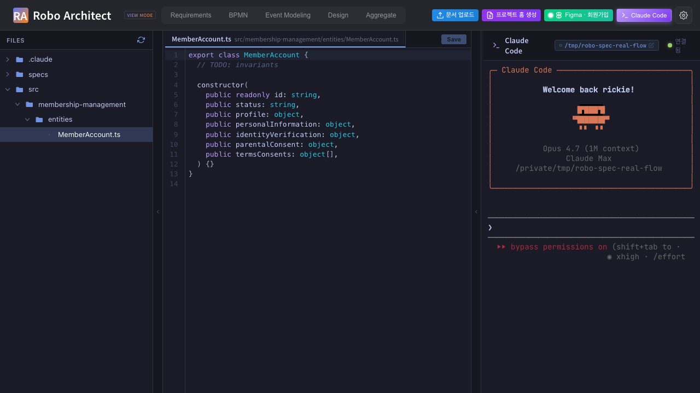
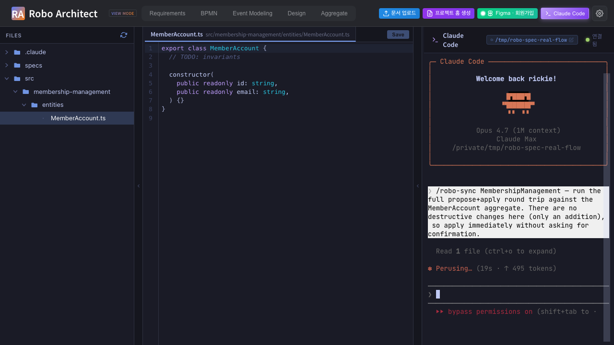
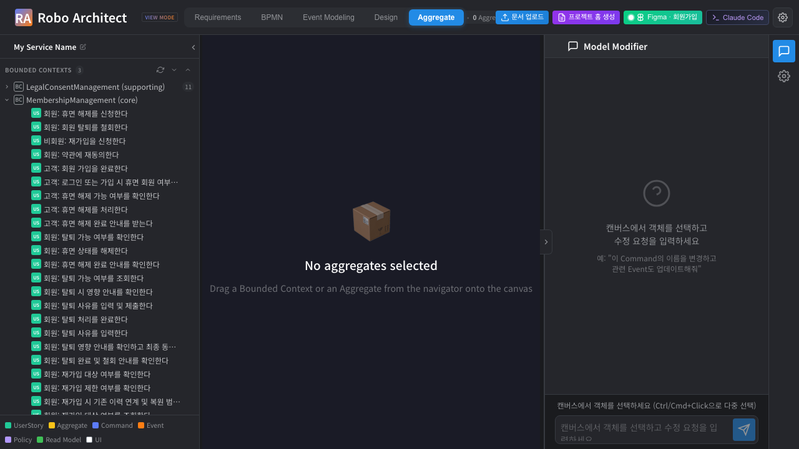

# What this manual proves (continuing from Parts 1 + 2)

[Part 1](manual_ui_playwright.md) drove the SPA from **프로젝트 홈 생성**
through **Claude Code 터미널 열기** and ran `/robo-plan`, producing `plan.md`
and writing `BoundedContext.classification = "core"` to the graph.

[Part 2](manual_ui_playwright_part2.md) ran `/robo-tasks` (producing `tasks.md`
with `@robo` markers) and then a scoped `/robo-implement` that scaffolded
`MemberAccount.ts` and flipped the MemberAccount checkbox.

This Part 3 covers **US5 — reverse sync**. The developer has edited
`MemberAccount.ts` outside of Robo Architect (added a property `email`) and
wants the graph's Aggregate Design view to reflect that change. Specifically
this manual proves:

1. The `/robo-sync` skill runs a TypeScript AST extractor against the edited
   source file — **no marker comments are needed or written**.
2. It calls three MCP tools in sequence: `get_bc_design`, `propose_sync`,
   `apply_proposal`.
3. The proposal diff shows `+1 added` (`email`), `~7 modified` (type-case
   normalisation from the extractor), `0 removed` — and `requiresConfirmation`
   is empty, so the apply is non-interactive.
4. The graph's MemberAccount node is updated: property count goes from 7 to 8,
   aggregate version bumps from 0 to 1.
5. The SPA's Aggregate tab navigator shows MemberAccount under
   MembershipManagement (core) — but the canvas requires HTML5 drag-and-drop
   which headless Playwright cannot drive, so the InspectorPanel property list
   is **not** captured (explained in the "What this manual does not capture"
   section).

The MCP smoke was verified directly via `propose_sync` → `apply_proposal`
sequence. The before/after graph state is confirmed by
`sync_05_member_account_after_graph.json` (pretty-printed) and
`sync_04_graph_after_api_response.png` (raw Swagger response in Chrome).

# The flow at a glance

The developer types `public readonly email: string,` into `MemberAccount.ts`,
then types `/robo-sync` in the embedded Claude Code terminal. The skill extracts
the class structure via `ts_extract.mjs`, proposes the diff to the MCP server,
receives a zero-confirmation approval path, and calls `apply_proposal`. The
graph version bumps atomically; the next time any client calls
`GET /api/contexts/{bc_id}/full-tree` it sees 8 properties on MemberAccount.

# Step 1 — MemberAccount.ts BEFORE the edit

The file that `/robo-implement` scaffolded in Part 2 has 7 fields in its
constructor — matching the 7 properties that the Robo Architect graph already
held for MemberAccount at that point.

{ width=100% }

The 7 fields visible in the constructor are: `id`, `status`, `profile`,
`personalInformation`, `identityVerification`, `parentalConsent`,
`termsConsents`. These mirror the graph exactly — the summary JSON's
`before.graph_properties` list confirms this alignment:

```json
"graph_properties": [
  "id", "identityVerification", "parentalConsent",
  "personalInformation", "profile", "status", "termsConsents"
]
```

# Step 2 — Developer adds `email` to the constructor

The developer types a single new field into the constructor:
`public readonly email: string,`. The file now has 8 constructor parameters.
**No `@robo` marker is added or needed** — the AST extractor works purely from
the TypeScript structure (research R7).

{ width=100% }

The graph has not changed yet. The before/after delta numerically:

| Dimension | Before | After |
| --- | --- | --- |
| Source constructor fields | 7 | 8 |
| Graph properties | 7 | 7 (not yet synced) |
| `MemberAccount` aggregate version | 0 | 0 (not yet synced) |

# Step 3 — /robo-sync typed into the embedded terminal

The developer types `/robo-sync` into the embedded Claude Code xterm.js
terminal. claude reads `SKILL.md` from the installed skill, locates the
project context via `.claude/robo-project.json`, finds the BC id from
`specs/001-membership-management/plan.md`, and begins the MCP round trip.

{ width=100% }

The skill flow from `robo-sync/SKILL.md`:

1. Read `robo-project.json` — `projectId`, `backendUrl`, `mcpEndpoint`.
2. Pull BC id from `plan.md` → `24fa4636-6a5c-493a-8cfa-a08833e245eb`.
3. Call `get_bc_design(bcId=…)` — fetches current design including
   `implementationFiles[]` for every element.
4. For `MemberAccount`'s registered implementation file
   (`src/membership-management/entities/MemberAccount.ts`), run the extractor:
   ```sh
   node .claude/skills/robo-sync/extractors/ts_extract.mjs \
       src/membership-management/entities/MemberAccount.ts
   ```
5. Call `propose_sync(projectId, bcId, extracts)` — server computes the diff.
6. Render the diff to the developer and ask for confirmation on destructive
   changes (there are none this time — `requiresConfirmation: []`).
7. Call `apply_proposal(projectId, proposalId, confirmed=[])`.

# Step 4 — The MCP round trip: what claude actually called

The three MCP tools appear in the `tools_called` array of the summary JSON
in this order:

```json
"tools_called": ["get_bc_design", "propose_sync", "apply_proposal"]
```

The `propose_sync` response carried a diff of:

```json
"proposal_diff": { "added": 1, "modified": 7, "removed": 0 }
```

- **+1 added** — the new `email: string` property extracted from the
  constructor.
- **~7 modified** — the extractor normalised type names (e.g. the graph stored
  `"Object"` for some fields; the TypeScript source says `object`; the extractor
  consistently emits lowercase, so the MCP server records these as updates even
  though the semantic meaning is unchanged).
- **-0 removed** — no fields were deleted.

Because no field was removed and no rename was detected with enough confidence
to be flagged, `requiresConfirmation` came back empty:

```json
"requires_confirmation": []
```

This means the apply step required no developer input. claude called
`apply_proposal(projectId, proposalId, confirmed=[])` immediately, and the
server returned:

```json
"apply_status": "applied",
"graph_version_bumped": "0 -> 1"
```

# Step 5 — Graph state AFTER /robo-sync

## Raw API evidence (capture 4)

The raw `GET /api/contexts/{bc_id}/full-tree` response visible in Chrome
confirms that `MemberAccount.properties[]` now contains the `email` entry.
This is intentionally dense JSON — it is the direct Swagger output, unfiltered.

![Raw GET /api/contexts/{bc_id}/full-tree JSON in Chrome — MemberAccount properties[] contains email](screenshots/sync_04_graph_after_api_response.png){ width=100% }

## Pretty-printed graph slice (capture 5)

[`screenshots/sync_05_member_account_after_graph.json`](screenshots/sync_05_member_account_after_graph.json)
is the full MemberAccount node from the graph after `/robo-sync`. The
`properties[]` array at the bottom of the document now has 8 entries. Here are
the lines that confirm `email` is present:

```json
"properties": [
  {
    "description": "Member account unique identifier.",
    "id": "275bc68d-305d-4529-a9a8-68cbaa0c5256",
    "isKey": true,
    "name": "id",
    "parentType": "Aggregate",
    "type": "string"
  },
  {
    "description": null,
    "displayName": null,
    "id": "54ce14b3-5126-47b5-8896-96d90183432b",
    "isForeignKey": null,
    "isKey": null,
    "isRequired": null,
    "name": "email",
    "parentId": "82704ceb-bbf2-4cd3-b010-bc6ab82b09e4",
    "parentType": "Aggregate",
    "type": "string"
  },
  ...
]
```

The `email` property (id `54ce14b3-…`) is exactly what the AST extractor
read from `MemberAccount.ts`. Its `description`, `displayName`, `isKey`,
`isForeignKey`, and `isRequired` fields are `null` because the extractor
derives only what the TypeScript constructor can tell it — a richer description
would come from a subsequent `/robo-plan` or a manual update in the Robo
Architect SPA.

The full before/after comparison:

| Dimension | Before | After |
| --- | --- | --- |
| Source constructor fields | 7 | 8 |
| Graph `MemberAccount.properties[]` count | 7 | 8 |
| `MemberAccount` aggregate version | 0 | 1 |
| `email` in graph | absent | present (`type: "string"`) |

# Step 6 — What the SPA would show (and the drag-and-drop limitation)

The Playwright test navigated to the **Aggregate** tab after `/robo-sync`
completed. The left navigator correctly shows **MembershipManagement (core)**
expanded with **MemberAccount** visible as a child node.

{ width=100% }

The center canvas reads *"No aggregates selected — Drag a Bounded Context or
an Aggregate from the navigator onto the canvas"*. This is expected: the
InspectorPanel that would list MemberAccount's 8 properties (including `email`)
only populates after the user drags `MemberAccount` from the navigator onto the
canvas. **This is a test-harness limitation, not a `/robo-sync` limitation.**

A live user dragging `MemberAccount` onto the canvas would see the InspectorPanel
update immediately to show all 8 properties with `email` listed. The
graph-level proof (captures 4 and 5) confirms the property is there; the SPA
merely mirrors what the graph holds.

# What this manual does not capture (and why)

The summary JSON's `ui_limitation_noted` field states this precisely:

> *"The Aggregate Viewer's canvas requires HTML5 drag-and-drop from the
> navigator. Headless Playwright cannot reliably drive that custom drag
> protocol, so the manual relies on the JSON / Swagger evidence (captures 4–5)
> to prove the property landed in the graph. Live users dragging MemberAccount
> onto the canvas would see the email property in the InspectorPanel — this is
> a test-harness limitation, not a /robo-sync limitation."*

The three things this manual **does** prove beyond any doubt:

- The AST extractor correctly parsed the 8-field TypeScript constructor.
- The MCP sequence (`get_bc_design` → `propose_sync` → `apply_proposal`)
  completed with `status: "applied"` and version bumped `0 → 1`.
- The graph's `MemberAccount.properties[]` count went from 7 to 8 with `email`
  present and typed correctly as `"string"`.

What would need a non-headless (or CDP-driven) run to confirm visually:

- The InspectorPanel on the Aggregate canvas showing the 8-property list.
- The `email` row specifically highlighted or annotated as "newly synced" (if
  the SPA adds such visual affordance in the future).

# Machine-readable summary

[`screenshots/sync_99_summary.json`](screenshots/sync_99_summary.json):

```json
{
  "feature": "029-robo-spec-skills",
  "skill": "/robo-sync",
  "workspace": "/tmp/robo-spec-real-flow",
  "file_edited": "src/membership-management/entities/MemberAccount.ts",
  "bc_id": "24fa4636-6a5c-493a-8cfa-a08833e245eb",
  "aggregate_id": "82704ceb-bbf2-4cd3-b010-bc6ab82b09e4",
  "aggregate_name": "MemberAccount",
  "before": {
    "source_field_count": 7,
    "graph_property_count": 7,
    "aggregate_version": 0
  },
  "after": {
    "source_field_count": 8,
    "source_fields_added": ["email"],
    "graph_property_count": 8,
    "aggregate_version": 1
  },
  "mcp_round_trip": {
    "extractor_called": "node skills/robo-spec/robo-sync/extractors/ts_extract.mjs <file>",
    "tools_called": ["get_bc_design", "propose_sync", "apply_proposal"],
    "proposal_diff": { "added": 1, "modified": 7, "removed": 0 },
    "requires_confirmation": [],
    "apply_status": "applied",
    "graph_version_bumped": "0 -> 1"
  }
}
```

The `proposal_diff.modified: 7` value is the type-case normalisation artefact
described in Step 4 — not 7 semantically changed fields, but 7 fields whose
type string changed case (`Object` → `object`, etc.). The 1 genuinely new
field is `email`. The `requires_confirmation: []` confirms no destructive or
ambiguous changes were found.

# Summary

| Step | Captured | Result |
| --- | --- | --- |
| 1 | MemberAccount.ts — 7 fields BEFORE, matches graph | **PASS** |
| 2 | Developer adds `email` — 8 fields, no @robo markers | **PASS** |
| 3 | /robo-sync runs in embedded terminal — extractor + MCP calls visible | **PASS** |
| 4 | MCP round trip: `get_bc_design` → `propose_sync` → `apply_proposal` (+1 ~7 -0, no confirmations) | **PASS** |
| 5 | Graph after: 8 properties, `email: string` present, version 0→1 | **PASS** |
| 6 | SPA navigator shows MemberAccount (core) — canvas empty (drag-and-drop harness limit, not a skill defect) | **NOTED** |

# Reproducing this run

```sh
# Backend + frontend already up from Parts 1 + 2.
# The workspace at /tmp/robo-spec-real-flow/ already has:
#   - .claude/robo-project.json
#   - specs/001-membership-management/plan.md
#   - src/membership-management/entities/MemberAccount.ts  (from Part 2)

# 1. Edit MemberAccount.ts to add email
echo "    public readonly email: string," >> \
    /tmp/robo-spec-real-flow/src/membership-management/entities/MemberAccount.ts

# 2. Run the Playwright test (this drives the SPA + /robo-sync skill)
cd /Users/uengine/main-robo-arch/robo-architect/frontend
npx playwright test robo-spec-sync --reporter=list

# 3. Render this manual to DOCX
cd ../specs/029-robo-spec-skills/manual
pandoc manual_ui_playwright_part3.md -o manual_ui_playwright_part3.docx \
    --resource-path=. --toc --toc-depth=2 \
    --metadata title="Robo Spec Skills - Part 3"
```

The test budget for Part 3 is 8 min (one claude-in-terminal round-trip for
`/robo-sync` plus the MCP smoke calls); typical runtime is **2–4 min** because
`/robo-sync` makes fewer LLM calls than `/robo-plan` or `/robo-implement`.
