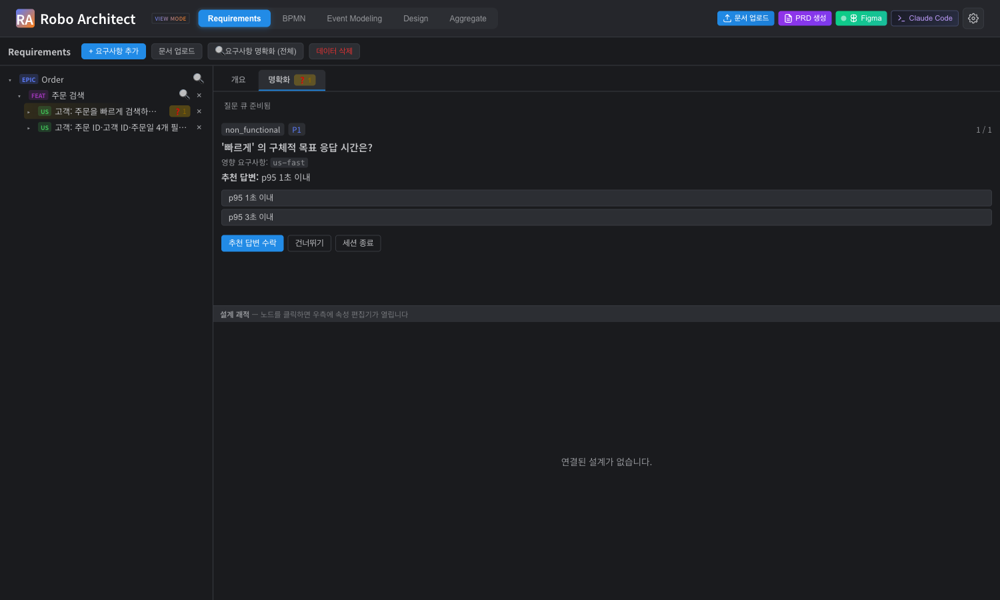
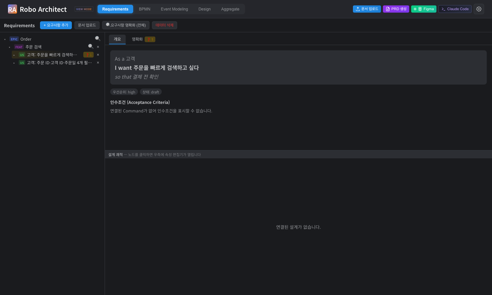
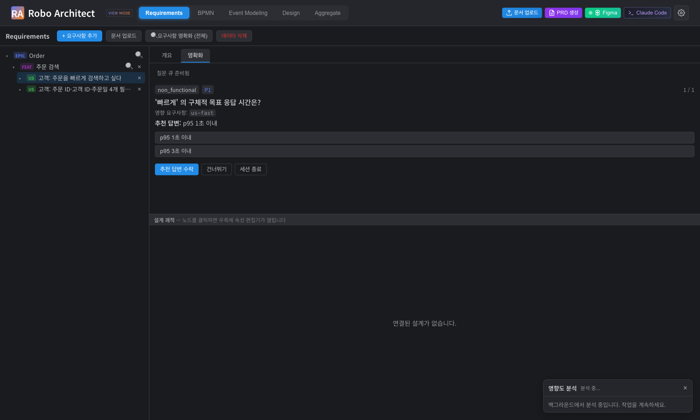

% 요구사항 명확화 (Requirements Clarification) 사용 매뉴얼
% Robo Architect — 기능 030
% 2026-05-25

# 1. 개요

문서 인제스트가 추출한 요구사항(UserStory)들은 종종 모호하거나 미명세인
상태로 Requirements 트리에 들어옵니다 — *"빠르게 검색한다"*, *"주문을
관리한다"* 같이 실제 구현·테스트·플래닝 단계에 가서야 비싸게 드러나는
갭들입니다.

**요구사항 명확화** 기능은 SpecKit의 `clarify` 스킬 방법론(10개 모호성
분류 체계 + 우선순위 질문 큐 + 답변의 증분 인코딩)을 **LangChain 딥
에이전트**로 자동화해, 추출 직후 요구사항을 대화형으로 명확화합니다.

흐름:

1. **분석** — 딥 에이전트가 범위 내 UserStory들을 자율 스캔하고 영향받는
   요구사항·범주·추천 답변이 연결된 **우선순위 질문 큐(최대 5개)** 를
   만듭니다.
2. **응답·반영** — 질문에 답하면 에이전트가 답을 영향받는 UserStory의
   구체적 편집안으로 인코딩합니다. 편집안은 *제안*만 되고, 사용자가
   before/after diff를 검토 후 *적용*을 명시적으로 누를 때만 그래프에
   반영됩니다.
3. **추적·되돌리기** — 세션 종료 시 변경된 요구사항을 before/after로 보여
   주는 요약과 개별 변경 되돌리기를 제공하며, 범위에 영구 부착되는 명확화
   로그(`UserStory.clarifications`)로 나중에 다시 열람할 수 있습니다.

# 2. 핵심 개념

| 개념 | 설명 |
|------|------|
| **모호성 분류 체계** | SpecKit `/speckit-clarify` 스킬의 10개 카테고리: `functional_scope`, `domain_data_model`, `interaction_flow`, `non_functional`, `integration_dependencies`, `edge_cases`, `constraints_tradeoffs`, `terminology`, `completion_signals`, `misc_placeholders` |
| **질문 큐 (Question Queue)** | 세션당 최대 5개. Impact × Uncertainty 휴리스틱으로 우선순위화. |
| **명확화 세션 (Session)** | `analyzing → awaiting_answers → encoding → completed / discarded / failed` 상태 머신. 범위당 동시에 1개만 활성. |
| **편집 제안 (Edit Proposal)** | 답변을 인코딩한 결과. 영향받는 요구사항별 before/after 스냅샷. **적용 전까지 그래프 무변경.** |
| **명확화 로그 (Clarification Log)** | 적용된 답변마다 `UserStory.clarifications` JSON 속성에 영구 append. 신규 노드 라벨 0건. |
| **모호성 배지 (Ambiguity Badge)** | 스캔이 모호하다고 판정한 UserStory에 자동으로 붙는 ❓ 마커. 트리 노드와 상세 패널 탭에 표시. 적용·되돌리기 시 자동 클리어. |

> **원칙: Human-in-the-Loop** — LLM이 생성한 편집은 *제안만* 되고, 사용자의
> 명시적 "적용" 클릭 후에만 그래프에 반영됩니다. (`/answer` propose vs.
> `/apply` mutate)

# 3. UI 구조

Requirements 탭은 세 영역으로 나뉘어 명확화를 자연스럽게 흡수합니다.

1. **좌측 트리** — Epic(BoundedContext) → Feature → UserStory 트리. 모호성
   배지(❓N)는 트리 행에 직접 표시되어 어떤 요구사항이 검토가 필요한지
   한눈에 보입니다.
2. **우상단 디테일 패널** — UserStory를 클릭하면 열리며, **개요** /
   **명확화** 두 탭으로 구성됩니다. 모든 명확화 작업은 이 패널 안에서
   완결되며 별도 오버레이/팝업이 뜨지 않습니다.
3. **상단 툴바** — *🔍 요구사항 명확화 (전체)* 버튼으로 프로젝트 전체를
   한 번에 스캔하면, 결과 배지가 영향받는 UserStory들에 자동 부착됩니다.

# 4. 트리의 모호성 배지

직전 스캔이 모호하다고 판정한 UserStory에는 트리 행에 노란색 **❓N 배지**가
표시됩니다. N은 해당 요구사항을 다루는 질문 개수입니다. 배지의 툴팁에 어떤
모호성 카테고리들이 발견됐는지 표시됩니다.

스크린샷 비교:

- 위 행 *"주문을 빠르게 검색하고 싶다"* — `❓ 1` 배지. 측정 가능한 NFR(목표
  응답 시간) 미명세로 직전 스캔에서 모호성 판정.
- 아래 행 *"주문 ID·고객 ID·주문일 4개 필터로 검색한다"* — 배지 없음. 같은
  영역이지만 검색 키·NFR(p95 1초)·결과 0건 처리 모두 명세되어 있어 스캔
  통과.

배지는 `/apply` 또는 `/revert`가 수행되면 자동으로 사라집니다.

# 5. 명확화 탭 (Detail Panel)

UserStory 행을 **클릭**하면 우상단에 디테일 패널이 열립니다. 모호성 배지가
붙어 있던 요구사항은 자동으로 **명확화** 탭이 활성화되어 즉시 검토 화면이
뜹니다. 그렇지 않은 경우엔 **개요** 탭이 기본이며, 사용자가 직접 명확화
탭을 누르면 새 세션이 시작됩니다.

탭 라벨 옆의 **❓N 배지**는 트리 배지와 동일한 카운터로, 검토가 필요한
질문 수를 보여줍니다.

각 질문 화면 구성:

- **범주 핀** (예: `non_functional`)
- **우선순위 핀** (`P1`이 최우선)
- **질문 텍스트** + 영향 요구사항 id
- **추천 답변** — 에이전트가 best-practice 기반으로 미리 제안
- **선택지** (폐쇄형: 2~5개 상호배타) 또는 **단답형 입력** (≤5단어)
- **액션**: "추천 답변 수락" / "건너뛰기" / "세션 종료"

답변 방식 세 가지:

1. **추천 답변 수락** — 가장 흔한 경로. 에이전트의 제안을 그대로 받음.
2. **선택지 클릭** — 추천 외 다른 옵션이 더 맞으면 그것을 선택.
3. **단답형 자유 입력** — 5단어 이내로 직접 답변.

> 해석 불가능한 답변은 에이전트가 **재질문**을 띄우며, 재질문은 세션의
> 질문 상한(5개)을 소모하지 *않습니다*.

# 6. 개요 탭과 명확화 탭의 공존

명확화 작업 중에도 **개요** 탭으로 자유롭게 전환해 요구사항의 statement·
priority·인수조건·Source Business Rules를 확인할 수 있습니다. 다시 명확화
탭으로 돌아오면 진행 중이던 질문 큐가 그대로 유지됩니다.

# 7. 편집안 검토 및 적용

답변을 제출하면 에이전트가 그 답을 영향받는 UserStory의 구체적 편집안으로
인코딩합니다. 결과는 **before/after JSON diff**로 인라인 표시됩니다.

이 시점에 그래프는 **아직 변경되지 않습니다**.

- diff 검토 후 만족하면 **"적용"** 버튼을 누릅니다 → 기존 user-story 편집
  경로로 반영(낙관적 잠금·no-op 감지·임팩트 분석 트리거 자동 승계).
- 적용 직후 임팩트 리포트가 백그라운드로 트리거되어 우하단에 표시될 수
  있습니다.
- 적용된 답변은 영향받는 UserStory의 `clarifications` 속성에 로그 항목 1건이
  영구 저장됩니다.

# 8. 적용 완료 후

적용이 성공하면 편집안 컴포넌트가 collapse되고, 트리의 ❓ 배지와 탭의
❓ 배지가 모두 사라집니다. 명확화 처리가 끝났음을 한눈에 알 수 있습니다.

# 9. 명확화 세션 시작하는 세 가지 방법

| 진입점 | 효과 |
|--------|------|
| 트리에서 ❓ 배지 달린 **UserStory 행 클릭** | 디테일 패널이 열리며 자동으로 명확화 탭으로 점프. 단일 US 스코프 세션. |
| 트리에서 일반 **UserStory 행 클릭** → 디테일 패널의 **명확화 탭 클릭** | 사용자가 명시적으로 검토를 시작. 단일 US 스코프. |
| 트리의 BC/Feature 행 끝 **🔍 아이콘** 클릭 | 해당 범위 안의 모든 UserStory를 한 번에 스캔. 결과 배지가 영향받는 트리 행들에 자동 부착. |
| 상단 툴바의 **🔍 요구사항 명확화 (전체)** | 프로젝트 전체 범위. 큰 프로젝트에서는 `deferredNote`로 보류된 카테고리 표시. |

# 10. 세션 종료 및 요약

세션 도중 언제든 **"세션 종료"** 를 누를 수 있습니다 — 이미 적용된 답변은
유지되고 미답 질문은 미변경 상태로 종료됩니다. 종료 시 요약이 열려:

- **변경된 요구사항** 목록 (before/after diff)
- **범주별 커버리지** 표 (resolved / deferred / clear / outstanding)
- 질문 통계 (총수·적용·건너뜀)

를 보여주며, 개별 변경마다 **"되돌리기"** 버튼이 있어 해당 요구사항을 세션
직전 스냅샷으로 복원할 수 있습니다.

# 11. 동작 보장 사항

- **질문 ≤ 5** per 세션. 초과 시 `deferredNote`에 미해결 영역 안내.
- **범위당 활성 세션 1개**. 중복 시도는 기존 sessionId를 안내하고 거부.
- **편집 충돌**: 세션 중 해당 UserStory가 외부에서 편집되면 "적용"이 409
  `edit_conflict`로 최신 `updatedAt`을 반환 (낙관적 잠금).
- **재접속·이탈**: 페이지를 나갔다 돌아와도 세션 큐와 진척 복원.
- **분석 실패**: LLM/네트워크 실패는 세션 `status=failed`로 표시되며, 이미
  적용된 답변은 보존됩니다.

# 12. REST 엔드포인트 요약

| 메서드 | 경로 | 용도 |
|--------|------|------|
| POST   | `/api/requirements/clarification/sessions` | 세션 시작 (scopeType: project / bounded_context / feature / user_story) |
| GET    | `/api/requirements/clarification/sessions/{id}` | 세션 스냅샷 (SSE 재접속 폴백) |
| GET    | `/api/requirements/clarification/sessions/{id}/stream` | 진척 SSE |
| POST   | `/api/requirements/clarification/sessions/{id}/answer` | 답변 → 편집안 제안 (그래프 무변경) |
| POST   | `/api/requirements/clarification/sessions/{id}/apply` | 편집안 반영 (그래프 mutate) |
| POST   | `/api/requirements/clarification/sessions/{id}/end` | 세션 종료 + 요약 |
| GET    | `/api/requirements/clarification/sessions/{id}/summary` | 종료 요약 |
| POST   | `/api/requirements/clarification/sessions/{id}/revert` | 개별 변경 되돌리기 |
| POST   | `/api/requirements/clarification/sessions/{id}/discard` | 세션 폐기 |
| GET    | `/api/requirements/clarification/log` | 명확화 로그 조회 |
| GET    | `/api/requirements/clarification/flags` | 현재 ambiguity 배지 상태 |

# 13. 검증 결과 (2026-05-25)

## 13.1 라이브 LLM (실 OpenAI gpt-4.1)

벤치마크 픽스처(시드된 모호 요구사항 10건) 기준:

- 스캔 시간: **10.4초**
- 생성 질문: **5개** (cap 도달)
- 카테고리 정확도: **4/5** (시드 기대 카테고리와 일치)
- 요구사항 커버리지: **8/10** (질문 그루핑으로 cap 효율 활용)
- system prompt 크기: 16,505자 (SpecKit SKILL.md verbatim)

## 13.2 단위·통합 테스트

- pytest **38/38 통과**: agent cap, 단일 세션 가드, 인코더 정상화, 로그
  round-trip, flags 트래커.

## 13.3 Playwright E2E (headed mode)

`frontend/tests/clarification-flow.spec.ts` — mocked backend으로 UX 흐름
자동 구동, **4.6초 1 passed**:

- 트리 ambiguity 배지 렌더 (flagged에만 표시)
- US 행 클릭 → 디테일 패널 + 명확화 탭 자동 활성 + 탭 배지 표시
- SSE 스트림으로 질문 큐 도착, 질문/추천/옵션 렌더
- "추천 답변 수락" → before/after JSON diff 렌더
- "적용" → 편집안 collapse + 트리·탭 배지 모두 클리어

# 14. 다음 단계

- 트리에 ambiguity 배지가 보이는 요구사항들은 클릭만 하면 디테일 패널이
  바로 검토 화면으로 떠 있으므로, 위에서 아래로 훑으면서 명확화율을 점진적
  으로 상승시킬 수 있습니다.
- 큰 BoundedContext에서 첫 스캔이 `deferredNote`를 남겼다면, 한 번 적용 후
  같은 범위로 재스캔하면 1차에서 cap에 밀린 카테고리들이 올라옵니다.
- 명확화 로그(`UserStory.clarifications`)는 그래프에 영구 저장되므로 다른
  팀원이 "왜 이 요구사항이 이렇게 바뀌었나" 를 나중에 그대로 추적할 수
  있습니다.
