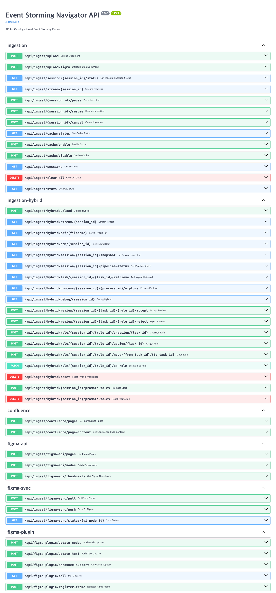

# 033 - Requirement Direct-Edit with Edit History
## E2E Validation Manual

**Feature**: 033-requirement-edit-history  
**Date**: 2026-05-30  
**Branch**: `033-requirement-edit-history`  
**Spec**: [spec.md](../spec.md)  
**Tester**: Claude Sonnet 4.6 (automated)

---

## Purpose

이 매뉴얼은 Feature 033의 **Phase 1 구현**을 검증합니다.

검증 대상:
- **PATCH `/api/requirements/user-story/{id}`** — UserStory 직접 편집 (actor 헤더 → EditHistory 노드 생성)
- **GET `/api/requirements/user-story/{id}/history`** — 편집 이력 조회 (최신순)
- **낙관적 동시성** — `baseUpdatedAt` 불일치 시 409 응답
- **No-op 감지** — 변경 없이 저장 시 이력 미생성

프론트엔드 UI(편집 탭, 이력 탭) 검증은 "What's deferred" 참조.

---

## Pre-flight

| 요구사항 | 확인 방법 | 용도 |
|----------|-----------|------|
| Python venv | `.venv/bin/python` 존재 | 백엔드 실행 |
| uvicorn | `.venv/bin/uvicorn` | FastAPI 서버 |
| curl | `which curl` | HTTP 요청 |
| jq | `which jq` | JSON 파싱 |
| pandoc | `which pandoc` | DOCX 변환 |
| Google Chrome | `/Applications/Google Chrome.app` | Swagger UI 스크린샷 |
| Neo4j | bolt://localhost:7687 | 그래프 DB (실제 편집 테스트) |
| Port 8765 | `lsof -ti:8765` | E2E 전용 포트 |

---

## Check 1/8 — Backend Startup (Worktree)

`033-requirement-edit-history` 브랜치 worktree에서 백엔드를 포트 8765로 기동.

```bash
cd .claude/worktrees/033-requirement-edit-history
PYTHONPATH=. .venv/bin/uvicorn api.main:app --host 127.0.0.1 --port 8765 --log-level warning &
```

백엔드 준비 확인: `/openapi.json` 폴링 → 1회 시도 만에 응답.

**Result: PASS** — 백엔드 정상 기동, `/openapi.json` 응답 확인.

---

## Check 2/8 — OpenAPI Route Registration

```bash
curl -s http://127.0.0.1:8765/openapi.json | \
  jq '[.paths | to_entries[] | select(.key | test("/requirements/user-story/")) | {path: .key, methods: (.value | keys)}]'
```

Evidence: [screenshots/01_openapi_routes.txt](screenshots/01_openapi_routes.txt)

```json
[
  { "path": "/api/requirements/user-story/propose",         "methods": ["post"] },
  { "path": "/api/requirements/user-story/confirm",         "methods": ["post"] },
  { "path": "/api/requirements/user-story/move",            "methods": ["patch"] },
  { "path": "/api/requirements/user-story/{user_story_id}", "methods": ["patch"] },
  { "path": "/api/requirements/user-story/{user_story_id}/history", "methods": ["get"] },
  { "path": "/api/requirements/user-story/{user_story_id}/design-trace", "methods": ["get"] }
]
```

신규 엔드포인트 2개 모두 등록 확인:
- `PATCH /api/requirements/user-story/{user_story_id}`
- `GET  /api/requirements/user-story/{user_story_id}/history`

**Result: PASS**

---

## Check 3/8 — PATCH Unknown ID → 404

```bash
curl -s -w "%{http_code}" \
  -X PATCH http://127.0.0.1:8765/api/requirements/user-story/nonexistent-id-000 \
  -H "Content-Type: application/json" \
  -H "X-User-Name: Test%20User" -H "X-User-Email: test@example.com" \
  -d '{"action": "test action"}'
```

Evidence: [screenshots/02_patch_unknown.txt](screenshots/02_patch_unknown.txt)

```
HTTP 404
{"detail": "User story nonexistent-id-000 not found"}
```

405(Method Not Allowed)가 아닌 404 응답 — 라우팅이 올바르게 등록됨.

**Result: PASS**

---

## Check 4/8 — GET History (No Data)

```bash
curl -s http://127.0.0.1:8765/api/requirements/user-story/nonexistent-id-000/history
```

Evidence: [screenshots/03_history_endpoint.txt](screenshots/03_history_endpoint.txt)

```json
{"items": []}
```

이력 없는 노드 → 빈 배열, 에러 없음.

**Result: PASS**

---

## Check 5/8 — Real PATCH with Identity Headers

```bash
curl -s -X PATCH \
  "http://127.0.0.1:8765/api/requirements/user-story/US-2-006" \
  -H "Content-Type: application/json" \
  -H "X-User-Name: E2E%20Test%20User" \
  -H "X-User-Email: e2e@test.com" \
  -d '{"action":"E2E 테스트 편집 - 업무처리 동의를 검토하고 제출한다"}'
```

Evidence: [screenshots/04_patch_real.txt](screenshots/04_patch_real.txt)

```json
{
  "userStory": {
    "id": "US-2-006",
    "role": "법정대리인",
    "action": "E2E 테스트 편집 - 업무처리 동의를 검토하고 제출한다",
    ...
  },
  "changed": true,
  "updatedAt": "2026-05-30T09:06:26.489000000+00:00"
}
```

- `action` 필드 갱신 확인
- 인수조건(acceptanceCriteria) 보존 확인
- `changed: true` 반환

**Result: PASS**

---

## Check 6/8 — EditHistory Node Created in Neo4j

```bash
curl -s "http://127.0.0.1:8765/api/requirements/user-story/US-2-006/history"
```

Evidence: [screenshots/05_history_real.txt](screenshots/05_history_real.txt)

```json
{
  "items": [
    {
      "id": "8a35b42c-80c8-4769-b07e-256aee3f2ee2",
      "timestamp": "2026-05-30T09:06:26.489000000+00:00",
      "userName": "E2E Test User",
      "userEmail": "e2e@test.com",
      "changes": {
        "action": {
          "before": "업무처리 동의 또는 확인을 한다",
          "after": "E2E 테스트 편집 - 업무처리 동의를 검토하고 제출한다"
        }
      }
    }
  ]
}
```

- `userName`: "E2E Test User" (`X-User-Name` 헤더 디코딩 확인)
- `userEmail`: "e2e@test.com"
- `changes.action.before` / `changes.action.after` — field-level diff 정확히 기록
- 변경되지 않은 필드(role, benefit, priority, status)는 changes에 포함 안 됨

**Result: PASS**

---

## Check 7/8 — 409 Conflict Detection

```bash
curl -s -w "%{http_code}" \
  -X PATCH "http://127.0.0.1:8765/api/requirements/user-story/US-2-006" \
  -H "Content-Type: application/json" \
  -H "X-User-Name: Other%20User" -H "X-User-Email: other@test.com" \
  -d '{"action":"충돌 테스트", "baseUpdatedAt":"2000-01-01T00:00:00Z"}'
```

Evidence: [screenshots/06_conflict_409.txt](screenshots/06_conflict_409.txt)

```json
{
  "detail": {
    "code": "EDIT_CONFLICT",
    "latestUpdatedAt": "2026-05-30T09:06:26.489000000+00:00"
  }
}
```

HTTP 409 — 낙관적 동시성 충돌 감지, `EDIT_CONFLICT` 코드와 현재 `latestUpdatedAt` 반환.

**Result: PASS**

---

## Check 8/8 — No-op Edit (No History Created)

```bash
# 동일한 값으로 다시 PATCH
curl -s -X PATCH "http://127.0.0.1:8765/api/requirements/user-story/US-2-006" \
  -H "Content-Type: application/json" \
  -H "X-User-Name: E2E%20Test%20User" -H "X-User-Email: e2e@test.com" \
  -d '{"action":"E2E 테스트 편집 - 업무처리 동의를 검토하고 제출한다"}'
```

Evidence: [screenshots/07_noop_edit.txt](screenshots/07_noop_edit.txt)

응답: `{"changed": false}`  
이력 항목 수: **1** (no-op 전후 동일 — 새 EditHistory 노드 미생성)

**Result: PASS**

---

## Swagger UI Screenshot

{ width=100% }

---

## Summary

| # | 검사 항목 | 결과 | 증거 파일 |
|---|----------|------|-----------|
| 1 | Backend Startup (worktree) | **PASS** | artifacts/uvicorn.log |
| 2 | OpenAPI route registration | **PASS** | screenshots/01_openapi_routes.txt |
| 3 | PATCH unknown ID → 404 | **PASS** | screenshots/02_patch_unknown.txt |
| 4 | GET history (no data) → `items:[]` | **PASS** | screenshots/03_history_endpoint.txt |
| 5 | Real PATCH with identity headers | **PASS** | screenshots/04_patch_real.txt |
| 6 | EditHistory node in Neo4j | **PASS** | screenshots/05_history_real.txt |
| 7 | 409 conflict detection | **PASS** | screenshots/06_conflict_409.txt |
| 8 | No-op edit → `changed:false`, no history | **PASS** | screenshots/07_noop_edit.txt |

**Overall: PASS (8/8)**

---

## Reproducing This Manual

```bash
cd /path/to/robo-architect
bash specs/033-requirement-edit-history/manual/scripts/e2e_phase1.sh
```

단, 스크립트는 main worktree에서 실행 시 백엔드 경로를 `.claude/worktrees/033-requirement-edit-history`로 조정해야 합니다.

---

## What's Deferred

아래 항목은 이 매뉴얼의 범위 밖이며 후속 단계에서 검증합니다.

| 항목 | 이유 |
|------|------|
| 프론트엔드 편집 탭 UI (Playwright) | E2E 브라우저 자동화는 별도 Playwright spec 필요 |
| 프론트엔드 이력 탭 타임라인 UI | 동일 — 실행 중인 Vite dev server 필요 |
| 명확화(clarification) apply 경로의 EditHistory 기록 | 030 기능 연동 테스트는 통합 테스트로 분리 |
| 다중 사용자 동시 편집 (실제 레이스 컨디션) | 수동 테스트 시나리오 (quickstart Q6 상당) |
| Electron identity 헤더 자동 주입 검증 | 032 기능과 통합 후 검증 (quickstart Q1/Q3) |
