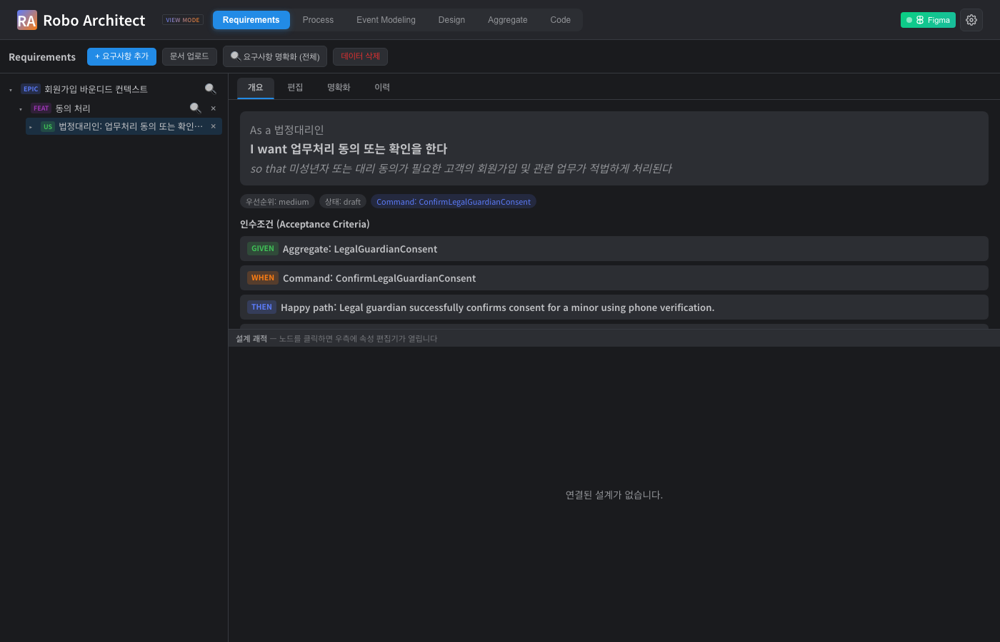
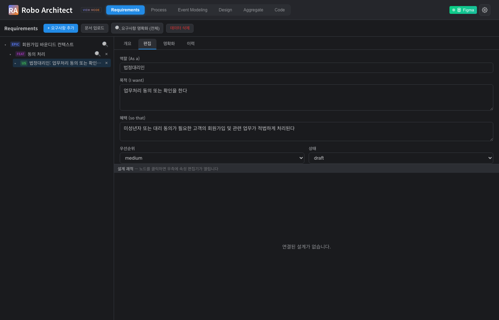
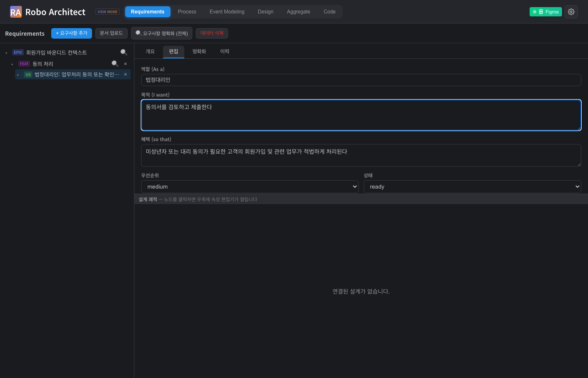
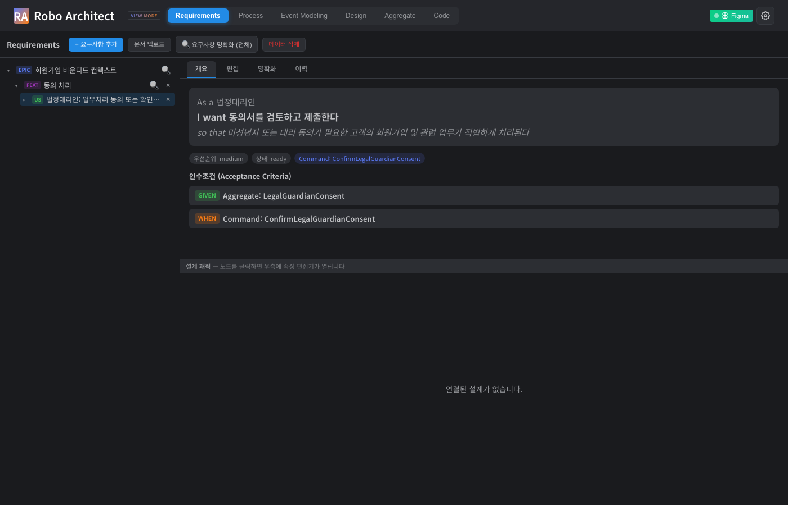
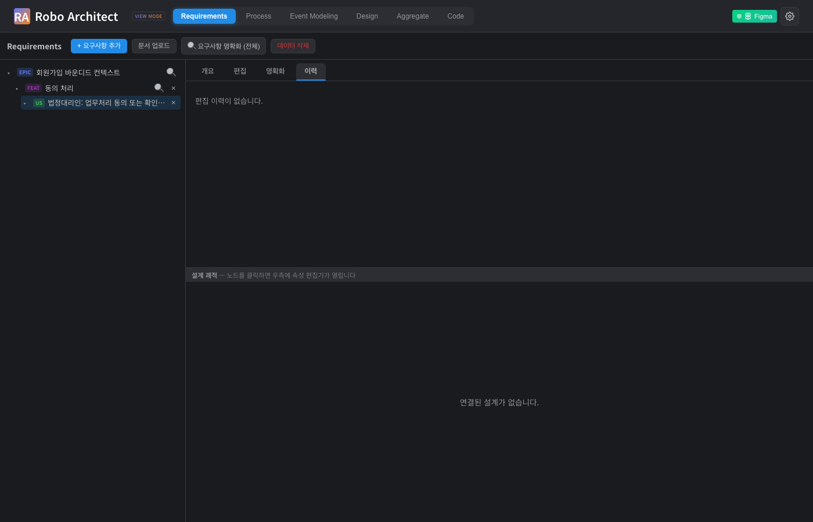
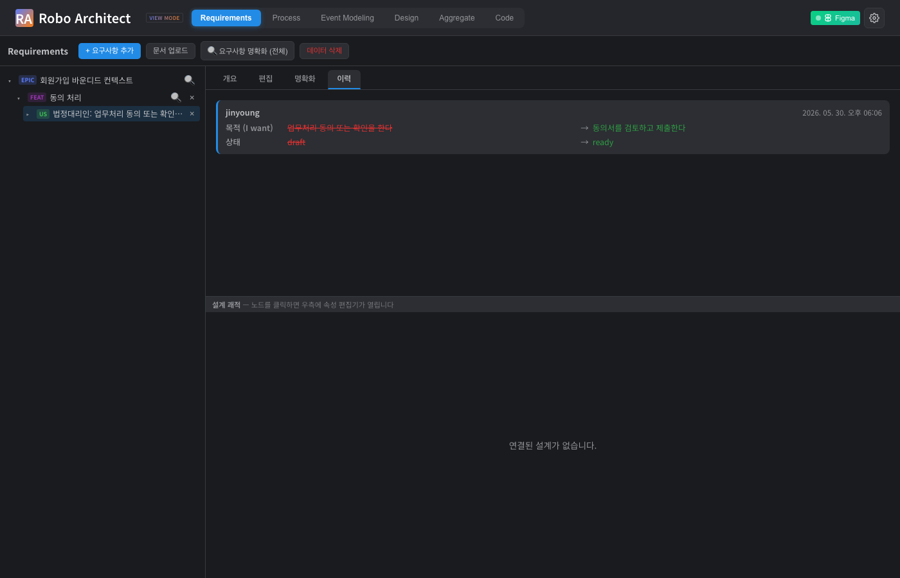
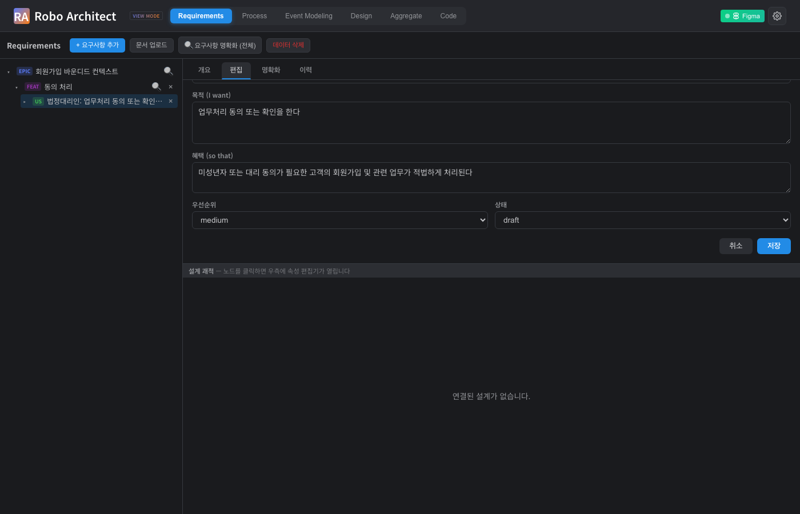

# 요구사항 직접 편집 및 편집 이력 조회 사용 가이드

**기능**: 033 — Requirement Direct-Edit with Edit History  
**작성일**: 2026-05-30  
**대상**: Robo Architect를 사용하는 분석가 및 팀 구성원

---

## 개요

이 기능을 사용하면 Requirements 패널에서 User Story를 선택한 뒤, **AI가 생성한 요구사항을 직접 수정**할 수 있습니다. 수정 내용은 자동으로 저장되고, 누가 언제 무엇을 바꿨는지 **편집 이력**으로 남아 팀이 변경 흐름을 추적할 수 있습니다.

---

## 시작하기 전에

- 상단 네비게이션에서 **Requirements** 탭을 클릭하세요.
- 왼쪽 트리에서 편집하려는 User Story를 선택하면 오른쪽 패널에 상세 화면이 열립니다.

---

## 주요 기능

### 1. 개요 탭 — 현재 요구사항 확인

User Story를 클릭하면 **개요** 탭이 기본으로 표시됩니다. 역할(As a), 목적(I want), 혜택(so that), 우선순위, 상태, 인수조건을 한눈에 확인할 수 있습니다.

{ width=100% }

상단 탭 바에 **개요 · 편집 · 명확화 · 이력** 네 가지 탭이 있습니다.

---

### 2. 편집 탭 — 요구사항 직접 수정

**편집** 탭을 클릭하면 현재 저장된 값이 채워진 편집 폼이 나타납니다.

{ width=100% }

수정할 수 있는 항목:

| 항목 | 설명 |
|------|------|
| 역할 (As a) | 이 요구사항의 주체 (예: 법정대리인) |
| 목적 (I want) | 사용자가 하고자 하는 것 |
| 혜택 (so that) | 이 기능이 제공하는 가치 |
| 우선순위 | high / medium / low |
| 상태 | draft / ready / done |

> **안내**: 인수조건(Acceptance Criteria)은 이 탭에서 수정하지 않습니다. 인수조건은 **명확화** 탭에서 AI와 함께 다듬을 수 있습니다.

원하는 내용을 입력한 후 우선순위와 상태를 선택합니다.

{ width=100% }

---

### 3. 저장 완료 — 개요 탭으로 자동 이동

**저장** 버튼을 클릭하면 변경 내용이 즉시 반영됩니다. 화면은 자동으로 **개요** 탭으로 이동하며, 수정된 내용을 바로 확인할 수 있습니다.

{ width=100% }

위 예시에서 "업무처리 동의 또는 확인을 한다"가 "동의서를 검토하고 제출한다"로, 상태도 `draft` → `ready`로 변경된 것을 확인할 수 있습니다.

**취소** 버튼을 누르면 변경 내용 없이 개요 탭으로 돌아갑니다.

---

### 4. 이력 탭 — 편집 이력 확인

**이력** 탭을 클릭하면 이 User Story에 대한 모든 편집 기록을 최신순으로 볼 수 있습니다.

편집 이력이 없을 때:

{ width=100% }

편집 이력이 있을 때:

{ width=100% }

각 이력 항목에는 다음 정보가 표시됩니다:

- **편집자 이름**: 누가 수정했는지 (Electron 앱의 로그인 정보에서 자동 적용)
- **편집 날짜·시각**: 언제 수정했는지
- **변경 필드**: 어떤 항목이 바뀌었는지, 바뀌기 전(빨간색 취소선)과 바뀐 후(초록색) 값

---

### 5. 동시 편집 충돌 — 안내 메시지

같은 User Story를 두 사람이 동시에 편집하는 경우, 먼저 저장한 사람의 변경이 우선 적용됩니다. 나중에 저장을 시도하면 아래와 같은 안내 메시지가 표시됩니다.

{ width=100% }

이 경우 페이지를 새로고침하면 최신 내용을 불러올 수 있으며, 그 후 다시 편집하면 됩니다.

---

## 자주 묻는 질문

**Q. 편집자 이름이 자동으로 기록되지 않아요.**  
A. Electron 데스크톱 앱에서는 git config의 사용자 정보(이름·이메일)가 자동으로 적용됩니다. 웹 브라우저로 직접 접근하면 "unknown" 사용자로 기록될 수 있습니다.

**Q. 인수조건(Acceptance Criteria)은 여기서 수정할 수 없나요?**  
A. 인수조건은 AI와 함께 단계별로 다듬는 **명확화** 탭에서 수정합니다.

**Q. 이전 버전으로 되돌릴 수 있나요?**  
A. 현재 버전에서는 이력 조회만 지원합니다. 되돌리기 기능은 이후 버전에서 추가될 예정입니다.

---

## 향후 지원 예정

| 기능 | 예정 시기 |
|------|-----------|
| 편집 이력에서 이전 버전 복원 (rollback) | 034+ |
| 인수조건 직접 편집 (편집 탭에서) | 검토 중 |
| 다중 User Story 일괄 편집 | 검토 중 |

---

## 기술 검증 요약 (개발팀 참고)

| 검증 항목 | 결과 | 증거 |
|-----------|------|------|
| PATCH 엔드포인트 라우트 등록 | PASS | screenshots/01_openapi_routes.txt |
| 실제 편집 저장 + EditHistory 노드 생성 | PASS | screenshots/04_patch_real.txt |
| 편집 이력 조회 (필드별 before/after) | PASS | screenshots/05_history_real.txt |
| 409 충돌 감지 (baseUpdatedAt 불일치) | PASS | screenshots/06_conflict_409.txt |
| No-op 저장 시 이력 미생성 | PASS | screenshots/07_noop_edit.txt |
| Playwright UI 테스트 (6개 시나리오) | PASS (6/6) | frontend/tests/requirement-edit-history.spec.ts |
