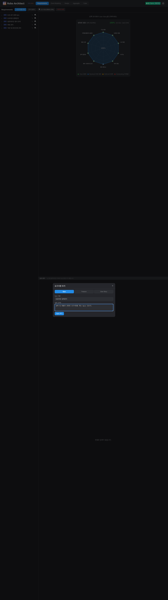
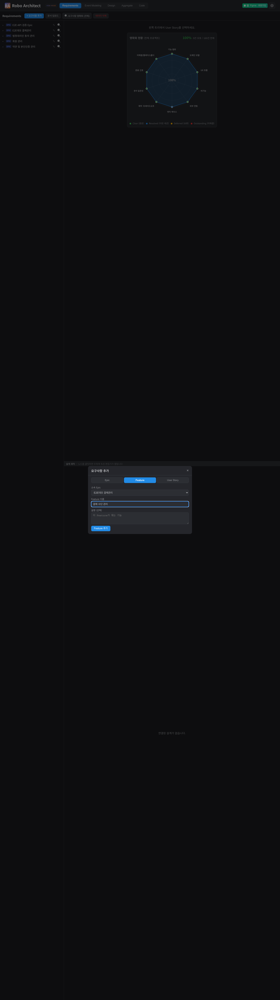
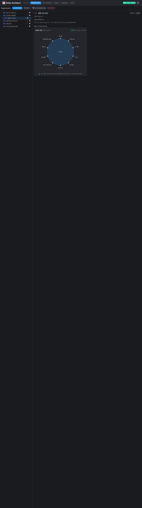
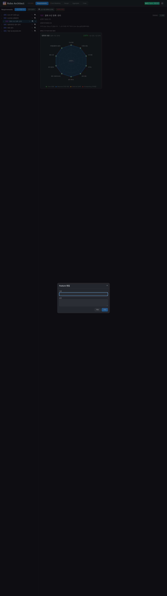

# 요구사항 Epic·Feature 관리 사용 가이드

## 개요

이 기능은 **Requirements(요구사항) 탭**에서 요구사항을 **Epic → Feature → User Story** 세 단계로
직접 등록하고 관리할 수 있게 해 줍니다. 지금까지는 "+" 버튼으로 User Story만 추가할 수 있었지만,
이제는 더 큰 단위인 **Epic(업무 영역)** 과 **Feature(기능 묶음)** 도 손수 등록하고, 각각의 전용
화면에서 내용을 살펴보고 편집할 수 있습니다. 또한 Epic·Feature를 선택하면 그 범위에 맞춰
**명확도 레이더(clarification radar)** 가 다시 그려집니다.

## 시작하기 전에

- 상단 탭에서 **Requirements** 탭을 선택합니다(기본 화면이 다른 탭으로 열려 있을 수 있습니다).
- 왼쪽에는 요구사항 트리가, 오른쪽에는 선택한 항목의 상세 화면이 나타납니다.
- Feature를 등록하려면 먼저 그 Feature가 속할 **Epic이 하나 이상** 있어야 합니다.
  Epic이 없다면 아래 1번 절차로 Epic부터 만들어 주세요.

## 주요 기능

### 1. 요구사항 추가 — 단위(Epic / Feature / User Story) 선택

왼쪽 위의 **"+ 요구사항 추가"** 버튼을 누르면 추가 창이 열립니다. 창 맨 위에서 추가할 **단위**를
**Epic / Feature / User Story** 중에서 고를 수 있습니다. 단위에 따라 입력 양식이 바뀝니다.

{ width=100% }

### 2. Epic 등록하기

단위에서 **Epic**을 선택하면 이름과 설명을 입력하는 양식이 나타납니다. **Epic 이름**(필수)과
**설명**(선택)을 입력합니다. 예를 들어 "결제관리"처럼 하나의 업무 영역을 나타내는 이름이 좋습니다.

{ width=100% }

**"Epic 추가"** 버튼을 누르면 창이 닫히고, 왼쪽 트리의 최상위에 새 Epic이 바로 나타납니다.

{ width=100% }

### 3. Feature 등록하기

다시 **"+ 요구사항 추가"** 를 누르고 단위에서 **Feature**를 선택합니다. **소속 Epic**을 목록에서
고른 뒤 **Feature 이름**(필수)과 설명을 입력합니다. Feature는 선택한 Epic 아래에 묶이는 기능
단위입니다.

{ width=100% }

**"Feature 추가"** 를 누르면 해당 Epic 아래에 Feature가 추가됩니다. Epic 왼쪽의 화살표(▸)를
누르면 펼쳐서 방금 추가한 Feature를 확인할 수 있습니다.

{ width=100% }

> User Story는 기존과 동일하게 **자연어 입력** 또는 **수동 입력** 으로 추가할 수 있습니다.
> User Story 단위를 선택하면 기존 방식 그대로 사용하실 수 있습니다.

### 4. Epic 전용 화면 보기

트리에서 **Epic 이름을 클릭**하면 오른쪽에 그 Epic의 전용 화면이 열립니다. Epic의 이름과 설명,
그 아래에 속한 **Feature 목록**(각 Feature의 User Story 개수 포함)을 한눈에 볼 수 있습니다.
화면 아래쪽에는 이 Epic 범위의 **명확도 레이더**가 함께 표시됩니다(아래 7번 참고).

{ width=100% }

> 화살표(▸)를 누르면 트리가 펼쳐지고, **이름을 누르면** 해당 항목이 선택되어 상세 화면이 열립니다.

### 5. Feature 전용 화면 보기

트리에서 **Feature 이름을 클릭**하거나, Epic 화면의 Feature 목록에서 항목을 누르면 Feature 전용
화면이 열립니다. Feature의 이름·설명·출처와 그 아래 **User Story 목록**을 확인할 수 있습니다.
아직 User Story가 없으면 추가를 안내하는 문구가 보입니다.

{ width=100% }

### 6. Epic·Feature 편집하기

각 항목을 수정하려면 두 가지 방법이 있습니다.

- 트리에서 Epic·Feature 행 오른쪽의 **✎(연필) 버튼** 을 누릅니다.
- 또는 전용 화면 오른쪽 위의 **"✎ 편집"** 버튼을 누릅니다.

편집 창에서 이름과 설명을 고친 뒤 **"저장"** 을 누르면, 화면을 새로 고치지 않아도 트리와 상세
화면에 즉시 반영됩니다. 하위 항목(Feature·User Story)과의 연결은 그대로 유지됩니다.

{ width=100% }

저장하면 바뀐 이름이 곧바로 적용됩니다.

{ width=100% }

**이름은 비워 둘 수 없습니다.** 이름을 모두 지우면 **"저장" 버튼이 비활성화**되어 잘못된 저장을
막아 줍니다. 변경을 원치 않으면 **"취소"** 를 누르면 됩니다.

{ width=100% }

### 7. 선택한 범위에 따른 명확도 레이더

Epic이나 Feature를 선택하면, 전용 화면의 **명확도 레이더**가 그 범위에 속한 요구사항만을
집계해 다시 그려집니다. 다른 Epic·Feature를 선택하면 레이더도 그 범위에 맞게 갱신됩니다.
이를 통해 "이 Epic은 어느 항목이 아직 모호한가"를 범위별로 빠르게 가늠할 수 있습니다.
(7·8번 화면 아래쪽의 레이더가 각각 해당 Epic·Feature 범위를 나타냅니다.)

## 자주 묻는 질문

- **Feature를 추가하려는데 소속 Epic이 목록에 없어요.**
  먼저 Epic을 하나 등록해 주세요(2번 절차). Feature는 반드시 어떤 Epic에 속해야 합니다.

- **Epic·Feature 이름을 바꾸면 그 아래 항목이 사라지나요?**
  아니요. 이름·설명만 바뀌고 하위 Feature·User Story와의 연결은 그대로 유지됩니다.

- **이름을 비우고 저장하면 어떻게 되나요?**
  저장 버튼이 비활성화되어 저장되지 않습니다. 이름은 필수 항목입니다.

## 기술 검증 요약 (개발팀 참고)

| 검증 항목 | 결과 | 증거 |
|-----------|------|------|
| Requirements 탭 진입 및 트리 표시 | PASS | 01_requirements_initial.png |
| "+ 추가" 단위 선택(Epic/Feature/User Story) | PASS | 02_add_dialog_units.png |
| Epic 등록(수동) → 트리 반영 | PASS | 03·04 PNG, 12_api_create_epic.txt |
| Feature 등록(소속 Epic 지정) → 트리 반영 | PASS | 05·06 PNG, 15_api_tree.txt |
| Epic 전용 뷰 + 하위 Feature 목록 | PASS | 07_epic_detail_view.png |
| Feature 전용 뷰 + 하위 User Story 목록 | PASS | 08_feature_detail_view.png |
| Epic·Feature 편집(이름·설명) 즉시 반영 | PASS | 09·10 PNG, 13_api_patch_feature_ok.txt |
| 빈 이름 저장 차단(버튼 비활성/422) | PASS | 11 PNG, 14_api_validation.txt |
| 없는 항목 편집 → 404 | PASS | 14_api_validation.txt |
| 편집 시 하위 연결 보존(관계 무변경) | PASS | 13_api_patch_feature_ok.txt |
| 선택 범위별 명확도 레이더 표시 | PASS | 07·08 PNG |

검증 백엔드 엔드포인트: `POST /api/requirements/bounded-context`(Epic 생성),
`PATCH /api/requirements/bounded-context`(Epic 편집), `PATCH /api/requirements/feature`(Feature 편집).
재사용: `GET /api/requirements/tree`, `POST /api/requirements/feature`,
`GET /api/requirements/clarification/clarity`.

## 향후 지원 예정

아래 항목은 이번 범위에 포함되지 않았으며 후속 작업으로 제공될 예정입니다.

- Epic·Feature의 **AI 제안** 등록(자연어 설명 → 후보 제안 → 확정). 현재는 수동 입력만 지원합니다.
- Epic·Feature 등록 시 **하위 User Story 자동 생성**.
- 요구사항의 **DDD 적합성·입도·기존 스펙 정합성 검증**.
- Event Modeling·Design 탭 진입 시 **미반영 요구사항의 설계 자동 반영**.
