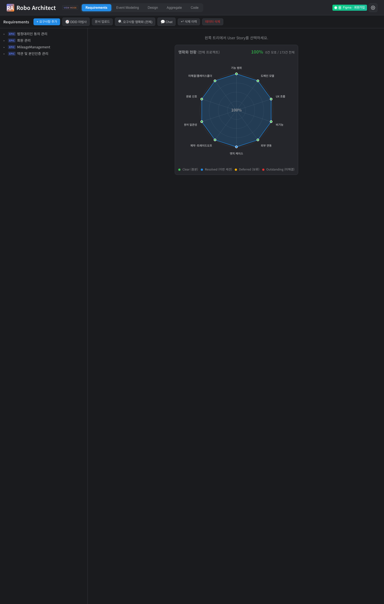
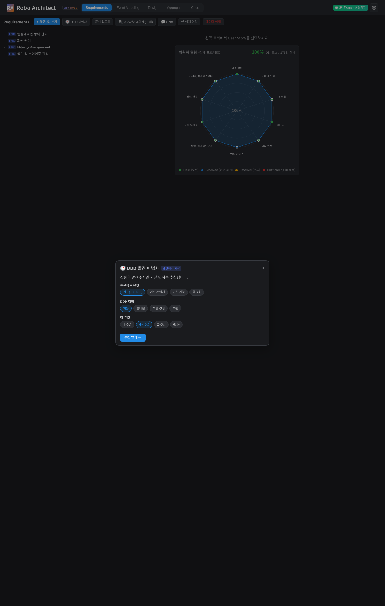
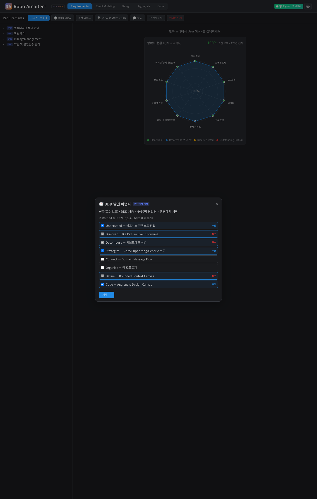
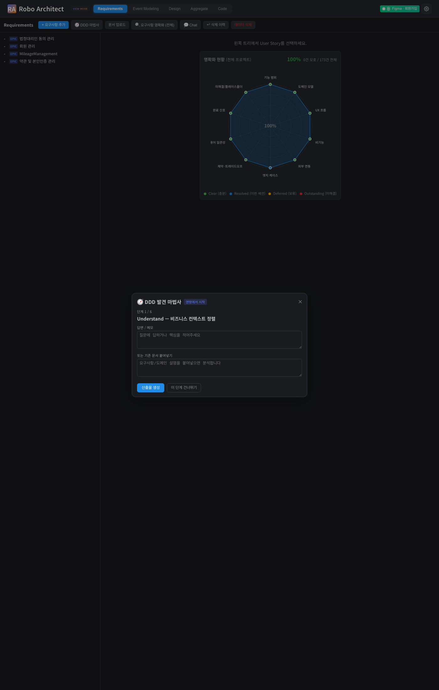

# DDD 발견 마법사 & 도메인 캔버스 사용 가이드

## 개요

**DDD 발견 마법사**는 Robo Architect의 요구사항 탭에서 DDD(도메인 주도 설계) 8단계
프로세스를 대화형으로 진행할 수 있는 기능입니다. 맨땅에서 시작할 때 어떤 도메인
경계(Bounded Context)를 만들지 단계별 안내를 받을 수 있고, 각 BC와 Aggregate를
**캔버스** 형태로 조회·편집할 수 있습니다.

---

## 시작하기 전에

- Robo Architect 앱에서 **Requirements** 탭을 선택하세요.
- 요구사항이 아직 없어도(맨땅) 마법사를 시작할 수 있습니다. 기존 요구사항이 있는
  경우에도 이 기능을 함께 사용할 수 있습니다.
- 생성 엔진 설정(기어 아이콘 → 생성 엔진)이 **in-process LLM** 이면 별도 로컬 도구
  설치 없이 바로 사용 가능합니다.

---

## 주요 기능

### 1. DDD 발견 마법사 시작

Requirements 탭 상단 도구막대에서 **🧭 DDD 마법사** 버튼을 클릭합니다.

{ width=100% }

버튼을 클릭하면 **DDD 발견 마법사** 다이얼로그가 열립니다.

---

### 2. 프로파일링 — 상황에 맞는 단계 추천

마법사가 열리면 3가지 질문으로 현재 상황을 파악합니다.

| 질문 | 보기 예시 |
|---|---|
| 프로젝트 유형 | 신규(그린필드), 기존 재설계, 단일 기능, 학습용 |
| DDD 경험 | 처음, 들어봄, 적용 경험, 숙련 |
| 팀 규모 | 1~3명, 4~10명, 2~5팀, 6팀+ |

답변을 선택하고 **추천 받기 →** 를 클릭하세요.

{ width=100% }

---

### 3. 단계 선택 — 거칠 단계 조합 확정

프로파일 결과에 맞는 단계 조합이 추천됩니다.

- ✅ **필수** 표시 단계는 해제할 수 없습니다 (Discover/Decompose/Define은 항상 필수).
- **추천** 표시 단계는 원하지 않으면 체크를 해제할 수 있습니다.
- 준비가 되면 **시작 →** 버튼을 클릭하세요.

{ width=100% }

---

### 4. 단계 진행 — 답변 입력 또는 문서 붙여넣기

선택한 단계가 순서대로 진행됩니다. 각 단계에서:

1. **답변 / 메모** 란에 해당 단계의 핵심 내용을 입력하거나,
2. **기존 문서 붙여넣기** 란에 비즈니스 설명, 요구사항 문서 등을 붙여넣을 수 있습니다.

두 입력 방식 중 하나만 사용해도 됩니다.

입력이 끝나면 **산출물 생성**을 클릭하면 그 단계의 마크다운 산출물과 그래프 변경안이 표시됩니다.

{ width=100% }

---

### 5. 산출물 확인 및 그래프 반영(propose → confirm)

산출물이 생성되면:

- **마크다운 초안**을 확인합니다.
- 그래프에 반영할 **변경안 목록**에서 체크박스로 원하는 변경만 선택합니다.
- **확인 후 다음 →** 버튼을 클릭하면 체크된 항목만 그래프에 반영됩니다.
- 체크를 하나도 하지 않고 확인하면 그래프는 변경되지 않습니다.

> 모든 변경은 확인(Confirm) 단계를 거쳐야만 실제로 반영됩니다.

---

### 6. Bounded Context Canvas — BC 상세 보기

요구사항 트리에서 **Epic(Bounded Context)** 을 클릭하면 상세 화면이 열립니다.
상단 탭에서 **Canvas** 탭을 선택하면 BC Canvas를 볼 수 있습니다.

Canvas에서 볼 수 있는 정보:

| 항목 | 설명 |
|---|---|
| 전략 분류 배지 | 🔴 Core / 🟡 Supporting / ⚪ Generic |
| 책임(Purpose) | 이 BC가 담당하는 한 줄 설명 |
| 유비쿼터스 언어 | 이 BC 안에서만 통용되는 핵심 용어 목록 |
| 인/아웃바운드 메시지 | 이 BC로 들어오고 나가는 이벤트·커맨드 |
| 비즈니스 결정 | 이 BC가 다른 BC에 묻지 않고 스스로 내리는 규칙 |

**✨ 자동생성** 버튼으로 LLM이 캔버스 초안을 채워줍니다.
**✎ 편집** 버튼으로 직접 수정하고 **저장**할 수 있습니다.

---

### 7. Aggregate Design Canvas — 애그리거트 상세 보기

설계 탭이나 Aggregate 탭에서 Aggregate를 열면 **Canvas** 탭이 있습니다.

Canvas에서 볼 수 있는 정보:

| 항목 | 설명 |
|---|---|
| 설명 | 이 Aggregate의 한 줄 역할 |
| 상태 전이 | 상태 머신 (Mermaid 다이어그램으로 표시) |
| 커맨드 / 이벤트 | 처리하는 커맨드와 발행하는 이벤트 목록 |
| 불변 조건 | 항상 참이어야 하는 비즈니스 규칙 |
| 보정 정책 | 불변 조건이 위협받을 때 취하는 조치 |

---

### 8. Core / Supporting / Generic 전략 분류

마법사 Strategize 단계 또는 BC 상세 화면에서 분류를 지정할 수 있습니다.

판별 기준:
- **Core** — 이 영역을 외부에 아웃소싱하면 고객이 차이를 느낀다.
- **Supporting** — 필요하지만 차별화 요소는 아니다.
- **Generic** — 충분히 좋은 외부 솔루션(SaaS/라이브러리)이 이미 있다.

분류 결과는 컨텍스트 맵과 BC Canvas에서 색상 배지로 한눈에 확인할 수 있습니다.

---

### 9. 그래프 → .ddd 내보내기

현재 그래프 상태를 사람이 읽고 버전관리할 수 있는 **ddd-starter 형식 마크다운**으로
내보낼 수 있습니다.

생성 파일 예시:
- `00-plan.md` — 전체 모델 요약
- `02-event-storm.md` — 도메인 이벤트 목록 (피보탈/핫스팟 표시 포함)
- `04-core-domain-chart.md` — BC별 전략 분류 차트
- `07-bounded-contexts/<이름>.md` — BC별 캔버스 문서
- `08-aggregates/<이름>.md` — Aggregate별 설계 문서

> **참고**: 내보내기 파일은 보조 산출물입니다. 진실의 원천은 항상 그래프입니다.

---

## 자주 묻는 질문

**Q. 확인 없이 그래프가 바뀔 수 있나요?**
아니요. 모든 변경은 사용자가 "확인 후 다음 →"을 클릭해야만 반영됩니다. 변경안 체크박스를 모두 해제한 채 확인해도 그래프는 변경되지 않습니다.

**Q. 마법사를 중단했다가 다시 시작하면 어떻게 되나요?**
마법사는 각 단계의 답변과 진행 상태를 세션에 보존합니다. 현재는 페이지를 새로고침하면 세션이 초기화되므로, 이어서 진행하려면 새 세션을 시작하세요.

**Q. 문서 업로드(기존 일괄 분석)와 함께 쓸 수 있나요?**
네, 둘 다 같은 그래프를 공유합니다. 단, 문서 업로드(전체 분석)는 모델을 재구성하므로 마법사로 만든 결과 위에 전체 분석을 다시 실행하면 변경될 수 있습니다.

**Q. 생성 언어를 바꾸고 싶어요.**
기어 아이콘(⚙) → 언어 설정에서 BCP-47 언어 코드(예: `ko`, `en`)를 설정하면 이후 생성 산출물의 언어가 바뀝니다.

---

## 향후 지원 예정

- 마법사 세션 중단/재개 (페이지 새로고침 후에도 이어서 진행)
- 전체 ingestion(문서 업로드) 후 마법사 산출물 자동 보존
- 피보탈 이벤트 UI 배지 (EventStorming 타임라인에서 직접 조정)
- .ddd → 그래프 가져오기(Import) — 외부 수정 후 재반영

---

## 기술 검증 요약 (개발팀 참고)

| 검증 항목 | 결과 | 증거 |
|---|---|---|
| 요구사항 탭 + DDD 마법사 버튼 표시 | PASS ✓ | `screenshots/01_requirements_tab.png` |
| 마법사 프로파일링 UI | PASS ✓ | `screenshots/02_wizard_profiling.png` |
| 추천 단계 선택 UI (필수/선택 구분) | PASS ✓ | `screenshots/03_wizard_plan.png` |
| 단계 진행 UI (답변 입력 / 문서 붙여넣기) | PASS ✓ | `screenshots/04_wizard_step.png` |
| 마법사 start API — 세션 생성 + 추천 단계 | PASS ✓ | `screenshots/05_wizard_start.txt` |
| BC Canvas GET/PATCH + 분류(generic) 저장 | PASS ✓ | `screenshots/06_canvas_classification.txt` |
| 그래프 → .ddd 내보내기 (15 파일) | PASS ✓ | `screenshots/07_ddd_export.txt` |
| 피보탈 이벤트 토글 — 없는 이벤트 404 처리 | PASS ✓ | `screenshots/08_pivotal_404.txt` |
| 백엔드 import 스모크 (59 routes 등록) | PASS ✓ | `artifacts/openapi.json` |
| 단위 테스트 (마법사 로직 12/12) | PASS ✓ | 구현 세션 실행 |
| Playwright UI 테스트 4/4 | PASS ✓ | `artifacts/playwright.out` |
| Vite 프로덕션 빌드 | PASS ✓ | 구현 세션 실행 (exit 0) |
| 신규 Neo4j 노드 라벨/관계 0건 | PASS ✓ | 코드 리뷰 + 구현 원칙 |
| 모든 LLM 변경 propose→confirm | PASS ✓ | 라이브 E2E (empty confirm = 무변경) |
