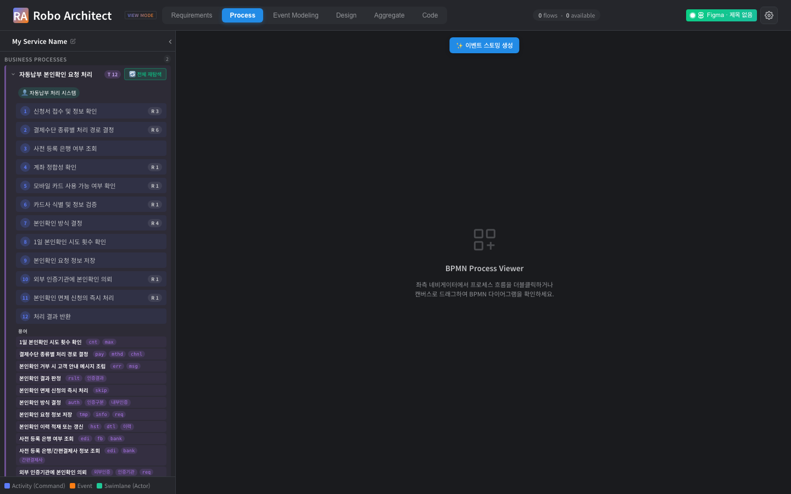
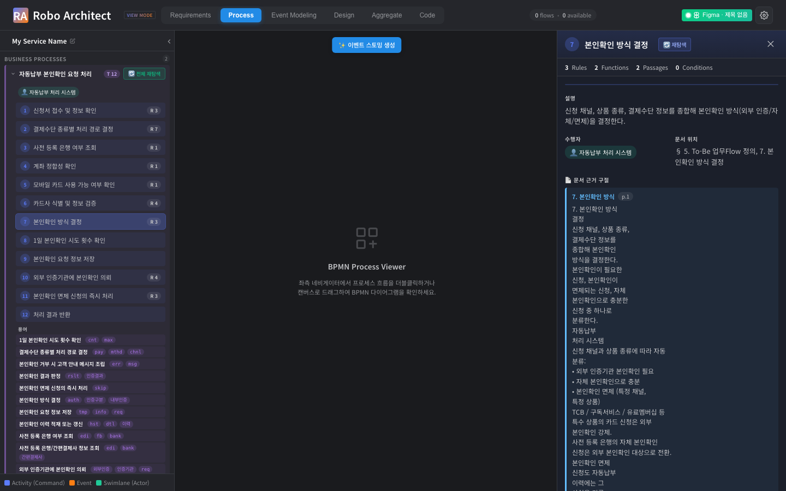

# 사용자 매뉴얼 — BPMN 룰 매핑 Recall 개선 (용어 정규화, spec 036)

## 1. 이 기능이 해결하는 문제

BPMN 모델 탐색으로 레거시 코드의 비즈니스 로직(BL) 룰을 각 활동(Task)에 매핑할 때,
평문 요구사항(예: "본인확인을 처리한다")과 레거시 코드의 개발자 용어(예: `zapamcom`,
`TB_WD_MST`)는 어휘가 달라 임베딩 유사도가 낮게 나옵니다. 그 결과 **매핑되어야 할 룰이
후보 검색에서 탈락**해, 사용자는 "코드에 분명 있는 규칙이 매핑 안 됐다"는 누락을 겪습니다.

이 기능은 이미 추출되는 **용어 사전(glossary)을 임베딩 단계에 주입(양방향 정규화)** 하여,
통과 기준(floor)·후보 예산·검증기·화면을 그대로 둔 채 진짜 매칭의 유사도만 끌어올립니다.
→ **놓치던 룰이 매핑으로 회복**되고, **사용자가 검토하는 화면 항목은 늘지 않습니다.**

## 2. 사용 방법 (사용자 관점)

별도 조작이 없습니다. 평소처럼 문서를 인제스트하고 BPMN 매핑을 실행하면, 어휘가 다른
정당한 룰이 자동으로 더 많이 매핑됩니다. 동작은 환경 변수로 제어됩니다.

| 환경 변수 | 기본 | 설명 |
|---|---|---|
| `HYBRID_GLOSSARY_NORMALIZE` | `1`(on) | `0`이면 정규화 완전 비활성(이전 동작과 동일). A/B·롤백용. |
| `HYBRID_GLOSSARY_MAX_RECOVERIES` | `3` | 활동당 회복 후보 상한. 0=회복 없음, 값↑=더 많은 누락 회복(비용↑). 인지부하/비용 제어 노브. |

## 3. before / after (어휘갭 룰 회복)

> 골든 픽스처: `자동납부 본인확인` 업무흐름 PDF 2종 + 레거시 C(`zapamcom*`) 분석 그래프.

| off (`=0`) | on (`=1`) |
|---|---|
|  |  |
| "본인확인" 활동에 `zapamcom` 룰 누락 | 동일 활동에 해당 룰이 매핑되어 표시 |

매핑 패널 상세: 

## 4. 측정 결과 (골든 픽스처 A/B)

> 라이브 환경(neo4j analyzer 그래프 + LLM 키)에서 `manual/run_mapping.py`(off/on) →
> `manual/compare.py`로 산출. 아래 표는 실행 후 채웁니다.

측정 환경: golden036 세션(자동납부 본인확인 PDF 2종 ingest + `zapamcom*` analyzer 그래프), `HYBRID_GLOSSARY_MAX_RECOVERIES=3`.

| 지표 | 기준(SC) | 결과 |
|---|---|---|
| recovered (회복) | ≥ 1 (SC-001) | **23** ✅ |
| regressed (회귀) | ≤ 1, 검증기 비결정성 허용 (SC-001/004) | **1** ✅ |
| wall_clock_ratio (비용) | ≤ 1.2 (SC-003) | **1.07x** ✅ |
| accept_delta (= recall 향상분, 정보용) | — | +22 (off 25 → on 47) |

회복된 매핑 예: `본인확인 방식 결정` ← 납부방법별 인증구분 설정 룰들, `카드사 식별 및 정보 검증` ← 카드사 코드 정합성 오류 룰 — 어휘갭("본인확인" 평문 ↔ `zapamcom`/`auth` 코드)으로 누락되던 정당한 룰을 회복. 재현 절차는 [../quickstart.md](../quickstart.md) Q2~Q4 참조.

## 5. 안전성 / 롤백

- 용어 사전이 비어 있거나 추출 실패해도 매핑은 오류 없이 완료됩니다(기존 동작 폴백).
- 잘못된 정규화로 무관한 룰이 후보에 들어가도 **LLM 검증기가 걸러내** 화면에는 노출되지 않습니다.
- `HYBRID_GLOSSARY_NORMALIZE=0` 으로 두면 이전과 완전히 동일하게 동작합니다(즉시 롤백).
- 신규 그래프 노드/관계는 추가되지 않습니다.
