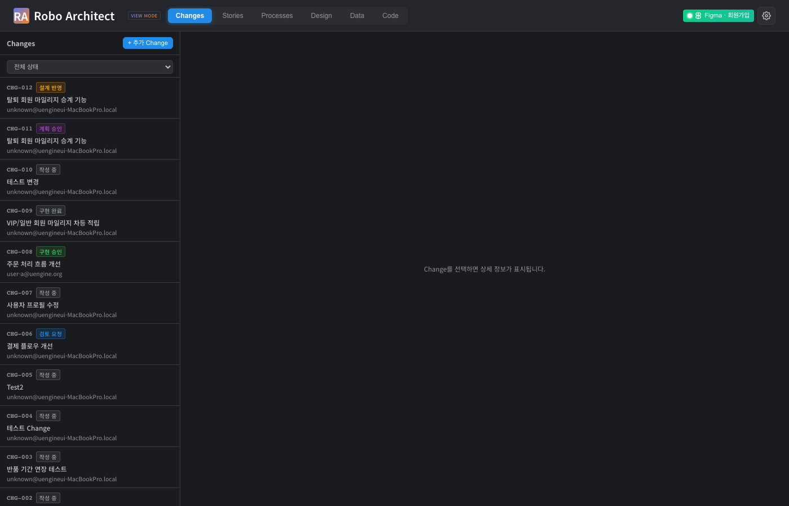
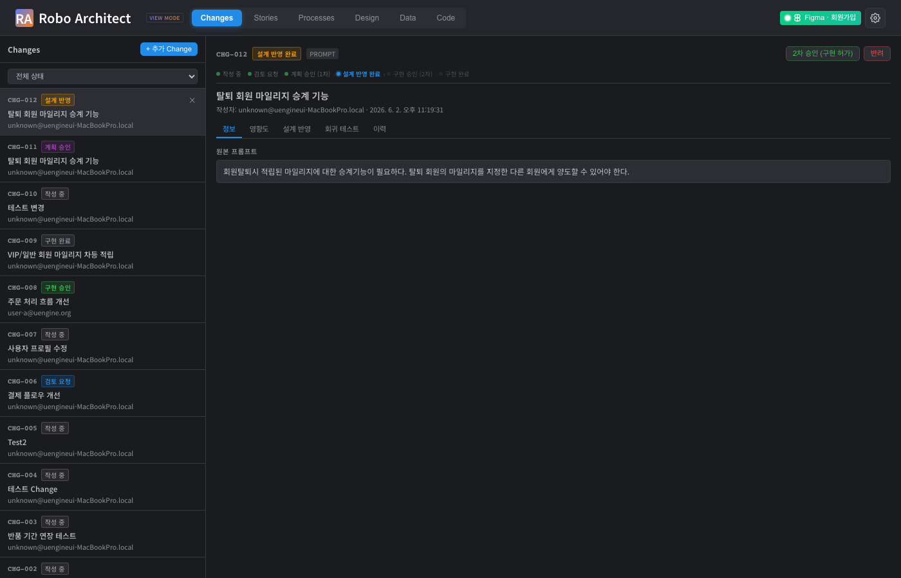
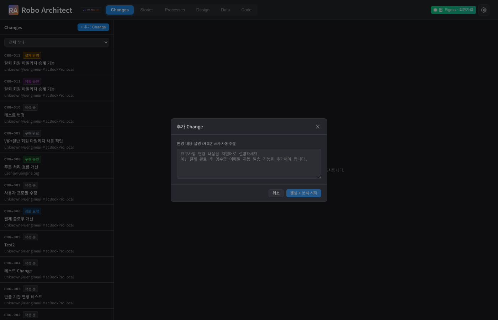
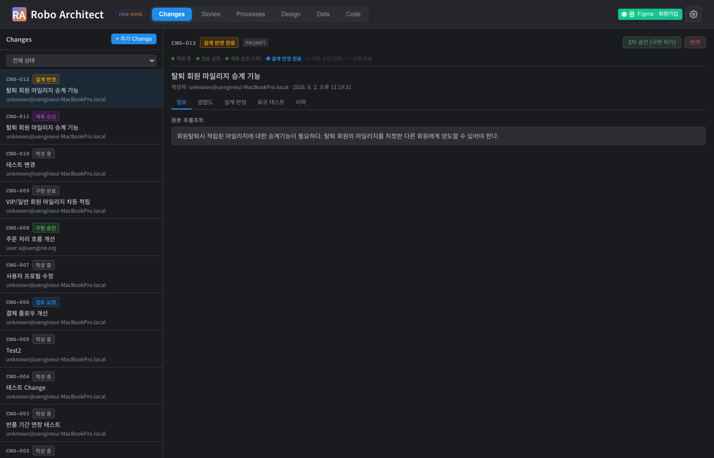
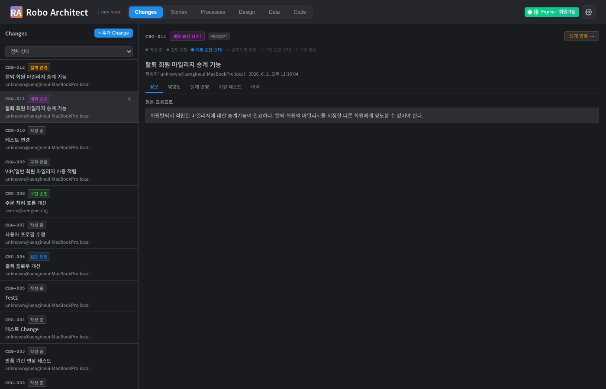

# 요구사항 변경 관리(Change Management) 사용 가이드

## 개요

요구사항 변경 관리 기능은 팀의 도메인 설계 변경 내역을 **CHG-NNN** 형식의 레코드로 체계적으로 추적합니다. 변경 요청 생성부터 영향도 분석, 설계 반영, 회귀 테스트 확인, 구현 승인까지 전체 워크플로우를 하나의 화면에서 관리할 수 있습니다.

---

## 시작하기 전에

- 상단 탭 바에서 **Changes** 탭을 클릭하여 진입합니다.
- 변경 관리 기능을 사용하려면 최소 하나 이상의 BoundedContext와 UserStory가 데이터베이스에 존재해야 합니다.
- 승인 워크플로우는 **자기 승인이 불가**합니다. 변경 요청자와 승인자가 달라야 합니다.

---

## 주요 기능

### 1. Changes 탭 — 변경 목록 조회

{ width=100% }

**Changes** 탭을 열면 시스템에 등록된 모든 변경 레코드(CHG-NNN)가 생성일시 역순으로 나열됩니다. 각 항목에는 다음 정보가 표시됩니다:

- **CHG-NNN** 고유 식별자
- 현재 **상태** (작성 중 / 검토 요청 / 계획 승인 / 설계 반영 완료 / 구현 승인 / 구현 완료)
- **작성자** 및 **생성 시각**
- 변경 **제목** 요약

목록에서 원하는 항목을 클릭하면 상세 화면으로 이동합니다.

---

### 2. Change 상세 화면 — 정보 및 승인 흐름

{ width=100% }

Change를 클릭하면 상세 화면이 열립니다. 화면 상단에는 **승인 흐름 스텝**이 표시되어 현재 어느 단계에 있는지 한눈에 파악할 수 있습니다:

작성 중 → 검토 요청 → 계획 승인(1차) → 설계 반영 완료 → 구현 승인(2차) → 구현 완료

상세 화면 내 탭 구성:

| 탭 | 내용 |
|----|------|
| 정보 | 원본 프롬프트, ChangeSet 소속 여부 |
| 영향도 | 영향받는 UserStory·Aggregate·BC 목록 |
| 설계 반영 | AI가 수정한 도메인 객체 변경 내역 |
| 회귀 테스트 | 영향받는 테스트 항목 분석 |
| 이력 | 상태 변경 타임라인 |

---

### 3. Change 생성 — 새 변경 요청 등록

{ width=100% }

**새 Change 추가** 버튼을 클릭하면 변경 등록 다이얼로그가 열립니다. 변경 내용을 자연어로 작성하고 저장하면 **CHG-NNN** ID가 자동 부여됩니다. 생성된 Change는 `DRAFT` 상태로 시작하며, "제출" 버튼으로 검토 요청 단계로 넘어갑니다.

**세 가지 생성 방법:**

1. Changes 탭의 "추가 Change" 버튼 (직접 등록)
2. 요구사항 입력창에 자연어 프롬프트 입력 (AI 자동 분류)
3. UserStory / Feature를 직접 수정 시 자동 생성

---

### 4. 영향도 분석 — 어떤 설계 요소가 영향받는가

{ width=100% }

**영향도** 탭에서는 AI가 분석한 변경 영향 범위를 확인할 수 있습니다. 영향받는 항목은 레이어별로 분류되어 표시됩니다:

- **Requirements 레이어**: UserStory, Feature
- **Process 레이어**: BoundedContext
- **Design 레이어**: Aggregate, Command, Event

각 항목에는 영향 이유와 HIGH / MEDIUM / LOW 영향 등급이 함께 표시됩니다. 영향도 분석이 아직 실행되지 않은 경우 "영향도 분석 시작" 버튼을 클릭하면 AI가 자동으로 분석을 수행합니다.

---

### 5. 설계 반영 — AI가 도메인 객체를 자동 업데이트

{ width=100% }

Change가 **계획 승인(1차)** 상태가 되면 **설계 반영** 탭에서 "설계 변경 적용" 버튼을 클릭할 수 있습니다. AI가 영향받는 도메인 객체(UserStory의 인수조건, Aggregate의 설명·ValueObject·Enumeration 등)를 자동으로 업데이트합니다.

변경 내역은 **레이어별 트리** 형태로 표시됩니다:

- 각 노드의 **변경 전 / 변경 후** 텍스트를 펼쳐서 확인 가능
- Aggregate의 경우 **필드 변경 표**, **Value Object 추가/제거**, **Enumeration 변경**, **불변식 추가** 내역이 별도로 표시됩니다
- **📊 보기** 버튼 클릭 시 해당 Aggregate의 Data 탭으로 이동하여 실제 변경을 확인할 수 있습니다

설계 반영 후 내용이 잘못되었다면 **↩ 설계 되돌리기** 버튼으로 AI가 변경 기여분만 지능적으로 제거하여 이전 상태로 복원합니다.

---

### 6. 상태 이력 — 변경의 타임라인 추적

{ width=100% }

**이력** 탭에서는 Change가 어떤 경로로 상태가 변화했는지 타임라인으로 확인할 수 있습니다. 각 항목에는 이전 상태 → 현재 상태, 처리자, 처리 시각, 코멘트가 기록됩니다.

---

### 7. 승인 워크플로우 — 단계별 승인 진행

{ width=100% }

Change는 2단계 승인을 거쳐 구현까지 진행됩니다:

| 단계 | 버튼 | 조건 |
|------|------|------|
| 제출 | 작성자가 클릭 | DRAFT 상태 |
| 1차 승인 (계획 승인) | 다른 팀원이 클릭 | SUBMITTED 상태, 자기 승인 불가 |
| 설계 반영 | 시스템 자동 / 수동 | PLAN_APPROVED 상태 |
| 2차 승인 (구현 허가) | 다른 팀원이 클릭 | DESIGN_APPLIED 상태, 자기 승인 불가 |
| 구현 시작 | 작성자가 클릭 | APPROVED 상태 |

승인 시 선택적으로 코멘트를 남길 수 있으며, 코멘트는 이력 탭에 기록됩니다. 문제가 있을 경우 **반려** 버튼으로 변경을 거부할 수 있습니다.

---

### 8. 회귀 테스트 — 영향받는 테스트 확인

{ width=100% }

**회귀 테스트** 탭에서는 이번 변경으로 인해 재검증이 필요한 테스트 항목을 확인할 수 있습니다. 시스템이 EFFECT 관계 그래프를 트래버스하여 영향받는 설계 요소와 연관된 테스트를 자동으로 식별합니다.

---

## 자주 묻는 질문

**Q. 본인이 생성한 Change를 직접 승인할 수 없나요?**
네, 자기 승인은 정책상 허용되지 않습니다. 1차·2차 승인 모두 Change 작성자와 다른 팀원이 처리해야 합니다.

**Q. 설계 반영 후 실수로 잘못된 내용이 반영되었어요.**
설계 반영 탭에서 **↩ 설계 되돌리기** 버튼을 클릭하면 AI가 CHG의 기여분만 선별하여 이전 상태로 복원합니다. 단, 되돌리기는 현재 DESIGN_APPLIED 상태에서만 가능합니다.

**Q. 여러 Change를 한꺼번에 관리하고 싶어요.**
관련된 Change 여러 개를 **Change Set**으로 묶으면 함께 검토·승인·반영할 수 있습니다.

**Q. 영향도 분석 결과가 너무 적게 나왔어요.**
"영향도 재분석" 기능으로 AI에게 다시 분석을 요청할 수 있습니다. 프롬프트를 보다 구체적으로 작성하면 더 정확한 영향 범위를 파악할 수 있습니다.

---

## 향후 지원 예정

- **Change Set 일괄 승인 UI**: 현재 API로는 지원되나 UI에서 그룹 승인 플로우가 개선될 예정입니다.
- **기존 CHG SemanticDiff 마이그레이션**: CHG-012처럼 이전 방식으로 apply된 Change는 EFFECT.diff가 없으므로 설계 되돌리기가 제한됩니다. 신규 apply 분부터 완전한 ops 기반 undo가 지원됩니다.
- **Change 간 충돌 감지**: 같은 Aggregate를 수정하는 여러 Change의 충돌을 사전에 경고하는 기능이 추가될 예정입니다.

---

## 기술 검증 요약 (개발팀 참고)

| 검증 항목 | 결과 | 증거 |
|-----------|------|------|
| Changes 탭 목록 조회 (12개 CHG) | PASS | screenshots/09_api_changes_list.txt |
| CHG-012 상세 조회 (EFFECT 10개) | PASS | screenshots/10_api_chg012_detail.txt |
| GET /design-changes (EFFECT.diff 조회) | PASS | screenshots/11_api_design_changes.txt |
| Playwright 01 — Changes 목록 화면 | PASS | screenshots/01_changes_list.png |
| Playwright 02 — Change 상세 화면 | PASS | screenshots/02_change_detail.png |
| Playwright 03 — Change 생성 버튼 | PASS | screenshots/03_change_create_modal.png |
| Playwright 04 — 영향도 분석 탭 | PASS | screenshots/04_impact_analysis.png |
| Playwright 05 — 설계 반영 탭 | PASS | screenshots/05_design_changes.png |
| Playwright 06 — 상태 이력 탭 | PASS | screenshots/06_status_history.png |
| Playwright 07 — 승인 흐름 표시 | PASS | screenshots/07_approval_workflow.png |
| Playwright 08 — 회귀 테스트 탭 | PASS | screenshots/08_regression_tests.png |
| 자기 승인 방지 (API 계층) | PASS | changes_approval.py 구현 완료 |
| SemanticDiff EFFECT.diff 저장 구조 | PASS | design_applier.py / changes_design.py |
| DRAFT→SUBMITTED→PLAN_APPROVED 전이 | PASS | screenshots/10_api_chg012_detail.txt |
