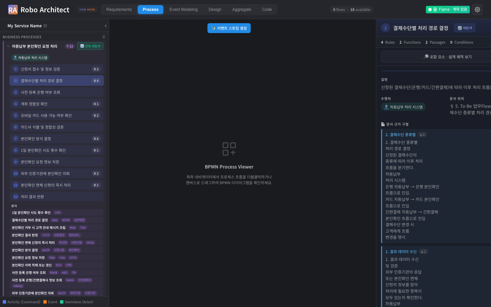
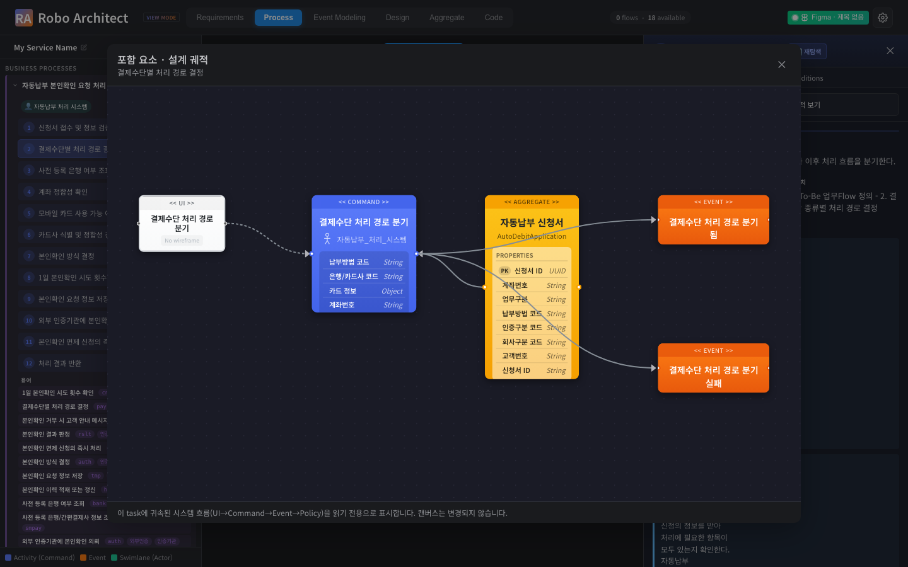
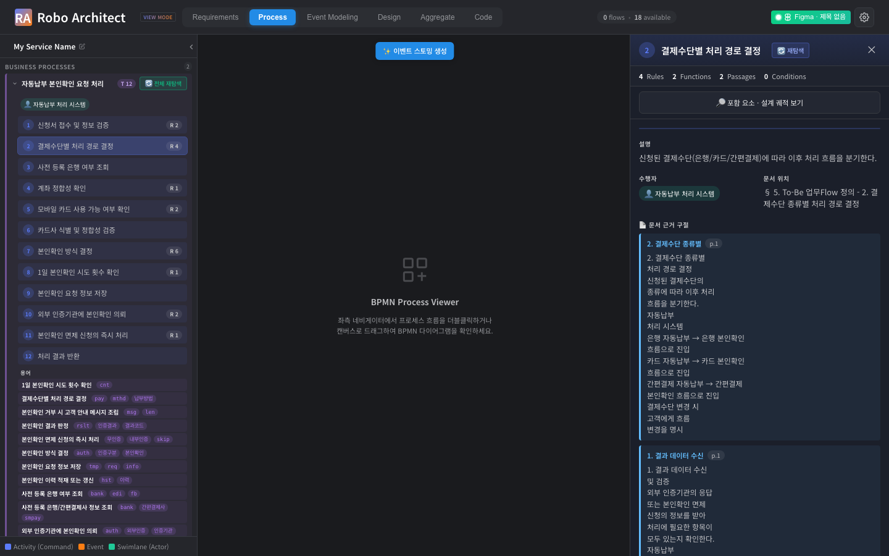
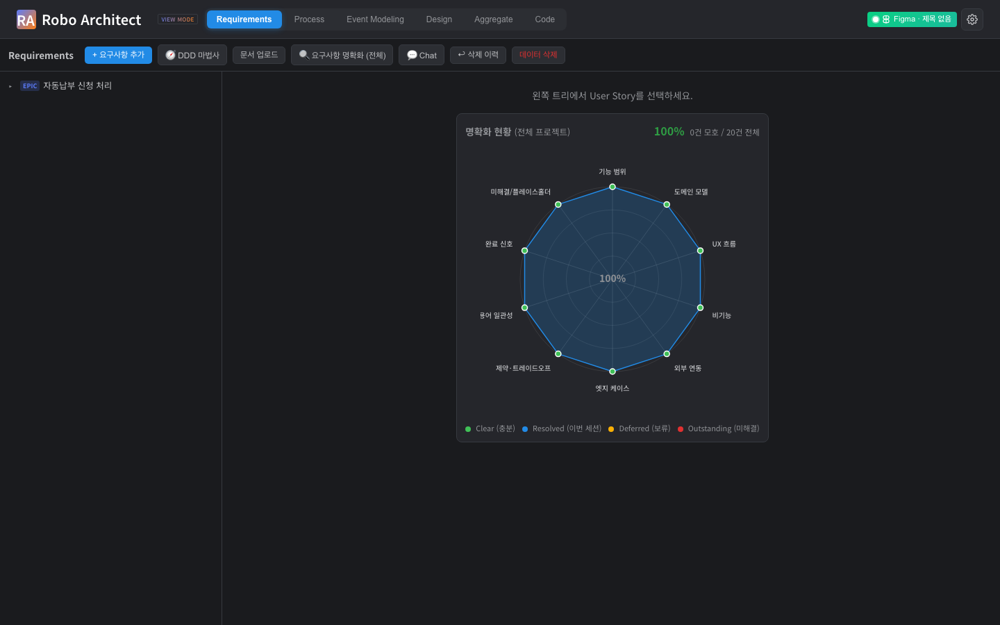
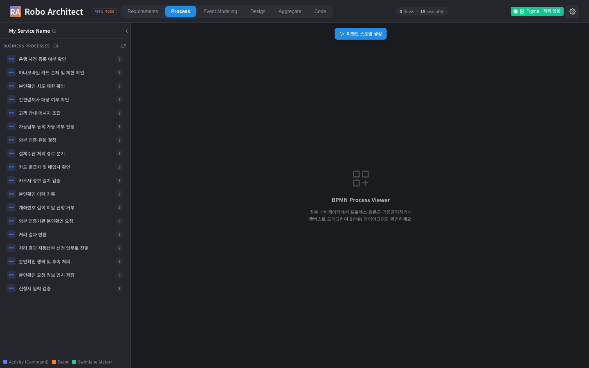

# BPM ↔ Event Modeling 통합 — 사용 매뉴얼 (spec 039)

## 1. 무엇이 바뀌었나

BPM 뷰와 Event Modeling 뷰는 이제 **하나의 그래프를 보는 두 가지 방식**입니다.

- **BPM 뷰** = 사용자가 관여하는 업무 흐름(task 단위). task의 순서는 A2A가 추출한 프로세스 흐름을 따릅니다.
- **Event Modeling 뷰** = 그 흐름 안에서 시스템이 실제로 하는 일(UI → Command → Event → Policy → ReadModel).

두 뷰는 같은 `:BpmTask`를 척추로 공유하므로, **한 곳에서 본 task가 다른 곳에서도 같은 task**입니다. 별도의 동기화나 복제가 없습니다.

새로 추가된 것은 단 하나 — **각 BPM task가 "무엇을 포함하는지"를 한 번의 클릭으로 보는 모달**입니다. 캔버스는 전혀 바뀌지 않습니다.

또한 효용이 사라진 **"Big picture" 뷰는 비활성화**되었습니다.

## 2. BPM task 포함 요소 보기 (핵심 기능)

1. **Process** 탭을 엽니다(BPM 뷰).
2. 아무 **task**나 클릭하면 우측에 task 인스펙터가 열립니다.
3. 인스펙터 상단의 **"🔎 포함 요소 · 설계 궤적 보기"** 버튼을 누릅니다.
4. 모달이 열리며, 그 task에 귀속된 **UI · Command · Event · Policy · Aggregate** 가
   event-modeling 스티커(Design 탭과 동일한 모양)로 표시됩니다.
5. 모달을 닫으면 BPM 캔버스는 **처음과 완전히 동일**합니다.






> 그 task에 귀속된 설계 요소가 아직 없으면 모달은 "연결된 설계가 없습니다"를 안내합니다(비차단).

### 동작 원리 (요약)

BPM(`:BpmTask`)과 ES(`:Command`/`:Event`/…)는 실제 그래프에서 **`PROMOTED_TO → UserStory → IMPLEMENTS`** 로 이어집니다(Event Modeling 뷰가 쓰는 그 연결). 모달은 이 경로로 task의 Command를 루트로 잡고, 거기서 UI·Event·Policy·Aggregate로 확장하여 **이미 영속된 관계만 읽습니다**:

```
(:BpmTask)-[:PROMOTED_TO]->(:UserStory)-[:IMPLEMENTS]->(:Command)   ← task의 Command 루트
(:UI)-[:ATTACHED_TO]->(:Command)
(:Aggregate)-[:HAS_COMMAND]->(:Command)
(:Command)-[:EMITS]->(:Event)-[:TRIGGERS]->(:Policy)-[:INVOKES]->(:Command)
```

> 일부 세션은 `(:Command)-[:PROMOTED_FROM]->(:BpmTask)` 추적 엣지를 쓰는데, 라우트는 **두 스키마를 모두 커버**한다(둘 중 존재하는 경로로 Command를 찾음).

신규 노드/관계를 만들지 않으며(스키마 변경 0건), requirements 탭의 "설계 궤적"과
동일한 렌더러(`DesignTraceCanvas`)를 그대로 재사용합니다.

> ⚠️ **전제**: task에 궤적이 뜨려면 그 task가 **ES 승격(`PROMOTED_TO`)** 까지 완료돼 있어야 한다. A2A로 BPM(task)만 뽑히고 ES 승격 전이면 "연결된 설계가 없습니다"가 뜬다.

## 3. "Big picture" 비활성화

상단 탭에서 "Big picture" 진입점이 사라졌습니다. 관련 패널/스토어/백엔드 라우트는
비활성화되었고(파일은 보존), 문서 export의 빅픽처(swimlane) 섹션도 비활성화됩니다.
다른 뷰(BPM/Event Modeling/Requirements/Aggregate)와 navigator·export는 정상 동작합니다.




## 4. 재현/검증 방법

전제: 프런트(`localhost:5173`) + 백엔드(`localhost:8000`) 구동, 하이브리드 인제스천
완료 세션(`:BpmTask`/`PROMOTED_FROM` 영속).

### 백엔드 단위·계약 테스트

```bash
python -m pytest \
  api/features/requirements/tests/test_design_trace_refactor.py \
  api/features/canvas_graph/tests/test_bpm_task_trace.py -q
# 8 passed — _expand_trace 공유 헬퍼 + bpm-task trace 라우트 계약(404/empty/clamp/read-only)
```

### 정렬 회귀 하니스 (US3)

```bash
# 재인제스천 전/후 스냅샷 비교로 멱등성(중복 0) 확인
python specs/039-bpm-event-unification/manual/check_alignment.py > before.json
# ...동일 문서 재인제스천...
python specs/039-bpm-event-unification/manual/check_alignment.py > after.json
diff before.json after.json   # task/체인 수 불변이어야 함
```

### Playwright 캡처

```bash
cd specs/039-bpm-event-unification/manual/artifacts
HYBRID_SESSION=<세션id> npx playwright test --config playwright.config.ts
# → manual/screenshots/*.png 생성
```

## 5. 요약표

| 항목 | 값 |
|---|---|
| 진실의 원천 | 단일 Neo4j 그래프(`:BpmTask` 척추) |
| BPM task ↔ Event Modeling | 동일 task 공유(복제 0) |
| 신규 노드 라벨/관계 | **0건** (기존 `PROMOTED_FROM`/`ATTACHED_TO`/`EMITS` 읽기) |
| 캔버스 변경 | **없음** (포함 요소는 모달로만) |
| 신규 백엔드 | 읽기 라우트 1개 `GET /api/graph/bpm-task/{id}/design-trace` |
| 재사용 | `design_trace._expand_trace`, `DesignTraceCanvas.vue` |
| Big picture | 비활성화(탭/패널/스토어/라우트/export 섹션) |
| LLM / SSE / propose-confirm | 해당 없음(읽기 전용 + UI 정리) |
