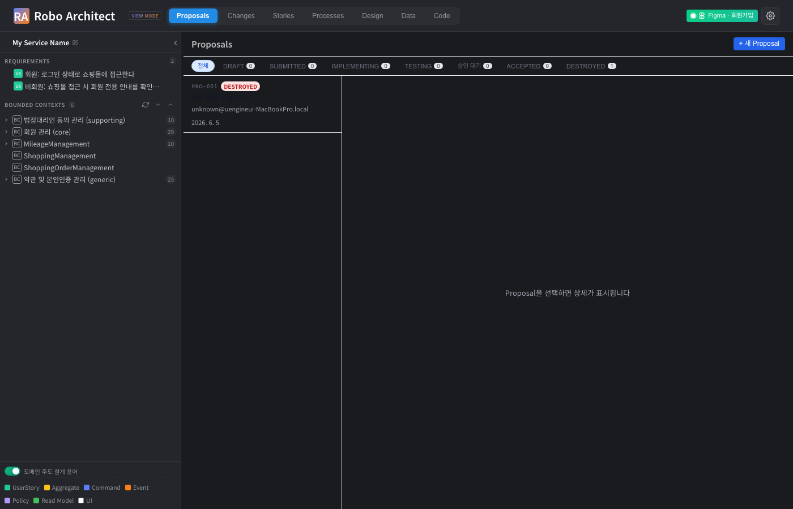
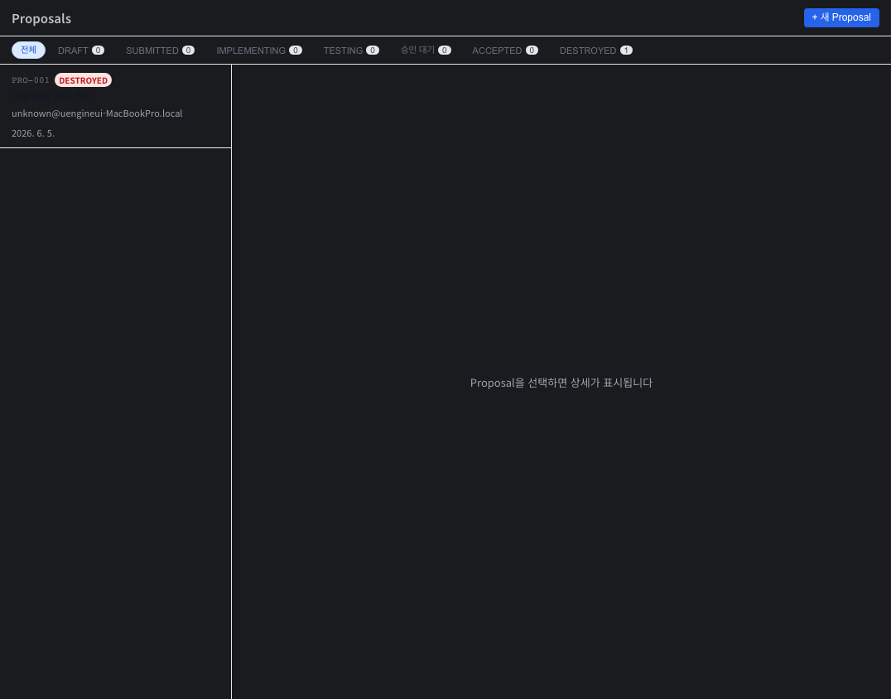
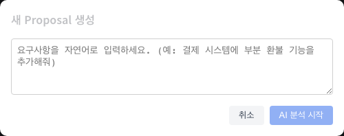
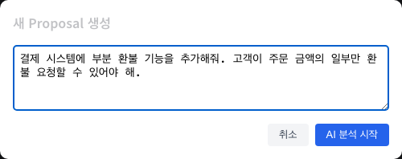
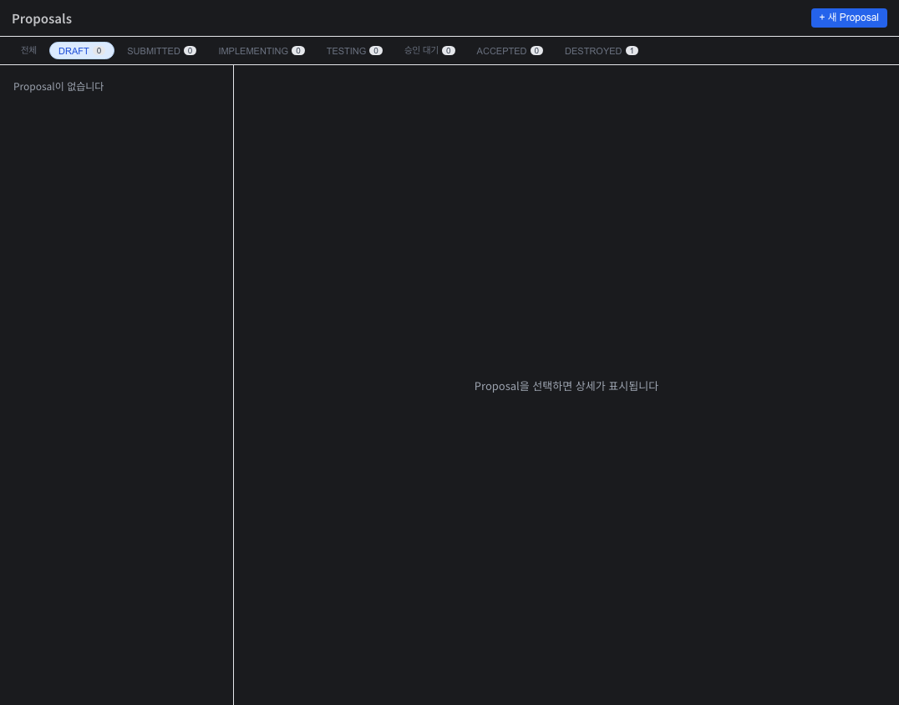

# Proposal Lifecycle 사용 가이드

**기능**: Proposal 기반 요구사항 생애주기 관리 (039)
**버전**: v1.0 | **작성일**: 2026-06-05

---

## 개요

Proposal은 자연어 한 줄로 시작하는 **"평행 우주 실험 단위"**입니다. AI가 요구사항을 분석하여 전략적(Epic·Feature·UserStory)·전술적(Aggregate·Command·Event·VO) 변경안을 자동으로 생성하고, 격리된 Git Worktree 샌드박스에서 구현을 검증한 뒤, PO가 Accept 또는 Destroy를 결정합니다. Accept가 확정되는 순간까지 메인 시스템에는 아무 영향을 주지 않습니다.

---

## 시작하기 전에

- Robo Architect 애플리케이션에 접속합니다.
- 왼쪽 탐색 패널에 도메인 데이터(Bounded Context, UserStory, Aggregate 등)가 로드되어 있어야 합니다.
- AI 분석 기능은 서버의 LLM 설정이 완료된 환경에서 동작합니다.

---

## 주요 기능

### 1. Proposals 탭 진입

상단 탭바에서 **Proposals**를 클릭하면 Proposals 관리 화면으로 이동합니다.

{ width=100% }

화면 왼쪽에는 전체 도메인 트리(Bounded Context 목록)가 표시되고, 오른쪽 메인 영역에 Proposals 패널이 나타납니다. 상단 탭바에서 Proposals가 활성화(파란색)된 것을 확인할 수 있습니다.

---

### 2. Proposal 목록 및 상태 필터

Proposals 패널에는 모든 Proposal이 목록으로 표시되며, 상단 필터 탭에서 상태별로 조회할 수 있습니다.

{ width=100% }

**상태 필터 탭 설명:**

| 필터 | 설명 |
|------|------|
| **전체** | 모든 상태의 Proposal 표시 |
| **DRAFT** | AI 분석 중 또는 검토 대기 중 |
| **SUBMITTED** | 검토 완료, 샌드박스 구현 대기 |
| **IMPLEMENTING** | Git Worktree에서 구현 진행 중 |
| **TESTING** | 자동 테스트 실행 중 |
| **승인 대기** | PO의 최종 Accept/Destroy 결정 대기 |
| **ACCEPTED** | Dual Merge 완료, 메인 브랜치에 반영됨 |
| **DESTROYED** | PO가 폐기, 이력은 영구 보관 |

목록에서 Proposal을 클릭하면 오른쪽 상세 패널에 해당 내용이 표시됩니다.

---

### 3. 새 Proposal 생성 — 자연어 입력

오른쪽 상단의 **+ 새 Proposal** 버튼을 클릭하면 생성 다이얼로그가 열립니다.

{ width=100% }

요구사항을 자연어로 자유롭게 입력합니다. 기술적인 용어나 형식에 구애받지 않고 원하는 내용을 설명하면 됩니다.

---

### 4. 요구사항 입력 후 AI 분석 시작

자연어 문장을 입력하고 **AI 분석 시작** 버튼을 클릭합니다.

{ width=100% }

**AI 분석 시작**을 누르면:
1. Proposal이 `DRAFT` 상태로 생성됩니다.
2. AI가 인텐트 분해를 시작합니다 — 전략적 변경안(Epic·Feature·UserStory)과 전술적 변경안(Aggregate·Command·Event·VO)을 구분하여 분석합니다.
3. 요구사항이 모호한 경우 AI가 최대 5개의 명확화 질문을 순차적으로 제시합니다.
4. 분석이 완료되면 Proposal 상세 화면의 **Strategic + Tactical Diff** 탭에 결과가 표시됩니다.

---

### 5. 상태별 필터링

상태 필터 탭을 클릭하면 해당 상태의 Proposal만 목록에 표시됩니다.

{ width=100% }

DRAFT 필터를 선택하면 현재 작성 중이거나 AI 분석이 완료되지 않은 Proposal만 표시됩니다. IMPLEMENTING 또는 TESTING 상태에서는 목록 항목에 실시간 진행률이 함께 표시됩니다.

---

### 6. Proposal 상세 화면 — Diff 검토 및 수정

목록에서 Proposal을 선택하면 오른쪽에 상세 화면이 열립니다. 상세 화면은 여러 탭으로 구성됩니다.

#### Strategic + Tactical Diff 탭

AI가 분석한 변경 계획을 확인합니다.

- **Strategic Diff**: Epic·Feature·UserStory 수준의 변경안이 `CREATE`/`MODIFY`/`DELETE` 연산으로 표시됩니다.
- **Tactical Diff**: Aggregate·Command·Event·VO 수준의 세부 변경안이 SemanticDiff 형식으로 표시됩니다.

수정이 필요한 경우 **Diff 직접 수정** 버튼을 클릭하여 JSON 형식으로 편집할 수 있습니다.

#### Impact Map 탭

그래프 DB에서 탐색된 영향 노드 목록이 충돌 가능성과 함께 표시됩니다.

- **HIGH** (빨강): 직접 수정이 필요한 핵심 노드
- **MEDIUM** (노랑): 플로우 변경이 필요한 연관 노드
- **LOW** (초록): 경계 범위만 영향받는 노드

---

### 7. Proposal 제출 — 구현 단계로 이동

AI가 생성한 Diff를 검토하고 이상이 없으면 하단의 **Proposal 제출 (SUBMIT)** 버튼을 클릭합니다.

- DRAFT → SUBMITTED 상태로 전환됩니다.
- Strategic Diff 또는 Tactical Diff가 비어 있으면 제출할 수 없습니다.
- 동일한 도메인 노드를 수정 중인 다른 Proposal이 구현 단계에 있으면 충돌 경고가 표시됩니다.

---

### 8. 샌드박스 구현 — Git Worktree 격리 환경

SUBMITTED 상태에서 **구현 시작** 버튼을 클릭하면 격리된 Git Worktree가 생성됩니다.

**샌드박스 구현 진행 탭**에서 확인할 수 있는 정보:
- 생성된 브랜치명 (`proposal/PRO-NNN`)과 Worktree 경로
- 태스크별 진행 상태 (대기 ○ / 진행 중 ◎ / 완료 ✓ / 실패 ✗)
- Claude Code의 실시간 출력 로그

구현 완료 후 자동으로 자동 테스트가 시작되어 TESTING 상태로 전환됩니다.

> **메인 브랜치는 절대 건드리지 않습니다.** 모든 코드 변경은 격리 브랜치에서만 이루어집니다.

---

### 9. 자동 테스트 결과 확인

구현이 완료되면 그래프 DB에 저장된 UserStory의 인수 조건(GWT)을 기반으로 자동 테스트가 실행됩니다.

**자동 테스트 탭**에서 확인할 수 있는 정보:
- 전체/통과/실패/스킵 시나리오 수 및 통과율
- 시나리오별 PASS / FAIL / SKIPPED 결과
- 실패 시 구체적인 실패 사유

---

### 10. PO 최종 결정 — Accept 또는 Destroy

테스트 결과를 확인한 후 PO가 최종 결정을 내립니다.

#### Accept (Dual Merge)

**Accept** 버튼을 클릭하면 두 가지 작업이 단일 트랜잭션으로 처리됩니다.

1. 샌드박스 브랜치의 코드가 메인 브랜치에 머지됩니다.
2. 그래프 DB의 관련 노드 속성이 Proposal의 After 값으로 업데이트됩니다.

> 테스트 실패 항목이 있는 경우 리스크 경고가 표시되며, 확인 체크박스를 클릭해야 Accept를 진행할 수 있습니다.

> 자기 승인 방지: Proposal 생성자와 Accept 처리자는 다른 사용자여야 합니다.

#### Destroy (폐기)

**Destroy** 버튼을 클릭하면 폐기 사유를 입력하는 다이얼로그가 열립니다. 폐기된 Proposal의 Diff 이력은 영구 보관되어 언제든 조회할 수 있습니다. Git Worktree와 브랜치는 자동으로 정리됩니다.

#### Dual Merge 실패 시 재시도

Dual Merge 실패(MERGE_FAILED) 상태에서는 **Dual Merge 재시도** 버튼이 표시됩니다. 실패 단계(코드 머지 / 그래프 DB 업데이트)와 원인이 함께 표시되어 문제를 파악할 수 있습니다.

---

## 자주 묻는 질문

**Q. Proposal 생성 후 AI 분석이 시작되지 않으면 어떻게 하나요?**
서버의 `CLAUDE_CODE_PATH` 환경변수가 올바른 claude CLI 경로를 가리키는지 확인하세요. Proposals 탭에서 생성된 Proposal을 클릭하고 Intent 스트림 SSE 엔드포인트를 직접 확인할 수 있습니다.

**Q. Git Worktree 생성에 실패하면 어떻게 되나요?**
디스크 공간 부족(100MB 미만)이거나 고아 Worktree가 남아 있는 경우 실패합니다. 서버를 재시작하면 `git worktree prune`이 자동으로 실행되어 고아 Worktree가 정리됩니다.

**Q. 두 팀원이 동일한 Aggregate를 수정하는 Proposal을 동시에 SUBMIT하려 하면?**
충돌 경고 메시지가 표시되며, 현재 IMPLEMENTING 중인 Proposal의 ID가 함께 안내됩니다. 먼저 진행 중인 Proposal의 결과를 확인한 후 제출하세요.

**Q. ACCEPTED된 Proposal을 취소할 수 있나요?**
ACCEPTED 상태의 Proposal은 수정하거나 삭제할 수 없습니다 (코드와 스펙의 Single Source of Truth 보장). 수정이 필요한 경우 새 Proposal을 생성하여 추가 변경안을 적용하세요.

---

## 향후 지원 예정

현재 v1에서는 아래 기능이 완전 지원되지 않거나 부분 지원됩니다.

- **명확화 질문 UI**: AI의 명확화 질문이 발생하는 경우 ProposalCreate 다이얼로그에서 선택형 답변으로 처리됩니다 (v1에서 검증 완료).
- **실제 코드 구현 태스크 스트리밍**: `robo-proposal-implement` 스킬 연동 시 실시간 스트리밍됩니다 (Claude Code CLI 환경 필요).
- **자동 테스트 LLM 판정**: GWT 기반 자동 테스트는 `robo-proposal-test` 스킬(LLM-as-judge)을 통해 동작합니다.
- **PRD 문서 자동 갱신**: Accept 후 `specs/proposal-changes.md`에 이력이 추가됩니다 (v1 수준; v2에서 도메인 용어집·컨텍스트 맵 전체 갱신 예정).

---

## 기술 검증 요약 (개발팀 참고)

| 검증 항목 | 결과 | 증거 |
|-----------|------|------|
| Proposals 탭 UI 진입 | PASS | `screenshots/01_proposals_tab_initial.png` |
| Proposals 목록 패널 렌더링 | PASS | `screenshots/02_proposals_panel.png` |
| 새 Proposal 생성 다이얼로그 | PASS | `screenshots/03_proposal_create_dialog.png` |
| 자연어 입력 폼 동작 | PASS | `screenshots/04_proposal_input_filled.png` |
| 상태 필터 탭 동작 | PASS | `screenshots/05_proposals_status_filter.png` |
| POST /api/proposals/ — Proposal 생성 (PRO-001, DRAFT) | PASS | `screenshots/06_api_create_proposal.txt` |
| GET /api/proposals/ — 목록 조회 | PASS | `screenshots/07_api_list_proposals.txt` |
| GET /api/proposals/{id} — 상세 조회 | PASS | `screenshots/08_api_get_proposal.txt` |
| PUT /api/proposals/{id}/diff — Diff 수정 | PASS | `screenshots/09_api_update_diff.txt` |
| POST /api/proposals/{id}/submit — DRAFT → SUBMITTED | PASS | `screenshots/10_api_submit_proposal.txt` |
| GET /api/proposals/?status=SUBMITTED — 상태 필터 | PASS | `screenshots/11_api_filter_submitted.txt` |
| POST /api/proposals/{id}/destroy — DESTROYED 상태 전환 | PASS | `screenshots/12_api_destroy_proposal.txt` |
| OpenAPI /api/proposals/ 경로 등록 | PASS | `artifacts/openapi.json` |
