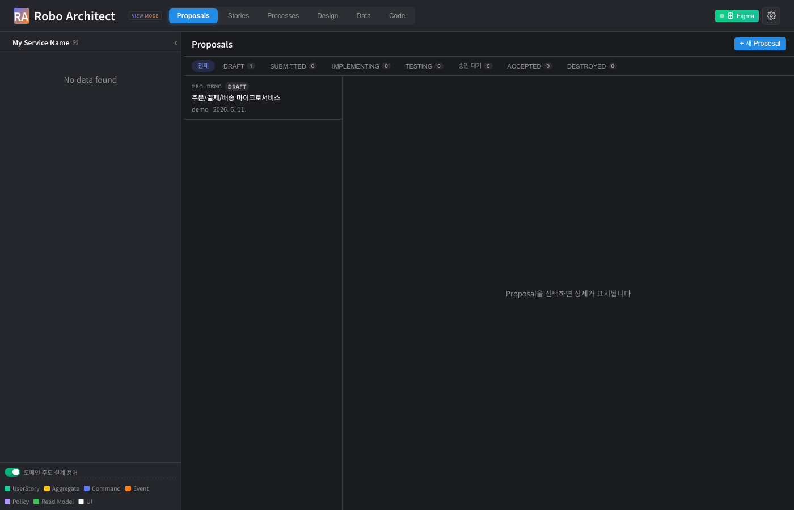
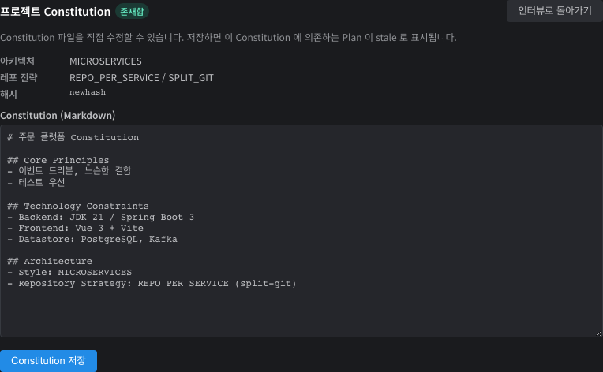
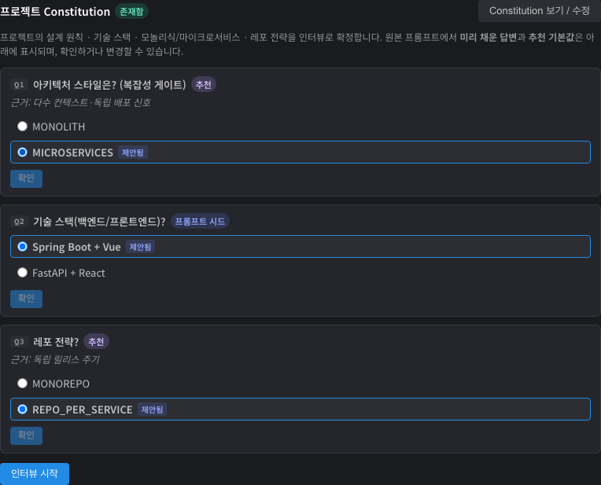
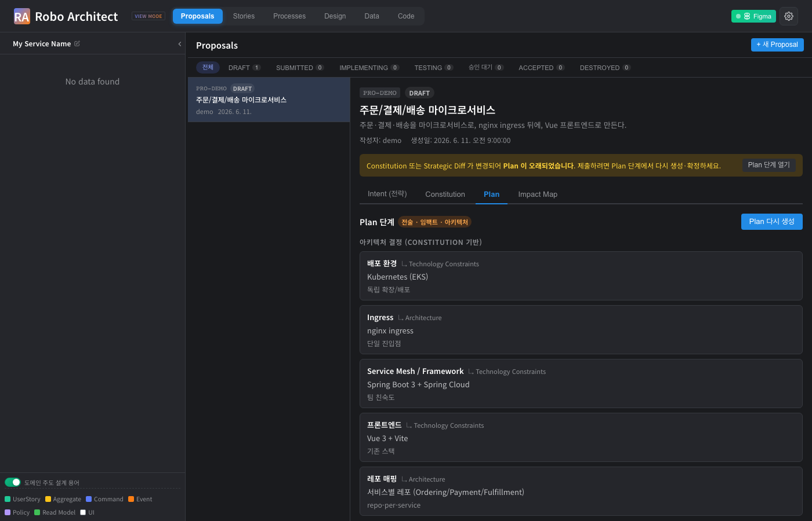
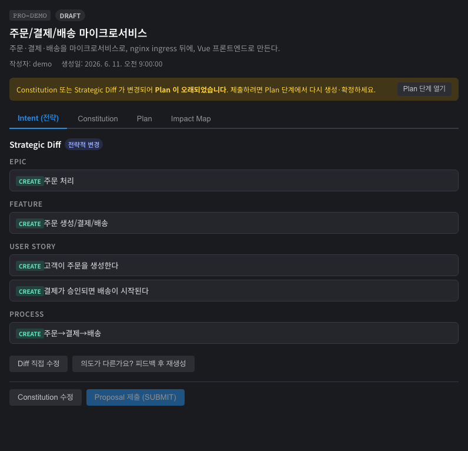

# Constitution 기반 Plan 단계 사용 가이드

## 개요

요구사항(Proposal)을 구현으로 옮기기 전에, 프로젝트의 **설계 원칙·기술 스택·아키텍처 스타일·레포 전략**을 한 번 정해 두고(= **Constitution / 헌장**), 그 결정에 맞춰 **구현계획(Plan)** 을 세우는 단계가 추가되었습니다.

> **중요(2026-06-11 개정)**: **헌장은 그래프(Neo4j)에 저장**되며, **프로젝트 전체 헌장 + 각 Bounded Context 별 헌장(오버라이드)** 의 2계층입니다. 헌장의 **보기/수정은 Design 탭의 "헌장(📜)" 아이콘**에서 합니다(프로젝트 루트 + 각 BC). **Proposals 탭에는 헌장 편집 화면이 없고**, 헌장이 아직 없을 때 Plan 단계에서 **인터뷰만 1회** 진행해 프로젝트 헌장을 만듭니다. 프로포절마다 헌장이 따로 만들어지지 않습니다.

## 시작하기 전에

- 상단 **Proposals** 탭에서 작업합니다.
- 요구사항을 자연어로 입력할 때, 기술 선호(예: "마이크로서비스", "nginx ingress", "Vue")를 함께 적어 두면 Constitution 인터뷰에 **미리 채워진 제안**으로 나타납니다.

## 주요 기능

### 1. Proposal 목록에서 시작하기

Proposals 탭에 들어가면 제안 목록이 보입니다. 항목을 클릭하면 오른쪽에 상세가 열리고, 단계 탭(Intent · Constitution · Plan · Impact Map)으로 진행할 수 있습니다.

{ width=100% }

### 2. Intent — "무엇을" 만들지 (전략만)

Intent 단계는 요구사항을 **Strategic Diff**(Epic · Feature · UserStory · Process)로만 분해합니다. 전술(Aggregate·Command·Event)이나 아키텍처는 여기서 다루지 않으므로, 먼저 "무엇을 만들지"를 차분히 검토·수정할 수 있습니다.

{ width=100% }

### 3. 헌장 보기 / 수정 — Design 탭에서 (프로젝트 + 각 BC)

프로젝트의 엔지니어링 결정을 담은 헌장은 **Design 탭**에서 관리합니다. 캔버스 툴바의 **📜 헌장** 버튼은 **프로젝트 전체 헌장**을, 각 Bounded Context 노드 헤더의 **📜** 버튼은 **그 BC의 헌장(오버라이드)** 을 엽니다. BC 헌장 화면에서는 프로젝트 헌장과 합쳐진 **유효(effective) 헌장**도 함께 보여주고, 오버라이드를 제거할 수 있습니다. 아키텍트는 언제든 수정할 수 있고, 저장하면 이 헌장에 의존하는 Plan 이 "오래됨"으로 표시됩니다. 헌장은 **그래프(Neo4j)** 에 저장됩니다(레포 파일 아님).

아래는 헌장 편집 화면의 필드 예시(아키텍처 스타일·레포 전략·해시 + 본문)입니다.

{ width=100% }

### 4. 헌장 인터뷰 — 없을 때 Plan 단계에서 1회 (시드 · 추천 · 최소 질문)

프로젝트 헌장이 아직 없는 상태에서 Plan 을 실행하면, **Plan 화면 안에서 인터뷰가 1회** 열립니다(별도 탭 없음). 인터뷰는 **꼭 필요한 질문만** 던집니다.

- **프롬프트 시드**: 요구사항에 이미 드러난 기술 선호(예: 기술 스택)는 미리 채워진 제안으로 표시됩니다.
- **추천**: 정해지지 않은 항목은 프로젝트 의도에 맞는 기본값을 근거와 함께 추천합니다.
- **의존성 인지 최소 질문**: 위 질문(아키텍처 스타일)에서 **마이크로서비스**를 고르면 레포 전략 같은 후속 질문이 이어지고, **모놀리식**을 고르면 게이트웨이·메시 같은 질문은 아예 나오지 않습니다.

아래 예시는 아키텍처 스타일(추천: MICROSERVICES), 기술 스택(프롬프트 시드: Spring Boot + Vue), 레포 전략(추천: REPO_PER_SERVICE)을 한 화면에서 확인·선택하는 모습입니다.

{ width=100% }

### 5. Plan — "어떻게" 만들지 (아키텍처 · 연동 · 개발환경)

Plan 단계는 승인된 전략과 헌장을 바탕으로 구현계획을 세웁니다.

- **아키텍처 결정(Constitution 기반)**: 배포 환경, Ingress, Service Mesh/프레임워크, 프론트엔드, 레포 매핑 — 각 결정은 근거가 된 헌장 섹션으로 연결됩니다.
- **Constitution 공백**: 헌장이 정하지 않은 필수 항목은 임의로 채우지 않고 "공백"으로 표시해, 직접 결정하거나 헌장을 보완하도록 안내합니다.
- **컨텍스트 간 연동 · 메시징**: 서비스가 여러 개면 컨텍스트 간 상호작용을 Event(pub/sub)·Command·Query 로 분류하고, 메시징 채널(예: Kafka)을 정합니다. 기본은 이벤트 드리븐 pub/sub 입니다.
- **서비스별 개발 환경**: 각 서비스의 Docker 기반 개발 환경과 범위 제한 의존(예: kafka, postgres)을 정의해, 나중에 멀티레포로 나눌 때 각 개발자가 자기 서비스 것만 가져가도록 준비합니다.

검토 후 **Plan 확정**을 누르면 계획이 저장됩니다.

{ width=100% }

### 6. 제출 게이트 — 계획이 최신일 때만 제출

헌장을 수정하거나 전략(Intent)을 다시 분해하면, 기존 계획이 **"오래됨"** 으로 표시되고 제출이 잠깁니다. 노란 배너의 **Plan 단계 열기**로 다시 계획을 세워 확정하면 제출이 열립니다. 이렇게 계획·헌장·모델이 서로 어긋난 채 제출되는 일을 막습니다.

{ width=100% }

## 자주 묻는 질문

- **헌장은 어디에 저장되나요?** 그래프(Neo4j)에 저장됩니다 — 프로젝트 루트 헌장 1개 + 각 BC 오버라이드. 레포 파일이나 프로포절 사본이 아닙니다. 보기/수정은 Design 탭의 📜 헌장 아이콘에서 합니다.
- **모놀리식이면 질문이 줄어드나요?** 네. 아키텍처 스타일에서 모놀리식을 고르면 게이트웨이·서비스 메시·서비스별 개발환경 등 마이크로서비스 전용 질문이 모두 생략됩니다.
- **왜 제출 버튼이 비활성화되나요?** 확정된 최신 Plan 이 없을 때(미작성 또는 "오래됨")는 제출이 잠깁니다. Plan 단계에서 다시 생성·확정하세요.

## 향후 지원 예정

- 인터뷰 답변을 백엔드 스킬이 실시간으로 이어받아 다음 질문을 동적으로 생성하는 라이브 스트리밍 데모(본 매뉴얼 화면은 결정적 캡처를 위해 응답을 모킹).
- 작업 분해(tasks) 화면에서 Constitution 충돌 항목 하이라이트.

## 기술 검증 요약 (개발팀 참고)

| 검증 항목 | 결과 | 증거 |
|-----------|------|------|
| Constitution/Plan API 6종 마운트 | PASS | screenshots/07_backend_endpoints.txt |
| Plan 완전성(모놀리식 5항목 / 마이크로서비스 +연동·채널·환경) | PASS | screenshots/08_backend_tests.txt |
| Plan staleness(헌장 해시·전략 버전 변경 시) | PASS | screenshots/08_backend_tests.txt |
| 인터뷰 시드·추천·최소 질문 UI | PASS | screenshots/04_constitution_interview.png |
| Plan UI(아키텍처·공백·연동·개발환경) | PASS | screenshots/05_plan_architecture.png |
| 제출 게이트·오래됨 배너 | PASS | screenshots/06_submit_gate_stale.png |

> 화면 캡처는 프론트엔드를 실제로 구동하고 백엔드 응답을 모킹한 Playwright 헤드리스 실행으로 생성했습니다. 재생성: `scripts/e2e_capture.sh`.
