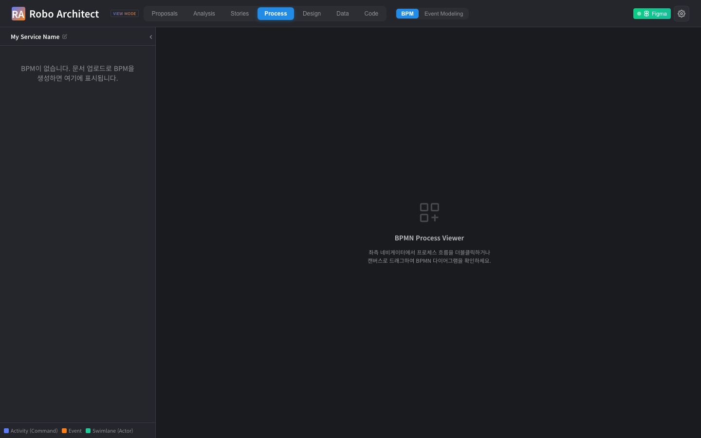
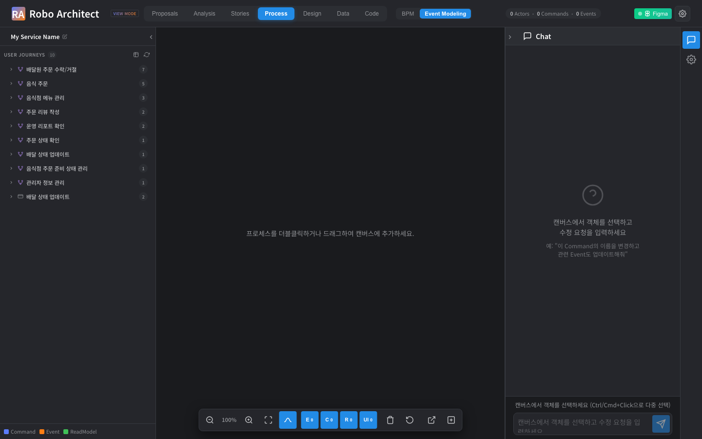
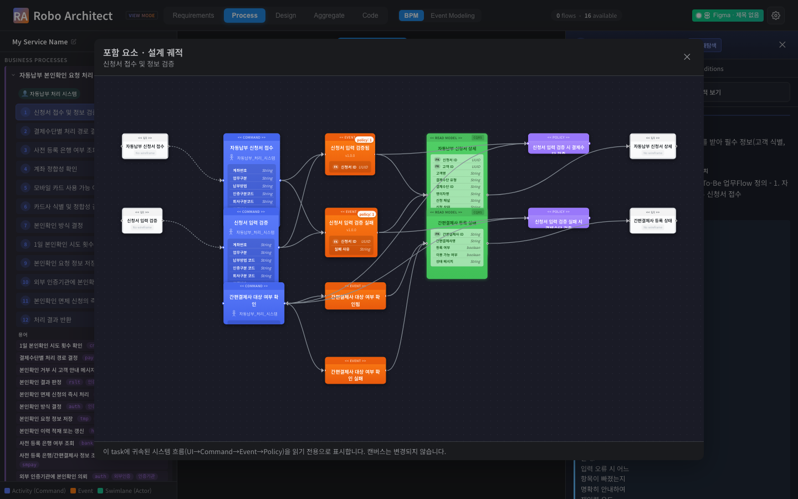
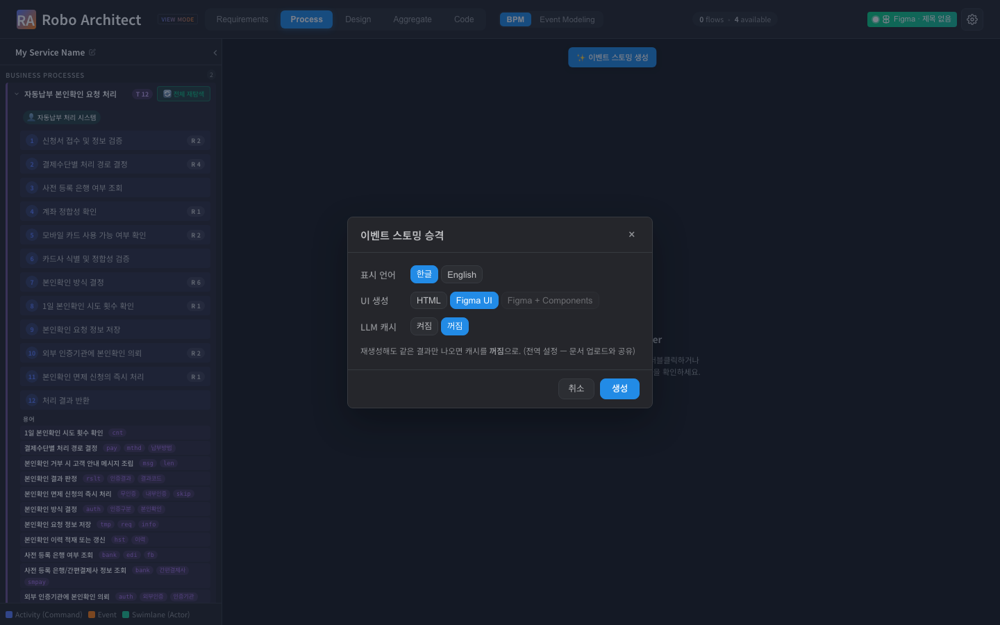

# task=UI 통합 — 사용 매뉴얼 (spec 043)

BPM과 Event Modeling을 **UI를 공유 앵커**로 일관화한다. 검증 완료(라이브 재인제스천).

## 1. 무엇이 바뀌었나

- **단일 Process 탭** — 분리됐던 'Process'·'Event Modeling' 탭이 하나로 합쳐지고, 상단바 **[BPM] / [Event Modeling]** 서브토글로 전환한다.
- **task=UI (인제스천)** — ES 승격 시 화면을 사람-스텝 기준으로 생성한다:
  - 사람이 조작하는 **Command마다 액션 화면**(task당 1~N개 — 한 화면 강제 아님)
  - 사용자가 보는 **ReadModel마다 결과 화면**(조회/검색 + 처리 결과 화면)
  - 시스템 전용 Command/ReadModel은 화면 없음
- **Event Modeling 형식 뷰** — task 포함요소를 **가로 레인** `UI(액션)→Command→Event→ReadModel→UI(결과)` 로 표시.

## 2. 단일 Process 탭 + 토글 (US1)

`Process` 탭 상단바에 **[BPM] / [Event Modeling]** 서브토글이 있다(독립 'Event Modeling' 탭은 제거). 서브토글은 `activeTab`을 `Process`(BPM)⇄`Event Modeling`로 바꾸므로 — **네비게이터·캔버스·상단바 상태·ES 생성 버튼** 등 activeTab 기준 동작이 **모두 함께 전환**된다(App/TopBar 레벨 처리).




## 3. task=UI 인제스천 (US2/US3) — ✅ 검증됨

[ui_wireframes.py](../../api/features/ingestion/workflow/phases/ui_wireframes.py) + [task_ui_helpers.py](../../api/features/ingestion/workflow/phases/task_ui_helpers.py)(신규). **하이브리드 인제스천 한정**(일반 워크플로우는 기존 동작, 가드).

- **액션 화면(Command)**: policy-invoked(=시스템) Command를 제외한 **사람-조작 Command마다 UI 1개**. 한 task에 사람 스텝이 여럿이면 화면도 여럿(1~N).
- **결과 화면(ReadModel)**: `classify_readmodel`이 **screen / inline / system** 3분류 —
  - `screen`(조회·검색 **또는 처리 결과 화면**) → **자체 결과 UI 생성**
  - `inline`(다른 화면에 데이터로만 박힘) → 소비 화면에 `ATTACHED_TO {role:'display'}`로 부착
  - `system`(내부 전용) → 화면 없음
  - 불확실하면 보수적으로 `screen`(사용자가 보는 결과 누락 방지)
- **A2A BPM·Command/Event의 task 귀속 불변.** **신규 Neo4j 영속 라벨/관계 0**(`ATTACHED_TO.role` 속성만).

### Before → After (baseline.json → after3.json)

| 측정 | baseline | 재인제스천 후 |
|---|---|---|
| task당 UI 분포 | `{0:1, 1:17, 2:1}` | `{0:3, 1:12, 2:4}` (1~N) |
| UI 총 | 22 | 30 (액션 19 + 결과 11) |
| ReadModel 자체 결과 UI | 0 | **11 / 11** |
| 042 신규 영속 라벨/관계 | — | **0** |

> ReadModel display 부착은 처음 `PROMOTED_TO`(후처리 훅=ui_wireframes 이후 생성) 경로라 단계 시점에 0건이었다 → `rm→CQRS→Event←EMITS←Command←ATTACHED_TO←UI` 경로(CQRS=phase06, command-UI=phase11)로 수정해 in-phase 동작. 이번 run은 11개 모두 `screen`이라 결과 UI로 생성됨.

## 4. Event Modeling 형식 레인 (US4) — ✅ 검증됨

BPM task 더블클릭 → 인스펙터 **"포함 요소"** → 모달이 **가로 레인**으로 `UI(액션)→Command→Event→ReadModel→UI(결과)`를 보여준다. 결과 UI는 ReadModel 다음 **맨 오른쪽**에 배치. requirements 탭 설계-궤적(컬럼 그래프)은 불변.



> 백엔드 trace: `_expand_trace`에 ReadModel(`FEEDS`) + 결과 UI(`RESULT_UI`/`DISPLAYED_ON`, 응답 전용·비영속) 확장. task 포함 관계는 **시작점 UI(액션)에서 흐름**으로 결정되므로 결과 UI도 같은 task에 자연 포함.

## 5. ES 승격 모달 캐시 토글

재생성 시 **LLM 캐시가 켜져 있으면 동일 결과만** 나온다. ES 승격 모달([PromoteToEsModal.vue](../../frontend/src/features/canvas/ui/PromoteToEsModal.vue))에 **[켜짐]/[꺼짐]** 토글 추가(전역 `/api/ingest/cache/*`, 문서 업로드와 공유). 코드 변경 후 재생성 검증 시 **꺼짐**.



## 6. 검증 방법

```bash
# 단위·계약 테스트 (DB 불필요)
python -m pytest \
  api/features/ingestion/workflow/tests/test_task_ui_invariant.py \
  api/features/canvas_graph/tests/test_bpm_task_trace.py \
  api/features/requirements/tests/test_design_trace_refactor.py -q

# 재인제스천 정합 (캐시 OFF로 ES 재생성 후)
PYTHONPATH=. python specs/043-task-ui-unification/manual/check_task_ui.py > after.json
diff specs/043-task-ui-unification/manual/baseline.json after.json
#  → task당 UI 1~N, ReadModel ui_screen↑, labels/relationship_types 불변(신규 0)

# Playwright (탭 토글·EM 레인·캐시 토글)
cd specs/043-task-ui-unification/manual/artifacts
HYBRID_SESSION=<sid> npx playwright test --config playwright.config.ts
```

## 7. 요약

| 항목 | 상태 |
|---|---|
| 단일 Process 탭 + BPM⇄EM 토글(네비/캔버스 동반 전환) | ✅ 검증 |
| 액션 화면: 사람 Command마다 UI(task당 1~N) | ✅ 검증 |
| 결과 화면: 사용자 ReadModel마다 결과 UI(11/11) | ✅ 검증 |
| EM 레인: `UI→Command→Event→ReadModel→UI(결과)` | ✅ 검증 |
| ES 승격 모달 캐시 토글 | ✅ |
| 신규 Neo4j 영속 라벨/관계 | 0 (role 속성만) |
| A2A BPM / Command·Event task귀속 | 불변 |
