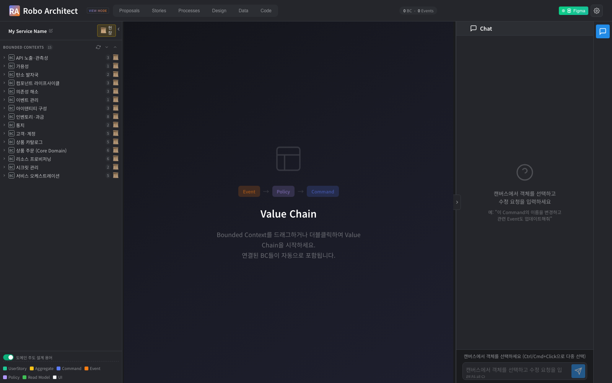
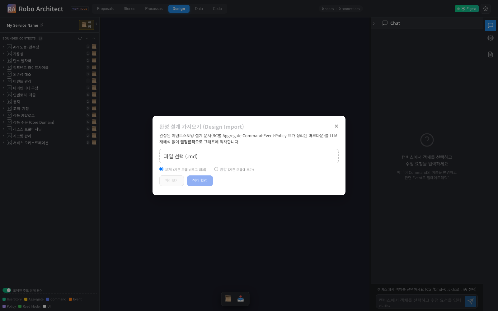
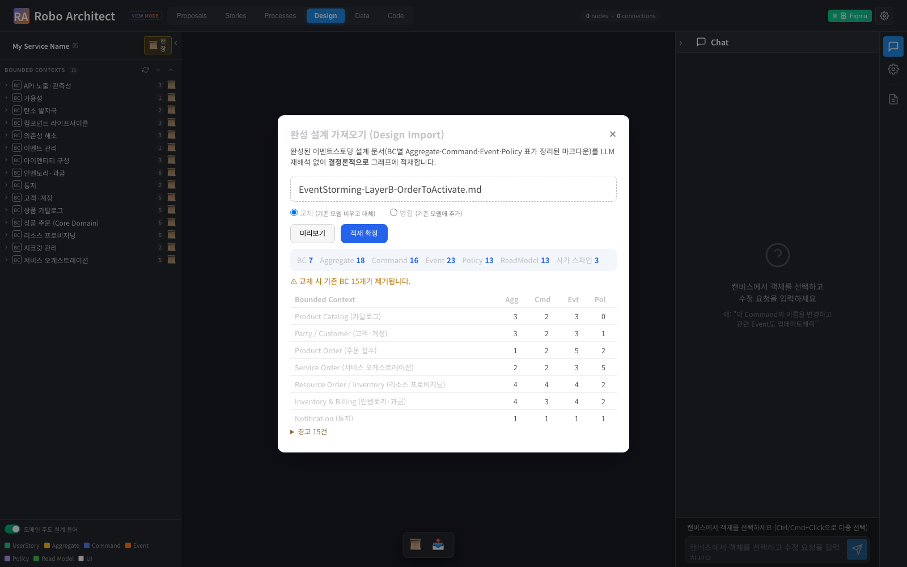
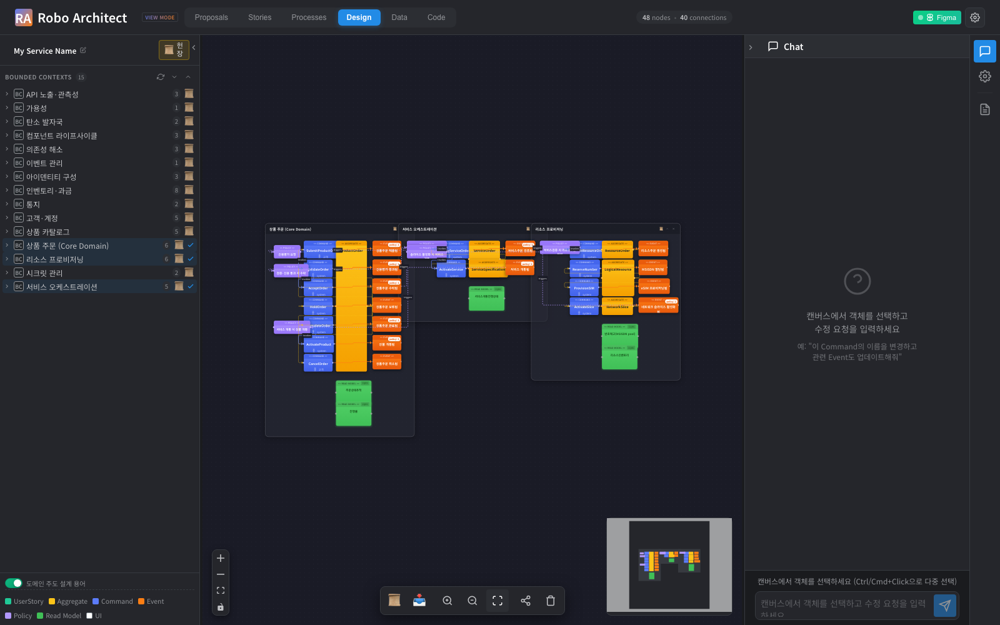

# 사용자 매뉴얼 — 완성 설계 Import (Design tab)

**기능**: 완성된 이벤트스토밍 설계 문서를 Design 탭에서 그래프로 가져오기
**대상**: 도메인 모델을 다루는 아키텍트 / 설계자
**버전**: 044-design-import (2026-06-29)

---

## 1. 이 기능이 하는 일

이미 **완성된 이벤트스토밍 설계 문서**(Bounded Context별로 Aggregate·Command·Event·Policy·ReadModel이 표로 정리된 마크다운 — 예: TM Forum **ODA 표준 컴포넌트 캔버스**)를 Design 탭에서 업로드하면, 시스템이 그 설계를 **LLM 재해석 없이 그대로** 도메인 모델 그래프에 적재하고 Design 탭에 바로 보여줍니다.

기존 Stories 탭의 "문서 업로드"는 자연어 요구사항을 AI가 **재분해**하는 방식이라, 이미 완성된 설계를 넣으면 모델이 만들어지지 않고 그래프 전체를 덮어씁니다. 본 기능은 그 빈틈을 메우는 **별도 진입점**으로, **충실도 보존**과 **Design 탭 직접 진입**이 핵심입니다.

> 적재된 결과 예시 — ODA 표준 컴포넌트 15개 Bounded Context가 Design 탭 좌측 목록에 들어온 모습:

---

## 2. 사용 방법 (단계별)

### 2-1. Design 탭 열고 Import 버튼 누르기

상단 **Design** 탭으로 이동한 뒤, 캔버스 좌상단 툴바의 **📥(완성 설계 가져오기)** 버튼을 누릅니다.

### 2-2. 문서 선택 + 모드 선택

- **파일 선택**: 완성 설계 마크다운(`.md`)을 고릅니다.
- **모드**:
  - **교체** — 기존 모델을 비우고 이 설계로 대체 (한 문서 = 활성 모델).
  - **병합** — 기존 모델 위에 이 설계를 추가.

### 2-3. 미리보기로 확인

**[미리보기]** 를 누르면, 적재될 **BC·Aggregate·Command·Event·Policy·ReadModel·사가 스파인** 개수와 BC별 요약, 그리고 **경고**(추정으로 연결한 부분 등)와 **교체 시 제거되는 기존 BC 수**가 표시됩니다. 그래프는 아직 바뀌지 않습니다.

위 예시(ODA Layer B 주문→개통 캔버스)는 **BC 7 · Aggregate 16 · Command 16 · Event 23 · Policy 13 · 사가 스파인 3** 으로 파싱되었고, "교체 시 기존 BC 15개 제거" 영향과 경고 15건이 함께 표시됩니다.

### 2-4. 적재 확정

미리보기가 의도와 맞으면 **[적재 확정]** 을 누릅니다. 모델이 그래프에 적재되고 Design 탭이 자동 새로고침되어 설계가 렌더링됩니다.

---

## 3. 결과 확인

좌측 **Bounded Contexts** 목록에서 가져온 BC를 더블클릭하면 해당 컨텍스트의 **Aggregate(🍐)·Command(🟦)·Event(🟧)·ReadModel(🟩)** 가 캔버스에 이벤트스토밍 형태로 펼쳐지고, 컨텍스트 간 **Policy 스파인**(이벤트→정책→명령)으로 연결됩니다.

---

## 4. 입력 문서 형식

다음 이벤트스토밍 캔버스 관례를 인식합니다(프로젝트 DDD 스킬·ODA 캔버스가 쓰는 범례):

| 표기 | 의미 | 그래프 결과 |
|---|---|---|
| 🍐 Aggregate | 애그리거트 | `BC -[:HAS_AGGREGATE]-> Aggregate` |
| 🟦 Command | 명령(+actor) | `Aggregate -[:HAS_COMMAND]-> Command` |
| 🟧 Event | 도메인 이벤트(과거형) | `Command -[:EMITS]-> Event` |
| 🟪 Policy | 반응 규칙 | `BC -[:HAS_POLICY]-> Policy` |
| 🟩 Read Model | 조회 모델 | `BC -[:HAS_READMODEL]-> ReadModel` |

- **BC 섹션** = 헤딩 바로 뒤에 오는 `| 종류 | 항목 |` 표.
- **컨텍스트 간 스파인** = 코드 블록의 `이벤트 ─P─▶ 명령` 라인 → `Event -[:TRIGGERS]-> Policy -[:INVOKES]-> Command`.

> 같은 문서를 두 번 가져오면 결과 그래프 구성이 **동일**합니다(결정론적). 형식이 일부 어긋나거나 매핑되지 않는 참조가 있어도 **가능한 부분은 적재**하고 나머지는 **경고**로 보여줍니다.

---

## 5. 주의 / 한계

- 본 기능은 **완성된 설계**(요소가 표로 정리된 문서)를 대상으로 합니다. 자유 산문 요구사항은 기존 **Stories 탭 문서 업로드(AI 분해)** 를 쓰세요.
- 원본 표에 **명령→이벤트** 짝이 명시되지 않은 BC는, 이벤트를 그 BC의 첫 명령에 일괄 연결하고 **경고**로 알립니다. 명시적 매핑이 있으면 충실도가 올라갑니다.
- **교체** 모드는 기존 이벤트스토밍 모델을 비웁니다. 누적하려면 **병합** 을 쓰세요.

---

## 부록 — 예시 입력 문서

- `/Users/uengine/oda-canvas/EventStorming-LayerB-OrderToActivate.md` (비즈니스 골든 컴포넌트: 카탈로그·고객·주문·서비스·리소스·과금·통지)
- `/Users/uengine/oda-canvas/EventStorming-LayerA-Canvas.md` (관리 평면: 컴포넌트 라이프사이클·API 노출·의존성·아이덴티티·시크릿 등)
