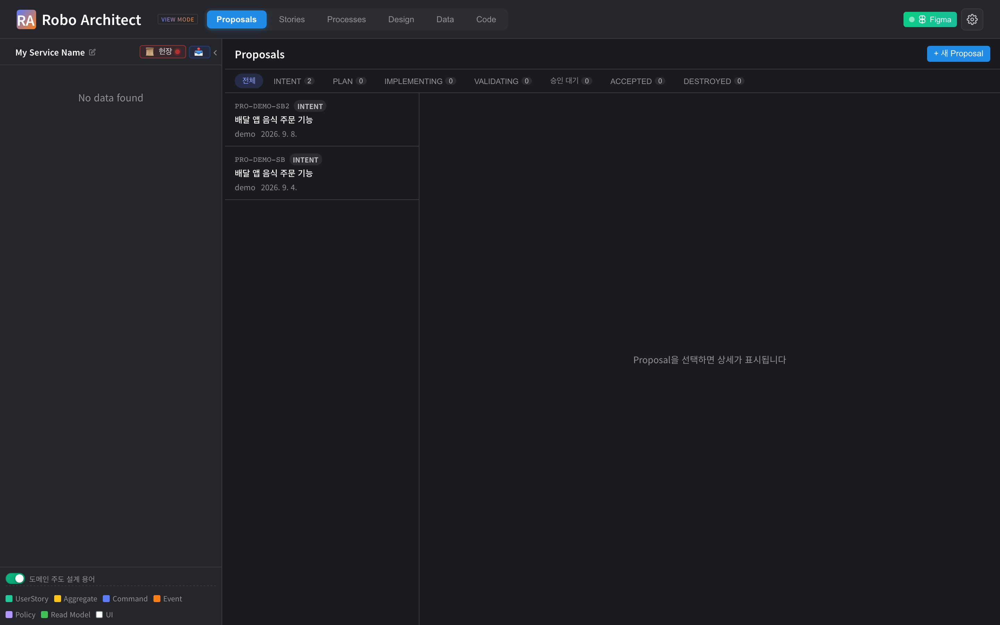
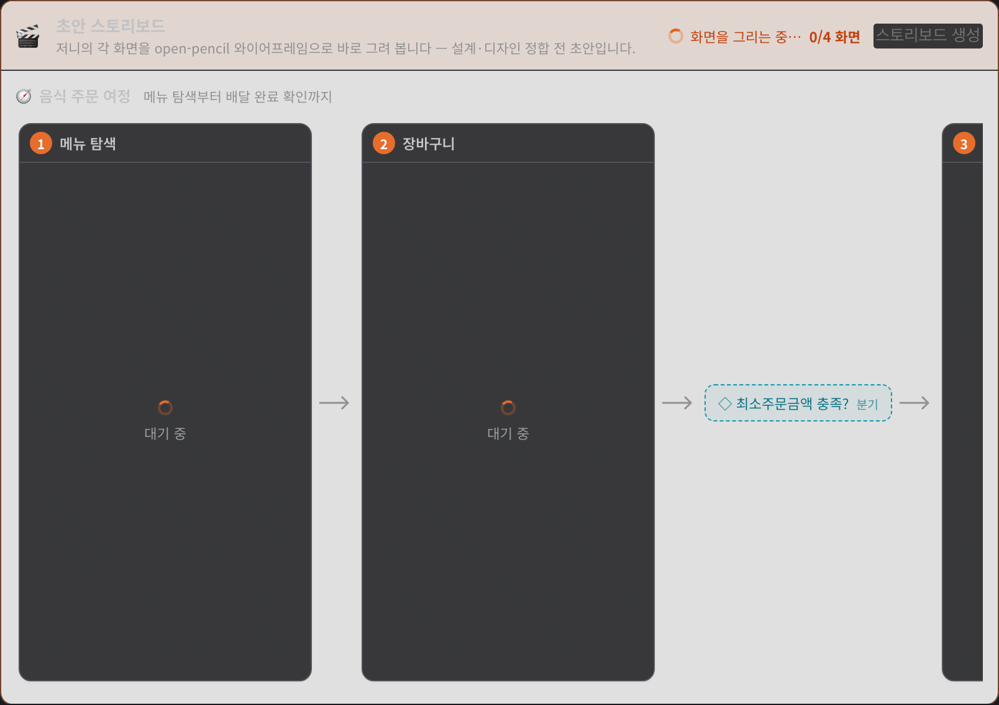
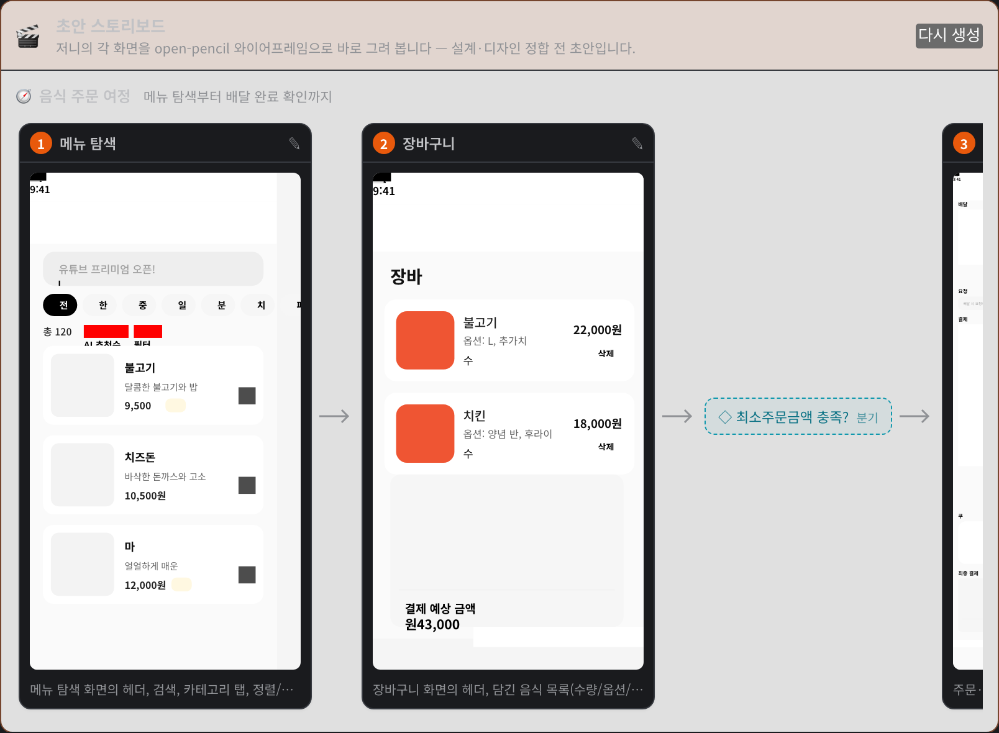
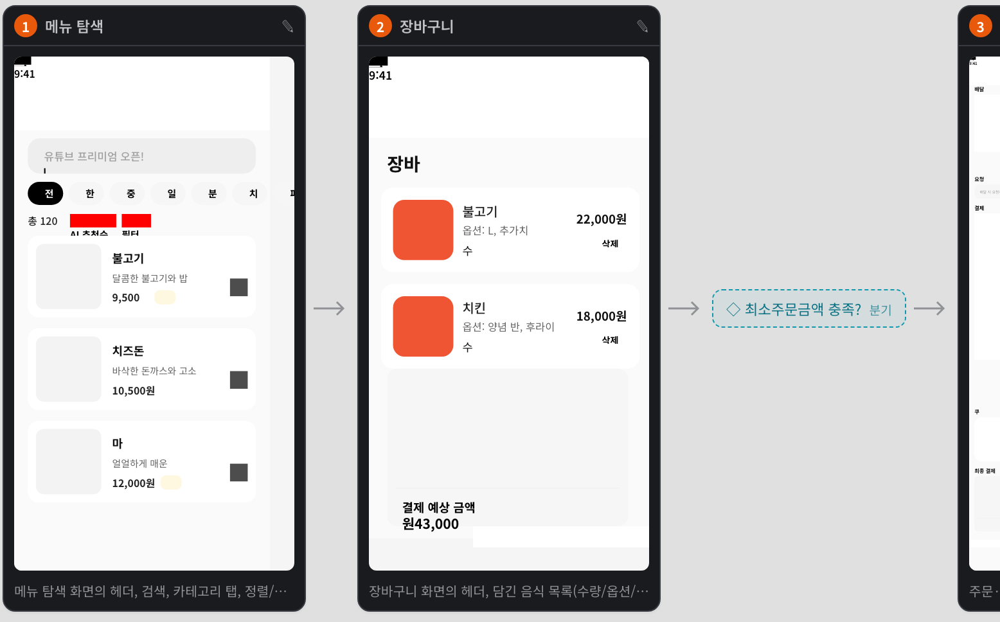
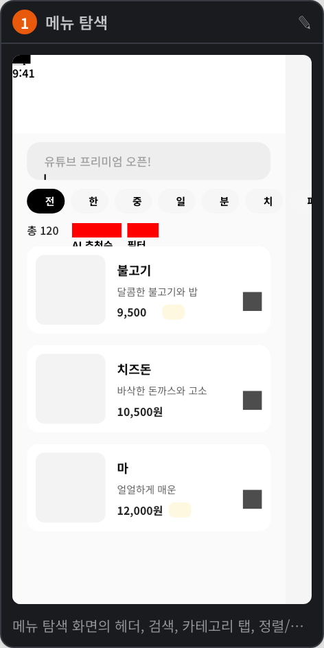
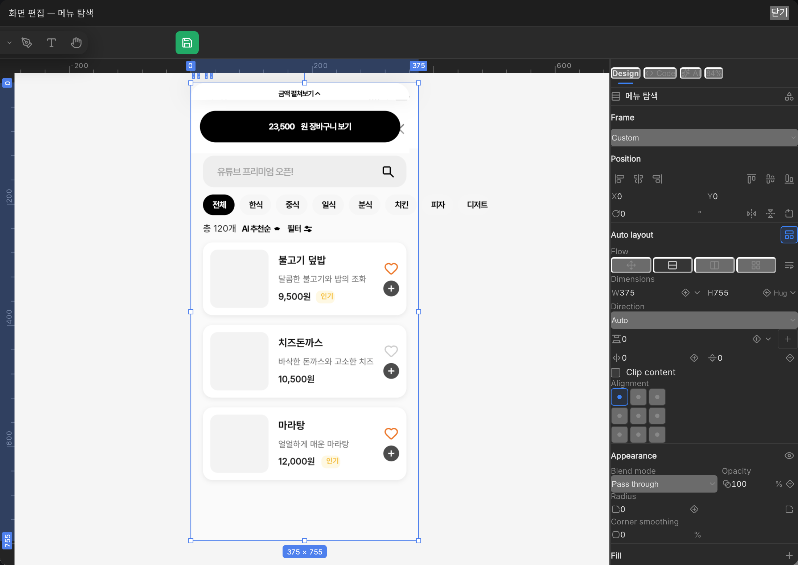

# 초안 스토리보드 사용 매뉴얼

**기능**: spec 056 — Proposal 초안 단계에서 유저 저니를 와이어프레임으로 바로 보기
**대상**: Proposal로 변경을 제안하고 검토하는 아키텍트·PO·기획자
**작성**: 2026-09-08 · 스크린샷은 `manual-assets/`의 실제 구동 인스턴스 캡처

---

## 무엇을 하는 기능인가

Proposal에 요구사항을 적으면 Intent 단계가 그것을 **Strategic Diff**(Epic·Feature·UserStory)와
**저니**(사용자 화면 흐름)로 분해합니다. 지금까지 그 저니는 스텝 이름의 나열이었습니다 —
"메뉴 탐색 → 장바구니 → 주문·결제 → 배달 현황". 화면이 실제로 어떻게 생겼는지는 설계(Aggregate·
Command·Event)와 디자인(Figma 바인딩)이 모두 끝난 다음에야 볼 수 있었습니다.

**초안 스토리보드**는 그 순서를 뒤집습니다. Intent 분해가 끝나는 즉시 저니의 각 화면을
open-pencil 와이어프레임으로 그려, Intent 탭 맨 위에 흐름 순서대로 늘어놓습니다.
이해관계자는 텍스트 다이어그램이 아니라 **화면**을 보고 초안을 판단합니다.

- 화면은 디자인 시스템 컴포넌트(버튼·헤더·카드 등)를 실제로 인스턴스로 배치해 그립니다.
- 마음에 들지 않으면 카드에서 바로 open-pencil 편집기를 열어 고칠 수 있습니다.
- 어디까지나 **초안**입니다. 이 단계에서 만든 화면은 설계를 확정하지 않으며, 나중에
  Design 탭에서 하는 정식 화면 작업을 대체하지 않습니다.

---

## 사전 준비

| 항목 | 확인 방법 |
|---|---|
| 백엔드 | `curl localhost:8000/api/health` → `{"status":"healthy","neo4j":"connected"}` |
| 컴포넌트 렌더 서비스 | `curl localhost:7610/health` → `{"status":"ok","components":N}` |
| LLM 설정 | `.env`의 `LLM_PROVIDER` / `LLM_MODEL` / API 키 |

렌더 서비스가 꺼져 있어도 스토리보드는 만들어집니다. 다만 디자인 시스템 컴포넌트 없이
기본 도형만으로 그려집니다. 실행 방법은 [quickstart.md](quickstart.md)를 참고하세요.

---

## 1. Proposal 열기

상단 **Proposals** 탭에서 검토할 Proposal을 고릅니다. 초안 스토리보드는 Intent 분해가 끝난
Proposal(상태 `INTENT`)에서 볼 수 있습니다.

---

## 2. 스토리보드가 만들어지는 동안

Proposal을 열면 **Intent (전략)** 탭 맨 위에 스토리보드 영역이 나타납니다. Intent 분해가 막
끝났다면 이미 생성이 시작된 상태입니다 — 별도로 버튼을 누를 필요가 없습니다.

- 오른쪽 위에 **화면을 그리는 중… `n/m 화면`** 진행률이 표시됩니다.
- 아직 안 그려진 화면은 **대기 중** 카드로 자리를 잡고 있다가, 끝나는 순서대로 채워집니다.
- 화면을 나갔다 돌아와도 진행 중이던 결과는 그대로 남아 있습니다 — 부분 결과가 저장됩니다.

> 화면 한 장에 30초~1분 정도 걸리고 두 장씩 동시에 그립니다. 한 저니가 아무리 길어도
> 화면 12개까지만 그립니다.

---

## 3. 완성된 스토리보드 읽기

- 카드는 저니의 **흐름 순서**대로 왼쪽에서 오른쪽으로 놓이고, 화살표로 이어집니다.
- 카드 번호(①②③)는 화면 순번입니다. 분기는 번호를 받지 않습니다.
- 카드 아래 회색 글씨는 그 화면을 무엇으로 구성했는지에 대한 한 줄 요약입니다.
- 저니가 여러 개면 저니마다 한 줄씩(🧭 저니 이름) 나뉘어 표시됩니다.

### 분기(gateway)는 마름모로

저니에 조건 분기가 있으면 화면 대신 **◇ 마름모 표기**로 흐름 안에 들어갑니다. 분기는 화면이
아니므로 그리지 않고, 마우스를 올리면 조건 문구를 볼 수 있습니다.

### 화면 카드 하나

카드 안의 그림은 그림 파일이 아니라 **실제 sceneGraph**입니다. 그래서 편집기로 열면 요소 하나
하나를 그대로 고칠 수 있습니다.

---

## 4. 화면 고치기

카드 오른쪽 위의 **✎** 를 누르면 open-pencil 편집기가 열립니다.

- 왼쪽 툴바에서 도구를 고르고, 캔버스에서 요소를 선택해 옮기거나 크기를 바꿉니다.
- 요소를 선택하면 오른쪽에 속성 패널(레이아웃·크기·정렬·색)이 열립니다.
- 초록색 **저장** 버튼을 누르면 그 스텝의 화면으로 반영되고 "저장됨" 표시가 잠깐 나타납니다.
- **닫기**로 모달을 닫습니다. 저장하지 않고 닫으면 편집은 버려집니다.

---

## 5. 다시 생성하기

요구사항이 바뀌어 Intent를 다시 돌렸다면 스토리보드도 자동으로 다시 만들어집니다.
수동으로 다시 그리려면 오른쪽 위의 **다시 생성**을 누릅니다 — 기존 화면은 버려지고 처음부터
다시 그립니다.

| 버튼 | 동작 |
|---|---|
| 스토리보드 생성 | 아직 만든 적이 없을 때. 저니(또는 UserStory)를 읽어 처음 생성 |
| 다시 생성 | 이미 있을 때. 전부 버리고 다시 그림 |

---

## 자주 겪는 상황

**"아직 저니나 유저스토리가 없어 스토리보드를 만들 수 없습니다"가 뜹니다**
Intent 분해가 끝나지 않았거나, 분해 결과에 저니와 UserStory가 모두 없는 경우입니다.
Intent가 끝나면 자동으로 생성됩니다.

**저니가 없는데 화면이 그려졌습니다**
저니가 없으면 UserStory 순서대로 흐름을 합성해 그립니다. 저니 이름은 "유저스토리 흐름"으로
표시됩니다.

**카드 하나만 "렌더 실패"로 남습니다**
화면 하나가 실패해도 나머지는 그대로 진행됩니다. 실패한 카드에 마우스를 올리면 사유가
보입니다. **다시 생성**으로 전체를 다시 시도하거나, 그대로 두고 검토를 이어가도 됩니다.

**화면에 디자인 시스템 컴포넌트가 안 보입니다**
컴포넌트 렌더 서비스(7610)가 꺼져 있으면 기본 도형으로만 그립니다.
`curl localhost:7610/health`로 확인하세요.

**목록이 느려졌습니다**
스토리보드의 화면 데이터는 목록·상세 응답에 실리지 않습니다(별도 조회). 느려졌다면 다른
원인입니다.

---

## 이 기능이 건드리지 않는 것

- **설계를 확정하지 않습니다.** 스토리보드는 Proposal에 붙는 초안이며, Aggregate·Command·Event
  같은 설계 요소를 만들거나 바꾸지 않습니다.
- **Design 탭의 화면을 대체하지 않습니다.** Proposal이 승인돼 그래프에 반영된 뒤, UI 노드에
  붙는 정식 화면은 Design 탭에서 따로 만듭니다.
- **신규 그래프 노드를 만들지 않습니다.** 스토리보드는 `Proposal` 노드의 속성 하나입니다.
  Proposal을 지우면 함께 사라집니다.

---

## 참고

- 기능 명세: [spec.md](spec.md)
- 설계와 결정: [plan.md](plan.md)
- 이식 과정의 함정: [implementation-notes.md](implementation-notes.md)
- 개발 런북: [quickstart.md](quickstart.md)
- 시연 영상: `frontend/tests/.artifacts/storyboard/proposal-storyboard-demo.webm`
