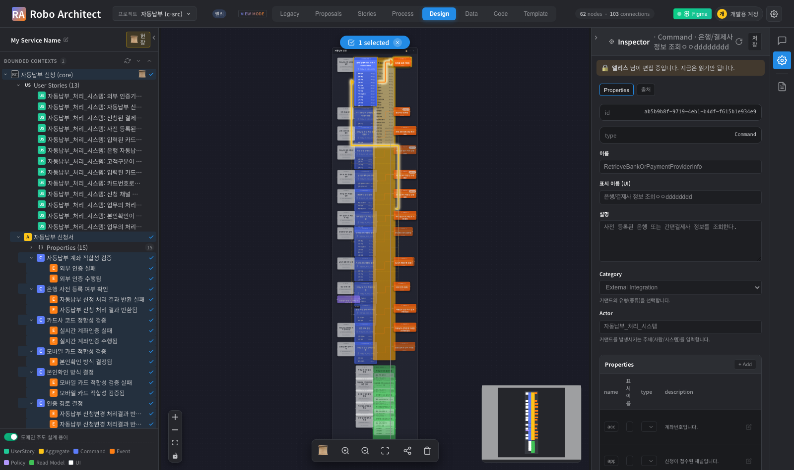
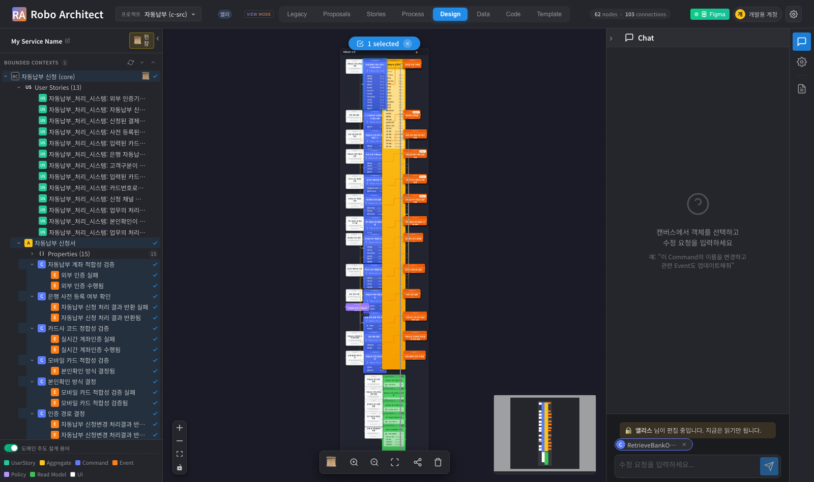
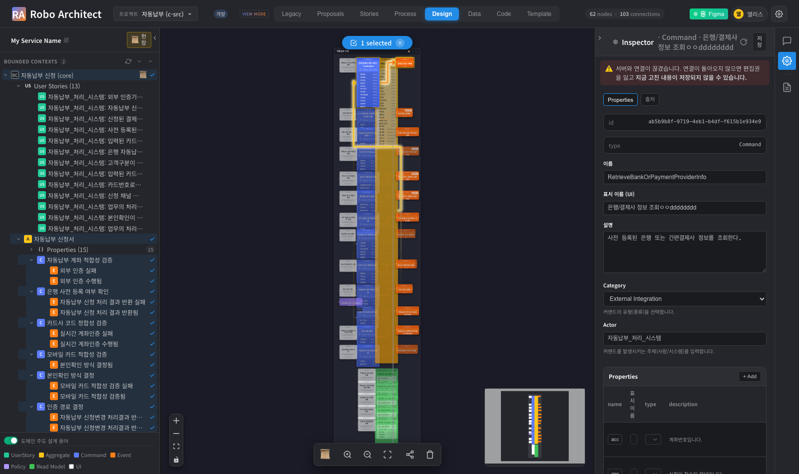
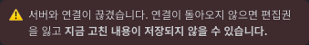

# 사용자 매뉴얼 — 동시편집 선점 (접속 기반 수명, spec 057)

> 대상 사용자: 같은 프로젝트를 **여럿이 함께 고치는 사람**(기획자·아키텍트)
> 기능 명세: [../spec.md](../spec.md) · [../plan.md](../plan.md) · [../tasks.md](../tasks.md)
> 최종 업데이트: 2026-09-17

## 1. 이 기능이 해결하는 문제

여러 사람이 같은 설계를 동시에 열면, 두 사람이 각자 고친 뒤 나중에 저장한 쪽이
앞사람의 수정을 **말없이 덮어씁니다.** 이를 막기 위해 요소마다 **선점(잠금)** 을 둡니다.

그런데 선점 자체가 시간으로 관리되면 새 문제가 생깁니다. 이전 방식은 서버가
**마지막 갱신에서 60초**를 재고, 그 갱신은 실시간 스트림(SSE)만 했습니다.

```
스트림이 잠깐 끊긴다        절전 · 사내 프록시 · 재연결 대기
→ 서버는 선점을 놓는다      사람은 화면 앞에서 글자를 치고 있는데
→ 그 틈에 남이 집어 간다
→ 돌아와 저장하면 거부      "○○ 님이 편집 중입니다"
```

**실측: 끊고 10초 안에 선점이 사라졌습니다.** 60초는 한 번도 오지 않았습니다.

이 기능은 선점의 수명을 **시간이 아니라 "그 사람이 아직 붙어 있는가"** 로 바꿉니다.
화면이 실시간 스트림과 **별개의 경로로** 주기적으로 자기 존재를 알리므로, 스트림만
끊기는 흔한 상황에서는 선점이 유지됩니다. 두 경로가 모두 끊겼을 때만 — 즉 사람이
정말로 없을 때만 — 선점이 풀립니다.

→ **오래 열어 두어도 편집권을 잃지 않고**, **창을 닫으면 즉시 남이 이어받을 수 있습니다.**

## 2. 사용 방법 (사용자 관점)

**별도 조작이 없습니다.** 켜고 끄는 설정도, 눌러야 하는 잠금 버튼도 없습니다.

| 하는 일 | 일어나는 일 |
|---|---|
| 캔버스에서 요소를 더블클릭 | Inspector 가 열리며 **그 순간 선점** |
| 남이 잡은 요소를 열기 | 열리되 **읽기 전용** + 🔒 배너 |
| AI 챗에 요소를 올리기 | 남이 잡았으면 **프롬프트 입력 전에** 차단 |
| Inspector ↔ 챗 전환 | 선점 **유지**(패널 전환은 손을 뗀 것이 아님) |
| 창(탭)을 닫기 | **즉시** 해제 |

선점이 풀리는 시점은 다음과 같습니다.

| 상황 | 언제 |
|---|---|
| 다른 요소를 엽니다 | 즉시 |
| 오른쪽 패널을 접습니다 | 잠시 뒤(몇 초 유예) |
| **창(탭)을 닫습니다** | **즉시** |
| 브라우저 강제 종료 · 절전 후 미복귀 | 약 25초 |
| 서버 재시작 | 재시작 시 자동 정리 |

**시간 제한은 없습니다.** 회의를 다녀와도 열어 둔 요소는 그대로 내 것입니다.
**선점은 창(탭) 단위**라, 같은 사람이 탭을 둘 열면 각각 따로 잡습니다.

## 3. 화면 (실제 캡처)

> 캡처는 `manual/artifacts/playwright-057-collab.spec.ts` 가 **두 사람(앨리스·개발용
> 계정)을 실제로 띄워** 찍습니다. 동시편집은 혼자서는 찍을 수 없는 화면입니다.

### 3-1. 잡은 사람 ↔ 다른 사람

| 잡은 사람 (앨리스) | 다른 사람 |
|---|---|
|  |  |
| 배너 없음 · 입력칸 그대로 | 🔒 배너 · 입력칸 잠김 (내용은 볼 수 있음) |


> **아예 못 열게 하지 않습니다.** 옆 사람이 무엇을 하는지도 못 보게 되고, 그 사람이
> 창을 켜 둔 채 자리를 비우면 아무도 아무것도 못 합니다. 선점은 **실수로 겹쳐 쓰는
> 것**을 막는 장치이지 사람을 막는 장치가 아닙니다.

### 3-2. AI 챗도 같은 선점을 따릅니다



선택 칩은 남고 **입력칸과 보내기가 잠깁니다.** 보내고 나서 막으면 AI 가 초안을 다
만든 뒤에 실패하고, 그 초안은 **남이 지금 고치는 내용 위에 쓸 것**이라 쓸모가 없습니다.

챗은 선점을 **잡지 않습니다** — 고르기만 해도 잡으면 Inspector 로 고치려던 사람이
막힙니다. "남이 잡았는지"만 읽습니다.

### 3-3. 연결이 끊겼을 때





**두 배너는 다른 사건입니다.** 원인이 다르고 할 일도 다릅니다.

| 배너 | 뜻 | 할 일 |
|---|---|---|
| 🔒 회색 | 남이 그 요소를 고치고 있다 | 기다리거나 그 사람에게 말한다 |
| ⚠️ 빨강 | **내** 연결이 끊겼다 | 큰 수정을 잠시 멈추고 복구를 기다린다 |

입력칸은 **잠그지 않습니다** — 끊긴 것은 아직 빼앗긴 것이 아니고, 잠깐 끊겼다 붙는
경우가 흔합니다. 연결이 돌아오면 아무도 안 가져갔으면 **자동으로 다시 선점**하고,
누가 가져갔으면 🔒 배너로 **누가** 가져갔는지 보입니다.

### 3-4. 접속자


## 4. 측정 결과 (화면 경로 실측)

> 창 둘·두 사람으로 **사람이 밟는 경로 그대로** 측정했습니다. 근거 검사는
> `frontend/tests/collab-lock-lifetime.spec.ts` · `collab-two-paths.spec.ts` ·
> `collab-catchup.spec.ts`. 각 항목은 **결함을 심어 검사가 실패하는 것까지** 확인했습니다.

| 지표 | 기준(SC) | 결과 |
|---|---|---|
| 스트림 끊김 중 선점 유지 | 끊긴 내내 놓지 않는다 (US1) | **71초 · 놓은 적 0회** ✅ |
| 창 닫기 → 해제 | 유예 없이 즉시 (US2-1) | **7.7초 안** ✅ |
| 브라우저 강제 종료(SIGKILL) → 해제 | 유예 안에 (US2-2) | **약 25초** ✅ |
| 서버 재시작 후 유령 선점 | 0건 (US2-3) | **0건** ✅ |
| 끊김 경고 표시 | 화면에 뜬다 (US3-1) | **뜬다**(⚠️ 배너) ✅ |
| 복귀 후 재선점 | 자동 (US3-2) | **자동** ✅ |
| 빼앗긴 뒤 표시 | 누구인지 보인다 (US3-3) | **보인다** + 입력칸 잠김 ✅ |
| 챗 차단 시점 | LLM 호출 **전** (US4-1) | **프롬프트 입력 전** ✅ |
| 챗 왕복 → 상대 화면 | 반영된다 (US4-3 · US5-2) | **반영** ✅ |
| 칩 id = 선점 id | 같아야 한다 (FR-010) | **같다**(앱이 만든 값끼리 대조) ✅ |
| 끊긴 동안 남의 수정 따라잡기 | 복귀 후 반영 | **반영** ✅ |

검사 수: 화면 10종 · 서버 15종 · 단위 4종. 결함 주입 8종 전부 확인.

## 5. 안전성 / 롤백

- **선점을 강제로 빼앗는 기능은 없습니다.** 살아 있는 사람에게서 뺏을 수 있으면
  선점이 선점이 아니게 됩니다. 급하면 그 사람이 **창을 닫으면 즉시** 풀립니다.
  (spec 의 명시적 비목표 — 없는 기능을 찾지 마세요.)
- 선점을 **못 잡아도 화면은 열립니다.** 읽기로 열려 내용은 볼 수 있습니다.
- 잠금을 거치지 않는 쓰기(인제스천·일괄 작업·스크립트)는 **막지 않습니다.**
  그것까지 막으면 선점이 기능을 세우는 게 아니라 무너뜨립니다.
- 저장이 거부되면 **화면의 내용은 그대로 남습니다.** 잠시 뒤 다시 시도하세요.
- 읽기 권한 사용자는 선점하지 않습니다 — 못 고칠 것을 잡아 두면 방해일 뿐입니다.
- 신규 그래프 노드/관계는 추가되지 않습니다. 선점 상태는 설계 그래프가 아니라
  **애플리케이션 DB(Postgres)** 에 있습니다. 분석기가 그래프를 통째로 비워도
  영향이 없고, 스냅샷·산출물에 잠금 흔적이 섞이지 않습니다.

## 6. 자주 묻는 것

**Q. 저장 버튼이 눌리지 않습니다.**
Inspector 위쪽 🔒 배너를 보세요. 남이 그 요소를 고치는 중입니다. 배너가 없다면
아직 아무 칸도 수정하지 않은 상태입니다.

**Q. "○○ 님이 편집 중입니다. 저장하지 않았습니다" 가 떴습니다.**
저장 직전에 다른 사람이 가져갔습니다. **내용은 그대로 남아 있으니** 잠시 뒤 다시
시도하거나 순서를 정하세요.

**Q. 내가 열어 뒀는데 남이 편집 중이라고 나옵니다.**
연결이 오래 끊겨 선점이 풀린 사이에 상대가 가져간 경우입니다. ⚠️ 경고가 먼저
떴을 것입니다. 상대가 놓으면 다시 잡을 수 있습니다.

**Q. 상대 화면에 내 수정이 안 보인다고 합니다.**
상대가 그 요소를 **열어 놓고 편집 중**이면 그 요소만 갱신이 미뤄집니다(치던 글자가
지워지지 않게). 손을 떼면 들어옵니다.

**Q. 접속자 목록에 나간 사람이 남아 있습니다.**
브라우저를 강제 종료한 경우 몇십 초 남을 수 있고, 곧 자동으로 빠집니다.

## 7. 캡처 재현

```bash
cd frontend
NODE_PATH="$PWD/node_modules" npx playwright test \
  --config ../specs/057-presence-bound-element-lock/manual/artifacts/playwright.config.ts
```

`NODE_PATH` 가 필요합니다 — 설정 파일이 `specs/` 아래에 있어 `@playwright/test` 를
그냥은 못 찾습니다. 캡처는 실 데이터를 고치지 않습니다(잠그고 보고 풉니다).
