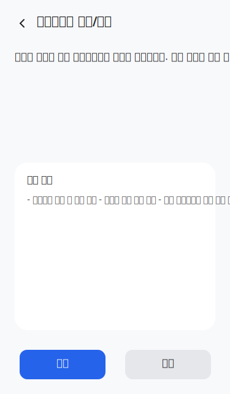

# Requirements: LegalConsentManagement

> User Stories with EARS acceptance criteria and wireframes rendered from the event-storming graph.
>
> Generated: 2026-05-12T11:55:59Z

## Aggregate: LegalGuardianConsent

### 법정대리인 동의를 제출한다

As a 고객, I want to 법정대리인 동의를 제출한다, so that 미성년자 등 법정대리인 동의가 필요한 경우 회원 업무를 진행할 수 있도록

**Acceptance Criteria.**

1. the system SHALL 법정대리인 동의 대상 고객 및 업무에 한해 동의가 요구된다
2. the system SHALL 법정대리인 인증수단 및 동의 방식이 제공된다
3. the system SHALL 동의 유효시간이 적용된다
4. the system SHALL 동의 미완료 시 회원 업무가 진행되지 않는다
5. the system SHALL 동의 증적이 저장된다
6. the system SHALL 동의 철회가 가능하다
7. the system SHALL 동의 결과가 통지된다

### 업무처리 동의 또는 확인을 한다

As a 법정대리인, I want to 업무처리 동의 또는 확인을 한다, so that 미성년자 또는 대리 동의가 필요한 고객의 회원가입 및 관련 업무가 적법하게 처리된다

**Acceptance Criteria.**

1. the system SHALL 법정대리인의 동의 또는 확인이 저장된다
2. the system SHALL 동의가 완료되어야만 해당 고객의 업무가 진행된다

#### Wireframe: ConfirmLegalGuardianConsent

- frame: 법정대리인 동의/확인 · layout: vertical
  - frame: Header · layout: horizontal
    - frame: Icon / lucide:chevron-left
      - icon: path
    - text: "법정대리인 동의/확인"
  - frame: Content · layout: vertical
    - text: "서비스 이용을 위해 법정대리인의 동의가 필요합니다. 아래 내용을 확인 후 동의 또는 확인 버튼을 눌러주세요."
    - frame: 동의 내용 카드 · layout: vertical
      - text: "동의 내용"
      - text: "- 개인정보 수집 및 이용 동의 - 서비스 이용 약관 동의 - 기타 법정대리인 확인 관련 안내"
  - frame: Action Buttons · layout: horizontal
    - frame: Frame · layout: vertical
      - rect: 동의 버튼
        - text: "동의"
    - frame: Frame · layout: vertical
      - rect: 확인 버튼
        - text: "확인"

#### Wireframe: LegalGuardianConsentHistory

_No scene graph modeled for this UI._

#### Wireframe: LegalGuardianConsentStatus

_No scene graph modeled for this UI._

### 법정대리인 동의를 받는다

As a 미성년자_고객, I want to 법정대리인 동의를 받는다, so that 미성년자 업무(가입 등) 진행을 위해 법적 요건을 충족하기 위해

**Acceptance Criteria.**

1. the system SHALL 고객 생년월일, 법정대리인 이름, 법정대리인 연락처, 동의 대상, 세션ID를 입력받는다
2. the system SHALL 미성년자 여부를 확인한다
3. the system SHALL 법정대리인 동의 요청을 생성하여 발송한다
4. the system SHALL 동의 결과를 업무 세션에 연결한다
5. the system SHALL 동의 미완료 시 대기 또는 재요청이 가능하다
6. the system SHALL 동의필요여부, 동의요청ID, 동의상태, 동의완료시각, 다음 이동 경로가 출력된다
7. the system SHALL 법정대리인 인증 실패 시 정보 수정 안내가 제공된다
8. the system SHALL 동의 유효시간 만료 시 재요청이 가능하다
9. the system SHALL 보호자 정보 불일치 시 업무 진행이 보류된다

