# Requirements: MembershipManagement

> User Stories with EARS acceptance criteria and wireframes rendered from the event-storming graph.
>
> Generated: 2026-05-12T11:55:59Z

## Aggregate: MemberAccount

### 휴면 해제를 신청한다

As a 회원, I want to 휴면 해제를 신청한다, so that 장기 미이용으로 제한된 계정을 정상적으로 복원하여 서비스를 재이용하기 위해

**Acceptance Criteria.**

1. the system SHALL 휴면 회원임을 본인인증으로 확인해야 한다
2. the system SHALL 휴면 해제 시 필요한 데이터를 운영 영역으로 복원해야 한다
3. the system SHALL 휴면 해제 시 약관 재동의가 필요할 수 있다
4. the system SHALL 휴면 해제 후 정상 회원 상태로 전환되어야 한다

#### Wireframe: RequestDormantAccountReactivation

- frame: 휴면 해제 신청 · layout: vertical
  - frame: 타이틀 및 안내 · layout: vertical
    - text: "휴면 해제 신청"
    - text: "회원님의 계정은 현재 휴면 상태입니다. 본인인증 후 휴면 해제가 가능합니다."
  - frame: 본인인증 영역 · layout: vertical
    - text: "본인인증"
    - frame: Frame · layout: horizontal
      - text: "이름"
      - rect: Rectangle
        - text: "홍길동"
    - frame: Frame · layout: horizontal
      - text: "생년월일"
      - rect: Rectangle
        - text: "1990-01-01"
    - frame: Frame · layout: horizontal
      - text: "인증방법"
      - rect: Rectangle
        - text: "휴대폰 인증"
    - frame: Frame · layout: horizontal
      - frame: Frame · layout: horizontal
        - frame: Icon / lucide:check-circle
          - icon: path
          - icon: path
        - text: "인증 완료"
      - frame: Frame
      - rect: Rectangle
        - text: "재인증"
  - frame: 휴면 해제 버튼 영역 · layout: vertical
    - rect: 휴면 해제 버튼
      - text: "휴면 해제"
    - text: "휴면 해제 후 정상적으로 서비스를 이용하실 수 있습니다."

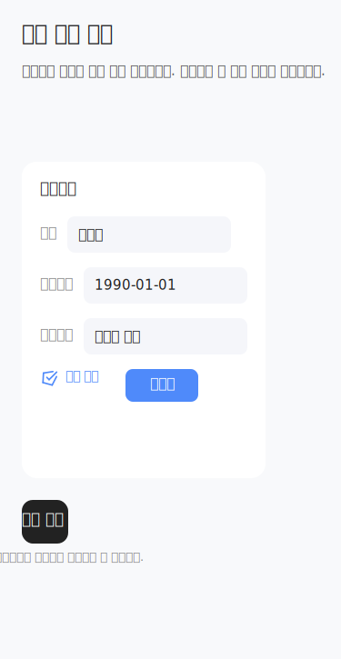

### 회원 탈퇴를 철회한다

As a 회원, I want to 회원 탈퇴를 철회한다, so that 탈퇴 유예 기간 내에 계정 종료를 취소하고 서비스를 계속 이용할 수 있도록

**Acceptance Criteria.**

1. the system SHALL 탈퇴 유예 기간(7일) 내에만 철회가 가능해야 한다
2. the system SHALL 철회 시 회원 상태를 정상 회원으로 복원해야 한다
3. the system SHALL 철회 시 분리보관 데이터는 운영 데이터로 복원되어야 한다

#### Wireframe: CancelWithdrawal

- frame: 탈퇴 철회 · layout: vertical
  - frame: 헤더 · layout: horizontal
  - frame: 안내 카드 · layout: horizontal
  - frame: 버튼 영역 · layout: horizontal

### 재가입을 신청한다

As a 비회원, I want to 재가입을 신청한다, so that 이전에 탈퇴하거나 휴면 상태였던 계정을 다시 생성하여 서비스를 재이용할 수 있도록

**Acceptance Criteria.**

1. the system SHALL 탈퇴 회원 또는 휴면 회원임을 본인인증으로 확인해야 한다
2. the system SHALL 재가입 시 약관 재동의가 필요하다
3. the system SHALL 재가입 제한 회원은 재가입이 불가하다
4. the system SHALL 재가입 시 기존 데이터 복원 또는 신규 계정 생성 정책을 따라야 한다

### 약관에 재동의한다

As a 회원, I want to 약관에 재동의한다, so that 약관 개정, 휴면 해제, 재가입 등 사유로 서비스 이용을 계속할 수 있도록

**Acceptance Criteria.**

1. the system SHALL 필수 약관에 재동의해야 한다
2. the system SHALL 약관 동의 이력이 저장되어야 한다
3. the system SHALL 선택 약관은 동의하지 않아도 된다

### 회원 가입을 완료한다

As a 고객, I want to 회원 가입을 완료한다, so that 즉시 서비스 이용이 가능하도록 정상 회원 상태로 전환하기 위해

**Acceptance Criteria.**

1. the system SHALL 가입 결과가 안내된다
2. the system SHALL 가입 완료 화면과 알림이 발송된다
3. the system SHALL 정상 회원 이용이 가능해진다
4. the system SHALL 자동 로그인 허용 시 로그인 세션이 생성된다
5. the system SHALL 홈 또는 목적지로 이동한다
6. the system SHALL 내정보 점검·혜택 안내가 제공된다
7. the system SHALL 가입완료여부, 로그인세션ID, 완료안내문구, 후속 액션, 알림결과가 출력된다
8. the system SHALL 가입 완료 알림 실패 시 화면 안내가 유지된다
9. the system SHALL 세션 생성 실패 시 로그인 재시도 안내가 제공된다
10. the system SHALL 중복 완료 요청 시 기존 가입 결과가 반환된다

### 로그인 또는 가입 시 휴면 회원 여부를 확인받는다

As a 고객, I want to 로그인 또는 가입 시 휴면 회원 여부를 확인받는다, so that 휴면 상태일 경우 해제 절차로 안내받아 정상 이용을 준비하기 위해

**Acceptance Criteria.**

1. the system SHALL 로그인ID, CI/DI, 세션ID, 접근채널 정보를 입력받는다
2. the system SHALL 로그인 계정이 휴면 상태이면 휴면 해제 안내가 노출된다
3. the system SHALL 정상 회원이면 일반 로그인 처리 후 홈으로 이동한다
4. the system SHALL 상태 확인 실패 시 재조회 또는 오류 안내가 제공된다
5. the system SHALL 계정 미존재 시 가입 또는 아이디 찾기 안내가 제공된다
6. the system SHALL 휴면여부, 휴면전환일, 해제필요여부, 안내 메시지, 다음 이동 경로가 출력된다

### 휴면 해제 가능 여부를 확인한다

As a 고객, I want to 휴면 해제 가능 여부를 확인한다, so that 휴면 상태에서 정상 회원으로 복귀할 수 있는지 판단받기 위해

**Acceptance Criteria.**

1. the system SHALL 회원ID, 휴면상태코드, 본인인증결과, 분리보관 데이터 존재 여부를 입력받는다
2. the system SHALL 본인인증 완료 및 데이터 복원 가능 시 해제 가능 판정이 내려진다
3. the system SHALL 필수 재동의 대상 존재 시 약관 재동의 단계로 이동한다
4. the system SHALL 복원 불가 또는 제한 상태 시 제한 사유가 반환된다
5. the system SHALL 해제가능여부, 필요조치, 재동의필요여부, 제한사유가 출력된다
6. the system SHALL 인증 미완료 시 본인인증 단계로 이동한다
7. the system SHALL 재동의 미완료 시 약관 단계로 이동한다
8. the system SHALL 복원 대상 데이터 오류 시 처리 보류된다

### 휴면 해제를 처리한다

As a 고객, I want to 휴면 해제를 처리한다, so that 휴면 상태에서 정상 회원으로 전환되어 서비스 이용을 재개하기 위해

**Acceptance Criteria.**

1. the system SHALL 회원ID, 인증세션ID, 재동의이력ID, 해제요청시각을 입력받는다
2. the system SHALL 해제 조건 충족 시 회원 상태가 정상으로 전환된다
3. the system SHALL 분리보관 데이터가 운영 데이터 영역으로 복원된다
4. the system SHALL 세션 복구가 필요한 경우 로그인 세션이 생성된다
5. the system SHALL 회원상태코드, 해제완료시각, 복원범위, 로그인세션ID가 출력된다
6. the system SHALL 상태 전환 실패 시 휴면 상태가 유지된다
7. the system SHALL 데이터 복원 실패 시 해제 처리가 보류된다
8. the system SHALL 중복 해제 요청 시 기존 결과가 반환된다

### 휴면 해제 완료 안내를 받는다

As a 고객, I want to 휴면 해제 완료 안내를 받는다, so that 휴면 해제 결과와 복원 범위, 후속 조치를 명확히 안내받기 위해

**Acceptance Criteria.**

1. the system SHALL 해제 결과와 복원 범위가 안내된다
2. the system SHALL 완료 화면과 알림이 발송된다
3. the system SHALL 일부 정보 점검 필요 시 내정보 확인 액션이 노출된다
4. the system SHALL 알림 실패 시 실패 이력이 저장되고 화면 안내가 유지된다
5. the system SHALL 복원 범위 없음 시 기본 이용 가능 안내가 제공된다
6. the system SHALL 결과 조회 실패 시 해제 상태가 재조회된다
7. the system SHALL 완료안내문구, 해제시각, 복원범위, 후속 액션, 알림결과가 출력된다

### 탈퇴 가능 여부를 확인한다

As a 회원, I want to 탈퇴 가능 여부를 확인한다, so that 탈퇴 전 미납, 연계 서비스, 제한 조건을 확인하여 탈퇴 가능 여부를 명확히 알기 위해

**Acceptance Criteria.**

1. the system SHALL 탈퇴 전 미납, 연계 서비스, 제한 조건을 확인한다
2. the system SHALL 탈퇴 가능 여부가 안내된다

### 휴면 상태를 해제한다

As a 회원, I want to 휴면 상태를 해제한다, so that 서비스 이용을 재개할 수 있도록

**Acceptance Criteria.**

1. the system SHALL 회원ID, 인증세션ID, 재동의이력ID, 해제요청시각을 입력한다
2. the system SHALL 본인인증 결과를 확인한다
3. the system SHALL 필수 약관 재동의 여부를 확인한다
4. the system SHALL 휴면 상태 해제 조건을 충족해야 한다
5. the system SHALL 분리보관 데이터가 있으면 운영 데이터로 복원된다
6. the system SHALL 회원 상태가 정상으로 전환된다
7. the system SHALL 로그인 세션이 복구되어야 한다
8. the system SHALL 회원상태코드, 해제완료시각, 복원범위, 로그인세션ID가 출력된다
9. the system SHALL 상태 전환 실패 시 휴면 상태가 유지된다
10. the system SHALL 데이터 복원 실패 시 해제가 보류된다
11. the system SHALL 중복 해제 요청 시 기존 결과가 반환된다

### 휴면 해제 완료 안내를 확인한다

As a 회원, I want to 휴면 해제 완료 안내를 확인한다, so that 휴면 해제 결과와 후속 조치를 명확히 인지할 수 있도록

**Acceptance Criteria.**

1. the system SHALL 해제 결과와 복원 범위를 확인할 수 있다
2. the system SHALL 완료 안내 화면이 제공된다
3. the system SHALL 완료 알림이 발송된다
4. the system SHALL 로그인 또는 홈 화면으로 이동할 수 있다
5. the system SHALL 알림 실패 시 화면 안내가 유지된다
6. the system SHALL 복원 범위가 없으면 기본 이용 가능 안내가 제공된다
7. the system SHALL 결과 조회 실패 시 해제 상태를 재조회할 수 있다

### 탈퇴 가능 여부를 조회한다

As a 회원, I want to 탈퇴 가능 여부를 조회한다, so that 탈퇴 진행 전 제한 조건을 확인하고 안내받기 위해

**Acceptance Criteria.**

1. the system SHALL 회원ID, 인증세션ID, 회원상태, 미납여부, 연계서비스 정보를 입력한다
2. the system SHALL 회원 상태, 미완료 업무, 보유 혜택 및 연계 서비스 정보를 확인한다
3. the system SHALL 탈퇴 가능 여부, 제한 사유, 선행 조치 목록, 안내 메시지가 반환된다
4. the system SHALL 미납 존재 시 납부 안내가 제공된다
5. the system SHALL 진행 중 주문 존재 시 처리 완료 후 가능 안내가 제공된다
6. the system SHALL 상태 조회 실패 시 재시도 안내가 제공된다

### 탈퇴 시 영향 안내를 확인한다

As a 회원, I want to 탈퇴 시 영향 안내를 확인한다, so that 탈퇴로 인한 소멸·해지·보관 정보를 사전에 인지할 수 있도록

**Acceptance Criteria.**

1. the system SHALL 회원ID, 보유혜택, 포인트, 구독/결합/부가서비스 정보를 입력한다
2. the system SHALL 소멸 혜택, 연계 서비스, 보관 정보를 조회하여 안내받는다
3. the system SHALL 법정 보관 범위가 있으면 안내받고 확인한다
4. the system SHALL 유예·철회 기준이 안내된다
5. the system SHALL 소멸혜택목록, 연계서비스 영향, 보관대상정보, 확인완료여부가 출력된다
6. the system SHALL 영향 정보 조회 실패 시 진행이 보류된다
7. the system SHALL 연계 서비스 정보 불일치 시 재조회 안내가 제공된다
8. the system SHALL 고객 미확인 시 다음 단계로 진행할 수 없다

### 탈퇴 사유를 입력 및 제출한다

As a 회원, I want to 탈퇴 사유를 입력 및 제출한다, so that 탈퇴 사유를 표준화된 형태로 제출하여 서비스 개선에 기여할 수 있도록

**Acceptance Criteria.**

1. the system SHALL 회원ID, 탈퇴사유코드, 직접입력내용, 세션ID를 입력한다
2. the system SHALL 표준 사유를 선택하거나 직접 입력할 수 있다
3. the system SHALL 직접 입력 시 금칙어 및 길이 검증이 수행된다
4. the system SHALL 사유 미입력 시 입력 요청이 제공된다
5. the system SHALL 사유저장결과, 사유ID, 다음 이동 경로가 출력된다
6. the system SHALL 직접 입력 길이 초과 시 수정 요청이 제공된다
7. the system SHALL 저장 실패 시 재시도 안내가 제공된다

### 탈퇴 처리를 완료한다

As a 회원, I want to 탈퇴 처리를 완료한다, so that 회원 탈퇴가 최종적으로 반영되고 후속 처리가 이루어지도록

**Acceptance Criteria.**

1. the system SHALL 회원ID, 탈퇴요청ID, 최종동의이력ID, 처리기준일시를 입력한다
2. the system SHALL 회원 상태가 탈퇴유예 또는 탈퇴 완료로 전환된다
3. the system SHALL 후속 처리가 수행된다

### 탈퇴 사유를 입력한다

As a 회원, I want to 탈퇴 사유를 입력한다, so that 탈퇴 절차를 진행하기 위해

**Acceptance Criteria.**

1. the system SHALL 표준 탈퇴 사유 목록이 제공된다
2. the system SHALL 회원이 표준 사유를 선택할 수 있다
3. the system SHALL 직접 입력 시 금칙어 및 길이 검증이 수행된다
4. the system SHALL 탈퇴 사유 입력은 필수이며 미입력 시 입력 요청 안내가 표시된다
5. the system SHALL 입력된 사유가 저장된다
6. the system SHALL 탈퇴 세션과 입력 정보가 연결된다
7. the system SHALL 저장 실패 시 재시도 안내가 제공된다

### 탈퇴 영향 안내를 확인하고 최종 동의를 한다

As a 회원, I want to 탈퇴 영향 안내를 확인하고 최종 동의를 한다, so that 탈퇴에 따른 영향과 조건을 충분히 인지한 후 탈퇴를 확정하기 위해

**Acceptance Criteria.**

1. the system SHALL 탈퇴 영향 안내 문구가 노출된다
2. the system SHALL 회원이 안내 내용을 확인해야 최종 동의가 가능하다
3. the system SHALL 최종 동의 여부가 저장된다
4. the system SHALL 동의 이력이 저장된다
5. the system SHALL 최종 동의 철회 시 탈퇴 요청이 취소된다
6. the system SHALL 최종 동의 미완료 시 탈퇴 처리가 불가하다
7. the system SHALL 인증 세션 만료 시 본인인증을 재수행해야 한다
8. the system SHALL 중복 동의 요청 시 최신 요청 기준으로 처리된다

### 탈퇴 완료 및 철회 안내를 확인한다

As a 회원, I want to 탈퇴 완료 및 철회 안내를 확인한다, so that 탈퇴 처리 결과와 철회 가능 여부, 재가입 제한 정보를 명확히 인지하기 위해

**Acceptance Criteria.**

1. the system SHALL 탈퇴유예 상태인 경우 철회 가능 기간과 방법이 안내된다
2. the system SHALL 탈퇴 완료 상태인 경우 완료 결과와 개인정보 보관 범위가 안내된다
3. the system SHALL 재가입 제한 정보가 안내된다
4. the system SHALL 완료 및 유예 안내 알림이 발송된다
5. the system SHALL 알림 실패 시 화면 안내가 유지된다
6. the system SHALL 유예 정보 조회 실패 시 상태가 재조회된다
7. the system SHALL 철회 불가 상태 시 재가입 안내가 제공된다

### 재가입 대상 여부를 확인한다

As a 회원, I want to 재가입 대상 여부를 확인한다, so that 탈퇴 이력 및 현재 상태에 따라 재가입 또는 로그인·신규 가입 절차로 안내받기 위해

**Acceptance Criteria.**

1. the system SHALL 본인인증 정보가 확인된다
2. the system SHALL 탈퇴 이력이 조회된다
3. the system SHALL 정상 회원이 존재할 경우 로그인 안내가 제공된다
4. the system SHALL 탈퇴 이력이 없으면 신규 가입 안내가 제공된다
5. the system SHALL 재가입 대상 여부가 반환된다
6. the system SHALL 이력 조회 실패 시 재시도 안내가 제공된다
7. the system SHALL 식별정보 불일치 시 본인인증 재수행이 안내된다

### 재가입 제한 여부를 확인한다

As a 회원, I want to 재가입 제한 여부를 확인한다, so that 재가입 제한 조건에 따라 재가입 가능 여부 및 제한 사유를 명확히 안내받기 위해

**Acceptance Criteria.**

1. the system SHALL 제한 조건이 조회된다
2. the system SHALL 제한 기간이 확인된다
3. the system SHALL 제한 기간 종료 시 재가입이 허용된다
4. the system SHALL 제한 기간 미종료 시 제한 종료일이 안내된다
5. the system SHALL 부정이용 제한 대상일 경우 가입 제한 사유가 안내된다
6. the system SHALL 예외 허용 여부가 확인된다
7. the system SHALL 판정 오류 시 재시도 안내가 제공된다

### 재가입 시 기존 이력 연계 및 복원 범위를 확인한다

As a 회원, I want to 재가입 시 기존 이력 연계 및 복원 범위를 확인한다, so that 재가입 후 복원 가능한 데이터와 제외 대상을 명확히 인지하기 위해

**Acceptance Criteria.**

1. the system SHALL 기존 회원ID와 탈퇴 이력이 확인된다
2. the system SHALL 보관 데이터 목록이 조회된다
3. the system SHALL 연계 가능한 이력과 복원 제외 대상이 안내된다

### 재가입 대상 여부를 조회한다

As a 회원, I want to 재가입 대상 여부를 조회한다, so that 내가 재가입할 수 있는지 확인하기 위해

**Acceptance Criteria.**

1. the system SHALL 본인인증 정보로 탈퇴 이력과 기존 회원 여부를 조회한다
2. the system SHALL 정상 회원이 이미 존재하면 로그인 안내를 제공한다
3. the system SHALL 탈퇴 이력이 없으면 신규 가입 안내를 제공한다
4. the system SHALL 탈퇴 이력이 있으면 재가입 플로우로 진입한다
5. the system SHALL 이력 조회 실패 시 재시도 안내를 제공한다
6. the system SHALL 식별정보 불일치 시 본인인증 재수행을 안내한다
7. the system SHALL 재가입대상여부, 기존회원ID, 탈퇴일시, 재가입가능일, 다음 업무 정보를 출력한다

### 기존 이력 연계 및 복원 범위를 확인한다

As a 회원, I want to 기존 이력 연계 및 복원 범위를 확인한다, so that 재가입 시 내 기존 정보가 어떻게 처리되는지 알기 위해

**Acceptance Criteria.**

1. the system SHALL 기존회원ID, CI/DI, 탈퇴이력, 보관 데이터 목록을 조회한다
2. the system SHALL 법정 보관 이력이 있으면 연계 가능 항목을 안내한다
3. the system SHALL 복원 제외 대상이 있으면 제외 사유를 안내한다
4. the system SHALL 연계 가능 정보가 없으면 신규 가입 기준을 적용한다
5. the system SHALL 보관 기간 만료 시 신규 생성 안내를 제공한다
6. the system SHALL 이력 불일치 시 수동 확인 안내를 제공한다
7. the system SHALL 복원 제한 항목 요청 시 제외 안내를 제공한다
8. the system SHALL 연계가능항목, 복원제외항목, 기존이력ID, 신규생성대상 정보를 출력한다

### 재가입 정보 입력 및 약관에 동의한다

As a 회원, I want to 재가입 정보 입력 및 약관에 동의한다, so that 최신 정보로 재가입을 완료하기 위해

**Acceptance Criteria.**

1. the system SHALL 재가입 필수 정보를 입력한다
2. the system SHALL 기존 정보 재사용 여부를 확인하고, 사용 가능 시 확인·수정 방식을 제공한다
3. the system SHALL 필수 약관 동의가 완료되어야 진행할 수 있다
4. the system SHALL 입력값 검증 결과와 약관동의이력ID, 기존정보사용여부, 다음 이동 경로를 출력한다
5. the system SHALL 필수 정보 누락 시 입력 요청을 안내한다
6. the system SHALL 약관 미동의 시 진행 불가 안내를 제공한다
7. the system SHALL 기존 정보 사용 불가 시 신규 입력 요청을 안내한다

### 재가입 처리를 완료한다

As a 회원, I want to 재가입 처리를 완료한다, so that 계정 복원 또는 신규 생성으로 정상 회원 상태가 되기 위해

**Acceptance Criteria.**

1. the system SHALL 기존 계정 복원 가능 시 계정 상태를 정상으로 전환한다
2. the system SHALL 신규 생성 필요 시 신규 회원ID를 생성하고 기존 이력을 연결한다
3. the system SHALL 처리 완료 후 로그인 세션을 생성하고 알림을 발송한다
4. the system SHALL 재가입결과, 회원ID, 회원상태코드, 연계이력ID, 로그인세션ID 정보를 출력한다
5. the system SHALL 계정 복원 실패 시 신규 생성 또는 재시도 안내를 제공한다
6. the system SHALL 식별정보 중복 시 상태 재조회를 안내한다
7. the system SHALL 알림 실패 시 화면 안내를 유지한다

### 재가입 완료 안내를 받는다

As a 회원, I want to 재가입 완료 안내를 받는다, so that 재가입 결과와 연계 이력, 후속 작업을 명확히 알기 위해

**Acceptance Criteria.**

1. the system SHALL 재가입 완료 시 완료 화면과 알림을 발송한다
2. the system SHALL 기존 이력 일부 연계 시 연계·제외 항목을 안내한다
3. the system SHALL 후속 설정이 필요한 경우 내정보 점검 액션을 제공한다
4. the system SHALL 완료안내문구, 연계항목, 제외항목, 후속 액션, 알림결과를 출력한다
5. the system SHALL 알림 실패 시 화면 안내를 유지한다
6. the system SHALL 연계항목 조회 실패 시 내정보에서 확인 안내를 제공한다
7. the system SHALL 세션 오류 시 로그인 재시도 안내를 제공한다

### 재가입 후 로그인 세션을 생성하거나 전환한다

As a 회원, I want to 재가입 후 로그인 세션을 생성하거나 전환한다, so that 재가입 직후 바로 서비스를 이용하기 위해

**Acceptance Criteria.**

1. the system SHALL 업무 완료 후 자동 로그인이 허용되면 로그인 세션을 생성하고 목적지로 이동한다
2. the system SHALL 자동 로그인 불가 시 로그인 화면으로 안내한다
3. the system SHALL 기존 세션이 있으면 세션 상태를 갱신하여 정상 이용 상태를 유지한다

### 계정을 복원하거나 신규로 생성한다

As a 고객, I want to 계정을 복원하거나 신규로 생성한다, so that 서비스 이용을 재개하거나 신규로 시작할 수 있도록

**Acceptance Criteria.**

1. the system SHALL 식별정보가 기존 계정과 연계되는 경우 계정 복원이 진행된다
2. the system SHALL 식별정보가 중복되는 경우 상태를 재조회한다
3. the system SHALL 계정 복원 실패 시 신규 생성 또는 재시도 안내를 제공한다
4. the system SHALL 계정 복원 또는 신규 생성 후 회원 상태가 정상으로 전환된다
5. the system SHALL 재가입 이력이 저장된다
6. the system SHALL 세션이 생성되고 알림이 발송된다
7. the system SHALL 재가입 결과, 회원ID, 회원상태코드, 연계이력ID, 로그인세션ID가 출력된다
8. the system SHALL 알림 발송 실패 시 화면 안내를 유지한다

### 재가입 완료 안내를 받는다

As a 고객, I want to 재가입 완료 안내를 받는다, so that 재가입 결과와 연계 이력, 후속 이용 방법을 명확히 확인할 수 있도록

**Acceptance Criteria.**

1. the system SHALL 재가입 결과와 연계 이력 여부가 안내된다
2. the system SHALL 완료 안내 문구와 연계/제외 항목이 제공된다
3. the system SHALL 후속 설정이 필요한 경우 내정보 점검 액션이 제공된다
4. the system SHALL 알림 발송 실패 시 화면 안내가 유지된다
5. the system SHALL 연계항목 조회 실패 시 내정보에서 확인 안내가 제공된다
6. the system SHALL 세션 오류 시 로그인 재시도 안내가 제공된다

### 로그인 세션을 생성하거나 기존 세션을 전환한다

As a 고객, I want to 로그인 세션을 생성하거나 기존 세션을 전환한다, so that 업무 완료 후 즉시 서비스를 이용할 수 있도록

**Acceptance Criteria.**

1. the system SHALL 업무 완료 후 자동 로그인이 가능한 경우 로그인 세션이 생성되고 목적지로 이동한다
2. the system SHALL 자동 로그인이 불가한 경우 로그인 화면 안내를 통해 수동 로그인을 유도한다
3. the system SHALL 기존 세션이 존재할 경우 세션 상태가 갱신된다
4. the system SHALL 세션 생성 조건이 확인된다
5. the system SHALL 세션 만료·중복 기준이 적용된다
6. the system SHALL 로그인세션ID, 세션만료시각, 목적지URL, 자동로그인여부가 출력된다
7. the system SHALL 세션 생성 실패 시 로그인 재시도 안내가 제공된다
8. the system SHALL 인증 세션 만료 시 본인인증 재수행 안내가 제공된다
9. the system SHALL 목적지 오류 시 홈으로 이동한다

### 탈퇴 또는 재가입 후 개인정보 파기 보관 분리보관 처리를 수행한다

As a 시스템, I want to 탈퇴 또는 재가입 후 개인정보 파기 보관 분리보관 처리를 수행한다, so that 개인정보 보호 및 법적 준수를 위해

**Acceptance Criteria.**

1. the system SHALL 탈퇴 완료 시 즉시 파기 대상과 법정 보관 대상이 분류된다
2. the system SHALL 보관 기간 만료 시 보관 데이터 파기 요청이 생성된다
3. the system SHALL 파기·보관 이력이 저장된다
4. the system SHALL 재가입 요청 시 보관 이력 연계 가능 여부가 확인된다
5. the system SHALL 파기요청ID, 보관대상목록, 파기결과, 보관만료일이 출력된다
6. the system SHALL 파기 요청 실패 시 재처리 큐에 등록된다
7. the system SHALL 보관 대상 불일치 시 운영 확인 요청이 발생한다
8. the system SHALL 재가입 이력 조회 실패 시 신규 가입 기준이 적용된다

### 업무 처리 결과와 이력을 재조회한다

As a 고객, I want to 업무 처리 결과와 이력을 재조회한다, so that 가입, 휴면 해제, 탈퇴, 재가입 등 처리 결과와 이력을 확인할 수 있도록

**Acceptance Criteria.**

1. the system SHALL 업무별 처리 이력이 조회된다
2. the system SHALL 탈퇴 회원의 경우 허용 범위 내 이력만 확인할 수 있다
3. the system SHALL 조회 권한이 없으면 본인인증이 요구된다
4. the system SHALL 이력이 없으면 결과 없음 안내가 제공된다
5. the system SHALL 조회 시스템 오류 시 재시도 안내가 제공된다
6. the system SHALL 처리상태, 처리일시, 업무구분, 이력ID, 상세보기 가능 여부가 출력된다

### 회원가입 시 본인인증을 한다

As a 회원, I want to 회원가입 시 본인인증을 한다, so that 본인임을 증명하여 안전하게 회원가입을 진행하기 위해

**Acceptance Criteria.**

1. the system SHALL 회원 가입 허용 인증수단 중 하나를 선택할 수 있다
2. the system SHALL 인증번호 방식의 경우 인증번호를 발급받고 입력해야 한다
3. the system SHALL 인증번호 유효시간 및 재요청 정책이 적용된다
4. the system SHALL 인증 실패 시 재시도 및 잠금 정책이 적용된다
5. the system SHALL 인증 결과에 따라 가입 진행 여부가 결정된다
6. the system SHALL 인증 이력이 저장된다

### 회원가입 시 약관에 동의한다

As a 회원, I want to 회원가입 시 약관에 동의한다, so that 서비스 이용을 위한 법적·운영상의 동의 절차를 완료하기 위해

**Acceptance Criteria.**

1. the system SHALL 필수 약관에 동의하지 않으면 가입이 불가하다
2. the system SHALL 선택 약관은 개별적으로 동의 또는 미동의할 수 있다
3. the system SHALL 전체 동의 기능이 제공된다
4. the system SHALL 약관 상세 내용을 확인할 수 있다
5. the system SHALL 약관 동의 이력이 저장된다
6. the system SHALL 약관 버전 및 동의 일시가 기록된다
7. the system SHALL 법정대리인 동의가 필요한 경우 별도 동의 절차가 진행된다

#### Wireframe: AgreeToTerms

- frame: 약관 동의 · layout: vertical
  - text: "약관에 동의해 주세요"
  - frame: 약관 리스트 · layout: vertical
    - frame: 전체 동의 · layout: horizontal
      - rect: 전체 동의 체크박스
      - text: "필수 약관에 동의해야 가입할 수 있습니다"
    - frame: 필수 약관 · layout: vertical
      - frame: Frame · layout: horizontal
        - rect: 필수1 체크박스
        - text: "[필수] 서비스 이용약관 동의"
        - text: "(보기)"
      - frame: Frame · layout: horizontal
        - rect: 필수2 체크박스
        - text: "[필수] 개인정보 처리방침 동의"
        - text: "(보기)"
    - frame: 선택 약관 · layout: vertical
      - frame: Frame · layout: horizontal
        - rect: 선택1 체크박스
        - text: "[선택] 마케팅 정보 수신 동의"
        - text: "(보기)"
  - frame: 가입 버튼 영역 · layout: vertical
    - frame: 가입 버튼 · layout: vertical
      - text: "동의 후 가입합니다."
    - text: "필수 약관에 동의해야 가입할 수 있습니다"

### 회원가입 시 입력 정보를 검증받는다

As a 회원, I want to 회원가입 시 입력 정보를 검증받는다, so that 정확하고 유효한 정보로 회원가입을 완료하기 위해

**Acceptance Criteria.**

1. the system SHALL 필수 입력값이 누락된 경우 오류 안내가 표시된다
2. the system SHALL 아이디, 비밀번호, 이메일, 연락처 등은 정책에 따라 형식·길이·조합이 검증된다
3. the system SHALL 본인인증 연계 항목은 수정 제한 정책이 적용된다
4. the system SHALL 중복 확인 대상 정보는 가입 전 중복 여부가 검증된다
5. the system SHALL 검증 실패 시 안내 문구가 표시된다
6. the system SHALL 아이디는 영문 대소문자, 숫자만 허용되며 6~20자 이내여야 한다
7. the system SHALL 비밀번호는 10~20자, 영문 대문자, 영문 소문자, 숫자, 특수문자 중 3종 이상 조합이어야 한다
8. the system SHALL 이메일은 이메일 주소 형식이어야 한다
9. the system SHALL 연락처는 휴대폰번호 숫자 형식이어야 한다
10. the system SHALL 공백 입력은 허용되지 않는다
11. the system SHALL 검증은 입력 중, 다음 단계 이동 시, 가입 완료 요청 시 수행된다

### 회원가입 시 회원 상태를 조회받는다

As a 회원, I want to 회원가입 시 회원 상태를 조회받는다, so that 본인의 가입 가능 여부를 확인하고 적합한 가입 경로를 안내받기 위해

**Acceptance Criteria.**

1. the system SHALL 회원 상태(정상, 휴면, 탈퇴, 가입제한, 미가입 등)가 조회된다
2. the system SHALL 상태에 따라 신규가입, 휴면 해제, 재가입, 가입 제한 등 후속 경로가 분기된다
3. the system SHALL 가입 불가 시 사유 코드 및 안내 메시지가 표시된다
4. the system SHALL 상태 조회 이력이 저장된다

### 회원가입 완료 후 기본 프로필을 확인한다

As a 회원, I want to 회원가입 완료 후 기본 프로필을 확인한다, so that 가입 즉시 내 프로필 정보와 초기 설정을 확인하기 위해

**Acceptance Criteria.**

1. the system SHALL 기본 프로필 항목(이름, 연락처, 이메일 등)이 표시된다
2. the system SHALL 초기 수신 설정 및 마케팅 수신 여부가 기본값으로 설정된다
3. the system SHALL 맞춤형 혜택 제공 여부가 초기값으로 설정된다
4. the system SHALL 초기 권한 상태가 표시된다

### 회원가입 처리 결과를 조회한다

As a 회원, I want to 회원가입 처리 결과를 조회한다, so that 가입 처리 결과 및 이력을 확인하고 필요한 안내를 받기 위해

**Acceptance Criteria.**

1. the system SHALL 처리상태, 처리일시, 업무구분, 이력ID가 표시된다
2. the system SHALL 상세보기 가능 여부가 안내된다
3. the system SHALL 조회 권한이 없을 경우 본인인증 요청 안내가 표시된다
4. the system SHALL 이력이 없을 경우 결과 없음 안내가 표시된다
5. the system SHALL 조회 시스템 오류 시 재시도 안내가 표시된다

#### Wireframe: MembershipRegistrationResult

_No scene graph modeled for this UI._

### 회원가입 처리 이력을 조회한다

As a 회원, I want to 회원가입 처리 이력을 조회한다, so that 본인의 회원가입 관련 이력을 확인하기 위해

**Acceptance Criteria.**

1. the system SHALL 이력ID, 처리상태, 처리일시, 업무구분 등이 표시된다
2. the system SHALL 이력 상세보기가 가능하다
3. the system SHALL 이력 조회 권한이 없을 경우 본인인증 요청 안내가 표시된다
4. the system SHALL 이력이 없을 경우 결과 없음 안내가 표시된다

### 회원가입 관련 알림 발송 이력을 조회한다

As a 회원, I want to 회원가입 관련 알림 발송 이력을 조회한다, so that 가입 과정에서 발송된 알림 내역을 확인하기 위해

**Acceptance Criteria.**

1. the system SHALL 알림 발송 이력이 표시된다
2. the system SHALL 알림 발송 실패/예외 케이스 안내가 표시된다

### 회원 계정을 생성한다

As a 고객, I want to 회원 계정을 생성한다, so that 서비스에 로그인하고 개인화 기능을 사용할 수 있다

**Acceptance Criteria.**

1. the system SHALL 계정 식별자가 부여된다
2. the system SHALL CI, DI 등 식별정보가 저장된다
3. the system SHALL 휴대폰번호와 가입 채널 정보가 저장된다
4. the system SHALL 중복 계정 생성이 방지된다
5. the system SHALL 계정 생성 실패 시 안내가 제공된다

### 기본 프로필을 생성한다

As a 고객, I want to 기본 프로필을 생성한다, so that 개인화된 서비스와 혜택을 받을 수 있다

**Acceptance Criteria.**

1. the system SHALL 기본 프로필 항목이 생성된다
2. the system SHALL 기본 프로필 표시명이 설정된다
3. the system SHALL 초기 수신 설정 및 마케팅 수신 초기값이 반영된다
4. the system SHALL 기본 연락처와 이메일이 저장된다
5. the system SHALL 초기 권한 상태가 설정된다

#### Wireframe: CreateProfile

- frame: 프로필 생성 · layout: vertical
  - frame: 상단 영역 · layout: vertical
    - ellipse: 프로필 이미지
    - text: "프로필이 생성되었습니다"
    - text: "회원가입이 완료되어 기본 프로필이 자동으로 생성되었습니다."
  - frame: 프로필 정보 카드 · layout: vertical
    - frame: 닉네임 영역 · layout: horizontal
      - frame: Icon / lucide:user
        - icon: path
        - icon: path
      - text: "닉네임"
      - text: "기본닉네임"
    - frame: 이메일 영역 · layout: horizontal
      - frame: Icon / lucide:mail
        - icon: path
        - icon: path
      - text: "이메일"
      - text: "user@email.com"
  - frame: 버튼 영역 · layout: vertical
    - frame: 프로필 수정 버튼 · layout: vertical
      - text: "프로필 수정하기"
    - frame: 홈으로 이동 버튼 · layout: vertical
      - text: "홈으로 이동"

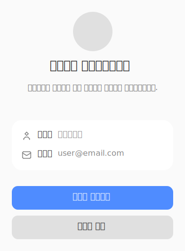

### 회원가입 완료 후 정회원 세션으로 전환한다

As a 고객, I want to 회원가입 완료 후 정회원 세션으로 전환한다, so that 로그인 상태로 서비스 이용을 바로 시작할 수 있다

**Acceptance Criteria.**

1. the system SHALL 임시 세션이 종료된다
2. the system SHALL 로그인 세션이 생성된다
3. the system SHALL 자동 로그인이 적용된다
4. the system SHALL 세션 유효시간이 설정된다
5. the system SHALL 가입 완료 후 이동 경로로 이동된다

#### Wireframe: SwitchMemberSession

- frame: 회원 세션 전환 · layout: vertical
  - frame: 상단 안내 · layout: vertical
    - frame: Icon / lucide:check-circle
      - icon: path
      - icon: path
    - text: "회원가입이 완료되었습니다"
    - text: "임시 세션이 종료되고 정회원 세션으로 전환되었습니다."
  - frame: 상태 표시 · layout: horizontal
    - frame: 임시 세션 · layout: vertical
      - ellipse: Ellipse
      - text: "임시 세션"
      - text: "종료됨"
    - frame: Icon / lucide:arrow-right
      - icon: path
    - frame: 정회원 세션 · layout: vertical
      - ellipse: Ellipse
      - text: "정회원 세션"
      - text: "활성화됨"
  - frame: 하단 안내 · layout: vertical
    - text: "이제 모든 서비스를 이용하실 수 있습니다."
    - frame: 메인으로 이동 버튼 · layout: vertical
      - text: "메인으로 이동"

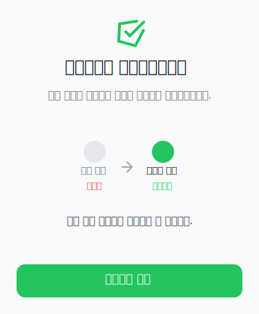

### 로그인을 시도한다

As a 고객, I want to 로그인을 시도한다, so that 본인 계정으로 서비스에 접근할 수 있다

**Acceptance Criteria.**

1. the system SHALL 계정 상태에 따라 로그인 가능 여부가 판정된다
2. the system SHALL 휴면 상태일 경우 안내 및 해제 경로가 제공된다
3. the system SHALL 탈퇴/가입제한 상태 로그인 시 별도 처리가 적용된다
4. the system SHALL 로그인 실패 시 안내가 제공된다
5. the system SHALL 로그인 실패 재시도 횟수가 제한된다

### 휴면 해제를 시도한다

As a 휴면_회원, I want to 휴면 해제를 시도한다, so that 정상 회원으로 서비스 이용을 재개할 수 있다

**Acceptance Criteria.**

1. the system SHALL 휴면 해제 가능 상태가 판정된다
2. the system SHALL 본인확인 및 약관 재동의가 필요할 수 있다
3. the system SHALL 해제 불가 시 안내가 제공된다
4. the system SHALL 휴면 해제 가능 채널이 제한될 수 있다

### 휴면 해제 처리를 완료한다

As a 휴면_회원, I want to 휴면 해제 처리를 완료한다, so that 정상 회원 상태로 전환되어 모든 서비스를 이용할 수 있다

**Acceptance Criteria.**

1. the system SHALL 상태 전환 조건이 충족되어야 한다
2. the system SHALL 전환 후 상태가 정상 회원으로 반영된다
3. the system SHALL 중복 요청 시 적절히 처리된다
4. the system SHALL 상태 전환 실패 시 안내가 제공된다

### 휴면 해제 처리를 한다

As a 회원, I want to 휴면 해제 처리를 한다, so that 휴면 상태에서 정상 회원으로 전환하여 서비스를 재이용하기 위해

**Acceptance Criteria.**

1. the system SHALL 휴면 해제 시 본인인증이 요구될 수 있다
2. the system SHALL 휴면 해제 대상 약관에 재동의가 필요하다
3. the system SHALL 상태 전환 조건 및 실패 시 처리 기준이 적용된다
4. the system SHALL 휴면 데이터 복원 정책에 따라 데이터가 복원된다
5. the system SHALL 세션 복구 또는 재로그인이 필요할 수 있다
6. the system SHALL 휴면 해제 결과 안내가 제공된다

### 휴면 해제 결과 안내를 확인한다

As a 회원, I want to 휴면 해제 결과 안내를 확인한다, so that 휴면 해제 처리 결과와 후속 이용 가능 상태를 파악하기 위해

**Acceptance Criteria.**

1. the system SHALL 안내 시점 및 채널에 따라 결과 안내가 제공된다
2. the system SHALL 후속 권장 경로 및 이동 경로가 안내된다
3. the system SHALL 결과 안내 이력이 저장된다
4. the system SHALL 발송 실패 시 처리 기준이 적용된다

### 탈퇴 전 안내를 확인한다

As a 회원, I want to 탈퇴 전 안내를 확인한다, so that 탈퇴로 인한 불이익, 미처리 항목, 자산 소멸, 연계 서비스 영향 등을 충분히 인지하여 의사결정을 할 수 있도록 하기 위해

**Acceptance Criteria.**

1. the system SHALL 탈퇴 가능/제한 회원 상태에 따라 안내가 다르게 제공된다
2. the system SHALL 미납 요금, 미완료 주문, 진행 중 민원 등 미처리 항목이 조회되어 안내된다
3. the system SHALL 보유 포인트, 쿠폰, 멤버십 등 소멸 자산이 안내된다
4. the system SHALL 구독, 결합, 멤버십, 제휴 서비스 등 연계 서비스 영향이 안내된다
5. the system SHALL 각 안내는 필수 확인 항목 여부에 따라 전체 확인 또는 일부 확인이 가능하다
6. the system SHALL 안내 확인 증적이 저장된다
7. the system SHALL 안내 이력이 보관된다
8. the system SHALL 안내 미확인 시 탈퇴 진행이 제한된다

### 탈퇴 최종 동의를 한다

As a 회원, I want to 탈퇴 최종 동의를 한다, so that 실제 탈퇴 의사를 명확히 확인받아 탈퇴 처리를 진행할 수 있도록 하기 위해

**Acceptance Criteria.**

1. the system SHALL 탈퇴 최종 동의 대상에게만 동의 절차가 제공된다
2. the system SHALL 동의 방식(체크박스, 버튼 등)에 따라 동의를 표시한다
3. the system SHALL 동의 문구가 명확히 안내된다
4. the system SHALL 동의 유효시간 내에 동의해야 한다
5. the system SHALL 동의 전 필수 조건(사전 안내 확인 등)이 충족되어야 한다
6. the system SHALL 동의 철회가 가능한 경우 철회 버튼이 제공된다
7. the system SHALL 미동의 시 탈퇴가 진행되지 않는다
8. the system SHALL 동의 후 탈퇴 처리가 시작된다
9. the system SHALL 동의 증적이 저장되고, 이력이 보관된다

### 회원 탈퇴를 요청한다

As a 회원, I want to 회원 탈퇴를 요청한다, so that 더 이상 서비스를 이용하지 않기 위해 계정을 탈퇴할 수 있도록 하기 위해

**Acceptance Criteria.**

1. the system SHALL 전환 전 회원 상태가 탈퇴 가능 상태여야 한다
2. the system SHALL 탈퇴 요청 후 회원 상태가 변경된다
3. the system SHALL 유예 기간이 적용되는 경우 유예 상태로 전환된다
4. the system SHALL 상태 전환 조건과 처리 시스템이 정책에 따라 동작한다
5. the system SHALL 중복 요청 시 처리 규칙을 따른다
6. the system SHALL 상태 전환 실패 시 안내 및 처리된다
7. the system SHALL 상태 전환 이력이 저장된다

### 탈퇴 처리 결과를 안내받는다

As a 회원, I want to 탈퇴 처리 결과를 안내받는다, so that 탈퇴가 정상적으로 처리되었는지, 유예 기간 및 데이터 보관 등 후속 정보를 확인할 수 있도록 하기 위해

**Acceptance Criteria.**

1. the system SHALL 안내 대상에게만 결과가 안내된다
2. the system SHALL 안내 시점 및 채널(화면, 이메일, SMS 등)이 정책에 따라 제공된다
3. the system SHALL 탈퇴 결과, 유예 기간, 데이터 보관, 후속 문의 경로 등이 안내된다
4. the system SHALL 발송 제외 조건에 해당하면 안내가 생략된다
5. the system SHALL 발송 실패 시 처리 규칙을 따른다
6. the system SHALL 결과 안내 이력이 저장된다

### 탈퇴 요청을 철회한다

As a 회원, I want to 탈퇴 요청을 철회한다, so that 유예 기간 내에 탈퇴 의사를 번복하여 계정 이용을 계속할 수 있도록 하기 위해

**Acceptance Criteria.**

1. the system SHALL 유예 기간 내에만 철회가 가능하다
2. the system SHALL 철회 가능/불가 조건이 정책에 따라 적용된다
3. the system SHALL 철회 요청 채널(웹, 앱 등)이 정책에 따라 제공된다
4. the system SHALL 철회 이력이 저장된다
5. the system SHALL 유예 종료 시점 이후에는 철회가 불가하다

### 기존 회원 이력을 확인한다

As a 회원, I want to 기존 회원 이력을 확인한다, so that 계정 복원, 재가입, 서비스 이용 제한 여부를 확인하기 위해

**Acceptance Criteria.**

1. the system SHALL 회원 상태(정상, 휴면, 탈퇴, 가입 제한, 미가입 등)가 조회된다
2. the system SHALL 상태 조회 기준 식별정보(CI, DI, 휴대폰번호 등)를 입력해야 한다
3. the system SHALL 상태별 후속 처리(정상, 휴면, 탈퇴, 가입제한, 미가입 등)가 다르다
4. the system SHALL 상태 불일치, 조회 실패 시 별도 안내 및 처리 기준이 적용된다
5. the system SHALL 상태 조회 이력 및 항목이 저장된다

### 재가입 가능 여부를 확인한다

As a 회원, I want to 재가입 가능 여부를 확인한다, so that 탈퇴 후 재가입 또는 계정 복원 가능성을 사전에 확인하기 위해

**Acceptance Criteria.**

1. the system SHALL 탈퇴 이력, 제한 기간, 고객 상태, 중복 계정 기준에 따라 재가입 가능 여부가 판정된다
2. the system SHALL 재가입 가능/불가 상태 및 제한 기간이 안내된다
3. the system SHALL 재가입 가능 채널이 안내된다
4. the system SHALL 재가입 불가 시 안내 문구가 노출된다
5. the system SHALL 판정 이력 및 항목이 저장된다
6. the system SHALL 재가입 제한 조건과 예외 승인 가능 조건이 적용된다
7. the system SHALL 예외 승인 시 증빙 자료 제출 및 승인 후 처리, 거절 처리, 제한 해제 조건이 적용된다

### 재가입을 처리한다

As a 회원, I want to 재가입을 처리한다, so that 탈퇴 또는 휴면 상태에서 계정을 복원하거나 신규 계정으로 재가입하기 위해

**Acceptance Criteria.**

1. the system SHALL 복원 처리 조건에 부합하면 기존 계정이 복원되고, 아니면 신규 계정이 생성된다
2. the system SHALL 기존 회원ID 재사용 여부, 신규 회원ID 발급 기준이 적용된다
3. the system SHALL CI/DI 등 식별정보 연결 기준이 적용된다
4. the system SHALL 기존 데이터 연결 또는 신규 생성 초기화 대상이 구분된다
5. the system SHALL 실패 시 롤백 및 중복 생성 방지 기준이 적용된다
6. the system SHALL 처리 결과 및 이력이 저장된다
7. the system SHALL 재가입 완료 후 안내 문구와 통지(알림, 화면 이동 등)가 제공된다
8. the system SHALL 이용 가능 상태 및 후속 이동 경로가 안내된다
9. the system SHALL 알림 발송 실패 시 별도 처리 기준이 적용된다

### 재가입 시 개인정보를 입력한다

As a 회원, I want to 재가입 시 개인정보를 입력한다, so that 재가입을 위해 필요한 정보를 제공하고 기존 정보를 재사용할 수 있도록 하기 위해

**Acceptance Criteria.**

1. the system SHALL 기존 정보 재사용 가능 항목과 제한 항목이 구분되어 노출된다
2. the system SHALL 신규 입력이 필요한 항목은 필수로 입력해야 한다
3. the system SHALL 고객 확인 대상 항목은 별도 확인 절차가 적용된다
4. the system SHALL 정보 최신화 기준에 따라 기존 휴대폰번호, 이메일 사용 조건이 적용된다
5. the system SHALL 입력값은 검증 기준(형식, 길이, 필수값, 정합성 등)을 충족해야 한다
6. the system SHALL 입력 이력 및 검증 실패 시 처리 기준이 적용된다

### 회원 정보의 중복 여부를 확인한다

As a 회원, I want to 회원 정보의 중복 여부를 확인한다, so that 이미 등록된 정보로 인한 중복 가입을 방지하기 위해

**Acceptance Criteria.**

1. the system SHALL CI, DI, 휴대폰번호, 이메일 등 중복 확인 대상 식별정보가 검증된다
2. the system SHALL CI, DI, 아이디, 휴대폰번호, 이메일 각각의 중복 처리 기준이 적용된다
3. the system SHALL 기존 정상/휴면/탈퇴 회원 식별 시 각각 처리 기준이 다르다
4. the system SHALL 중복 확인은 지정된 시스템과 시점에 수행된다
5. the system SHALL 중복 확인 실패 시 별도 안내 및 처리 기준이 적용된다

### 로그인한다

As a 회원, I want to 로그인한다, so that 개인화된 서비스와 회원 전용 기능을 이용한다

**Acceptance Criteria.**

1. the system SHALL 정상 회원만 로그인할 수 있다
2. the system SHALL 비회원, 탈퇴 회원, 휴면 회원은 로그인할 수 없다
3. the system SHALL 인증 세션이 생성된다

### 회원정보를 조회한다

As a 회원, I want to 회원정보를 조회한다, so that 내 정보를 확인하고 필요한 경우 변경할 수 있다

**Acceptance Criteria.**

1. the system SHALL 회원정보(이름, 연락처, 이메일 등)가 표시된다
2. the system SHALL 약관 동의 이력이 표시된다

#### Wireframe: MemberProfile

- frame: 회원 프로필 · layout: vertical
  - frame: 상단바 · layout: horizontal
    - text: "내 프로필"
  - frame: 프로필 카드 · layout: vertical
    - ellipse: 프로필 이미지
    - text: "홍길동"
    - text: "honggildong@email.com"
    - frame: 회원 정보 요약 · layout: horizontal
      - frame: 가입일 · layout: vertical
        - text: "가입일"
        - text: "2023-01-01"
      - frame: 등급 · layout: vertical
        - text: "등급"
        - text: "일반"
    - frame: 프로필 수정 버튼 · layout: vertical
      - text: "프로필 수정"
  - frame: 회원 상세 정보 · layout: vertical
    - frame: 정보 항목 · layout: horizontal
      - text: "휴대폰 번호"
      - text: "010-1234-5678"
    - frame: 정보 항목 · layout: horizontal
      - text: "생년월일"
      - text: "1990-05-15"
    - frame: 정보 항목 · layout: horizontal
      - text: "주소"
      - text: "서울특별시 강남구"

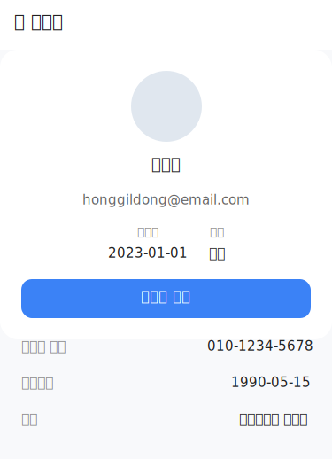

### 회원정보를 변경한다

As a 회원, I want to 회원정보를 변경한다, so that 최신 정보로 서비스를 이용할 수 있다

**Acceptance Criteria.**

1. the system SHALL 본인인증이 필요할 수 있다
2. the system SHALL 변경된 정보가 저장된다

#### Wireframe: UpdateMemberInformation

- frame: 회원정보 변경 · layout: vertical
  - frame: 헤더 · layout: horizontal
    - frame: Icon / lucide:chevron-left
      - icon: path
    - text: "회원정보 변경"
    - frame: Frame
  - frame: 폼 · layout: vertical
    - frame: 이름 입력 · layout: vertical
      - text: "이름"
      - rect: Rectangle
        - text: "이름을 입력하세요"
    - frame: 이메일 입력 · layout: vertical
      - text: "이메일"
      - rect: Rectangle
        - text: "이메일을 입력하세요"
    - frame: 휴대폰 입력 · layout: vertical
      - text: "휴대폰 번호"
      - rect: Rectangle
        - text: "휴대폰 번호를 입력하세요"
    - frame: 비밀번호 변경 · layout: vertical
      - text: "비밀번호"
      - rect: Rectangle
        - text: "비밀번호를 입력하세요"
  - frame: 저장 버튼 영역 · layout: vertical
    - rect: Rectangle
      - text: "저장"

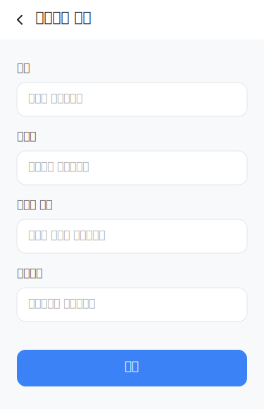

### 재가입을 한다

As a 고객, I want to 재가입을 한다, so that 탈퇴 또는 기존 가입 이력이 있어도 다시 회원이 되어 서비스를 이용할 수 있다

**Acceptance Criteria.**

1. the system SHALL 재가입 제한 기간이 경과해야 한다
2. the system SHALL 기존 계정 상태 및 재가입 가능 조건이 확인된다
3. the system SHALL 재가입 시 복원 가능한 계정 정보가 복원된다

### 재가입을 신청한다

As a 가입_제한_회원, I want to 재가입을 신청한다, so that 정책상 허용되는 경우 서비스 이용을 재개한다

**Acceptance Criteria.**

1. the system SHALL 가입 제한 사유가 해소되어야 한다
2. the system SHALL 본인인증을 완료해야 한다
3. the system SHALL 필수 약관에 재동의해야 한다

### 약관 동의 이력을 조회한다

As a 회원, I want to 약관 동의 이력을 조회한다, so that 내가 동의한 약관의 내역을 확인할 수 있다

**Acceptance Criteria.**

1. the system SHALL 약관명, 버전, 동의 일시, 채널, 철회 여부가 표시된다

#### Wireframe: TermsConsentHistory

- frame: 약관 동의 이력 · layout: vertical
  - frame: 헤더 · layout: horizontal
  - frame: 설명 · layout: horizontal
  - frame: 이력 리스트 · layout: horizontal

### 회원가입 시 식별정보 중복 여부를 확인받는다

As a 회원, I want to 회원가입 시 식별정보 중복 여부를 확인받는다, so that 중복 가입을 방지하고 본인 계정만 이용할 수 있도록 하기 위해

**Acceptance Criteria.**

1. the system SHALL 중복 확인 대상은 CI, DI, 아이디, 휴대폰번호, 이메일이다
2. the system SHALL 동일 CI는 1인 1계정만 허용된다
3. the system SHALL 동일 DI는 중복 가입이 불가하다
4. the system SHALL 아이디 중복 시 사용 불가 안내가 제공된다
5. the system SHALL 휴대폰번호 중복 시 기존 회원 확인 안내가 제공된다
6. the system SHALL 이메일 중복 시 기존 계정 확인 안내가 제공된다
7. the system SHALL 기존 정상 회원이 있으면 로그인 또는 아이디 찾기 안내가 제공된다
8. the system SHALL 기존 휴면 회원이 있으면 휴면 해제 안내가 제공된다
9. the system SHALL 기존 탈퇴 회원이 있으면 재가입 가능 여부를 확인한다
10. the system SHALL 중복 확인은 회원 정보 입력 완료 후, 가입 처리 전에 BSS 시스템에서 수행된다
11. the system SHALL 중복 확인 실패 시 다음 단계로 진행할 수 없다

### 회원가입 시 법정대리인 동의를 받는다

As a 미성년자_회원, I want to 회원가입 시 법정대리인 동의를 받는다, so that 법적으로 보호받으며 서비스를 이용하기 위해

**Acceptance Criteria.**

1. the system SHALL 만 14세 미만 또는 법정대리인 동의가 필요한 미성년자는 법정대리인 동의가 필요하다
2. the system SHALL 법정대리인 인증수단은 휴대폰 본인인증, PASS 인증을 지원한다
3. the system SHALL 법정대리인은 본인인증 후 전자 동의를 진행한다
4. the system SHALL 법정대리인 동의 유효시간은 요청 발송 후 24시간이다
5. the system SHALL 법정대리인 동의가 미완료되면 다음 단계로 진행할 수 없다
6. the system SHALL 법정대리인 동의 증적(고객 CI 해시, 법정대리인 CI 해시, 법정대리인 이름, 휴대폰번호, 고객과의 관계, 동의 일시, 동의 채널 등)이 저장된다
7. the system SHALL 법정대리인 동의는 가입 또는 재가입 완료 전까지 철회할 수 있다
8. the system SHALL 법정대리인 동의 결과는 고객과 법정대리인에게 통지된다

### 회원가입 완료 후 안내 및 통지를 받는다

As a 회원, I want to 회원가입 완료 후 안내 및 통지를 받는다, so that 가입 완료 사실을 확인하고, 서비스 이용 방법 및 후속 안내를 받기 위해

**Acceptance Criteria.**

1. the system SHALL 가입 완료 안내 항목이 제공된다
2. the system SHALL 통지 채널(이메일, SMS 등)로 안내가 발송된다
3. the system SHALL 기본 완료 화면으로 이동한다
4. the system SHALL 후속 이동 경로(예: 메인 서비스 화면)로 안내된다
5. the system SHALL 이용 가능 상태가 안내된다
6. the system SHALL 알림 발송 시점이 정책에 따라 지정된다
7. the system SHALL 알림 발송 실패 시 별도 처리 기준이 적용된다
8. the system SHALL 재가입 이력 저장 여부 및 저장 항목이 정책에 따라 적용된다
9. the system SHALL 안내 문구는 정책에 따라 제공된다

### 회원 상태를 조회한다

As a bss, I want to 회원 상태를 조회한다, so that 회원의 가입/이용 가능 여부를 판단하기 위해

**Acceptance Criteria.**

1. the system SHALL 상태 코드는 미가입, 정상, 휴면, 탈퇴, 가입제한 중 하나이다
2. the system SHALL 정상 상태는 업무 계속 진행, 휴면은 휴면 해제 프로세스 이동, 탈퇴는 재가입 가능 여부 확인, 가입제한은 가입 불가 안내, 미가입은 신규 가입 가능 여부 확인으로 후속 처리한다
3. the system SHALL 상태 불일치 시 BSS 기준을 적용한다
4. the system SHALL 조회 실패 시 업무 중단 및 오류 안내를 한다
5. the system SHALL 상태 조회 이력을 저장한다(고객ID, CI 해시, 조회 일시, 조회 채널, 조회 결과 코드)

### 신규 가입 가능 여부를 판정한다

As a bss, I want to 신규 가입 가능 여부를 판정한다, so that 고객의 회원가입 가능성을 정확히 판단하기 위해

**Acceptance Criteria.**

1. the system SHALL 신규가입 가능 상태는 미가입이다
2. the system SHALL 정상 회원은 로그인 유도, 휴면 회원은 휴면 해제 유도, 탈퇴 회원은 재가입 가능 여부 확인, 가입 제한 고객은 가입 불가로 처리한다
3. the system SHALL 동일 CI로 기존 계정이 있으면 중복으로 판정한다
4. the system SHALL 가입 불가 시 사유와 후속 처리 경로를 안내한다
5. the system SHALL 판정 실패 시 업무 중단 및 재시도 안내를 한다
6. the system SHALL 가입 제한 사유 코드는 DUPLICATE_CI, DORMANT_MEMBER, LEAVE_PENDING, REJOIN_LIMITED, BLOCKED_MEMBER이다
7. the system SHALL 신규 가입 재시도는 허용한다

### 회원 기본 프로필을 초기화한다

As a bss, I want to 회원 기본 프로필을 초기화한다, so that 회원의 기본 정보와 수신 설정을 등록하기 위해

**Acceptance Criteria.**

1. the system SHALL 초기 프로필 항목은 이름, 휴대폰번호, 이메일, 생년월일, 성별, 고객 유형이다
2. the system SHALL 기본 프로필 표시명은 고객 이름이다
3. the system SHALL 초기 수신 설정 및 마케팅/맞춤형 혜택 제공 초기값은 약관 동의 결과 및 고객 동의값을 따른다
4. the system SHALL 기본 연락처는 본인인증 휴대폰번호, 기본 이메일은 고객 입력 이메일이다
5. the system SHALL 초기 권한 상태는 일반 회원이다
6. the system SHALL 프로필 생성 실패 시 가입 처리를 중단한다
7. the system SHALL 프로필 변경 가능 항목은 이메일, 연락처, 마케팅 수신 설정이고, CI, DI는 변경 불가하다

### 가입 완료 회원의 세션을 전환한다

As a 시스템, I want to 가입 완료 회원의 세션을 전환한다, so that 가입 직후 자동 로그인 상태로 서비스를 이용할 수 있게 하기 위해

**Acceptance Criteria.**

1. the system SHALL 임시 세션은 가입 완료 즉시 종료한다
2. the system SHALL 가입 완료 회원에게 자동으로 로그인 세션을 생성한다
3. the system SHALL 세션 유효시간은 24시간이다
4. the system SHALL 세션 생성 기준 정보는 고객ID, 인증 결과, 가입 완료 상태이다
5. the system SHALL 세션 생성 실패 시 재로그인을 유도한다
6. the system SHALL 임시 세션 데이터는 삭제한다
7. the system SHALL 가입 완료 후 가입 완료 화면으로 이동한다

### 회원 경로를 분기 처리한다

As a 시스템, I want to 회원 경로를 분기 처리한다, so that 회원 상태에 따라 적절한 후속 프로세스로 안내하기 위해

**Acceptance Criteria.**

1. the system SHALL 미가입 상태는 개인정보 입력 경로로, 정상 회원은 로그인 경로로, 휴면 회원은 휴면 해제 경로로, 탈퇴 회원은 재가입 가능 여부 확인 경로로, 가입제한 회원은 가입 불가 안내 경로로 이동한다
2. the system SHALL 상태 조회 실패 시 오류 안내 경로로 이동한다
3. the system SHALL 고객이 로그인, 회원가입, 재가입을 선택할 수 있다
4. the system SHALL 자동 분기 기준은 상태 코드이다
5. the system SHALL 분기 처리 시스템은 채널, BSS이다
6. the system SHALL 분기 이력(고객ID, 상태 코드, 분기 경로, 처리 일시)을 저장한다

### 프로필 정보를 변경한다

As a 회원, I want to 프로필 정보를 변경한다, so that 연락처 및 수신 설정 등 개인정보를 최신 상태로 유지하기 위해

**Acceptance Criteria.**

1. the system SHALL 이메일, 연락처, 마케팅 수신 설정만 변경 가능하다
2. the system SHALL CI, DI는 변경할 수 없다

#### Wireframe: UpdateProfileInformation

- frame: 프로필 정보 변경 · layout: vertical
  - frame: 헤더 · layout: horizontal
    - frame: Icon / lucide:arrow-left
      - icon: path
    - text: "프로필 정보 변경"
  - frame: 폼 · layout: vertical
    - frame: 이메일 · layout: vertical
      - text: "이메일"
      - rect: 이메일 입력
        - text: "example@email.com"
    - frame: 연락처 · layout: vertical
      - text: "연락처"
      - rect: 연락처 입력
        - text: "010-1234-5678"
    - frame: 마케팅 수신 설정 · layout: vertical
      - text: "마케팅 수신 동의"
      - frame: Frame · layout: horizontal
        - rect: 마케팅 수신 체크박스
          - frame: Icon / lucide:check
            - icon: path
        - text: "이메일 및 문자 수신 동의"
  - frame: 하단버튼 · layout: vertical
    - rect: 저장 버튼
      - text: "저장"

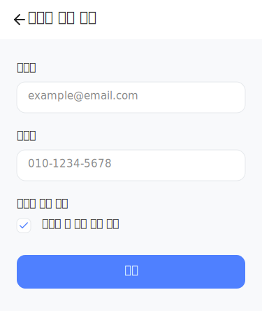

### 회원가입을 완료하고 자동으로 로그인한다

As a 회원, I want to 회원가입을 완료하고 자동으로 로그인한다, so that 가입 직후 별도의 로그인 없이 서비스를 바로 이용하기 위해

**Acceptance Criteria.**

1. the system SHALL 가입 완료 즉시 임시 세션이 종료된다
2. the system SHALL 가입 완료 회원에게 로그인 세션이 생성된다
3. the system SHALL 로그인 세션의 유효시간은 24시간이다
4. the system SHALL 자동 로그인이 적용된다
5. the system SHALL 세션 생성 기준 정보는 고객ID, 인증 결과, 가입 완료 상태이다
6. the system SHALL 가입 완료 후 가입 완료 화면으로 이동한다
7. the system SHALL 세션 생성 실패 시 재로그인을 유도한다
8. the system SHALL 임시 세션 데이터(인증 세션, 입력 임시저장 정보)는 삭제된다
9. the system SHALL 세션 전환 이력이 저장된다(고객ID, 전환 일시, 전환 결과 코드, 채널)

### 로그인을 한다

As a 회원, I want to 로그인을 한다, so that 서비스에 접근하고 개인화된 기능을 이용하기 위해

**Acceptance Criteria.**

1. the system SHALL 정상 상태의 회원만 로그인할 수 있다
2. the system SHALL 휴면 상태 회원은 휴면 안내가 노출된다
3. the system SHALL 탈퇴 상태 회원은 재가입 안내가 노출된다
4. the system SHALL 가입제한 상태 회원은 로그인 불가 안내가 노출된다
5. the system SHALL 로그인 실패 시 로그인 실패 안내가 노출된다
6. the system SHALL 휴면 안내는 회원 상태가 휴면일 때만 노출된다
7. the system SHALL 휴면 해제 이동 경로는 휴면 해제 프로세스이다
8. the system SHALL 로그인 상태 조회 기준은 고객ID, CI이다
9. the system SHALL 로그인 결과가 저장된다(고객ID, 로그인 일시, 로그인 채널, 결과 코드)
10. the system SHALL 로그인 실패 재시도는 5회까지 허용된다
11. the system SHALL 휴면 진입 안내 문구가 노출된다

### 휴면 해제 프로세스를 진행한다

As a 회원, I want to 휴면 해제 프로세스를 진행한다, so that 휴면 상태에서 정상 상태로 전환하여 서비스를 재이용하기 위해

**Acceptance Criteria.**

1. the system SHALL 휴면 상태에서만 해제 가능하다
2. the system SHALL 탈퇴, 가입제한 상태에서는 해제 불가하다
3. the system SHALL 본인확인이 필수이다
4. the system SHALL 개정된 필수 약관이 있을 경우 재동의가 필수이다
5. the system SHALL 앱, 모바일웹, PC웹에서 해제 가능하다
6. the system SHALL 본인인증 실패, 가입제한 상태, BSS 상태 조회 실패 시 해제 제한된다
7. the system SHALL 해제 불가 시 사유 및 후속 문의 경로가 안내된다
8. the system SHALL 휴면 해제 판정은 BSS 시스템에서 처리된다
9. the system SHALL 로그인 후 휴면 상태 확인 시 판정이 이루어진다
10. the system SHALL 판정 실패 시 업무가 중단되고 오류가 안내된다
11. the system SHALL 해제 가능 여부 이력이 저장된다(고객ID, 상태 코드, 판정 결과, 판정 일시)

### 휴면 상태를 정상 상태로 전환한다

As a 회원, I want to 휴면 상태를 정상 상태로 전환한다, so that 휴면 해제 후 정상적으로 서비스를 이용하기 위해

**Acceptance Criteria.**

1. the system SHALL 휴면 상태에서만 전환 가능하다
2. the system SHALL 본인인증 성공, 필수 약관 재동의 완료, 휴면 해제 가능 판정 통과 시 전환된다
3. the system SHALL 상태 전환은 BSS 시스템에서 처리된다
4. the system SHALL 상태 전환 기준 시각은 BSS 처리 완료 시각이다
5. the system SHALL 동일 세션 내 중복 요청은 1회만 처리된다
6. the system SHALL 상태 전환 실패 시 업무가 중단되고 오류가 안내된다
7. the system SHALL 상태 전환 이력이 저장된다(고객ID, 이전 상태, 변경 상태, 처리 일시, 처리 채널, 처리 결과 코드)
8. the system SHALL 상태 전환 결과에 따라 앱 푸시 또는 SMS로 알림이 발송된다
9. the system SHALL 상태 전환 결과 코드는 성공, 실패, 오류가 있다

### 휴면 상태 해제 시 개인정보 및 서비스 이용 데이터를 복원한다

As a 회원, I want to 휴면 상태 해제 시 개인정보 및 서비스 이용 데이터를 복원한다, so that 휴면 해제 후 기존의 정보와 설정을 그대로 사용할 수 있도록 하기 위해

**Acceptance Criteria.**

1. the system SHALL 회원 기본정보, 로그인 정보, 마케팅 수신 동의, 서비스 이용 설정이 복원된다
2. the system SHALL 삭제 대상 개인정보, 법정 보관 만료 정보는 복원되지 않는다
3. the system SHALL 복원은 휴면 상태 전환 완료 후에만 가능하다
4. the system SHALL 복원은 BSS 시스템에서 처리된다
5. the system SHALL 복원 순서는 식별정보, 회원 기본정보, 수신 동의, 서비스 이용 설정 순이다
6. the system SHALL 복원 기준 시각은 BSS 복원 완료 시각이다
7. the system SHALL 부분 복원은 허용되지 않는다
8. the system SHALL 복원 실패 시 업무가 중단되고 오류가 안내된다
9. the system SHALL 복원 후 회원 상태, 로그인 가능 여부, 필수 정보 존재 여부가 검증된다
10. the system SHALL 복원 이력이 저장된다(고객ID, 복원 대상, 복원 결과, 복원 일시, 처리 채널)
11. the system SHALL 복원 결과 코드는 성공, 실패, 부분 실패, 오류가 있다

#### Wireframe: DormantAccountRestorationResult

- frame: 휴면 해제 결과 · layout: vertical
  - frame: 상단 아이콘+타이틀 · layout: horizontal
  - frame: 확인 버튼 영역 · layout: horizontal

### 휴면 해제 후 세션을 복구한다

As a 회원, I want to 휴면 해제 후 세션을 복구한다, so that 휴면 해제 및 데이터 복원 후 별도의 로그인 없이 서비스를 바로 이용하기 위해

**Acceptance Criteria.**

1. the system SHALL 휴면 상태 전환 및 데이터 복원 완료 후 세션이 복구된다
2. the system SHALL 기존 로그인 세션은 즉시 만료된다
3. the system SHALL 신규 로그인 세션이 생성된다
4. the system SHALL 재로그인이 필요하지 않다
5. the system SHALL 세션 유효시간은 24시간이다
6. the system SHALL 세션 복구 후 홈 화면으로 이동한다
7. the system SHALL 세션 복구 실패 시 재로그인을 유도한다
8. the system SHALL 세션 저장 항목은 고객ID, 세션ID, 생성 일시, 만료 일시, 채널이다
9. the system SHALL 세션 보안 검증 항목은 기기 식별값, 접속 IP, 토큰 유효성이다
10. the system SHALL 세션 복구 이력이 저장된다

### 휴면 해제 데이터 복원 을 요청한다

As a 회원, I want to 휴면 해제 데이터 복원 을 요청한다, so that 서비스 이용을 재개하기 위해

**Acceptance Criteria.**

1. the system SHALL 복원 제외 데이터(삭제 대상 개인정보, 법정 보관 만료 정보)는 복원되지 않는다
2. the system SHALL 휴면 상태 전환이 완료된 후에만 복원이 가능하다
3. the system SHALL 식별정보, 회원 기본정보, 마케팅 수신 동의, 서비스 이용 설정 등이 복원된다
4. the system SHALL 복원 기준 시각은 BSS 복원 완료 시각으로 한다
5. the system SHALL 부분 복원은 허용되지 않는다
6. the system SHALL 복원 실패 시 업무가 중단되고 오류 안내가 제공된다
7. the system SHALL 복원 후 회원 상태, 로그인 가능 여부, 필수 정보 존재 여부를 검증한다
8. the system SHALL 복원 이력이 고객ID, 복원 대상, 복원 결과, 복원 일시, 처리 채널로 저장된다
9. the system SHALL 복원 결과 코드는 성공, 실패, 부분 실패, 오류 중 하나로 기록된다

### 휴면 해제 결과 안내를 받는다

As a 회원, I want to 휴면 해제 결과 안내를 받는다, so that 휴면 해제 및 서비스 이용 가능 여부를 즉시 확인하기 위해

**Acceptance Criteria.**

1. the system SHALL 안내 대상은 휴면 해제 완료 고객이다
2. the system SHALL 안내는 휴면 해제 완료 즉시 제공된다
3. the system SHALL 안내 채널은 화면, 앱 푸시, SMS이다
4. the system SHALL 화면 안내에는 정상 회원 전환 완료, 서비스 이용 가능 상태, 후속 이동 경로가 포함된다
5. the system SHALL 알림 발송에는 휴면 해제 완료 일시, 처리 채널이 포함된다
6. the system SHALL 고객 연락처 부재 또는 알림 수신 불가 상태인 경우 안내가 제외된다
7. the system SHALL 안내 후 기본 이동 경로는 홈이다
8. the system SHALL 후속 권장 경로로 회원정보 확인, 마케팅 동의 관리가 안내된다
9. the system SHALL 결과 안내 이력이 고객ID, 안내 채널, 발송 일시, 발송 결과 코드로 저장된다
10. the system SHALL 발송 실패 시 화면 안내가 유지된다
11. the system SHALL 안내 문구는 '휴면 해제가 완료되었습니다. 지금부터 정상적으로 서비스를 이용할 수 있습니다.'이다

### 회원 탈퇴 사유를 입력하고 제출한다

As a 회원, I want to 회원 탈퇴 사유를 입력하고 제출한다, so that 탈퇴 이유를 회사에 전달하여 서비스 개선에 기여하기 위해

**Acceptance Criteria.**

1. the system SHALL 탈퇴 사유 입력이 필수이다
2. the system SHALL 사유 코드는 서비스 이용 빈도 낮음, 혜택 불만, 개인정보 우려, 다른 서비스 이용, 기타 중 선택한다
3. the system SHALL 기타 선택 시 의견 입력이 필수이며 최대 500자까지 입력 가능하다
4. the system SHALL 사유 미선택 시 다음 단계로 진행할 수 없다
5. the system SHALL 민감정보(욕설, 비속어, 주민등록번호, 카드번호, 계좌번호 등) 입력이 제한된다
6. the system SHALL 사유가 고객ID, 사유 코드, 기타 의견, 입력 일시, 처리 채널로 저장된다
7. the system SHALL 사유는 탈퇴 완료 후 3년간 보관된다
8. the system SHALL 탈퇴 사유는 마케팅에 활용되지 않는다

### 회원 탈퇴 가능 여부를 사전 점검받는다

As a 회원, I want to 회원 탈퇴 가능 여부를 사전 점검받는다, so that 탈퇴 조건을 충족하는지 확인하고 원활한 탈퇴 절차를 위해

**Acceptance Criteria.**

1. the system SHALL 탈퇴 가능 회원 상태는 정상이다
2. the system SHALL 탈퇴 제한 회원 상태는 휴면, 가입제한, 탈퇴 상태이다
3. the system SHALL 본인인증이 선행되어야 한다
4. the system SHALL 점검 대상은 미납 요금, 미완료 주문, 진행 중 업무, 보유 혜택·자산, 연계 서비스이다
5. the system SHALL 탈퇴 가능은 제한 항목이 없을 때만 판정된다
6. the system SHALL 미납 요금, 필수 선처리 업무, BSS 상태 조회 실패 시 탈퇴가 불가하다
7. the system SHALL 탈퇴 불가 시 탈퇴 진행이 중단된다
8. the system SHALL 선처리 필요 업무는 선처리 후 재진입해야 한다
9. the system SHALL 점검은 BSS에서 수행된다
10. the system SHALL 점검 시점은 탈퇴 전 안내 진입 전이다
11. the system SHALL 점검 실패 시 업무가 중단되고 오류가 안내된다
12. the system SHALL 점검 이력이 저장된다

### 탈퇴 전 미납 미처리 항목을 확인한다

As a 회원, I want to 탈퇴 전 미납 미처리 항목을 확인한다, so that 탈퇴 불가 사유를 명확히 파악하고 필요한 조치를 취하기 위해

**Acceptance Criteria.**

1. the system SHALL 미납 조회 항목은 통신요금, 단말기 할부금, 소액결제, 콘텐츠 이용료이다
2. the system SHALL 미완료 주문 조회 항목은 진행 중 주문, 배송 중 주문, 교환/반품/환불 진행 건이다
3. the system SHALL 진행 중 업무 조회 항목은 상담 접수, 민원 접수, AS 접수, 명의변경 진행 건이다
4. the system SHALL 미납 존재 시 선결제가 필수이다
5. the system SHALL 미완료 주문 또는 진행 중 업무 존재 시 탈퇴가 불가하다
6. the system SHALL 부분 미납은 허용되지 않는다
7. the system SHALL 미처리 항목 안내에는 항목명, 금액, 처리 상태, 처리 경로, 담당 채널이 포함된다
8. the system SHALL 조회는 BSS, 주문 시스템, 상담 시스템에서 수행된다
9. the system SHALL 조회 실패 시 업무가 중단되고 오류가 안내된다
10. the system SHALL 확인 이력이 저장된다

### 탈퇴 전 미납 요금 및 미처리 항목을 확인한다

As a 회원, I want to 탈퇴 전 미납 요금 및 미처리 항목을 확인한다, so that 탈퇴 조건을 충족하는지 사전에 알 수 있다

**Acceptance Criteria.**

1. the system SHALL 통신요금, 단말기 할부금, 소액결제, 콘텐츠 이용료 등 미납 항목을 조회한다
2. the system SHALL 진행 중 주문, 배송 중 주문, 교환/반품/환불 진행 건 등 미완료 주문을 조회한다
3. the system SHALL 상담 접수, 민원 접수, AS 접수, 명의변경 등 진행 중 업무를 조회한다
4. the system SHALL 미납 또는 미완료 주문, 진행 중 업무가 존재하면 탈퇴 진행이 불가하다
5. the system SHALL 부분 미납은 허용되지 않는다
6. the system SHALL 미처리 항목의 항목명, 금액, 처리 상태, 처리 경로, 담당 채널이 안내된다
7. the system SHALL 조회 실패 시 업무가 중단되고 오류 안내가 제공된다
8. the system SHALL 조회 이력이 저장된다(고객ID, 조회 항목, 결과, 일시, 채널 등)

### 보유 혜택 및 자산 소멸 안내를 확인한다

As a 회원, I want to 보유 혜택 및 자산 소멸 안내를 확인한다, so that 탈퇴 시 소멸되는 포인트, 쿠폰, 멤버십 혜택 등 자산 정보를 인지할 수 있다

**Acceptance Criteria.**

1. the system SHALL 포인트, 쿠폰, 멤버십 혜택, 이벤트 응모권 등 소멸 대상 자산이 안내된다
2. the system SHALL 법정 보관 대상, 환불 대상 자산은 소멸 예외로 안내된다
3. the system SHALL 잔여 포인트, 쿠폰 등은 사용을 유도한다
4. the system SHALL 고객ID, CI 기준으로 BSS, 멤버십, 쿠폰 시스템에서 자산을 조회한다
5. the system SHALL 조회 실패 시 탈퇴 진행이 불가하다
6. the system SHALL 재가입 시 자산은 복구되지 않는다
7. the system SHALL 안내 이력이 저장된다(고객ID, 자산 유형, 안내/확인 일시, 처리 채널 등)

### 탈퇴 시 연계 서비스 영향 안내를 확인한다

As a 회원, I want to 탈퇴 시 연계 서비스 영향 안내를 확인한다, so that 탈퇴로 인해 이용 제한 또는 해지되는 연계 서비스 현황을 명확히 알 수 있다

**Acceptance Criteria.**

1. the system SHALL T 멤버십, T 우주, T 다이렉트샵, 구독, 결합, 제휴 서비스 등 영향 대상 서비스가 안내된다
2. the system SHALL 회원 기반 알림 설정, 개인화 설정, 내부 구독 연계 정보 등 자동 해지 대상 서비스가 안내된다
3. the system SHALL 제휴사 직접 가입, 외부 계정 연결 서비스 등 별도 해지 필요 서비스가 안내된다
4. the system SHALL 탈퇴 처리 완료 시 이용이 제한됨을 안내한다
5. the system SHALL 구독, 결합, 멤버십 영향 안내가 필수로 제공된다
6. the system SHALL 제휴사 정책이 우선 적용되는 서비스는 별도 안내된다
7. the system SHALL BSS, 구독, 멤버십, 제휴 연동 시스템에서 영향 조회를 수행한다
8. the system SHALL 조회 실패 시 탈퇴 진행이 불가하다
9. the system SHALL 고객 확인 방식은 체크박스이다
10. the system SHALL 안내 문구가 명시적으로 제공된다

### 탈퇴 전 안내 사항을 모두 확인한다

As a 회원, I want to 탈퇴 전 안내 사항을 모두 확인한다, so that 탈퇴에 따른 모든 중요 정보를 숙지하고 동의할 수 있다

**Acceptance Criteria.**

1. the system SHALL 탈퇴 제한 항목, 소멸 자산, 연계 서비스 영향, 데이터 보관·파기, 재가입 기준 등 필수 안내 항목을 모두 확인해야 한다
2. the system SHALL 항목별 체크 및 전체 확인이 가능하다
3. the system SHALL 필수 항목 전체 체크 시에만 전체 확인이 허용된다
4. the system SHALL 미확인 시 다음 단계로 진행할 수 없다
5. the system SHALL 확인 유효시간은 동일 세션 내로 제한된다
6. the system SHALL 세션 종료 시 재확인이 필요하다
7. the system SHALL 확인 증적이 저장된다(고객ID, 확인 항목, 일시, 채널, 세션ID)
8. the system SHALL 확인 이력은 탈퇴 완료 후 5년간 보관된다

### 회원 탈퇴에 최종 동의한다

As a 회원, I want to 회원 탈퇴에 최종 동의한다, so that 모든 안내와 조건을 숙지한 후 의사에 따라 탈퇴를 확정할 수 있다

**Acceptance Criteria.**

1. the system SHALL 최종 동의는 체크박스와 탈퇴 버튼 선택으로 이루어진다
2. the system SHALL 동의 문구는 '위 내용을 모두 확인했으며 회원 탈퇴에 동의합니다.'로 명시된다
3. the system SHALL 동의 유효시간은 동일 세션 내로 제한된다
4. the system SHALL 추가 인증, 탈퇴 전 안내 확인, 탈퇴 가능 판정이 모두 완료되어야 동의가 가능하다
5. the system SHALL 탈퇴 처리 전에는 동의 철회가 허용된다
6. the system SHALL 미동의 시 탈퇴 진행이 불가하다
7. the system SHALL 동의 후 탈퇴 처리 요청이 이루어진다
8. the system SHALL 동의 증적이 저장된다(고객ID, 동의 문구, 일시, 채널, 세션ID)
9. the system SHALL 동의 이력은 탈퇴 완료 후 5년간 보관된다

### 회원 탈퇴 상태를 전환한다

As a 회원, I want to 회원 탈퇴 상태를 전환한다, so that 탈퇴 요청 후 계정의 상태가 적절히 변경되어 서비스 이용이 제한된다

**Acceptance Criteria.**

1. the system SHALL 전환 전 상태는 정상, 탈퇴 요청 후 탈퇴유예, 유예 종료 후 탈퇴 상태로 변경된다
2. the system SHALL 탈퇴 최종 동의, 추가 인증, 탈퇴 가능 판정이 모두 완료되어야 상태 전환이 가능하다
3. the system SHALL 상태 전환은 BSS에서 처리한다
4. the system SHALL 처리 기준일시는 BSS 처리 완료 시각이다
5. the system SHALL 동일 고객 동일 세션 내 1회만 처리된다
6. the system SHALL 상태 전환 실패 시 업무가 중단되고 오류 안내가 제공된다
7. the system SHALL 상태 코드(ACTIVE, DORMANT, LEAVE_PENDING, LEAVED, BLOCKED)가 관리된다
8. the system SHALL 상태 전환 이력이 저장된다(고객ID, 이전 상태, 변경 상태, 일시, 채널, 결과 코드 등)

### 탈퇴 완료 시 모든 세션과 토큰을 종료한다

As a 회원, I want to 탈퇴 완료 시 모든 세션과 토큰을 종료한다, so that 탈퇴 후 계정 보안을 보장하고 추가 접근을 차단할 수 있다

**Acceptance Criteria.**

1. the system SHALL 탈퇴 완료 시 현재 세션과 전체 로그인 세션이 모두 종료된다

#### Wireframe: TerminateAllSessionsAndTokens

- frame: 모든 세션 및 토큰 종료 · layout: vertical
  - frame: 헤더 · layout: horizontal
  - frame: 아이콘 영역 · layout: horizontal
  - frame: 확인 버튼 영역 · layout: horizontal

### 탈퇴 요청 후 유예 기간 동안 탈퇴를 철회한다

As a 회원, I want to 탈퇴 요청 후 유예 기간 동안 탈퇴를 철회한다, so that 실수로 탈퇴한 계정을 복구할 수 있다

**Acceptance Criteria.**

1. the system SHALL 유예 기간은 7일이다
2. the system SHALL 유예 기간 내 본인 인증에 성공해야 한다
3. the system SHALL 유예 기간이 만료되거나 탈퇴 확정 처리 완료 시 철회가 불가하다
4. the system SHALL 철회 요청은 앱, 모바일웹, PC웹에서 가능하다
5. the system SHALL 철회 이력(고객ID, 철회 요청 일시, 처리 채널, 처리 결과 코드)을 저장한다

### 탈퇴 상태로 전환된다

As a 회원, I want to 탈퇴 상태로 전환된다, so that 계정이 완전히 탈퇴 처리되어 서비스 이용이 중단된다

**Acceptance Criteria.**

1. the system SHALL 전환 전 상태는 정상, 탈퇴 요청 후 상태는 탈퇴유예, 유예 종료 후 상태는 탈퇴다
2. the system SHALL 상태 전환 조건은 탈퇴 최종 동의 완료, 추가 인증 성공, 탈퇴 가능 판정 통과다
3. the system SHALL 상태 전환은 BSS 시스템에서 처리한다
4. the system SHALL 동일 고객 동일 세션 내 1회만 처리한다
5. the system SHALL 상태 전환 실패 시 업무 중단 및 오류 안내를 한다
6. the system SHALL 상태 코드(ACTIVE, DORMANT, LEAVE_PENDING, LEAVED, BLOCKED)를 사용한다
7. the system SHALL 상태 전환 이력(고객ID, 이전 상태, 변경 상태, 처리 일시, 처리 채널, 처리 결과 코드)을 저장한다

### 탈퇴 시 모든 로그인 세션과 인증 토큰을 종료한다

As a 회원, I want to 탈퇴 시 모든 로그인 세션과 인증 토큰을 종료한다, so that 탈퇴 후 계정 접근이 완전히 차단된다

**Acceptance Criteria.**

1. the system SHALL 현재 세션, 전체 로그인 세션, 인증 토큰, 갱신 토큰, 자동 로그인 토큰이 종료된다
2. the system SHALL 자동 로그인이 해제된다
3. the system SHALL 동시 접속이 모두 종료된다
4. the system SHALL 종료 시점은 탈퇴 상태 전환 완료 즉시다
5. the system SHALL 재로그인은 허용되지 않는다
6. the system SHALL 인증 세션은 즉시 만료된다
7. the system SHALL 종료 실패 시 재시도 후 실패 이력을 저장한다
8. the system SHALL 세션 종료 이력(고객ID, 세션ID, 종료 대상, 종료 일시, 종료 결과 코드)을 저장한다

### 탈퇴 회원의 데이터를 보관 또는 파기한다

As a 시스템, I want to 탈퇴 회원의 데이터를 보관 또는 파기한다, so that 법적 의무와 개인정보 보호를 준수한다

**Acceptance Criteria.**

1. the system SHALL 법정 보관 대상 거래 기록, 탈퇴 이력, 동의 이력은 보관한다
2. the system SHALL 법정 보관 대상 제외 개인정보, 마케팅 수신 정보, 개인화 설정은 파기한다
3. the system SHALL 법정 보관 대상 개인정보는 분리 보관한다
4. the system SHALL 전자상거래 거래기록은 5년, 소비자 불만·분쟁처리 기록은 3년, 접속기록은 3개월 보관한다
5. the system SHALL 자동 로그인 토큰, 개인화 설정, 마케팅 수신 설정은 즉시 파기한다
6. the system SHALL 파기 시점은 유예 기간 종료 후다
7. the system SHALL 파기는 복구 불가능한 방식으로 처리한다
8. the system SHALL 재가입 시 복구되는 데이터는 없다
9. the system SHALL 보관 기간 만료 후 데이터는 파기한다
10. the system SHALL 파기 이력(고객ID, 데이터 유형, 파기 일시, 파기 결과 코드, 처리 시스템)을 저장한다

### 탈퇴 결과 안내를 받는다

As a 회원, I want to 탈퇴 결과 안내를 받는다, so that 탈퇴 처리 및 데이터 보관/파기 기준 등 후속 정보를 명확히 인지할 수 있다

**Acceptance Criteria.**

1. the system SHALL 안내 대상은 탈퇴 요청 완료 고객, 탈퇴 확정 고객이다
2. the system SHALL 안내 시점은 탈퇴 요청 완료 즉시, 유예 종료 시다
3. the system SHALL 안내 채널은 화면, 앱 푸시, SMS다
4. the system SHALL 안내 항목에는 탈퇴 요청 완료, 유예 기간, 철회 경로, 데이터 보관·파기 기준, 재가입 기준, 후속 문의 경로가 포함된다
5. the system SHALL 유예 기간은 7일임을 안내한다
6. the system SHALL 데이터 보관 안내 항목(법정 보관 대상, 파기 대상, 보관 기간)이 포함된다
7. the system SHALL 후속 문의 경로(고객센터, 1:1 문의)를 안내한다
8. the system SHALL 고객 연락처 부재, 알림 수신 불가 상태는 발송 제외 조건이다
9. the system SHALL 발송 실패 시 화면 안내를 유지한다
10. the system SHALL 결과 안내 이력(고객ID, 안내 유형, 안내 채널, 발송 일시, 발송 결과 코드)을 저장한다
11. the system SHALL 안내 문구: '회원 탈퇴 요청이 완료되었습니다. 유예 기간 내에는 철회할 수 있습니다.'

#### Wireframe: MembershipWithdrawalResult

_No scene graph modeled for this UI._

### 탈퇴 철회 또는 재가입 가능 여부를 확인한다

As a 회원, I want to 탈퇴 철회 또는 재가입 가능 여부를 확인한다, so that 계정 복원 또는 신규 가입 가능성을 사전에 알 수 있다

**Acceptance Criteria.**

1. the system SHALL 복원 가능 상태는 탈퇴 철회 가능 상태다
2. the system SHALL 복원 불가 상태는 탈퇴 확정, 가입제한이다
3. the system SHALL 복원 가능 기간은 탈퇴 요청일로부터 7일이다
4. the system SHALL 복원 대상 데이터는 회원 계정, 기본 프로필, 약관 동의 이력, 알림 설정이다
5. the system SHALL 복원 제외 데이터는 탈퇴 시 즉시 삭제 대상 데이터다
6. the system SHALL 복원 판정 기준 식별자는 CI다
7. the system SHALL 복원 판정은 BSS 시스템에서 수행한다
8. the system SHALL 복원 불가 시 재가입 프로세스를 진행한다
9. the system SHALL 판정 실패 시 업무 중단 및 오류 안내를 한다
10. the system SHALL 판정 이력(CI, 회원ID, 판정 결과, 판정 일시, 처리 채널)을 저장한다
11. the system SHALL 재가입 가능 상태는 탈퇴 확정이다
12. the system SHALL 재가입 불가 상태는 정상, 휴면, 가입제한이다
13. the system SHALL 재가입 제한 기간은 탈퇴 요청일로부터 7일이다
14. the system SHALL 탈퇴 이력 기준으로 재가입 가능 여부를 판단한다

### 탈퇴한 계정을 복원한다

As a 회원, I want to 탈퇴한 계정을 복원한다, so that 탈퇴 철회 기간 내에 계정을 다시 사용할 수 있도록 하기 위해

**Acceptance Criteria.**

1. the system SHALL 복원 가능 상태는 탈퇴 철회 가능 상태에 한정된다
2. the system SHALL 복원 가능 기간은 탈퇴 요청일로부터 7일 이내이다
3. the system SHALL 복원 대상 데이터는 회원 계정, 기본 프로필, 약관 동의 이력, 알림 설정이다
4. the system SHALL 복원 제외 데이터는 탈퇴 시 즉시 삭제된 데이터이다
5. the system SHALL 복원 판정 기준은 CI를 사용한다
6. the system SHALL 복원 판정은 BSS 시스템에서 수행된다
7. the system SHALL 복원 불가 시 재가입 프로세스로 안내된다
8. the system SHALL 복원 판정 실패 시 업무가 중단되고 오류 안내가 제공된다
9. the system SHALL 복원 판정 이력이 저장된다 (CI, 회원ID, 판정 결과, 판정 일시, 처리 채널 포함)

#### Wireframe: RestoreMemberAccount

- frame: 계정 복원 · layout: vertical
  - frame: 헤더 · layout: horizontal
  - frame: 설명 · layout: horizontal
  - frame: 입력폼 · layout: horizontal
  - frame: 복원 요청 버튼 영역 · layout: horizontal

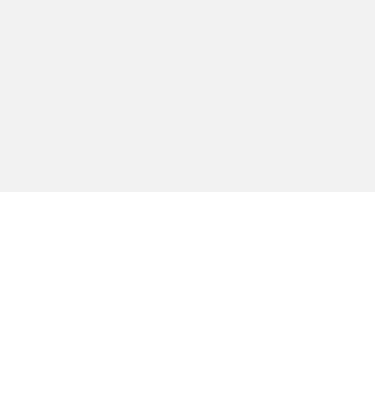

### 탈퇴 후 재가입 가능 여부를 확인한다

As a 회원, I want to 탈퇴 후 재가입 가능 여부를 확인한다, so that 재가입이 가능한지 확인하고, 필요한 경우 재가입을 진행할 수 있도록 하기 위해

**Acceptance Criteria.**

1. the system SHALL 재가입 가능 상태는 탈퇴 확정 상태이다
2. the system SHALL 재가입 불가 상태는 정상, 휴면, 가입제한 상태이다
3. the system SHALL 재가입 제한 기간은 탈퇴 요청일로부터 7일이다
4. the system SHALL 탈퇴 이력 기준은 CI를 사용한다
5. the system SHALL 중복 계정 기준은 CI, DI, 휴대폰번호이다
6. the system SHALL 재가입 가능 채널은 앱, 모바일웹, PC웹이다
7. the system SHALL 재가입 불가 시 불가 사유와 후속 문의 경로가 안내된다
8. the system SHALL 재가입 판정은 BSS 시스템에서 수행된다
9. the system SHALL 재가입 판정 실패 시 업무가 중단되고 오류 안내가 제공된다
10. the system SHALL 재가입 판정 이력이 저장된다 (CI, 회원ID, 판정 결과, 판정 일시, 처리 채널 포함)

### 재가입 제한 회원에 대해 예외 승인을 한다

As a 관리자, I want to 재가입 제한 회원에 대해 예외 승인을 한다, so that 특정 사유로 재가입 제한을 해제하여 회원이 재가입할 수 있도록 하기 위해

**Acceptance Criteria.**

1. the system SHALL 제한 대상은 가입제한 회원, 부정이용 이력 회원, 법령·약관 위반 회원이다
2. the system SHALL 제한 기준 식별자는 CI, DI이다
3. the system SHALL 제한 기간은 사유별 운영 정책에 따르며 기본 1년이다
4. the system SHALL 예외 승인 조건은 운영자 승인이다
5. the system SHALL 예외 승인 증빙은 본인확인 결과, 제한 해소 증빙, 운영자 승인 사유가 필요하다
6. the system SHALL 예외 승인 후 재가입이 가능하다
7. the system SHALL 예외 거절 시 재가입 불가 안내가 제공된다
8. the system SHALL 제한 해제 조건은 제한 기간 만료 또는 운영자 예외 승인 완료이다
9. the system SHALL 예외 이력이 저장된다 (고객ID, CI, 승인자ID, 승인 일시, 승인 결과 포함)

### 재가입 시 기존 정보를 재사용하거나 신규 정보를 입력한다

As a 회원, I want to 재가입 시 기존 정보를 재사용하거나 신규 정보를 입력한다, so that 재가입 절차를 간소화하고 필요한 정보를 최신화하기 위해

**Acceptance Criteria.**

1. the system SHALL 기존 정보 재사용 가능 항목은 본인인증 결과 항목, CI, DI이다
2. the system SHALL 비밀번호, 마케팅 동의, 선택 약관 동의는 신규 입력이 필요하다
3. the system SHALL 아이디, 비밀번호, 휴대폰번호, 이메일은 신규 입력 필수 항목이다
4. the system SHALL 이름, 휴대폰번호, 이메일은 고객 확인 대상 항목이다
5. the system SHALL 정보 최신화는 고객의 수정 입력값을 기준으로 한다
6. the system SHALL 기존 휴대폰번호는 본인인증 결과와 일치해야 사용 가능하다
7. the system SHALL 기존 이메일은 고객 확인 완료 시 사용 가능하다
8. the system SHALL 재사용 정보는 마스킹 처리되어 노출된다
9. the system SHALL 재사용 불가 시 신규 입력이 필요하다
10. the system SHALL 입력값 검증은 회원 정보 입력값 검증 정책을 따른다
11. the system SHALL 입력 이력이 저장된다 (고객ID, 입력 항목, 처리 일시, 처리 채널 포함)

### 계정 복원 또는 신규 계정 생성을 진행한다

As a 회원, I want to 계정 복원 또는 신규 계정 생성을 진행한다, so that 탈퇴 철회 또는 재가입 상황에 맞는 계정 상태로 서비스를 이용하기 위해

**Acceptance Criteria.**

1. the system SHALL 복원 처리는 탈퇴 철회 가능 상태 및 복원 가능 판정 통과 시 수행된다
2. the system SHALL 신규 생성은 탈퇴 확정 및 재가입 가능 판정 통과 시 수행된다
3. the system SHALL 기존 회원ID는 탈퇴 철회 가능 상태에서만 재사용된다
4. the system SHALL 신규 회원ID는 고객이 입력한 아이디가 중복되지 않을 때 발급된다
5. the system SHALL CI/DI 연결 기준을 따른다
6. the system SHALL 기존 데이터 연결 대상은 본인인증 결과 항목, 고객 식별 이력, 법정 보관 대상 이력이다
7. the system SHALL 신규 생성 시 기본 프로필, 약관 동의 이력, 수신 설정이 초기화된다
8. the system SHALL 실패 시 계정 생성, CI/DI 매핑, 프로필 생성이 롤백된다
9. the system SHALL 동일 CI 기준 1개 계정만 생성 가능하다
10. the system SHALL 처리 수행 시스템은 BSS이다
11. the system SHALL 처리 결과가 저장된다 (고객ID, CI, 처리 유형, 처리 일시, 처리 결과 코드 포함)

### 재가입을 완료하고 안내를 받는다

As a 회원, I want to 재가입을 완료하고 안내를 받는다, so that 정상적으로 서비스 이용을 재개할 수 있도록 하기 위해

**Acceptance Criteria.**

1. the system SHALL 재가입 완료 여부, 이용 가능 상태, 로그인 상태, 후속 안내가 안내된다
2. the system SHALL 안내는 앱 푸시, SMS, 이메일 채널로 발송된다
3. the system SHALL 재가입 완료 시 재가입 완료 화면으로 이동한다
4. the system SHALL 후속 이동 경로는 홈이다
5. the system SHALL 이용 가능 상태는 정상이다
6. the system SHALL 알림은 재가입 완료 즉시 발송된다
7. the system SHALL 알림 발송 실패 시 실패 이력이 저장된다
8. the system SHALL 재가입 이력이 저장된다 (고객ID, CI, 재가입 일시, 처리 채널, 처리 결과 코드 포함)
9. the system SHALL '재가입이 완료되었습니다. 지금부터 정상적으로 서비스를 이용할 수 있습니다.'라는 안내 문구가 제공된다

### 휴면 해제를 한다

As a 회원, I want to 휴면 해제를 한다, so that 정상 회원 자격을 회복하여 서비스를 다시 이용할 수 있다

**Acceptance Criteria.**

1. the system SHALL 로그인 시 휴면 계정임을 확인한다
2. the system SHALL 본인인증을 통과해야 한다
3. the system SHALL 재동의가 필요한 약관 및 고지 내용을 확인하고 동의해야 한다
4. the system SHALL 휴면 해제 처리가 정상적으로 완료되어야 한다
5. the system SHALL 휴면 해제 결과가 안내되어야 한다

### 회원 탈퇴를 한다

As a 회원, I want to 회원 탈퇴를 한다, so that 더 이상 서비스를 이용하지 않거나 개인정보를 삭제할 수 있다

**Acceptance Criteria.**

1. the system SHALL 탈퇴 전 본인인증을 통과해야 한다
2. the system SHALL 탈퇴 사유를 입력 또는 선택해야 한다
3. the system SHALL 자산 소멸, 미납 여부, 유의사항 등 안내를 확인해야 한다
4. the system SHALL 최종 탈퇴 의사를 명확히 동의해야 한다
5. the system SHALL 회원 상태가 탈퇴로 전환되어야 한다
6. the system SHALL 탈퇴 결과 및 유예 기간 정보가 안내되어야 한다

### 재가입을 한다

As a 회원, I want to 재가입을 한다, so that 탈퇴 또는 휴면 이후 다시 서비스를 이용할 수 있다

**Acceptance Criteria.**

1. the system SHALL 본인인증을 통과해야 한다
2. the system SHALL 기존 가입, 탈퇴, 휴면 이력을 조회한다
3. the system SHALL 재가입 제한 및 가능 조건을 확인한다
4. the system SHALL 재가입에 필요한 개인정보를 입력해야 한다
5. the system SHALL 재가입 처리가 정상적으로 완료되어야 한다

#### Wireframe: RejoinMembership

- frame: 재가입 · layout: vertical
  - text: "재가입"
  - frame: 본인인증 및 이력확인 · layout: vertical
    - text: "본인인증"
    - frame: Frame · layout: horizontal
      - rect: 휴대폰번호입력
        - text: "휴대폰 번호"
      - frame: 인증요청버튼 · layout: vertical
        - text: "인증 요청"
    - frame: Frame · layout: horizontal
      - rect: 인증번호입력
        - text: "인증번호"
      - frame: 확인버튼 · layout: vertical
        - text: "확인"
    - frame: 이력확인 · layout: horizontal
      - frame: Icon / lucide:info
        - icon: path
        - icon: path
      - text: "기존 이력이 확인되었습니다."
  - frame: 개인정보입력 · layout: vertical
    - text: "개인정보 입력"
    - rect: 이름입력
      - text: "이름"
    - rect: 이메일입력
      - text: "이메일"
    - rect: 생년월일입력
      - text: "생년월일 (YYYYMMDD)"
  - frame: 재가입버튼 · layout: vertical
    - text: "재가입"

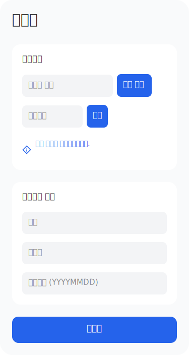

### 회원 상태를 조회한다

As a 회원, I want to 회원 상태를 조회한다, so that 현재 내 계정의 상태(정상, 휴면, 탈퇴 등)를 확인할 수 있다

**Acceptance Criteria.**

1. the system SHALL 회원 상태 코드(MBR_ACTIVE, MBR_DORMANT 등)가 정확히 표시되어야 한다
2. the system SHALL 상태 조회 실패 시 오류 안내가 제공되어야 한다

#### Wireframe: MembershipStatus

_No scene graph modeled for this UI._

### 회원 휴면 전환을 확인한다

As a 고객, I want to 회원 휴면 전환을 확인한다, so that 장기 미접속 등으로 계정이 휴면 상태로 전환되는 것을 인지하고 대응하기 위해

**Acceptance Criteria.**

1. the system SHALL 휴면 전환 기준 충족 시 안내가 제공된다
2. the system SHALL 휴면 전환 후 분리 보관 등 후속 처리가 안내된다

### 휴면 계정으로 로그인을 시도한다

As a 고객, I want to 휴면 계정으로 로그인을 시도한다, so that 휴면 상태인 계정으로 서비스 이용을 재개하기 위해

**Acceptance Criteria.**

1. the system SHALL 휴면 계정으로 서비스 이용 시도 시 로그인 절차가 시작된다
2. the system SHALL 회원 식별 및 상태 조회가 이루어진다
3. the system SHALL 휴면 회원 감지 및 안내가 제공된다
4. the system SHALL 로그인 시도 및 휴면 진입 판정 기준 정책이 적용된다

### 로그인 시도 계정의 휴면 여부를 확인한다

As a bss, I want to 로그인 시도 계정의 휴면 여부를 확인한다, so that 휴면 상태 여부에 따라 적절한 후속 조치를 제공하기 위해

**Acceptance Criteria.**

1. the system SHALL 로그인 시도 완료 후 휴면 여부 확인이 이루어진다
2. the system SHALL 회원 상태 조회 기준 정책에 따라 계정 상태를 조회한다
3. the system SHALL 휴면 해제 가능 여부 판정 기준 정책에 따라 해제 필요 여부를 판정한다

### 휴면 해제 처리 결과를 안내받는다

As a 고객, I want to 휴면 해제 처리 결과를 안내받는다, so that 휴면 해제 완료 여부와 후속 절차를 확인하기 위해

**Acceptance Criteria.**

1. the system SHALL 휴면 해제 완료 여부가 안내된다
2. the system SHALL 해제 후 이용 가능한 서비스 안내가 제공된다
3. the system SHALL 이력 및 알림이 처리된다

### 회원 탈퇴 사유를 입력 또는 선택한다

As a 고객, I want to 회원 탈퇴 사유를 입력 또는 선택한다, so that 탈퇴 이유를 전달하여 탈퇴 절차를 진행하기 위해

**Acceptance Criteria.**

1. the system SHALL 사유를 선택하거나 직접 입력할 수 있다
2. the system SHALL 탈퇴 사유가 저장된다

#### Wireframe: SubmitWithdrawalReason

- frame: 탈퇴 사유 제출 · layout: vertical
  - frame: 상단바 · layout: horizontal
    - frame: Icon / lucide:arrow-left
      - icon: path
    - text: "탈퇴 사유 제출"
    - frame: Frame
  - frame: 안내문구 · layout: vertical
    - text: "탈퇴 사유를 선택하거나 직접 입력해 주세요."
  - frame: 사유리스트 · layout: vertical
    - frame: Frame · layout: horizontal
      - ellipse: Ellipse
      - text: "서비스 불만족"
    - frame: Frame · layout: horizontal
      - ellipse: Ellipse
      - text: "사용 빈도 낮음"
    - frame: Frame · layout: horizontal
      - ellipse: Ellipse
      - text: "개인정보 우려"
    - frame: Frame · layout: horizontal
      - ellipse: Ellipse
      - text: "기타"
  - frame: 직접입력 · layout: vertical
    - text: "직접 입력"
    - rect: Rectangle
      - text: "사유를 입력해 주세요."
  - frame: 하단버튼 · layout: vertical
    - frame: Frame · layout: vertical
      - text: "제출하기"

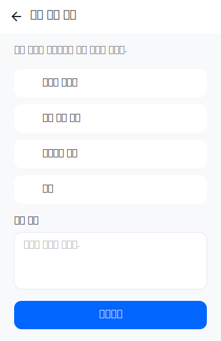

### 회원 탈퇴 전 안내사항을 확인한다

As a 고객, I want to 회원 탈퇴 전 안내사항을 확인한다, so that 탈퇴 시 자산 소멸, 미납, 유의사항 등 영향을 인지하기 위해

**Acceptance Criteria.**

1. the system SHALL 자산 소멸, 미납, 유의사항 등 안내를 확인할 수 있다

### 회원 탈퇴 결과 및 유예 기간 안내를 받는다

As a 고객, I want to 회원 탈퇴 결과 및 유예 기간 안내를 받는다, so that 탈퇴 완료 및 철회 가능 기간 등 후속 정보를 확인하기 위해

**Acceptance Criteria.**

1. the system SHALL 탈퇴 완료 및 유예 기간 안내가 제공된다
2. the system SHALL 업무 결과 및 이력 확인이 가능하다

### 회원가입을 진행한다

As a 고객, I want to 회원가입을 진행한다, so that 서비스를 이용할 수 있도록 계정을 생성하기 위해

**Acceptance Criteria.**

1. the system SHALL 필수 및 선택 약관을 조회하고 동의 결과를 저장한다
2. the system SHALL 기본 회원정보(이름, 휴대폰번호, 이메일 등)를 입력받고 형식 및 중복을 검증한다
3. the system SHALL 회원가입 플로우 진입 조건을 확인한다
4. the system SHALL 본인인증을 통해 가입자의 본인 여부를 확인한다
5. the system SHALL 미성년자일 경우 법정대리인 인증 및 동의를 처리한다
6. the system SHALL 본인인증 결과와 기존 이력을 기준으로 신규 가입 가능 여부를 판정한다
7. the system SHALL 검증이 완료된 경우 통합 회원 계정을 생성한다
8. the system SHALL 가입 결과를 안내하고 가입 직후 이용 가능한 상태로 전환한다
9. the system SHALL 가입 처리 결과를 이력화하고 고객에게 알림을 발송한다
10. the system SHALL 가입 완료 후 로그인 세션을 생성하거나 기존 세션을 전환한다
11. the system SHALL CI 기준 1인 1계정 원칙을 적용해야 한다
12. the system SHALL 필수 약관에 동의해야 한다
13. the system SHALL 선택 약관은 동의하지 않아도 가입이 가능해야 한다
14. the system SHALL 회원정보(이름, 휴대폰번호, 이메일 등)가 저장되어야 한다
15. the system SHALL 외국인 고객은 별도 인증수단을 통해 인증해야 한다
16. the system SHALL 가입 제한 회원은 가입이 불가하다
17. the system SHALL 미성년자일 경우 법정대리인 동의가 필요하다
18. the system SHALL 본인인증을 통해 고객 본인임을 확인해야 한다
19. the system SHALL 동일인 중복 가입이 제한된다
20. the system SHALL 약관 동의 이력이 저장되어야 한다
21. the system SHALL 약관 동의 결과가 저장된다
22. the system SHALL 외부 인증기관을 통한 본인인증 결과가 필요하다
23. the system SHALL 중복 가입 여부가 확인된다
24. the system SHALL 가입 가능 조건이 충족되어야 한다
25. the system SHALL 약관 동의를 완료해야 개인정보 입력이 가능하다
26. the system SHALL 이름, 연락처 등 회원 정보 입력 항목 기준 정책에 따라 입력한다
27. the system SHALL 입력값은 검증 기준 정책에 따라 형식 검증이 이루어진다
28. the system SHALL 회원 식별정보(예: 이메일, 휴대폰번호) 중복 확인이 이루어진다
29. the system SHALL 개인정보 입력이 완료되어야 본인인증을 진행할 수 있다
30. the system SHALL 인증 수단 선택 및 허용 기준 정책에 따라 인증수단을 선택할 수 있다
31. the system SHALL 본인인증 적용 기준 정책에 따라 인증이 수행된다
32. the system SHALL 인증 결과가 판정 및 반영된다
33. the system SHALL 인증 실패 시 재시도 및 제한 정책이 적용된다
34. the system SHALL 본인인증이 성공해야 회원 검증이 가능하다
35. the system SHALL 회원 상태 조회 기준 정책에 따라 회원의 상태를 조회한다
36. the system SHALL 신규가입 가능 여부 판정 기준 정책에 따라 가입 가능 여부를 판정한다
37. the system SHALL 회원 경로 분기 기준 정책에 따라 후속 처리가 결정된다
38. the system SHALL 회원 검증이 완료되어야 가입 처리가 가능하다
39. the system SHALL 회원 계정 생성 및 식별정보 관리 기준 정책에 따라 계정이 생성된다
40. the system SHALL 기본 프로필이 초기화된다
41. the system SHALL 가입 완료 처리 및 세션 전환 기준 정책에 따라 세션이 생성된다
42. the system SHALL 가입 완료 안내가 준비된다
43. the system SHALL 처리 이력 및 알림이 기록된다

#### Wireframe: RegisterMembership

- frame: 회원가입 완료 · layout: vertical
  - frame: 상단 영역 · layout: vertical
    - ellipse: 완료 아이콘
      - frame: Icon / lucide:check
        - icon: path
    - text: "회원가입이 완료되었습니다"
    - text: "약관 동의, 개인정보 입력, 본인인증, 법정대리인 동의(필요 시)를 모두 완료하셨습니다. 이제 서비스를 이용하실 수 있습니다."
  - frame: 가입 단계 요약 · layout: vertical
    - frame: 단계 리스트 · layout: vertical
      - frame: Frame · layout: horizontal
        - frame: Icon / lucide:check-circle
          - icon: path
          - icon: path
        - text: "약관 동의"
      - frame: Frame · layout: horizontal
        - frame: Icon / lucide:check-circle
          - icon: path
          - icon: path
        - text: "개인정보 입력"
      - frame: Frame · layout: horizontal
        - frame: Icon / lucide:check-circle
          - icon: path
          - icon: path
        - text: "본인인증"
      - frame: Frame · layout: horizontal
        - frame: Icon / lucide:check-circle
          - icon: path
          - icon: path
        - text: "법정대리인 동의(필요 시)"
  - frame: 확인 버튼 영역 · layout: vertical
    - frame: 확인 버튼 · layout: vertical
      - text: "확인"

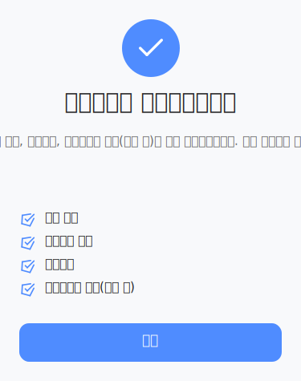

### 기존 회원 이력을 조회한다

As a bss, I want to 기존 회원 이력을 조회한다, so that 재가입 대상자의 기존 가입, 탈퇴, 휴면 이력을 확인하기 위해

**Acceptance Criteria.**

1. the system SHALL 본인인증에 성공한 고객의 기존 가입, 탈퇴, 휴면 이력이 모두 조회된다
2. the system SHALL 회원 식별 및 상태 조회가 정확히 이루어진다
3. the system SHALL 기존 이력 연계 및 복원 범위가 판정된다

#### Wireframe: MembershipHistory

- frame: 회원 이력 · layout: vertical
  - frame: 입력폼 · layout: horizontal
  - frame: 로그인 버튼 영역 · layout: horizontal

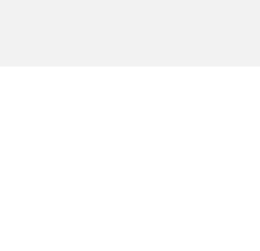

### 재가입 가능 여부를 판정한다

As a bss, I want to 재가입 가능 여부를 판정한다, so that 재가입 제한 및 가능 조건을 검토하여 고객의 재가입 가능 여부를 결정하기 위해

**Acceptance Criteria.**

1. the system SHALL 재가입 제한 및 예외 적용 기준 정책에 따라 재가입 가능 여부가 판정된다
2. the system SHALL 재가입 가능 상태로 판정된 경우에만 다음 단계로 진행된다

### 재가입을 위한 개인정보를 입력한다

As a 고객, I want to 재가입을 위한 개인정보를 입력한다, so that 재가입에 필요한 정보를 제공하여 회원 계정을 복원 또는 신규 생성하기 위해

**Acceptance Criteria.**

1. the system SHALL 재가입에 필요한 개인정보(예: 이름, 연락처 등)가 입력된다
2. the system SHALL 필수 약관 동의가 완료되어야 한다
3. the system SHALL 법정대리인 동의가 필요한 경우 해당 동의가 처리된다
4. the system SHALL 기존 정보 재사용 기준 정책에 따라 정보가 입력 또는 재사용된다

### 회원 탈퇴를 진행한다

As a 회원, I want to 회원 탈퇴를 진행한다, so that 서비스 이용을 중단하고 개인정보를 삭제 또는 보관하기 위해

**Acceptance Criteria.**

1. the system SHALL 회원 탈퇴 전 본인 여부를 확인한다
2. the system SHALL 표준 사유 및 직접 입력 사유를 접수하고 분석 가능한 형태로 저장한다
3. the system SHALL 탈퇴 전 미납, 연계 서비스, 제한 조건을 확인한다
4. the system SHALL 탈퇴 시 소멸·해지·보관되는 정보를 사전 안내받는다
5. the system SHALL 탈퇴 영향 안내 확인 후 최종 동의를 받고 철회 가능 조건을 확정한다
6. the system SHALL 회원 상태를 탈퇴유예 또는 탈퇴 완료 상태로 전환하고 후속 처리를 수행한다
7. the system SHALL 탈퇴 신청 시 추가 본인인증이 필요할 수 있다
8. the system SHALL 탈퇴 유예 기간(7일) 동안 탈퇴 철회가 가능해야 한다
9. the system SHALL 탈퇴 회원 상태로 전환되어야 한다
10. the system SHALL 법정보관 데이터는 정해진 기간 동안 보관되어야 한다
11. the system SHALL 운영 데이터는 분리보관 또는 삭제 처리해야 한다

### 휴면 해제 가능 여부를 확인한다

As a 휴면_회원, I want to 휴면 해제 가능 여부를 확인한다, so that 정상 회원으로 복귀할 수 있는지 알 수 있다

**Acceptance Criteria.**

1. the system SHALL 휴면 해제 조건을 판정하여 정상 회원 복귀 가능 여부를 안내한다

### 휴면 해제를 신청한다

As a 휴면_회원, I want to 휴면 해제를 신청한다, so that 휴면 상태에서 정상 회원으로 복귀할 수 있다

**Acceptance Criteria.**

1. the system SHALL 휴면 상태가 정상 상태로 전환된다
2. the system SHALL 분리보관된 데이터가 복원된다

### 로그인 세션을 생성하거나 전환한다

As a 고객, I want to 로그인 세션을 생성하거나 전환한다, so that 휴면 해제 또는 재가입 후 정상적으로 서비스를 이용할 수 있다

**Acceptance Criteria.**

1. the system SHALL 휴면 해제 또는 재가입 완료 후 로그인 세션이 생성되거나 기존 세션이 전환된다

### 휴면 해제 처리 결과와 후속 조치를 안내받는다

As a 고객, I want to 휴면 해제 처리 결과와 후속 조치를 안내받는다, so that 복원 범위와 후속 조치를 명확히 이해할 수 있다

**Acceptance Criteria.**

1. the system SHALL 휴면 해제 결과와 복원 범위, 후속 조치가 안내된다

### 회원 탈퇴를 신청한다

As a 고객, I want to 회원 탈퇴를 신청한다, so that 더 이상 서비스를 이용하지 않기로 결정할 수 있다

**Acceptance Criteria.**

1. the system SHALL 본인인증을 완료해야 한다
2. the system SHALL 표준 사유 또는 직접 입력 사유를 입력할 수 있다
3. the system SHALL 탈퇴 전 미납, 연계 서비스, 제한 조건을 확인한다
4. the system SHALL 탈퇴 시 소멸·해지·보관되는 정보를 사전 안내받는다
5. the system SHALL 탈퇴 영향 안내를 확인한 후 최종 동의를 해야 한다
6. the system SHALL 철회 가능 조건이 안내된다
7. the system SHALL 회원 상태가 탈퇴유예 또는 탈퇴 완료로 전환된다
8. the system SHALL 후속 처리가 수행된다

### 탈퇴 처리 결과와 철회 가능 여부를 안내받는다

As a 고객, I want to 탈퇴 처리 결과와 철회 가능 여부를 안내받는다, so that 탈퇴 상태와 철회 가능성을 명확히 알 수 있다

**Acceptance Criteria.**

1. the system SHALL 탈퇴 처리 결과가 안내된다
2. the system SHALL 유예 기간과 철회 가능 여부가 안내된다

### 탈퇴 처리 결과와 이력을 재확인한다

As a 고객, I want to 탈퇴 처리 결과와 이력을 재확인한다, so that 탈퇴 이력 및 상태를 필요할 때마다 확인할 수 있다

**Acceptance Criteria.**

1. the system SHALL 탈퇴 처리 결과와 이력을 재확인할 수 있다

### 재가입을 신청한다

As a 고객, I want to 재가입을 신청한다, so that 탈퇴 후 다시 서비스를 이용할 수 있다

**Acceptance Criteria.**

1. the system SHALL 본인인증을 완료해야 한다
2. the system SHALL 기존 회원 상태와 이력을 확인할 수 있다
3. the system SHALL 재가입 제한 여부가 판정된다
4. the system SHALL 기존 이력의 연계 가능 범위와 복원 제외 대상이 안내된다
5. the system SHALL 재가입에 필요한 회원정보를 입력할 수 있다
6. the system SHALL 최신 약관에 동의해야 한다
7. the system SHALL 재가입 대상 고객의 계정이 복원 또는 신규 생성 방식으로 처리된다
8. the system SHALL 재가입 결과와 기존 이력 연계 여부가 안내된다
9. the system SHALL 재가입 완료 후 로그인 세션이 생성되거나 기존 세션이 전환된다

### 회원 업무 처리 결과에 대한 알림을 수신한다

As a 고객, I want to 회원 업무 처리 결과에 대한 알림을 수신한다, so that 회원 생애주기 주요 처리 결과를 확인하고 필요한 후속 조치를 취하기 위해

**Acceptance Criteria.**

1. the system SHALL 업무구분, 처리결과, 회원ID, 연락처, 알림수단, 요청일시를 입력받는다
2. the system SHALL 업무 처리 완료 시 처리 이력이 저장된다
3. the system SHALL 알림 대상이면 업무별 알림 템플릿이 발송된다
4. the system SHALL 알림 발송 결과가 저장된다
5. the system SHALL 알림 발송 실패 시 재시도 또는 대체 채널로 발송된다
6. the system SHALL 이력 저장 실패 시 운영 오류가 기록된다
7. the system SHALL 중복 알림 요청 시 동일 업무 중복 발송이 제한된다
8. the system SHALL 처리이력ID, 알림발송결과, 알림시각, 알림채널, 실패사유가 출력된다

### 회원가입 플로우에 진입할 수 있는지 확인한다

As a 고객, I want to 회원가입 플로우에 진입할 수 있는지 확인한다, so that 회원가입 가능 여부를 사전에 확인하여 불필요한 절차를 방지하기 위해

**Acceptance Criteria.**

1. the system SHALL 접근채널, 고객유형, 로그인상태, 세션ID, 유입경로를 입력받는다
2. the system SHALL 미로그인 고객이면 가입 가능 업무인지 확인한다
3. the system SHALL 기존 로그인 회원이면 현재 회원 상태를 확인하여 적정 업무를 안내한다
4. the system SHALL 제한 대상 진입 시 제한 사유를 표시하고 진행을 제한한다
5. the system SHALL 진입가능여부, 진입제한사유, 시작 프로세스ID, 다음 화면이 출력된다
6. the system SHALL 이미 가입된 회원은 로그인 또는 내정보 안내가 제공된다
7. the system SHALL 휴면 회원은 휴면 해제 안내가 제공된다
8. the system SHALL 재가입 제한 대상은 제한 안내가 제공된다

### 회원 정보를 입력하고 검증한다

As a 고객, I want to 회원 정보를 입력하고 검증한다, so that 정확한 회원 정보를 등록하여 정상적으로 회원가입을 완료하기 위해

**Acceptance Criteria.**

1. the system SHALL 필수 회원정보(예: 이름, 생년월일, 연락처 등)를 입력받는다
2. the system SHALL 입력값의 유효성을 검증한다
3. the system SHALL 입력된 정보가 저장된다
4. the system SHALL 입력 오류 시 오류 메시지를 제공한다

### 회원가입 플로우에 진입한다

As a 고객, I want to 회원가입 플로우에 진입한다, so that 서비스 이용을 위한 회원가입을 시작할 수 있다

**Acceptance Criteria.**

1. the system SHALL 접근 채널, 고객 유형, 로그인 상태, 세션ID, 유입경로에 따라 가입 진입 가능 여부가 판단된다
2. the system SHALL 이미 가입된 회원은 로그인 또는 내정보 안내를 받는다
3. the system SHALL 휴면 회원은 휴면 해제 안내를 받는다
4. the system SHALL 재가입 제한 대상은 제한 안내를 받는다
5. the system SHALL 진입 제한 사유가 명확히 표시된다

### 회원정보를 입력하고 검증받는다

As a 고객, I want to 회원정보를 입력하고 검증받는다, so that 정확하고 유효한 정보로 회원가입을 진행할 수 있다

**Acceptance Criteria.**

1. the system SHALL 필수 입력값이 누락되면 누락 항목이 표시된다
2. the system SHALL 입력 형식 오류가 있으면 항목별 오류 안내가 제공된다
3. the system SHALL 아이디, 연락처, 이메일 중복 시 대체값 입력을 요청받는다
4. the system SHALL 입력값이 검증되면 가입 세션에 임시 저장된다

### 본인인증 및 기존 이력 기반으로 가입 가능 여부를 판정받는다

As a 고객, I want to 본인인증 및 기존 이력 기반으로 가입 가능 여부를 판정받는다, so that 자격 요건에 맞는 경우에만 신규 가입을 진행할 수 있다

**Acceptance Criteria.**

1. the system SHALL 동일 CI의 기존 회원이 없으면 신규 가입이 허용된다
2. the system SHALL 휴면 회원이 존재하면 휴면 해제 경로가 제시된다
3. the system SHALL 재가입 제한이 있으면 제한 사유와 제한 종료일이 안내된다
4. the system SHALL 탈퇴유예 대상은 철회 또는 재가입 제한 안내를 받는다
5. the system SHALL 판정 시스템 오류 시 재시도 안내가 제공된다

### 통합 회원 계정을 생성한다

As a 고객, I want to 통합 회원 계정을 생성한다, so that 서비스 이용을 위한 고유 회원ID와 계정을 갖게 된다

**Acceptance Criteria.**

1. the system SHALL 모든 선행 조건이 충족되어야 계정이 생성된다
2. the system SHALL 회원ID가 발급된다
3. the system SHALL CI/DI가 회원ID와 매핑된다
4. the system SHALL 기본 프로필이 생성된다
5. the system SHALL 정상 회원 상태가 생성된다
6. the system SHALL 동의 이력이 누락되면 약관 단계로 재진입한다
7. the system SHALL 식별정보 중복 시 회원 상태를 재조회한다

### 회원가입을 완료하고 서비스 이용을 시작한다

As a 고객, I want to 회원가입을 완료하고 서비스 이용을 시작한다, so that 정상 회원으로 로그인 상태에서 서비스를 이용할 수 있다

**Acceptance Criteria.**

1. the system SHALL 가입 성공 시 가입 완료 화면과 알림이 제공된다
2. the system SHALL 자동 로그인이 허용되면 로그인 세션이 생성된다
3. the system SHALL 후속 안내 대상에게는 내정보 점검 또는 혜택 안내가 제공된다
4. the system SHALL 가입 완료 알림 실패 시 화면 안내가 유지된다
5. the system SHALL 세션 생성 실패 시 로그인 재시도 안내가 제공된다
6. the system SHALL 중복 완료 요청 시 기존 가입 결과가 반환된다

### 휴면 상태 진입 시 안내를 받는다

As a 회원, I want to 휴면 상태 진입 시 안내를 받는다, so that 휴면 해제 등 필요한 후속 조치를 취할 수 있다

**Acceptance Criteria.**

1. the system SHALL 휴면 상태 진입 시점에 안내 메시지가 표시된다
2. the system SHALL 휴면 해제 방법이 명확히 안내된다

