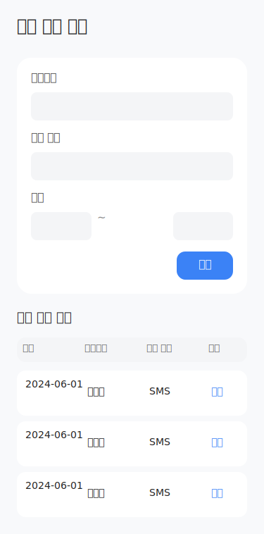
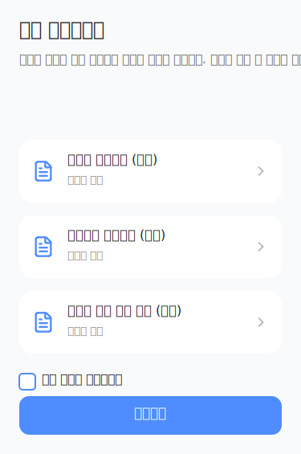

# Requirements: TermsAndAuthenticationManagement

> User Stories with EARS acceptance criteria and wireframes rendered from the event-storming graph.
>
> Generated: 2026-05-12T11:55:59Z

## Aggregate: AuthenticationHistory

### 본인인증을 수행한다

As a 회원, I want to 본인인증을 수행한다, so that 회원 업무(가입, 탈퇴, 휴면 해제 등) 진행을 위해 본인임을 증명하기 위해

**Acceptance Criteria.**

1. the system SHALL 업무별로 허용된 인증수단만 선택할 수 있다
2. the system SHALL 인증번호 방식의 경우 인증번호 발급 및 입력이 필요하다
3. the system SHALL 인증 실패 및 재시도, 잠금 정책이 적용된다
4. the system SHALL 고위험 업무의 경우 추가 인증이 요구될 수 있다
5. the system SHALL 인증 결과가 성공, 실패, 취소, 오류 등으로 판정된다

### 인증 이력을 조회한다

As a 회원_정책_담당자, I want to 인증 이력을 조회한다, so that 감사 및 정책 준수를 확인하기 위해

**Acceptance Criteria.**

1. the system SHALL 인증 이력에는 업무구분, 인증수단, 인증결과, 결과코드, 요청일시, 완료일시, 채널, 세션ID, CI 해시, IP가 저장된다
2. the system SHALL 인증 이력 보관 기간은 5년이다
3. the system SHALL 인증 이력은 회원 정책 담당자, 인증 시스템 운영자, 감사 권한자만 조회할 수 있다
4. the system SHALL 인증 이력 조회 시 CI, DI, 휴대폰번호, 이름, 생년월일, IP는 마스킹 처리된다
5. the system SHALL 인증번호 원문 로그는 저장되지 않는다
6. the system SHALL 감사 추적 항목(조회자 ID, 조회일시, 조회사유, 변경 전 값, 변경 후 값)이 저장된다
7. the system SHALL 인증 실패 이력도 저장된다

#### Wireframe: AuthenticationHistoryList

_No scene graph modeled for this UI._

#### Wireframe: ViewAuthenticationHistory

- frame: 인증 이력 조회 · layout: vertical
  - text: "인증 이력 조회"
  - frame: 검색 조건 영역 · layout: vertical
    - frame: 검색 필드 1 · layout: vertical
      - text: "사용자명"
      - rect: 사용자명 입력
    - frame: 검색 필드 2 · layout: vertical
      - text: "인증 유형"
      - rect: 인증 유형 선택
    - frame: 검색 필드 3 · layout: vertical
      - text: "기간"
      - frame: Frame · layout: horizontal
        - rect: 시작일
        - text: "~"
        - rect: 종료일
    - frame: 검색 버튼 영역 · layout: horizontal
      - frame: 검색 버튼 · layout: horizontal
        - text: "검색"
  - frame: 인증 이력 목록 영역 · layout: vertical
    - text: "인증 이력 목록"
    - frame: 목록 헤더 · layout: horizontal
      - text: "일시"
      - text: "사용자명"
      - text: "인증 유형"
      - text: "결과"
    - frame: 목록 · layout: vertical
      - frame: Frame · layout: horizontal
        - text: "2024-06-01"
        - text: "홍길동"
        - text: "SMS"
        - text: "성공"
      - frame: Frame · layout: horizontal
        - text: "2024-06-01"
        - text: "홍길동"
        - text: "SMS"
        - text: "성공"
      - frame: Frame · layout: horizontal
        - text: "2024-06-01"
        - text: "홍길동"
        - text: "SMS"
        - text: "성공"

### 인증 이력을 저장한다

As a 인증_시스템, I want to 인증 이력을 저장한다, so that 인증 내역을 추적 및 감사 목적으로 보관하기 위해

**Acceptance Criteria.**

1. the system SHALL 이력 저장 항목은 업무구분, 인증수단, 인증결과, 결과코드, 요청일시, 완료일시, 채널, 세션ID, CI 해시, IP이다
2. the system SHALL 이력 보관 기간은 5년이다
3. the system SHALL 인증 실패 이력도 저장한다
4. the system SHALL 인증번호 원문 로그는 저장하지 않는다

#### Wireframe: RecordAuthenticationHistory

- frame: 인증 이력 저장 · layout: vertical
  - frame: Icon / lucide:check-circle · layout: horizontal

### 회원 탈퇴 시 고위험 업무 추가 인증을 수행한다

As a 회원, I want to 회원 탈퇴 시 고위험 업무 추가 인증을 수행한다, so that 본인 확인을 강화하여 보안을 높이기 위해

**Acceptance Criteria.**

1. the system SHALL 회원 탈퇴가 고위험 업무로 분류된다
2. the system SHALL 추가 인증은 탈퇴 최종 동의 전에 적용된다
3. the system SHALL 인증수단은 휴대폰 본인인증, PASS 인증 중 선택한다
4. the system SHALL 인증 재사용은 허용되지 않는다
5. the system SHALL 동일 세션 내 인증 재사용이 제한된다
6. the system SHALL 인증 유효시간은 5분이다
7. the system SHALL 추가 확인 문구가 안내된다: '회원 탈퇴를 계속하려면 본인인증을 다시 완료해 주세요.'
8. the system SHALL 추가 인증 실패 시 탈퇴 진행이 불가하다
9. the system SHALL 추가 인증 이력이 고객ID, 업무ID, 인증수단, 인증 결과, 인증 일시, 처리 채널로 저장된다

### 휴면 해제를 위해 본인인증을 진행한다

As a 고객, I want to 휴면 해제를 위해 본인인증을 진행한다, so that 본인임을 증명하여 휴면 계정의 이용을 재개하기 위해

**Acceptance Criteria.**

1. the system SHALL 휴면 여부 확인 후 본인인증 절차가 시작된다
2. the system SHALL 인증 수단 선택 및 허용 기준 정책에 따라 인증수단을 선택할 수 있다
3. the system SHALL 본인인증 적용 기준 정책에 따라 인증이 수행된다
4. the system SHALL 인증 결과가 판정 및 반영된다
5. the system SHALL 인증 실패 시 재시도 및 제한 정책이 적용된다

### 휴면 해제 전 본인인증을 진행한다

As a 고객, I want to 휴면 해제 전 본인인증을 진행한다, so that 본인임을 확인하여 휴면 해제 절차를 계속 진행하기 위해

**Acceptance Criteria.**

1. the system SHALL 인증 수단을 선택할 수 있다
2. the system SHALL 인증 결과가 외부 인증기관으로부터 수신된다
3. the system SHALL 인증 이력이 저장된다

### 회원 탈퇴 전 본인인증을 진행한다

As a 고객, I want to 회원 탈퇴 전 본인인증을 진행한다, so that 본인임을 확인하여 탈퇴 절차를 계속 진행하기 위해

**Acceptance Criteria.**

1. the system SHALL 인증 수단을 선택할 수 있다
2. the system SHALL 인증 결과가 외부 인증기관으로부터 수신된다
3. the system SHALL 인증 실패 시 재시도 및 제한 규칙이 적용된다

### 재가입 전 본인인증을 진행한다

As a 고객, I want to 재가입 전 본인인증을 진행한다, so that 본인임을 확인하여 재가입 절차를 시작하기 위해

**Acceptance Criteria.**

1. the system SHALL 인증 수단을 선택할 수 있다
2. the system SHALL 인증 결과가 외부 인증기관으로부터 수신된다

### 본인인증을 한다

As a 고객, I want to 본인인증을 한다, so that 중요한 회원 관련 업무(가입, 휴면 해제, 탈퇴, 재가입 등)를 안전하게 진행할 수 있다

**Acceptance Criteria.**

1. the system SHALL 업무별 허용 인증수단을 확인한다
2. the system SHALL 인증 요청을 생성하고 외부 인증기관을 호출한다
3. the system SHALL 인증 성공 시 결과를 세션에 연결한다
4. the system SHALL 인증 실패 시 실패 횟수를 누적 관리한다
5. the system SHALL 인증 실패 한도 초과 시 재시도 제한이 적용된다
6. the system SHALL 인증번호 만료 시 재발급 안내가 제공된다
7. the system SHALL 외부 인증기관 오류 시 대체 수단 안내가 제공된다
8. the system SHALL 인증 이력이 저장된다

### 본인인증을 수행한다

As a 고객, I want to 본인인증을 수행한다, so that 회원가입, 휴면 해제, 탈퇴, 재가입 등 주요 업무를 진행하기 위해

**Acceptance Criteria.**

1. the system SHALL 업무구분, 인증수단, CI/DI, 휴대폰번호, 인증요청ID, 세션ID를 입력받는다
2. the system SHALL 업무별 허용 인증수단을 확인한다
3. the system SHALL 인증기관에 인증 요청을 생성한다
4. the system SHALL 인증 성공 시 인증 결과를 세션에 연결하여 다음 단계로 진행할 수 있다
5. the system SHALL 인증 실패 시 실패 횟수를 누적 관리한다
6. the system SHALL 인증 이력을 저장한다
7. the system SHALL 인증결과, 인증수단, 인증완료시각, 인증세션ID, 실패횟수, 제한여부가 출력된다
8. the system SHALL 인증번호 만료 시 재발급 안내가 제공된다
9. the system SHALL 인증 실패 한도 초과 시 재시도 제한 안내가 제공된다
10. the system SHALL 외부 인증기관 오류 시 대체 수단 안내가 제공된다

## Aggregate: TermsConsent

### 탈퇴 최종 동의를 제출한다

As a 회원, I want to 탈퇴 최종 동의를 제출한다, so that 탈퇴 절차의 마지막 단계에서 의사를 명확히 표명할 수 있도록

**Acceptance Criteria.**

1. the system SHALL 회원ID, 영향안내확인여부, 최종동의여부, 인증세션ID를 입력한다
2. the system SHALL 탈퇴 영향 안내를 확인해야 한다
3. the system SHALL 최종 동의 문구가 노출된다
4. the system SHALL 동의 이력이 저장된다
5. the system SHALL 최종 동의 완료 시 탈퇴 처리 단계로 이동한다
6. the system SHALL 최종 동의 철회 시 탈퇴 요청이 취소된다
7. the system SHALL 최종동의여부, 탈퇴요청ID, 동의시각, 철회가능여부가 출력된다
8. the system SHALL 최종 동의 미완료 시 탈퇴 처리 불가 안내가 제공된다
9. the system SHALL 인증 세션 만료 시 본인인증 재수행 안내가 제공된다
10. the system SHALL 중복 동의 요청 시 최신 요청 기준으로 처리된다

#### Wireframe: WithdrawalFinalConsentStatus

_No scene graph modeled for this UI._

### 약관에 동의한다

As a 고객, I want to 약관에 동의한다, so that 회원 업무(가입, 재가입, 휴면 해제 등)를 정상적으로 진행할 수 있도록

**Acceptance Criteria.**

1. the system SHALL 회원 가입, 재가입, 휴면 해제 등 각 업무에 필요한 필수 및 선택 약관이 구분되어 제공된다
2. the system SHALL 필수 약관 미동의 시 회원 업무가 진행되지 않는다
3. the system SHALL 선택 약관 미동의 시 선택 약관에 한해 거부가 반영된다
4. the system SHALL 전체 동의, 개별 동의, 선택 약관 해제 등이 허용된다
5. the system SHALL 약관 버전이 적용 기준에 따라 관리된다
6. the system SHALL 약관 상세가 노출된다
7. the system SHALL 약관 동의 결과가 저장된다

### 약관 동의 이력을 조회하거나 철회한다

As a 고객, I want to 약관 동의 이력을 조회하거나 철회한다, so that 본인의 약관 동의 내역을 확인하고 필요시 철회할 수 있도록

**Acceptance Criteria.**

1. the system SHALL 동의 이력에 약관 버전, 동의 일시, 동의 채널이 포함된다
2. the system SHALL 필수·선택 약관 동의 이력이 구분되어 저장된다
3. the system SHALL 약관 동의 철회가 가능한 대상에 한해 철회가 허용된다
4. the system SHALL 동의 이력 보관 기간이 적용된다
5. the system SHALL 이력 변경 허용 여부가 정책에 따라 적용된다
6. the system SHALL 동의 이력 조회 권한이 적용된다
7. the system SHALL 동의 이력 마스킹 대상이 정책에 따라 처리된다

#### Wireframe: TermsConsentRecordList

_No scene graph modeled for this UI._

### 약관 동의 내역을 조회한다

As a 회원, I want to 약관 동의 내역을 조회한다, so that 본인의 약관 동의 이력을 확인하기 위해

**Acceptance Criteria.**

1. the system SHALL 약관 동의 이력(버전, 일시, 채널 등)이 조회된다
2. the system SHALL 동의 철회 가능 대상이 표시된다
3. the system SHALL 이력 조회 권한 및 마스킹 기준이 적용된다

### 약관 동의를 철회한다

As a 회원, I want to 약관 동의를 철회한다, so that 더 이상 특정 약관에 동의하지 않음으로써 권리 및 정보를 관리하기 위해

**Acceptance Criteria.**

1. the system SHALL 약관 동의 철회 가능 대상만 철회할 수 있다
2. the system SHALL 철회 이력이 저장된다
3. the system SHALL 철회 후 서비스 이용에 제한이 있을 수 있음이 안내된다

### 약관에 동의한다

As a 회원, I want to 약관에 동의한다, so that 서비스 이용 또는 재가입 등 업무 진행을 위해 필수 약관에 동의할 수 있도록 하기 위해

**Acceptance Criteria.**

1. the system SHALL 회원가입, 재가입, 휴면 해제 등 업무별로 필수/선택 약관이 구분되어 노출된다
2. the system SHALL 필수 약관(서비스 이용약관, 개인정보 수집·이용 동의 등)에 동의하지 않으면 다음 단계로 진행할 수 없다
3. the system SHALL 선택 약관(마케팅 정보 수신 동의, 맞춤형 혜택 제공 동의 등)은 동의하지 않아도 업무 진행이 가능하다
4. the system SHALL 전체 동의, 개별 동의, 선택 약관 개별 해제가 허용된다
5. the system SHALL 약관은 최신 버전이 적용되며, 전문, 핵심 요약, 개정 이력이 노출된다
6. the system SHALL 휴면 해제 시 필수 약관은 변경 시 재동의, 선택 약관은 고객 선택에 따라 재동의한다

### 재동의가 필요한 약관에 동의한다

As a 고객, I want to 재동의가 필요한 약관에 동의한다, so that 휴면 해제에 필요한 법적 동의를 완료하기 위해

**Acceptance Criteria.**

1. the system SHALL 재동의가 필요한 약관 및 고지 내용을 확인할 수 있다
2. the system SHALL 필수 약관에 동의하지 않으면 다음 단계로 진행할 수 없다
3. the system SHALL 약관 동의 이력이 저장된다

#### Wireframe: ReconsentTerms

- frame: 약관 재동의하기 · layout: vertical
  - frame: 헤더 · layout: vertical
    - text: "약관 재동의하기"
    - text: "서비스 이용을 위해 재동의가 필요한 약관이 있습니다. 약관을 확인 후 동의해 주세요."
  - frame: 약관 리스트 · layout: vertical
    - frame: 약관카드_0 · layout: horizontal
      - frame: Icon / lucide:file-text
        - icon: path
        - icon: path
      - frame: Frame · layout: vertical
        - text: "서비스 이용약관 (필수)"
        - text: "자세히 보기"
      - frame: Icon / lucide:chevron-right
        - icon: path
    - frame: 약관카드_1 · layout: horizontal
      - frame: Icon / lucide:file-text
        - icon: path
        - icon: path
      - frame: Frame · layout: vertical
        - text: "개인정보 처리방침 (필수)"
        - text: "자세히 보기"
      - frame: Icon / lucide:chevron-right
        - icon: path
    - frame: 약관카드_2 · layout: horizontal
      - frame: Icon / lucide:file-text
        - icon: path
        - icon: path
      - frame: Frame · layout: vertical
        - text: "마케팅 정보 수신 동의 (선택)"
        - text: "자세히 보기"
      - frame: Icon / lucide:chevron-right
        - icon: path
  - frame: 동의 버튼 영역 · layout: vertical
    - frame: Frame · layout: horizontal
      - rect: 전체동의체크
      - text: "전체 약관에 동의합니다"
    - frame: 동의 버튼 · layout: vertical
      - text: "동의하기"

### 회원 탈퇴에 최종 동의한다

As a 고객, I want to 회원 탈퇴에 최종 동의한다, so that 회원 탈퇴를 확정하여 서비스 이용을 종료하기 위해

**Acceptance Criteria.**

1. the system SHALL 최종 탈퇴 의사에 동의해야 탈퇴가 진행된다
2. the system SHALL 탈퇴 확정 및 철회 유예 규칙이 적용된다

### 약관 및 고지 내용을 확인하고 동의한다

As a 고객, I want to 약관 및 고지 내용을 확인하고 동의한다, so that 서비스 이용에 필요한 법적·정책적 동의를 완료할 수 있다

**Acceptance Criteria.**

1. the system SHALL 재동의가 필요한 약관 및 고지 내용을 확인할 수 있다
2. the system SHALL 동의 결과가 저장된다

### 업무별 약관에 동의한다

As a 고객, I want to 업무별 약관에 동의한다, so that 회원가입, 휴면 해제, 재가입 등 업무 진행을 위해 필수 약관을 충족하기 위해

**Acceptance Criteria.**

1. the system SHALL 업무구분, 고객유형, 약관ID, 약관버전, 동의여부, 채널, 세션ID를 입력받는다
2. the system SHALL 업무별 최신 약관 목록을 조회하여 제공한다
3. the system SHALL 필수 약관 동의 여부를 확인한다
4. the system SHALL 선택 약관 동의도 접수할 수 있다
5. the system SHALL 동의값을 검증하고 저장한다
6. the system SHALL 약관 동의 이력을 생성한다
7. the system SHALL 약관목록, 필수동의완료여부, 선택동의값, 동의이력ID, 다음 이동 경로가 출력된다
8. the system SHALL 약관 버전 불일치 시 최신 약관 재동의가 필요하다
9. the system SHALL 필수 약관 미동의 시 진행이 제한된다
10. the system SHALL 동의 저장 실패 시 재시도 안내가 제공된다

