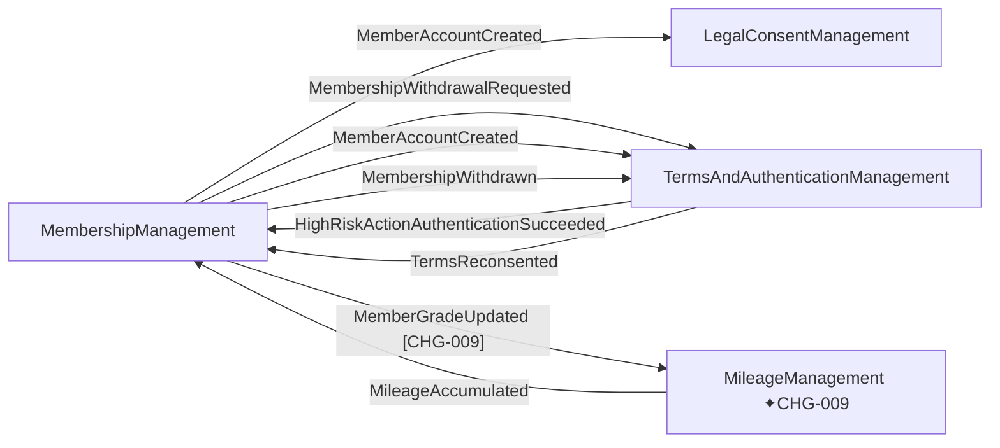

# Context Map

> Strategic-level relationships between the system's Bounded Contexts.
>
> Generated: 2026-05-12T11:55:59Z
> Last updated: 2026-06-02T00:00:00Z — CHG-009: MileageManagement BC 신규 추가 및 회원 등급 연동

## Diagram

## Relationships

### MembershipManagement → LegalConsentManagement

- **Pattern.** Open Host Service + Published Language *(inferred — confirm)*

- **Direction.** upstream → downstream
- **Translation.** None
- **Reason.** MemberAccountCreated
- **Spec file.** [`bounded-contexts/legalconsentmanagement/bc-legalconsentmanagement.md`](bounded-contexts/legalconsentmanagement/bc-legalconsentmanagement.md)

### MembershipManagement → TermsAndAuthenticationManagement

- **Pattern.** Open Host Service + Published Language *(inferred — confirm)*

- **Direction.** upstream → downstream
- **Translation.** None
- **Reason.** MembershipWithdrawalRequested
- **Spec file.** [`bounded-contexts/termsandauthenticationmanagement/bc-termsandauthenticationmanagement.md`](bounded-contexts/termsandauthenticationmanagement/bc-termsandauthenticationmanagement.md)

### MembershipManagement → TermsAndAuthenticationManagement

- **Pattern.** Open Host Service + Published Language *(inferred — confirm)*

- **Direction.** upstream → downstream
- **Translation.** None
- **Reason.** MemberAccountCreated
- **Spec file.** [`bounded-contexts/termsandauthenticationmanagement/bc-termsandauthenticationmanagement.md`](bounded-contexts/termsandauthenticationmanagement/bc-termsandauthenticationmanagement.md)

### MembershipManagement → TermsAndAuthenticationManagement

- **Pattern.** Open Host Service + Published Language *(inferred — confirm)*

- **Direction.** upstream → downstream
- **Translation.** None
- **Reason.** MembershipWithdrawn
- **Spec file.** [`bounded-contexts/termsandauthenticationmanagement/bc-termsandauthenticationmanagement.md`](bounded-contexts/termsandauthenticationmanagement/bc-termsandauthenticationmanagement.md)

### TermsAndAuthenticationManagement → MembershipManagement

- **Pattern.** Customer-Supplier *(inferred — confirm)*

- **Direction.** upstream → downstream
- **Translation.** None
- **Reason.** HighRiskActionAuthenticationSucceeded
- **Spec file.** [`bounded-contexts/membershipmanagement/bc-membershipmanagement.md`](bounded-contexts/membershipmanagement/bc-membershipmanagement.md)

### TermsAndAuthenticationManagement → MembershipManagement

- **Pattern.** Customer-Supplier *(inferred — confirm)*

- **Direction.** upstream → downstream
- **Translation.** None
- **Reason.** TermsReconsented
- **Spec file.** [`bounded-contexts/membershipmanagement/bc-membershipmanagement.md`](bounded-contexts/membershipmanagement/bc-membershipmanagement.md)

### MembershipManagement → MileageManagement ✦CHG-009

- **Pattern.** Customer-Supplier (Published Language via Domain Event)

- **Direction.** upstream → downstream
- **Translation.** None
- **Reason.** MemberGradeUpdated — 회원 등급 변경 시 마일리지 적립률 동기화
- **Spec file.** [`bounded-contexts/mileagemanagement/bc-mileagemanagement.md`](bounded-contexts/mileagemanagement/bc-mileagemanagement.md)

### MileageManagement → MembershipManagement ✦CHG-009

- **Pattern.** Customer-Supplier

- **Direction.** upstream → downstream
- **Translation.** None
- **Reason.** MileageAccumulated — 마일리지 적립 완료 통지
- **Spec file.** [`bounded-contexts/mileagemanagement/bc-mileagemanagement.md`](bounded-contexts/mileagemanagement/bc-mileagemanagement.md)

