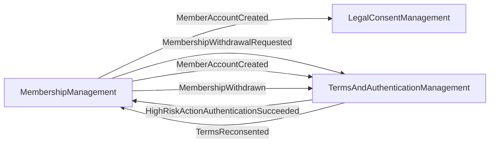

# Context Map

> Strategic-level relationships between the system's Bounded Contexts.
>
> Generated: 2026-05-12T11:55:59Z

## Diagram

## Relationships

### MembershipManagement → LegalConsentManagement

- **Pattern.** Open Host Service + Published Language *(inferred — confirm)*

- **Direction.** upstream → downstream
- **Translation.** None
- **Reason.** MemberAccountCreated
- **Spec file.** [`bounded-contexts/legalconsentmanagement/bc-legalconsentmanagement.md`](bounded-contexts/legalconsentmanagement/bc-legalconsentmanagement.md)

### MembershipManagement → TermsAndAuthenticationManagement

- **Pattern.** Open Host Service + Published Language *(inferred — confirm)*

- **Direction.** upstream → downstream
- **Translation.** None
- **Reason.** MembershipWithdrawalRequested
- **Spec file.** [`bounded-contexts/termsandauthenticationmanagement/bc-termsandauthenticationmanagement.md`](bounded-contexts/termsandauthenticationmanagement/bc-termsandauthenticationmanagement.md)

### MembershipManagement → TermsAndAuthenticationManagement

- **Pattern.** Open Host Service + Published Language *(inferred — confirm)*

- **Direction.** upstream → downstream
- **Translation.** None
- **Reason.** MemberAccountCreated
- **Spec file.** [`bounded-contexts/termsandauthenticationmanagement/bc-termsandauthenticationmanagement.md`](bounded-contexts/termsandauthenticationmanagement/bc-termsandauthenticationmanagement.md)

### MembershipManagement → TermsAndAuthenticationManagement

- **Pattern.** Open Host Service + Published Language *(inferred — confirm)*

- **Direction.** upstream → downstream
- **Translation.** None
- **Reason.** MembershipWithdrawn
- **Spec file.** [`bounded-contexts/termsandauthenticationmanagement/bc-termsandauthenticationmanagement.md`](bounded-contexts/termsandauthenticationmanagement/bc-termsandauthenticationmanagement.md)

### TermsAndAuthenticationManagement → MembershipManagement

- **Pattern.** Customer-Supplier *(inferred — confirm)*

- **Direction.** upstream → downstream
- **Translation.** None
- **Reason.** HighRiskActionAuthenticationSucceeded
- **Spec file.** [`bounded-contexts/membershipmanagement/bc-membershipmanagement.md`](bounded-contexts/membershipmanagement/bc-membershipmanagement.md)

### TermsAndAuthenticationManagement → MembershipManagement

- **Pattern.** Customer-Supplier *(inferred — confirm)*

- **Direction.** upstream → downstream
- **Translation.** None
- **Reason.** TermsReconsented
- **Spec file.** [`bounded-contexts/membershipmanagement/bc-membershipmanagement.md`](bounded-contexts/membershipmanagement/bc-membershipmanagement.md)

